# Fix JavaScript errors that are reported in the Console

This article walks you through six demo pages to demonstrate resolving JavaScript errors that are reported in the Console.


<!-- ====================================================================== -->
## Fix JavaScript errors

The first experience you have with the **Console** is likely to be errors in scripts.


### Demo page: JavaScript error reported in the Console tool

1. Open the demo webpage [JavaScript error reported in the Console tool](https://microsoftedge.github.io/Demos/devtools-console/error.html) in a new window or tab.

1. Right-click anywhere in the webpage and then select **Inspect**.  Or, press **F12**.  DevTools opens next to the webpage.

1. Click the **Console** button in the **Activity Bar**.  In DevTools, the **Console** gives you more information about the error:

   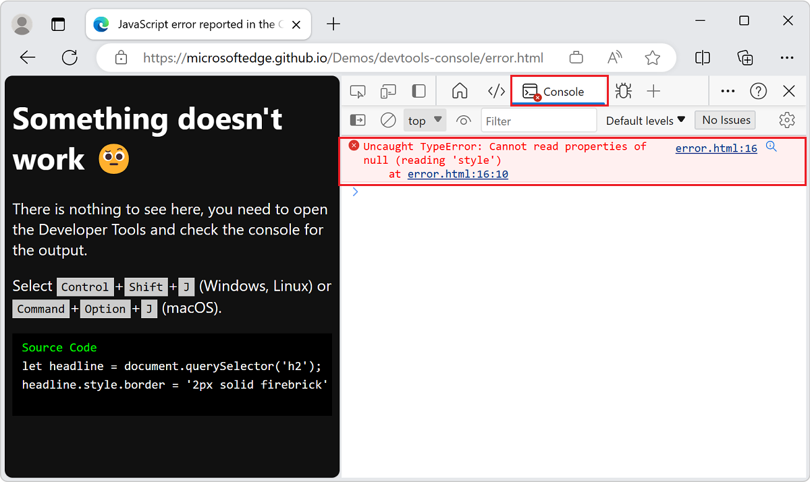

   Many error messages in the **Console** have a **Search for this message on the Web** button, shown as a magnifying glass.  For more information, see [Search the web for a Console error message string](index.md#search-the-web-for-a-console-error-message-string).

   The information in this error message suggests that the error is on line 16 of the `error.html` file.

1. Click the `error.html:16` link on the right of the error message in the **Console**.  The **Sources** tool opens and highlights the line of code with the error:

   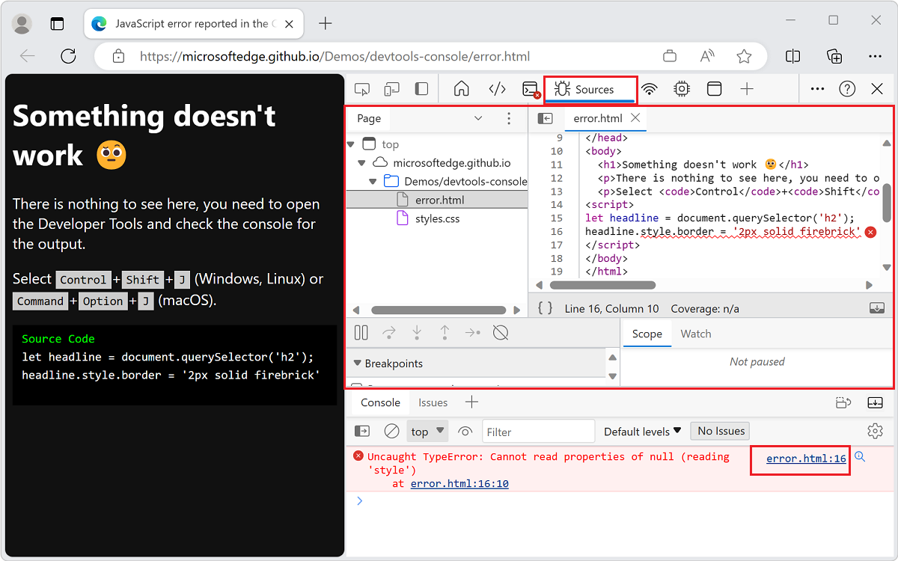

   The script tries to get the first `h2` element in the document and paint a red border around it.  But no `h2` element exists, so the script fails.


<!-- ====================================================================== -->
## Find and debug network issues

The **Console** also reports network errors.


### Demo page: Network error reported in Console

1. Open the demo webpage [Network error reported in Console](https://microsoftedge.github.io/Demos/devtools-console/network-error.html) in a new window or tab.

1. Right-click anywhere in the webpage and then select **Inspect**.  Or, press **F12**.  DevTools opens next to the webpage.

   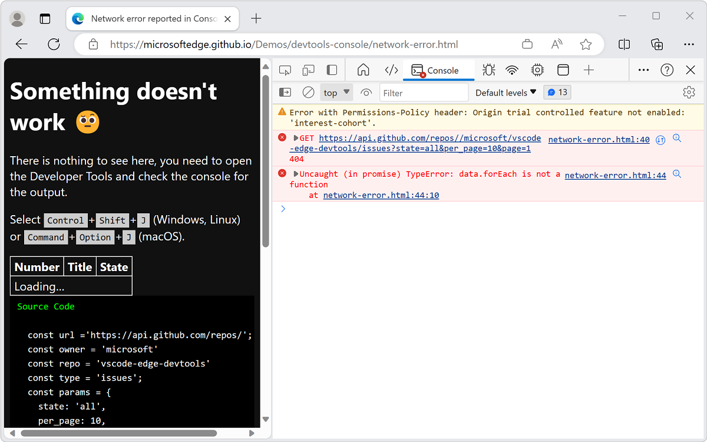

   The table displays `loading`, but nothing changes on the webpage, because the data is never retrieved.  In the **Console**, the following two errors occurred:

   *  A network error that starts with `GET` HTTP method followed by a URI.

   *  An `Uncaught (in promise) TypeError: data.forEach is not a function` error.

1. Click the link to the webpage and line of code where the error occurs, to open the Sources tool.  That is, click the `network-error.html:40` link in the **Console**:

   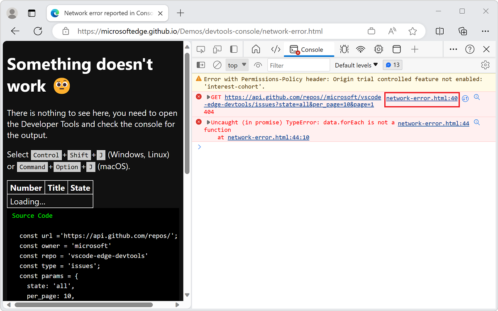

   The **Sources** tool opens.  The problematic line of code is highlighted and followed by an `error` (`x`) button.

1. Click the **error** (`x`) button.  The message `Failed to load resource: the server responded with a status of 404 ()` appears.

   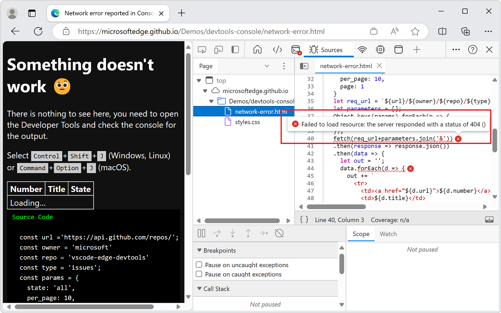

   This error informs you that the requested URL isn't found.

1. Open the **Network** tool, as follows: open the **Console**, and then click the URI that's associated with the error.

   The Console displays an HTTP status code of the error after a resource isn't loaded:

   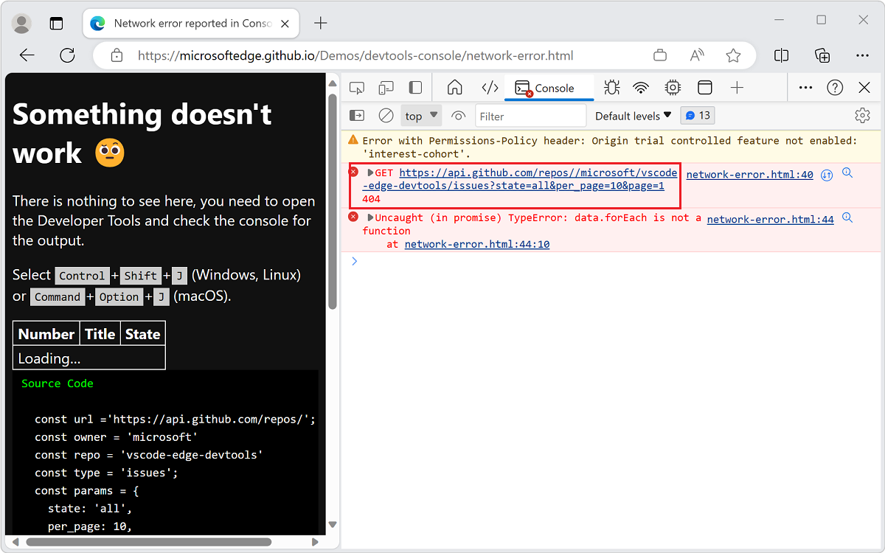

   The **Network** tool displays more information about the failed request:

   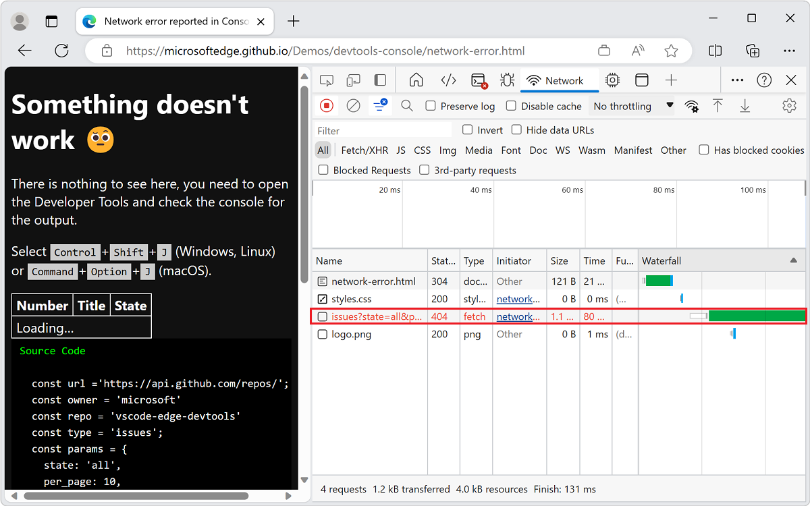

1. Inspect the headers in the **Network** tool to get more insight:

   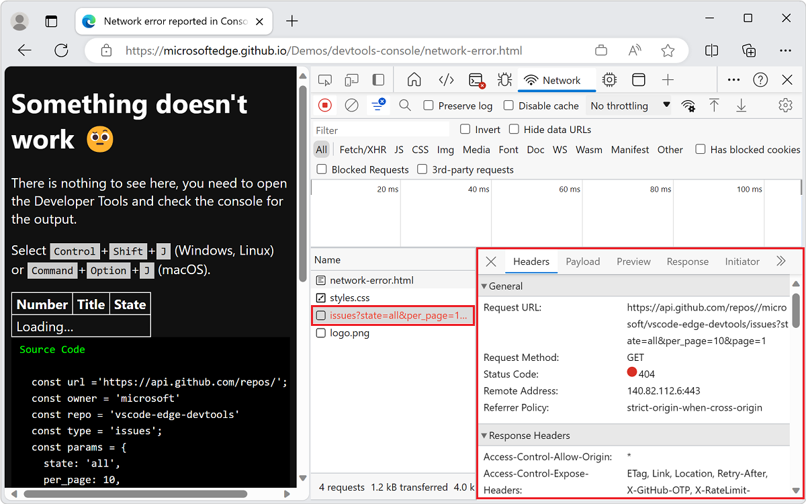

   What was the problem?  Two slash characters (`//`) occur in the requested URI after the word `repos`.

1. Open the **Sources** tool and inspect line 26.  A trailing slash character (`/`) occurs at the end of the base URI.  The **Sources** tool displays the line of code with the error:

   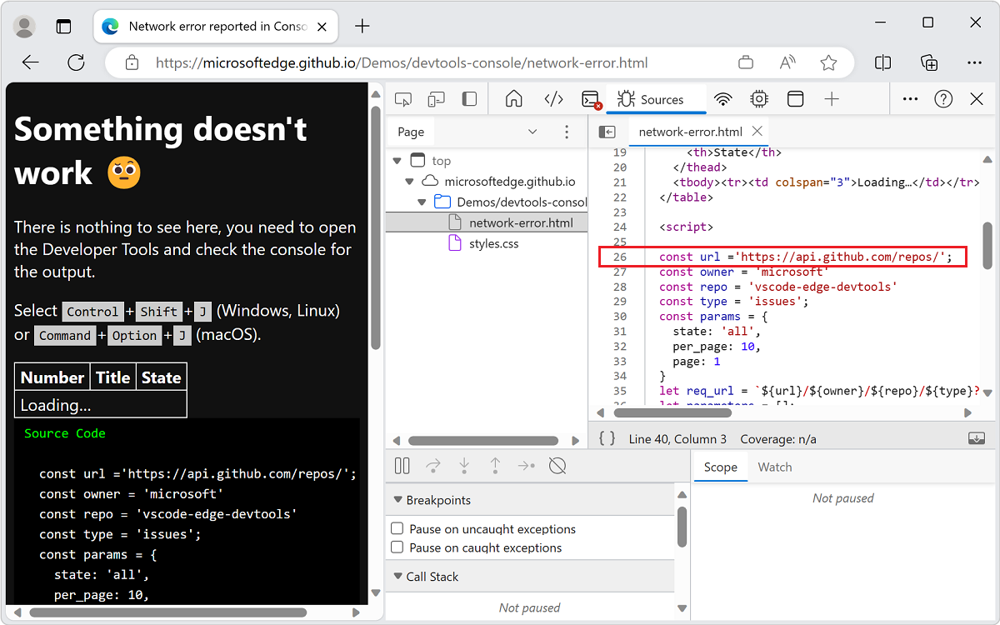


### Viewing the resulting page when there are no errors in the Console

Next, we'll look at the resulting page when there are no errors in the **Console**.


#### Demo page: Fixed network error reported in Console

1. Open the demo webpage [Fixed network error reported in Console](https://microsoftedge.github.io/Demos/devtools-console/network-error-fixed.html) in a new window or tab.

   The example without any errors loads information from GitHub and displays it:

   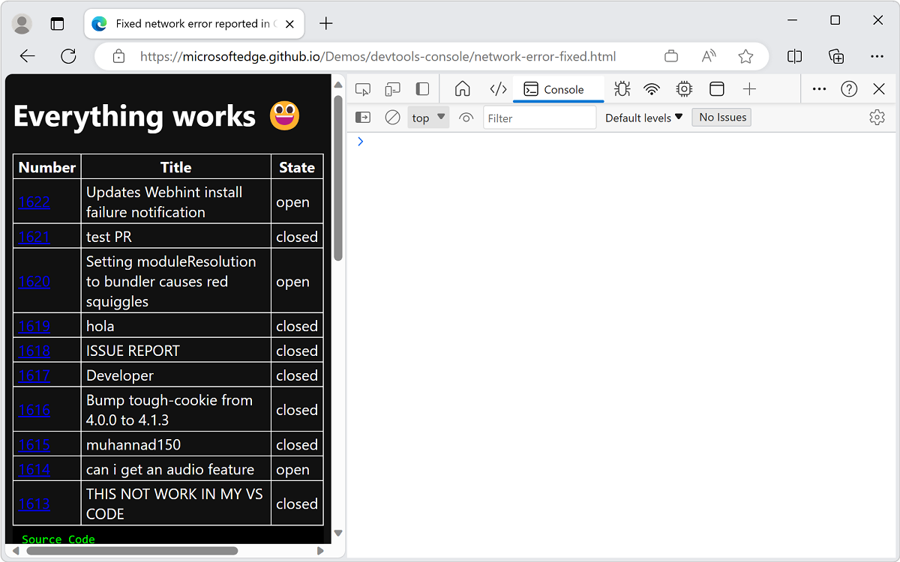


#### Demo page: Network error reporting in Console and UI

Use defensive coding techniques to avoid the previous user experiences.  Make sure your code catches errors and displays each error in the **Console**, as follows:

1. Open the demo webpage [Network error reporting in Console and UI](https://microsoftedge.github.io/Demos/devtools-console/network-error-reported.html) in a new window or tab.

1. Right-click anywhere in the webpage and then select **Inspect**.  Or, press **F12**.  DevTools opens next to the webpage.

   The example webpage demonstrates these practices:

   *  Provide a UI to the user to indicate that something went wrong.

   *  In the **Console**, provide helpful information about the **Network** error from your code.

   The example catches and reports errors:

   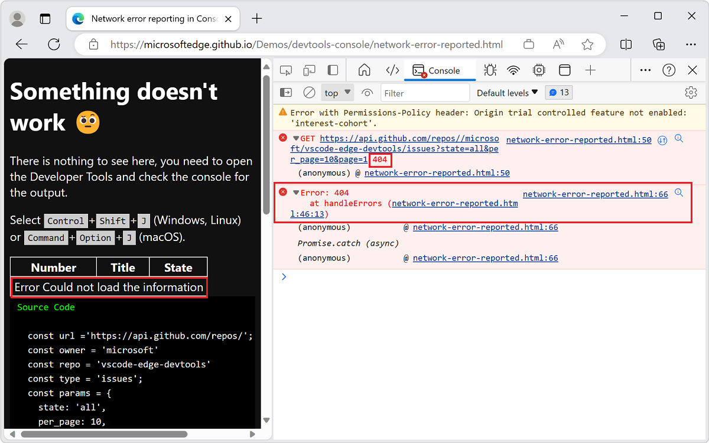

   The following code in the demo catches and reports errors using the `handleErrors` method, specifically the `throw Error` line:

   ```javascript
   const handleErrors = (response) => {
      if (!response.ok) {
         let message = 'Could not load the information'
         document.querySelector('tbody').innerHTML = `
         <tr><td colspan=3>Error ${message}</td></tr>
         `;
         throw Error(response.status + ' ' + response.statusText);
      }
      return response;
   };
   ```
   

<!-- ====================================================================== -->
## Create errors and traces in the Console

Besides the `throw Error` example in the previous section, you can also create different errors and trace problems in the **Console**.


### Demo page: Creating error reports and assertions in Console

To display two created error messages in the **Console**:

1. Open the demo page [Creating error reports and assertions in Console](https://microsoftedge.github.io/Demos/devtools-console/error-assert.html) in a new window or tab.

1. Right-click anywhere in the webpage and then select **Inspect**.  Or, press **F12**.  DevTools opens next to the webpage.

   Error messages appear in the **Console**:

   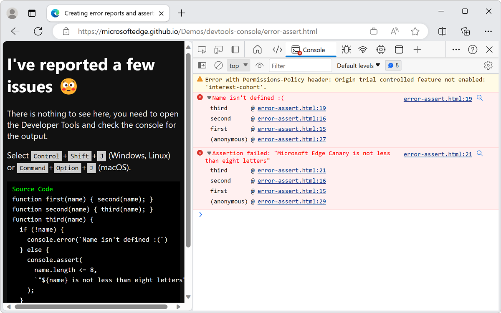

   The demo page uses the following code:

    ```javascript
    function first(name) { second(name); }
    function second(name) { third(name); }
    function third(name) {
        if (!name) {
            console.error(`Name isn't defined :(`)
        } else {
            console.assert(
                name.length <= 8,
                `"${name} is not less than eight letters"`
            );
        }
    }
    first();
    first('Console');
    first('Microsoft Edge Canary');
    ```
    
   There are three functions that request each other in succession:

   *  `first()`
   *  `second()`
   *  `third()`

   Each function sends a `name` argument to the other.  In the `third()` function, you check if the `name` argument exists and if it doesn't, you log an error that name isn't defined.  If `name` is defined, you use the `assert()` method to check if the `name` argument is fewer than eight letters long.

   You request the `first()` function three times, with the following parameters:

    *  No argument that triggers the `console.error()` method in the `third()` function.

    *  The term `Console` as a parameter to the `first()` function doesn't cause an error because `name` argument exists and is shorter than eight letters.

    *  The phrase `Microsoft Edge Canary` as a parameter to `first()` function causes the `console.assert()` method to report an error, because the parameter is longer than eight letters.

   The demo uses<!--todo: confirm--> the `console.assert()` method to create conditional error reports.  The following two examples have the same result, but one needs an extra `if{}` statement:

    ```javascript
    let x = 20;
    if (x < 40) { console.error(`${x} is too small`) };
    console.assert(x >= 40, `${x} is too small`)
    ```

   The second and third lines of the code perform the same test.  Because the assertion needs to record a negative result:

   *  You test for `x < 40` in the `if` case.
   *  You test for `x >= 40` for the assertion.


### Demo page: Creating traces in Console

If you aren't sure which function requests another function, use the `console.trace()` method to track which functions are requested in order to get to the current function.

To display the trace in the **Console**:

1. Open the demo page [Creating traces in Console](https://microsoftedge.github.io/Demos/devtools-console/trace.html) in a new window or tab.

1. Right-click anywhere in the webpage and then select **Inspect**.  Or, press **F12**.  DevTools opens next to the webpage.

   The page uses this code:

   ```javascript
   function here() {there()}
   function there() {everywhere()}
   function everywhere() {
      console.trace();
   }
   here();
   there();
   ```
    
   The result is a trace to display that `here()` is named `there()` and then `everywhere()`, and in the second example to display that it's named `everywhere()`.

   Here's the trace that's produced, in the **Console**:

   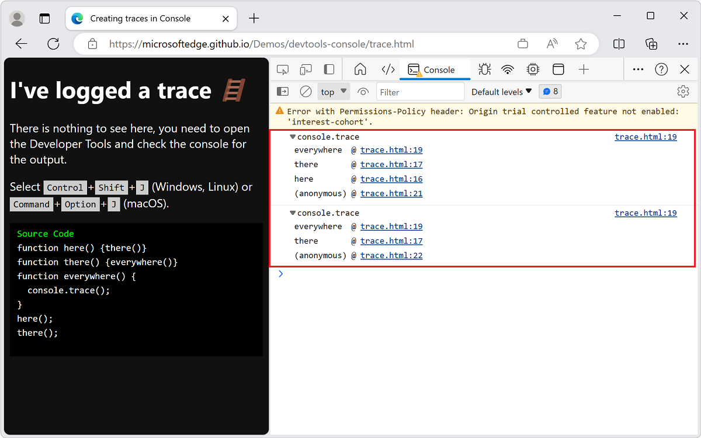


<!-- ====================================================================== -->
## See also

* [Console overview](index.md) - General use of the **Console** to display and resolve error messages.
