# Interact with the DOM using the Console

The **Console** tool is a great way to interact with the webpage in the browser.<!-- todo: add intro explanation -->  The **Console** is like a script-environment version of the [Inspect tool](../css/inspect.md).<!-- todo: add intro explanation -->


<!-- ====================================================================== -->
## Read from the DOM

To reference the header of the webpage:

1. Open the DevTools **Console**.  To do this from a webpage, you can press **Ctrl+Shift+J** (Windows, Linux) or **Command+Option+J** (macOS).

1. Type or paste the following code into the **Console**, and then press **Enter**:

   ```javascript
   document.querySelector('header')
   ```

   

1. In the **Console**, hover over the resulting HTML `<header>` element, or press **Shift+Tab**.  In the rendered webpage, DevTools highlights the header:

   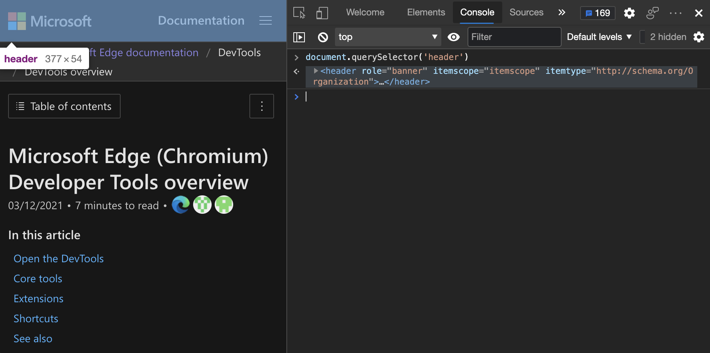


<!-- ====================================================================== -->
## Manipulate the DOM

You can manipulate the webpage from the **Console**, as follows.  In this example, you set a value in the DOM by using the Console, to affect the webpage styling: you add a green border around the header.

1. Press **Ctrl+Shift+J** (Windows, Linux) or **Command+Option+J** (macOS).  The Console opens in DevTools, next to the present webpage.

1. Paste the following code into the **Console**:

   ```javascript
   document.querySelector('header').style.border = '2em solid green'
   ```

   A green border appears around the header:

   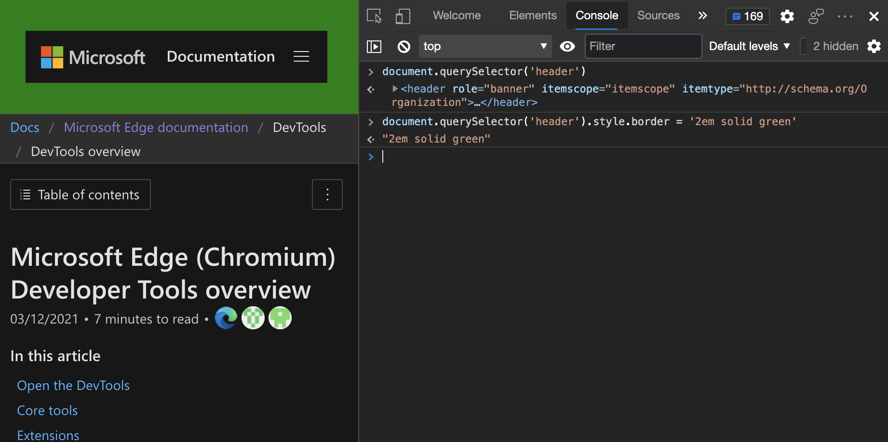


### Get a direct reference an element

Depending on the complexity of the webpage, it can be daunting to find the right element to manipulate.  But you can use the **Inspect** tool to help you.  Suppose you want to manipulate the **Documentation** region within the header of the rendered page:


To get a direct reference to the element that you want to manipulate:

1. In DevTools, click the **Inspect** tool, and then in the rendered webpage, hover over the element:

   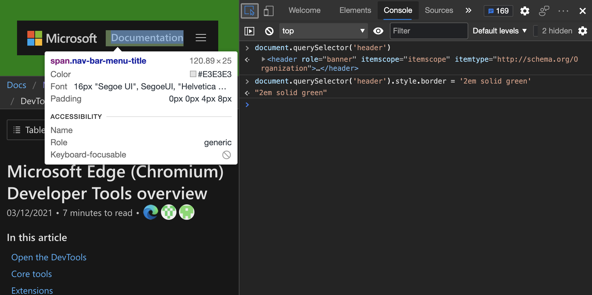

1. Click the element on the page, and DevTools jumps to the **Elements** tool.

1. Click the `...` menu next to the element in the DOM tree:

   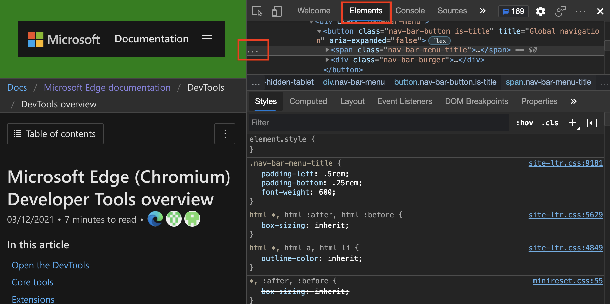

1. Right-click the element in the DOM tree and then select **Copy** > **Copy JS Path**.

   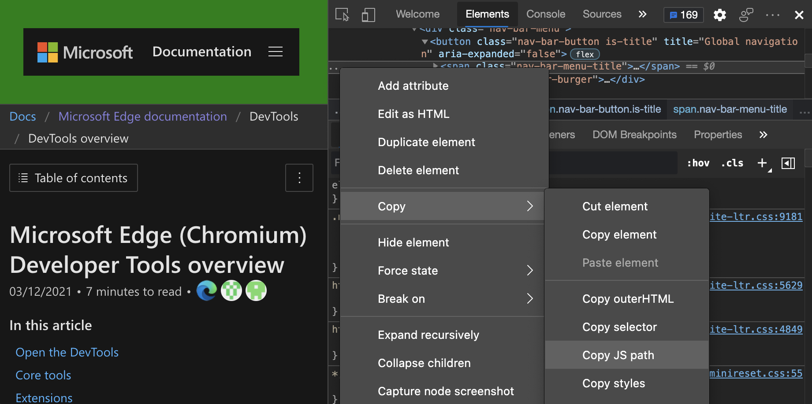

   <!-- could be useful to have code listings.  test this:
   Here's the JS path you copied:

   ```javascript
   document.querySelector("#headerAreaHolder > header > div:nth-child(1) > div.nav-bar-item.is-hidden-tablet > div > button > span")
   ```

   Here's the result after you add text content:

   ```javascript
   document.querySelector("#headerAreaHolder > header > div:nth-child(1) > div.nav-bar-item.is-hidden-tablet > div > button > span").textContent = "My Playground"
   ``` -->

1. In the **Console**, paste the JavaScript path that you copied, but don't press **Enter** yet.

1. Change the text of the link to `My Playground`.  To do that, add `.textContent = "My Playground"` to the JavaScript path that you previously pasted:

   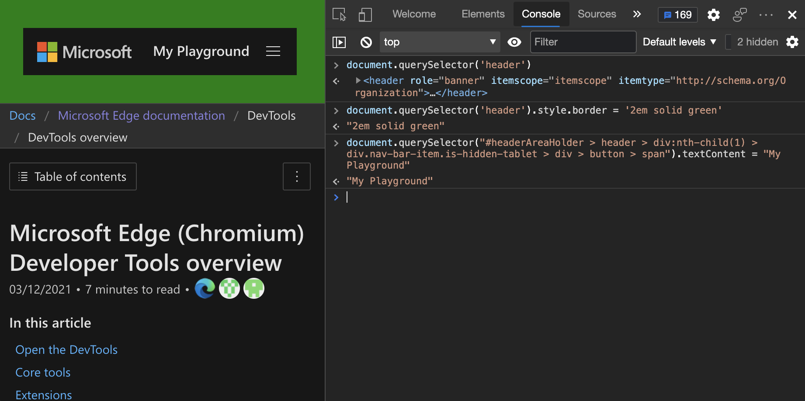

Use any JavaScript DOM manipulations you want in the **Console**.  To make it more convenient, the **Console** comes with a few helper utility methods.


<!-- ====================================================================== -->
## Helpful Console utility methods

Many convenience methods and shortcuts are available to you as [Console Utilities](utilities.md).  Some of the methods are incredibly powerful and are much more effective than using `console.log()` statements.


### The power of the $ functions

The `$` has special powers in **Console**, and you may remember that from jQuery.

*  `$_` stores the result of the last command.  So, if you type `2+2` and press **Enter**, and then type `$_`, the **Console** displays `4`.

*  `$0` to `$4` is a stack of the last inspected elements.  `$0` is always the newest one.  So in the earlier example, you just select the element in the **Inspect** tool and type `$0.textContent = "My Playground"` to get the same effect.

*  `$x()` allows you to select DOM elements using XPATH.

*  `$()` and `$$()` are shorter versions of for `document.querySelector()` and `document.querySelectorAll()`.


### Example: Extracting all links from a page, as a sortable table

1. Enter the following code, which retrieves all the links in the webpage, and displays the links as a sortable table to copy and paste (for example, into Excel):

   ```javascript
   console.table($$('a'),['href','text']);
   ```
   
   `$$('a')` is short for `document.querySelectorAll('a')`.

   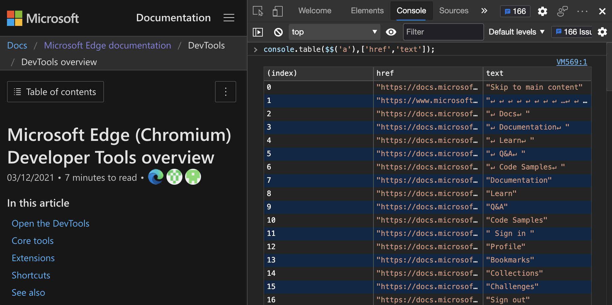

   However, suppose you don't want to display all the information, but you want to grab it as data and then select only some of the data.

   The `$$('a')` shortcut helps with that: it selects the anchor links and all of the properties for each anchor link.  But the problem is that you only want the anchor links and the related text, not all the properties of the anchor links.

   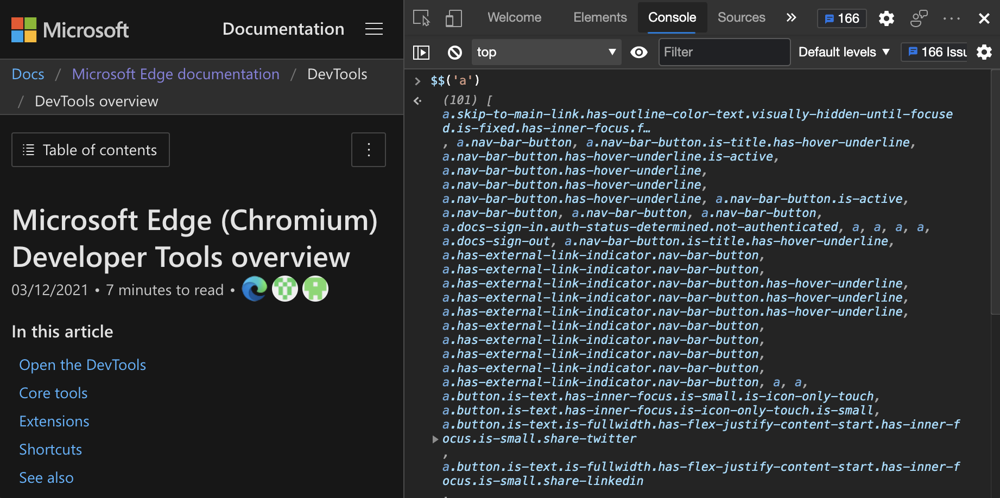

   To solve that problem, the `$$` shortcut has an interesting extra feature: instead of returning a pure `NodeList` like `document.querySelectorAll()`, the `$$` shortcut gives you all of the `Array` methods, including `map()`.

1. Use the `map()` method of the `Array` object to reduce the information to what you need:

   ```javascript
   $$('a').map(a => {
      return {url: a.href, text: a.innerText}
   })
   ```

   The above code returns an `Array` of all the links, as objects with `url` and `text` properties.

   

   You aren't done yet; several links are internal links to the webpage or have empty text.

1. Use the `filter` method to get rid of the internal links:

   ```javascript
   $$('a').map(a => {
      return {text: a.innerText, url: a.href}
   }).filter(a => {
      return a.text !== '' && !a.url.match('learn.microsoft.com')
   })
   ```

   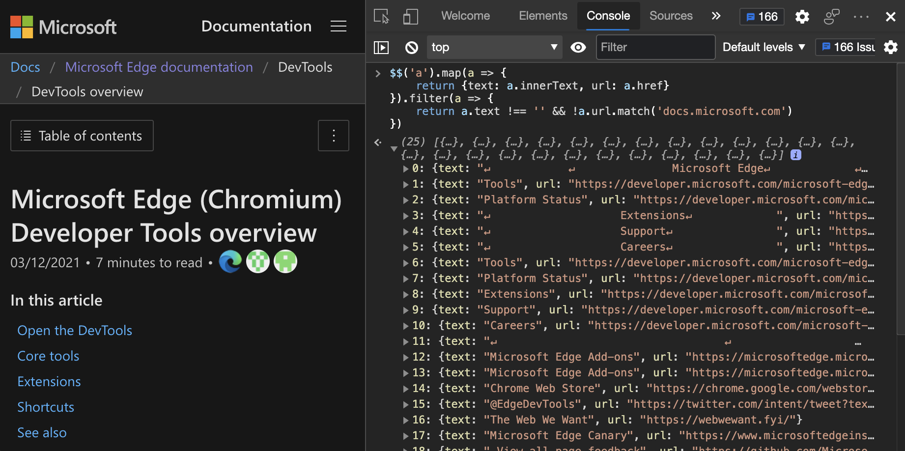

   By manipulating the DOM through issuing statements in the **Console**, you can change these elements in the rendered webpage.

1. For example, enter the following code, which adds a green border around all external links:

   ```javascript
   $$('a[href^="https://"]').forEach(
      a => a.style.border = '1px solid green'
   )
   ```

   

Instead of writing complex JavaScript to filter results, use the power of CSS selectors.


### Creating a table

To create a table of the `src` and `alt` information for all images on the webpage that aren't inline images:

1. Open the **Console**.

1. Paste the following code into the **Console**, and then press **Enter**:

   ```javascript
   console.table($$('img:not([src^=data])'), ['src','alt'])
   ```

   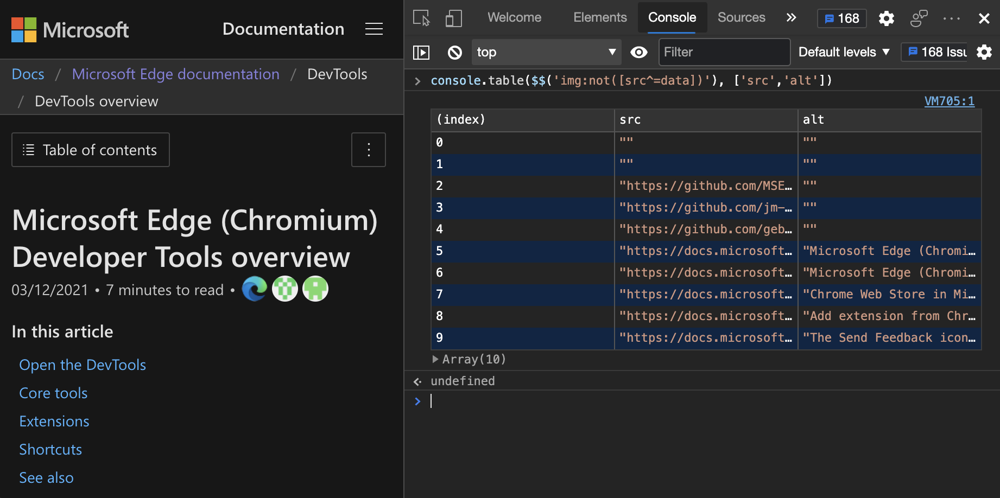

<!-- mystery wiggly line preventer -->


### Example: Getting all page headings and anchor URLs

Ready for an even more complex example?  HTML webpages that are generated from Markdown tagging, like the present article, have automatic ID values for each heading, to allow you to deep-link directly to that section of the webpage.  For example, a `# New features` h1 heading in the Markdown source file becomes `<h1 id="new-features">New features</h1>` in the HTML file.

To list all of the automatic headings to copy and paste:

1. Open the **Console**.

1. Copy and paste the following code:

   ```javascript
   let out = '';
   $$('#main [id]').filter(
      elm => {return elm.nodeName.startsWith('H')}
   ).forEach(elm => {
      out += elm.innerText + "\n" +
            document.location.href + '#' +
            elm.id + "\n";
   });
   console.log(out);
   ```
    
   The result is text that contains content for each heading followed by the full URL that points to it.

   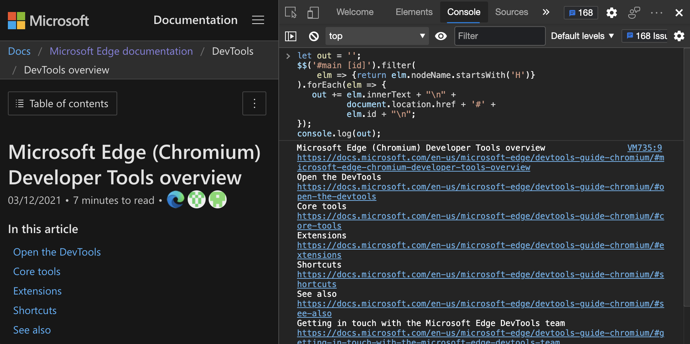


### Clean up with clear and copy

When developing in the **Console**, things can get messy.  It can be difficult to select results to copy and paste.  The following two utility methods help you:

* `copy()` copies whatever you give it to the clipboard.  The `copy()` method is especially useful when you mix it with `$_`, which copies the last result.

* `clear()` clears the **Console**.


### Read and monitor events

Two other interesting utility methods of **Console** deal with event handling:

* `getEventListeners(node)` lists all the event listeners of a node.

* `monitorEvents(node, events)` monitors and logs the events that happen on a node.


To list all of the event listeners that are assigned to the first form in the webpage:

1. In DevTools, open the **Console**.

1. Type or paste the following code into the **Console**:

   ```javascript
   getEventListeners($('form'));
   ```

   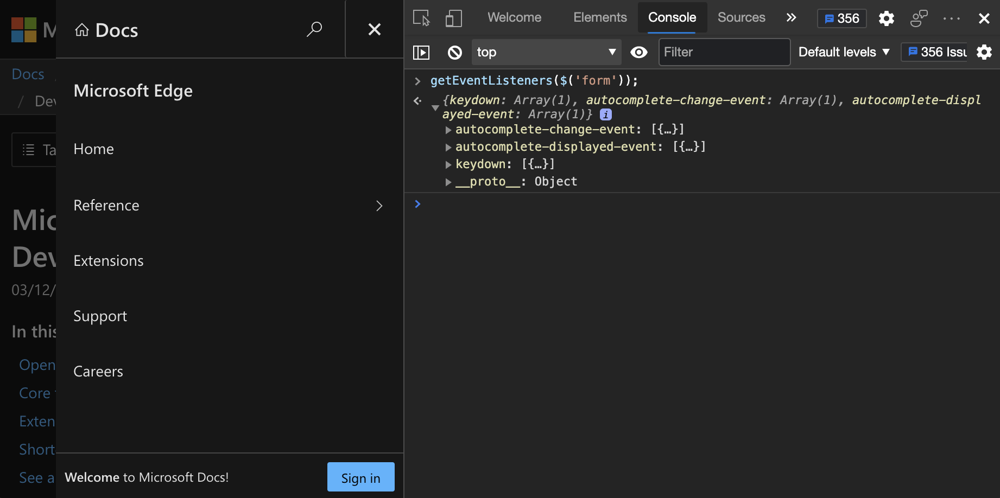

When you monitor, you to get a notification in the **Console** every time something changes to the specified elements.  You define the events you want to listen to as a second parameter.  It's important for you to define the events that you want to monitor, otherwise any event happening to the element is reported.


To get a notification in the **Console** every time you scroll, resize the window, or when the user types in the search form:

1. In DevTools, open the **Console**.

1. Paste the following code into the **Console**:

   ```javascript
   monitorEvents(window, ['resize', 'scroll']);
   monitorEvents($0, 'keyup');
   ```

   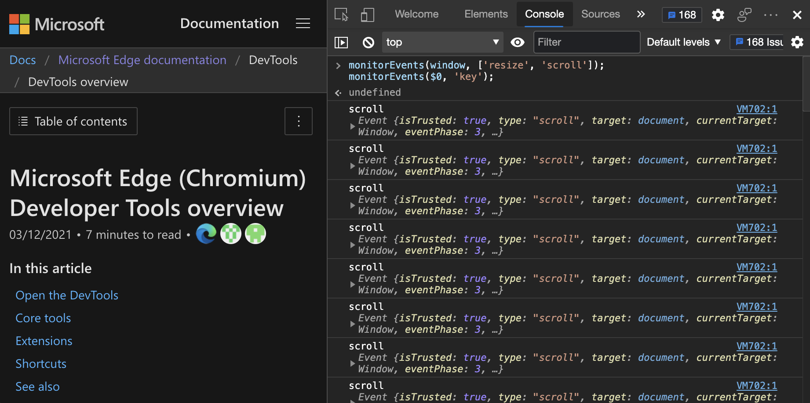

1. To log any key action on the currently selected element, focus on the search form in the header and press some keys.

   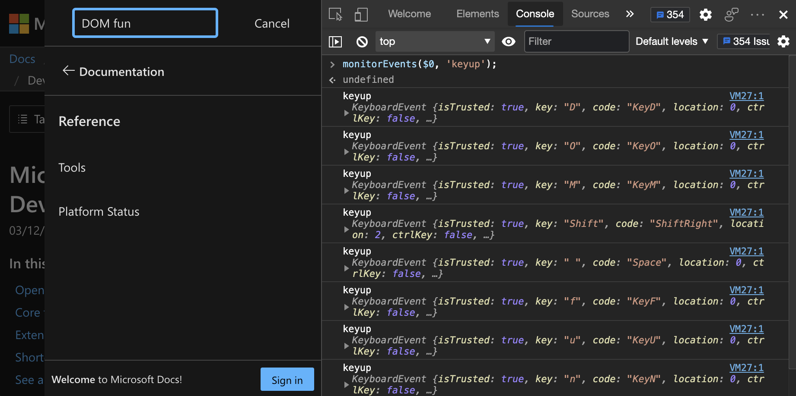

1. To stop logging, remove the monitoring you set, enter the following code into the **Console**:

   ```javascript
   unmonitorEvents(window, ['resize', 'scroll']);
   unmonitorEvents($0, 'key');
   ```
   

<!-- ====================================================================== -->
## Reuse DOM manipulation scripts

You may find it useful to manipulate the DOM from the **Console**.  You might soon run into the limitations of the **Console** as a development platform.  The good news is that the [Sources](../sources/index.md) tool in DevTools offers a fully featured development environment.  In the **Sources** tool, you can:

*  Store your scripts for the **Console** as snippets; see [Run snippets of JavaScript on any webpage](../javascript/snippets.md).

*  Run the scripts in a webpage by using a keyboard shortcut or the editor.


<!-- ====================================================================== -->
## See also

* [Log messages in the Console tool](console-log.md)
* [Run JavaScript in the Console](console-javascript.md)
