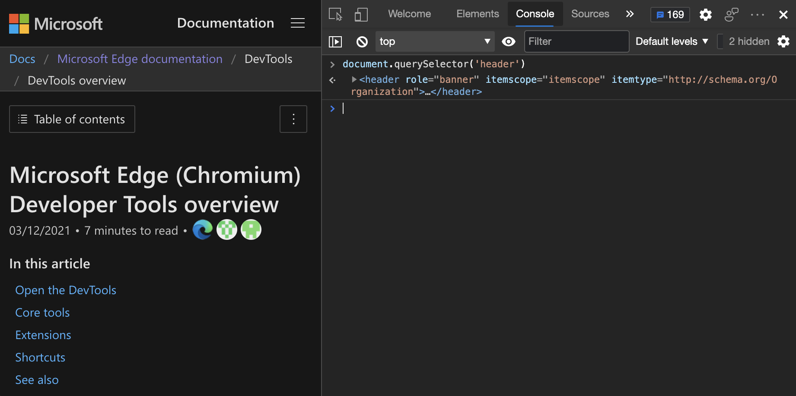
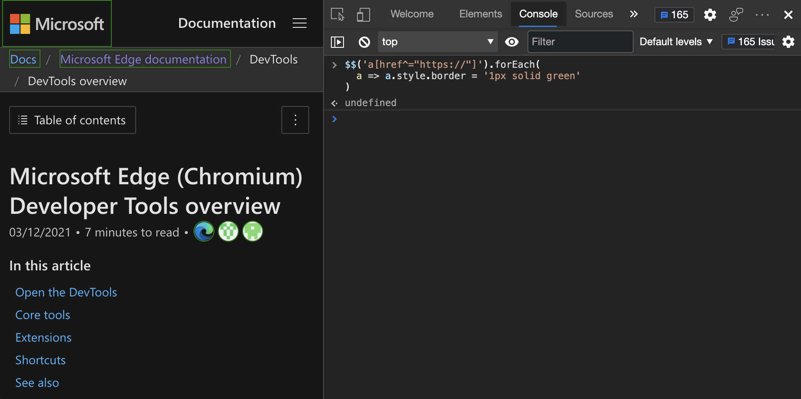

# Interact with the DOM using the Console

The **Console** tool is a great way to interact with the webpage in the browser.<!-- todo: add intro explanation -->  The **Console** is like a script-environment version of the [Inspect tool](../css/inspect.md).<!-- todo: add intro explanation -->


<!-- ====================================================================== -->
## Read from the DOM

To reference an element of the webpage:

1. Navigate to the [Animal Shelter](https://microsoftedge.github.io/Demos/devtools-a11y-testing/) demo site.

1. Open the DevTools **Console**.  To do this from a webpage, you can press `Ctrl`+`Shift`+`J` (Windows, Linux) or `Command`+`Option`+`J` (macOS).

1. Type or paste the following code into the **Console**, and then press `Enter`:

   ```javascript
   document.querySelector('header')
   ```

   

1. In the **Console**, hover over the resulting HTML `<header>` element, or press `Shift`+`Tab`.  In the rendered webpage, DevTools highlights the header:

   


<!-- ====================================================================== -->
## Manipulate the DOM

You can manipulate the webpage from the **Console**, as follows.  In this example, you set a value in the DOM by using the **Console**, to affect the webpage styling: you add a green border around the header.

1. Navigate to the [Animal Shelter](https://microsoftedge.github.io/Demos/devtools-a11y-testing/) demo site.

1. Press `Ctrl`+`Shift`+`J` (Windows, Linux) or `Command`+`Option`+`J` (macOS).  The **Console** opens in DevTools, next to the webpage.

1. Paste the following code into the **Console**:

   ```javascript
   document.querySelector('header').style.border = '2em solid green'
   ```

   A green border appears around the header:

   


### Get a direct reference an element

Depending on the complexity of the webpage, it can be daunting to find the right element to manipulate.  But you can use the **Inspect** tool to help you.  Suppose you want to manipulate the site navigation toolbar on the [Animal Shelter](https://microsoftedge.github.io/Demos/devtools-a11y-testing/) demo site.


To get a direct reference to the element that you want to manipulate:

1. In DevTools, click the **Inspect** tool, and then in the rendered webpage, hover over the element:

   

1. Click the element on the page, and DevTools jumps to the **Elements** tool.

1. Click the `...` menu next to the element in the DOM tree:

   

1. Select **Copy** > **Copy JS Path**.

   

   <!-- could be useful to have code listings.  test this:
   Here's the JS path you copied:

   ```javascript
   document.querySelector("#headerAreaHolder > header > div:nth-child(1) > div.nav-bar-item.is-hidden-tablet > div > button > span")
   ```

   Here's the result after you add text content:

   ```javascript
   document.querySelector("#headerAreaHolder > header > div:nth-child(1) > div.nav-bar-item.is-hidden-tablet > div > button > span").textContent = "My Playground"
   ``` -->

1. In the **Console**, paste the JavaScript path that you copied, but don't press `Enter` yet.

1. Change the background color of the site navigation to red.  To do that, add `.style.backgroundColor = "red"` to the JavaScript path that you previously pasted, and press `Enter`:

   

Use any JavaScript DOM manipulations you want in the **Console**.  To make it more convenient, the **Console** comes with a few helper utility methods.


<!-- ====================================================================== -->
## Helpful Console utility methods

Many convenience methods and shortcuts are available to you as [Console Utilities](utilities.md).  Some of the methods are incredibly powerful and are much more effective than using `console.log()` statements.


### The power of the $ functions

The `$` sign has special powers in the **Console**. Below is a list of predefined **Console** variables and methods with the `$` sign.

*  `$_` stores the result of the last command. If you type `2+2` and press `Enter`, you can then type `$_` to refer to the result again.

*  `$0` to `$4` is a stack of the last inspected elements.  `$0` always refers to the currently inspected element.  In the earlier example ([Get a direct reference an element](#get-a-direct-reference-an-element)), after you select the element with the **Inspect** tool, you can refer to it with `$0` and therefore get the same effect with `$0..style.backgroundColor = "red"`.

*  `$x()` allows you to select DOM elements using XPATH.

*  `$()` and `$$()` are shorter versions of for `document.querySelector()` and `document.querySelectorAll()`.


### Example: Extracting all links from a page, as a sortable table

1. Navigate to the [Animal Shelter](https://microsoftedge.github.io/Demos/devtools-a11y-testing/) demo site.

1. Press `Ctrl`+`Shift`+`J` (Windows, Linux) or `Command`+`Option`+`J` (macOS).  The **Console** opens in DevTools, next to the webpage.

1. Enter the following expression, which retrieves all the images in the webpage, and displays their sources as a sortable table to copy and paste (for example, into Excel):

   ```javascript
   console.table($$('img'),['src']);
   ```
   
   `$$('img')` is short for `document.querySelectorAll('a')`.

   

   However, suppose you don't want to display all the information, but you want to grab it as data and then select only some of the data.

   The `$$('img')` shortcut helps with that: it selects the image elements and all of the properties for each of them.  But the problem is that you only want the image elements and their source, not all the properties of the image elements.

   

   To solve that problem, the `$$` shortcut has an interesting extra feature: instead of returning a `NodeList` object like `document.querySelectorAll()` does, the `$$` shortcut returns an `Array`, which gives you access to `Array` methods like `map()`.

1. Use the `map()` method of the `Array` object to reduce the information to what you need:

   ```javascript
   $$('img').map(img => {
      return {src: img.src, width: img.naturalWidth, height: img.naturalHeight}
   });
   ```

   The above code returns an `Array` of all the images, as objects with the `src`, `width`, and `height` properties.

   

1. Use the `filter` method to filter the list of elements returned by `$$`.

   ```javascript
    $$('img').map(img => {
       return {src: img.src, width: img.naturalWidth, height: img.naturalHeight}
    }).filter(img => {
       return img.width > 1000
    });
   ```

   

   By manipulating the DOM through issuing statements in the **Console**, you can change these elements in the rendered webpage.

1. For example, enter the following code, which adds a red border around all images that do not have alternate text:

   ```javascript
   $$('img:not([alt])').forEach(img => img.style.border = '5px solid red');
   ```

   

Instead of writing complex JavaScript to filter results, use the power of CSS selectors.


### Creating a table

To create a table of the `src` and `alt` information for all images on the webpage:

1. Navigate to the [Animal Shelter](https://microsoftedge.github.io/Demos/devtools-a11y-testing/) demo site.

1. Press `Ctrl`+`Shift`+`J` (Windows, Linux) or `Command`+`Option`+`J` (macOS).  The **Console** opens in DevTools, next to the webpage.

1. Paste the following code into the **Console**, and then press `Enter`:

   ```javascript
   console.table($$('img:not([src^=data])'), ['src','alt'])
   ```

   


### Example: Getting all page headings and anchor URLs

Ready for an even more complex example?  HTML webpages often use `id` attributes on sections of their content to allow you to deep-link directly to that section of the webpage using the `https://example.com/#sectionid` URL syntax.

To list all of the anchor links in the demo page:

1. Navigate to the [Animal Shelter](https://microsoftedge.github.io/Demos/devtools-a11y-testing/) demo site.

1. Press `Ctrl`+`Shift`+`J` (Windows, Linux) or `Command`+`Option`+`J` (macOS).  The **Console** opens in DevTools, next to the webpage.

1. Copy and paste the following code:

   ```javascript
    let out = '';
    $$('[id]:has(h2)').forEach(el => {
      out += el.querySelector('h2').innerText + '\n' + document.location.href + '#' + el.id + '\n';
    });
    console.log(out);
   ```
    
   The result is text that contains content for each heading followed by the full URL that points to it.

   


### Clean up with clear and copy

When developing in the **Console**, things can get messy.  It can be difficult to select results to copy and paste.  The following two utility methods help you:

* `copy()` copies whatever you give it to the clipboard.  The `copy()` method is especially useful when you mix it with `$_`, which copies the last result.

* `clear()` clears the **Console**.


### Read and monitor events

Two other interesting utility methods of **Console** deal with event handling:

* `getEventListeners(node)` lists all the event listeners of a node.

* `monitorEvents(node, events)` monitors and logs the events that happen on a node.

To list all of the event listeners that are assigned to the donation form in the webpage:

1. Navigate to the [Animal Shelter](https://microsoftedge.github.io/Demos/devtools-a11y-testing/) demo site.

1. Press `Ctrl`+`Shift`+`J` (Windows, Linux) or `Command`+`Option`+`J` (macOS).  The **Console** opens in DevTools, next to the webpage.

1. Type or paste the following code into the **Console**:

   ```javascript
   getEventListeners($('#donate'));
   ```

   

If you want to get a notification in the **Console** every time an event occurs on the specified element, use the `monitorEvents` utility. Define the element you want to monitor as the first parameter, and the events you want to listen to as a second parameter.  It's important for you to define the events that you want to monitor, otherwise any event happening to the element is reported.

To get a notification in the **Console** every time the donation form is clicked:

1. Paste the following code into the **Console**:

   ```javascript
   monitorEvents($('#donate'), 'click');
   ```

   

   The click events are logged in the **Console**.

   

1. To stop logging, remove the monitoring you set, enter the following code into the **Console**:

   ```javascript
   unmonitorEvents($('#donate'), 'click');
   ```
   

<!-- ====================================================================== -->
## Reuse DOM manipulation scripts

You may find it useful to manipulate the DOM from the **Console**.  You might soon run into the limitations of the **Console** as a code editor though. The good news is that the [Sources](../sources/index.md) tool in DevTools offers a fully featured code editor environment.  In the **Sources** tool, you can:

*  Store your scripts for the **Console** as snippets; see [Run snippets of JavaScript on any webpage](../javascript/snippets.md).

*  Run the scripts in a webpage by using a keyboard shortcut or the editor.


<!-- ====================================================================== -->
## See also

* [Log messages in the Console tool](console-log.md)
* [Run JavaScript in the Console](console-javascript.md)
