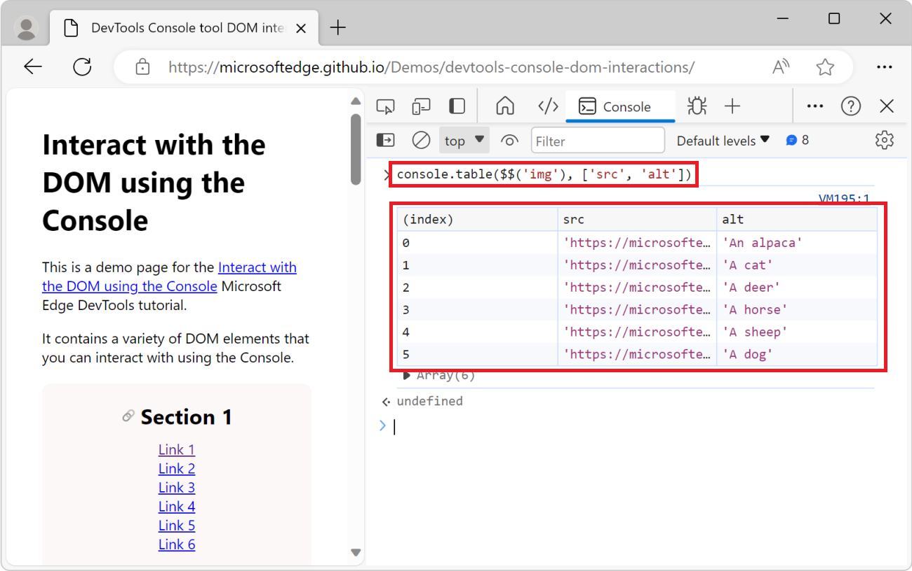
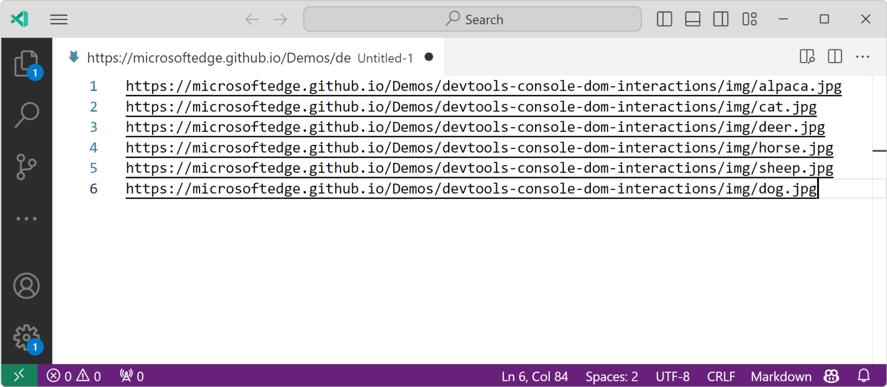

# Interact with the DOM using the Console

The **Console** tool is a great way to interact with the webpage in the browser. In DevTools, you usually interact with the DOM by using the **Inspect** tool to select elements, and by using the **Elements** tool to modify the DOM, for example to add or change element attributes or styles.

The **Console** tool can also be used to interact with the DOM by using JavaScript code. For example, you can find elements in the DOM tree and manipulate them by using DOM APIs.

To learn more about the **Inspect** tool, see [Analyze pages using the Inspect tool](../css/inspect.md). To learn more about the **Elements** tool, see [Inspect, edit, and debug HTML and CSS with the Elements tool](../elements-tool/elements-tool.md).


<!-- ====================================================================== -->
## Find an element in the DOM tree

To find an element in the DOM tree from the **Console** tool:

1. Go to the webpage that you want to inspect. For example, open the [DevTools Console tool DOM interactions demo page](https://microsoftedge.github.io/Demos/devtools-console-dom-interactions/) in a new tab or window.

1. Press **Ctrl+Shift+J** (Windows, Linux) or **Command+Option+J** (macOS).  The **Console** tool opens in DevTools, next to the webpage.

1. Type or paste the following code into the **Console**, and then press **Enter**.

   ```javascript
   document.querySelector('main');
   ```

   The `<main>` element from the DOM tree is displayed in the **Console**:

   

1. In the **Console**, hover over the resulting HTML `<main>` element, or press **Shift+Tab**.  In the rendered webpage, DevTools highlights the corresponding `<main>` element:

   


<!-- ====================================================================== -->
## Change the DOM of the webpage

You can make changes to the DOM tree of the webpage from the **Console** tool. In this example, you set the value of a DOM element attribute by using the Console, to affect the element's styling: you add a grey background to the `<h1>` title of the page.

1. Go to the webpage that you want to change. For example, open the [DevTools Console tool DOM interactions demo page](https://microsoftedge.github.io/Demos/devtools-console-dom-interactions/) in a new tab or window.

1. Press **Ctrl+Shift+J** (Windows, Linux) or **Command+Option+J** (macOS).  The **Console** tool opens in DevTools, next to the webpage.

1. Paste the following code into the **Console**:

   ```javascript
   document.querySelector("h1").style.backgroundColor = "lightgrey";
   ```

   A grey background appears behind the page title:

   


#### Get a reference to an element

In a complex webpage, it can be hard to find the right element to change.  But you can use the **Inspect** tool to help you.  Suppose you want to change the text of the first link within the **Section 1** element of the rendered page:


To get a reference to the link element that you want to change:

1. Go to the webpage that you want to inspect. For example, open the [DevTools Console tool DOM interactions demo page](https://microsoftedge.github.io/Demos/devtools-console-dom-interactions/) in a new tab or window.

1. Press **Ctrl+Shift+J** (Windows, Linux) or **Command+Option+J** (macOS).  The **Console** tool opens in DevTools, next to the webpage.

1. Click the **Inspect** () tool, and then in the rendered webpage, hover over a link, such as **Link 1**:

   

1. Click the hovered link on the rendered webpage. DevTools opens the **Elements** tool, with the corresponding element selected:

   

1. Click the `...` button next to the element in the DOM tree, and then select **Copy** > **Copy JS path**:

   

   Here's the JS path you copied:

   ```javascript
   document.querySelector("body > main > section:nth-child(1) > ul > li:nth-child(1) > a")
   ```

   The above path is a CSS selector that points to the link element you selected by using the **Inspect** tool.

1. In the **Console**, paste the JavaScript path that you copied, but don't press **Enter** yet.

1. Change the text of the link to `Updated link`.  To do that, add `.textContent = "Updated link"` to the JavaScript path that you previously pasted:

   

Use any DOM APIs you want to change the DOM tree in the **Console**.  To make it more convenient, the **Console** comes with a few helper utility methods.


<!-- ====================================================================== -->
## Helpful console utility functions

Many convenience methods and shortcuts are available to you as utility functions in the **Console** tool. Some of these utility functions are very useful for interacting with the DOM tree of a webpage, and are described below. To learn more, see [Console tool utility functions and selectors](./utilities.md).


#### Get elements with the $ functions and shortcuts

The `$` character has a special meaning in the **Console** tool:

*  The `$()` and `$$()` functions are shorter versions of the `document.querySelector()` and `document.querySelectorAll()` functions.

*  `$0`, `$1`, `$2`, `$3`, and `$4` are shortcuts to elements that you recently selected in the **Elements** tool. `$0` is always the most recently selected element. So, in the earlier example [Get a reference to an element](#get-a-reference-to-an-element), once you've selected the element by using the **Inspect** tool, you can change its text by using `$0.textContent = "Updated link"` to get the same effect.

*  `$x()` allows you to select DOM elements using [XPath](https://developer.mozilla.org/docs/Web/XPath).


###### Get all links from the page

In this example, you use the `$$()` utility function to list all links on the webpage.  You then use that function along with the `filter()` array method to get rid of the links that don't start with `https` (such as the anchor links in the present webpage), in order to filter the list to only include external links.

1. Go to the webpage that you want to get the links from. For example, open the [DevTools Console tool DOM interactions demo page](https://microsoftedge.github.io/Demos/devtools-console-dom-interactions/) in a new tab or window.

1. Press **Ctrl+Shift+J** (Windows, Linux) or **Command+Option+J** (macOS).  The **Console** tool opens in DevTools, next to the webpage.

1. To get the list of all links in the page, enter the following code in the **Console**, and then press **Enter**:

   ```javascript
   $$('a');
   ```
   
   

   `$$('a')` is short for `document.querySelectorAll('a')`.

1. Expand the list of links that's logged in the **Console**, and then expand the first link object. The link's properties are displayed:

   

1. To reduce the amount of information returned by the `$$()` function, use the `map()` array method. The `map()` method works because the `$$()` function returns an array.

   ```javascript
   $$('a').map(a => {
     return {url: a.getAttribute("href"), text: a.innerText}
   });
   ```

   The above code returns an array of all the links, where each link object is mapped to a JavaScript objects with the `url` and `text` properties.

1. Expand a few of the returned link objects to see their properties:

   

1. To only list external links, use the `filter()` array method to get rid of the links that don't start with `https`:

   ```javascript
   $$('a').map(a => {
      return {url: a.getAttribute("href"), text: a.innerText}
   }).filter(a => {
      return a.url.startsWith("https");
   });
   ```

   


###### Display DOM elements in a table

In the previous example, you displayed a list of elements from the page in the **Console**. The elements are displayed as a JavaScript array. To make it easier to use the list of elements in the **Console**, you can display them in a sortable table instead, by using the `console.table()` utility function:

1. Go to the webpage that you want to inspect. For example, open the [DevTools Console tool DOM interactions demo page](https://microsoftedge.github.io/Demos/devtools-console-dom-interactions/) in a new tab or window.

1. Press **Ctrl+Shift+J** (Windows, Linux) or **Command+Option+J** (macOS).  The **Console** tool opens in DevTools, next to the webpage.

1. Paste the following code into the **Console**, and then press **Enter**:

   ```javascript
   console.table($$('img'), ['src','alt'])
   ```

   The list of `` elements on the webpage is displayed in the **Console**, formatted as a table, with each image's `src` and `alt` attributes as columns:

   


###### Get all page headings and anchor URLs

In this example, you get all the headings on the webpage that have an `id` attribute, and you generate a URL that points to each heading.

1. Go to the webpage that you want to inspect. For example, open the [DevTools Console tool DOM interactions demo page](https://microsoftedge.github.io/Demos/devtools-console-dom-interactions/) in a new tab or window.

1. Press **Ctrl+Shift+J** (Windows, Linux) or **Command+Option+J** (macOS).  The **Console** tool opens in DevTools, next to the webpage.

1. Copy and paste the following code into the **Console**, and then press **Enter**:

   ```javascript
   let headings = $$('main [id]').filter(el => {
     return el.nodeName.startsWith('H');
   }).map(el => {
     return `${el.innerText}: ${document.location.href}#${el.id}\n`;
   });
   console.log(headings.join("\n"));
   ```
   
   The result is text that contains content for each section heading, followed by the full URL for the section heading:

   


#### Copy information from the Console

In the previous examples, you generated lists of elements and strings of information. It can be useful to copy the generated information from the **Console** and paste it somewhere else.

To copy the return value from an expression that you run in the **Console**, use the `copy()` utility function:

1. Go to the webpage that you want to extract some information from. For example, open the [DevTools Console tool DOM interactions demo page](https://microsoftedge.github.io/Demos/devtools-console-dom-interactions/) in a new tab or window.

1. Press **Ctrl+Shift+J** (Windows, Linux) or **Command+Option+J** (macOS).  The **Console** tool opens in DevTools, next to the webpage.

1. To copy the list of all image URLs on the page, enter the following code in the **Console**, and then press **Enter**:

   ```javascript
   copy($$('img').map(img => img.src).join("\n"));
   ```

   The `copy()` utility function can take any argument that can be converted into a string and copies it to the clipboard. In this example, the argument is a string that contains all the image URLs on the page, separated by a new line.

1. Open a text editor, such as Visual Studio Code, and then paste the copied image URLs into the editor:

   


#### Clear the Console

When running code in the **Console**, you often end up with many input statements and output results that you no longer need to display.  You can clear the **Console** by using the `clear()` utility function.


#### List the event listeners that are assigned to an element

To list all event listeners that are assigned to an element, use the `getEventListeners()` utility function:

1. Go to the webpage that you want to inspect. For example, open the [DevTools Console tool DOM interactions demo page](https://microsoftedge.github.io/Demos/devtools-console-dom-interactions/) in a new tab or window.

1. Press **Ctrl+Shift+J** (Windows, Linux) or **Command+Option+J** (macOS).  The **Console** tool opens in DevTools, next to the webpage.

1. Click the **Inspect** tool, and then in the rendered webpage, click one of the images to select it. The **Elements** tool is displayed, and the image element you selected is highlighted in the DOM tree:

   

1. Open the **Console** tool, enter the following code, and then press **Enter**:

   ```javascript
   getEventListeners($0);
   ```

   In the above code snippet, `$0` is a shortcut to the currently selected `` element in the **Elements** tool. The `getEventListeners()` utility function returns an object that contains all the event listeners that are assigned to the image.

1. Expand the object, and then expand the only event listener in the list to see the listener's properties. The `listener` property shows the name of the function that's called when the event is triggered (in this example, `showImage`):

   


#### Monitor events triggered on the page

Websites that use JavaScript often react to user events that happen in the browser. It can be difficult to keep track of all the events that are triggered by the browser. The `monitorEvents()` utility function allows you to monitor events that are triggered on the webpage.


###### Monitor all events on an element

To start monitoring events:

1. Go to the webpage that you want to monitor. For example, open the [DevTools Console tool DOM interactions demo page](https://microsoftedge.github.io/Demos/devtools-console-dom-interactions/) in a new tab or window.

1. Press **Ctrl+Shift+J** (Windows, Linux) or **Command+Option+J** (macOS).  The **Console** tool opens in DevTools, next to the webpage.

1. To start monitoring the events triggered on an element, for example on one of the `` elements, enter the following code in the **Console**, and then press **Enter**:

   ```javascript
   monitorEvents(document.querySelector('img'));
   ```

   The above code monitors all events that are triggered on the first `` element on the page.

1. In the rendered webpage, hover over the image, and move your mouse, or tab to the image with the keyboard. Events such as `mouseover`, `mousemove`, and `focus` get logged to the **Console**:

   

When you monitor events, you get logs in the **Console** every time an event is triggered by the browser. This can lead to a lot of noise in the **Console**. You can also monitor specific events on an element.


###### Monitor specific events on an element

To start monitoring specific events on an element:

1. Go to the webpage that you want to monitor. For example, open the [DevTools Console tool DOM interactions demo page](https://microsoftedge.github.io/Demos/devtools-console-dom-interactions/) in a new tab or window.

1. Press **Ctrl+Shift+J** (Windows, Linux) or **Command+Option+J** (macOS).  The **Console** tool opens in DevTools, next to the webpage.

1. To start monitoring only the mousedown, mouseup, and click events that are triggered on a the first `` element on the page, enter the following code in the **Console**, and then press **Enter**:

   ```javascript
   monitorEvents(document.querySelector('img'), ['mousedown', 'mouseup', 'click']);
   ```

1. In the rendered webpage, click the first image. `mousedown`, `mouseup`, and `click` events get logged to the **Console**:

   


###### Monitor events on the Window

To get a notification in the **Console** every time you scroll or resize the window:

1. Paste the following code into the **Console**:

   ```javascript
   monitorEvents(window, ['resize', 'scroll']);
   ```

1. Scroll the page and resize the browser window. The **Console** logs the events that are triggered:

   


###### Stop monitoring events

While monitoring events in the DOM, the **Console** can get noisy. To stop monitoring events, use the `unmonitorEvents()` utility function:

```javascript
unmonitorEvents(document.querySelector('img'));
unmonitorEvents(document.querySelector('img'), ['mousedown', 'mouseup', 'click']);
unmonitorEvents(window, ['resize', 'scroll']);
```
   

<!-- ====================================================================== -->
## Save DOM interaction scripts as snippets

If you enter the same DOM interaction code repeatedly in the **Console**, consider instead saving the code as a snippet and then running the snippet. Snippets are saved in the **Sources** tool, and you can run them from there or from the **Command menu**.  To learn more, see [Run snippets of JavaScript on any webpage](../javascript/snippets.md).


<!-- ====================================================================== -->
## See also

* [Log messages in the Console tool](./console-log.md)
* [Run JavaScript in the Console](./console-javascript.md)
