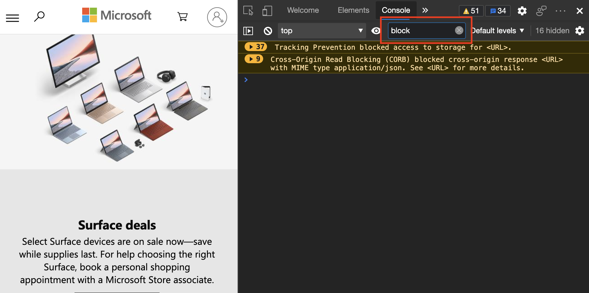
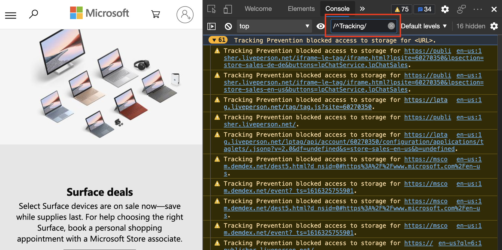
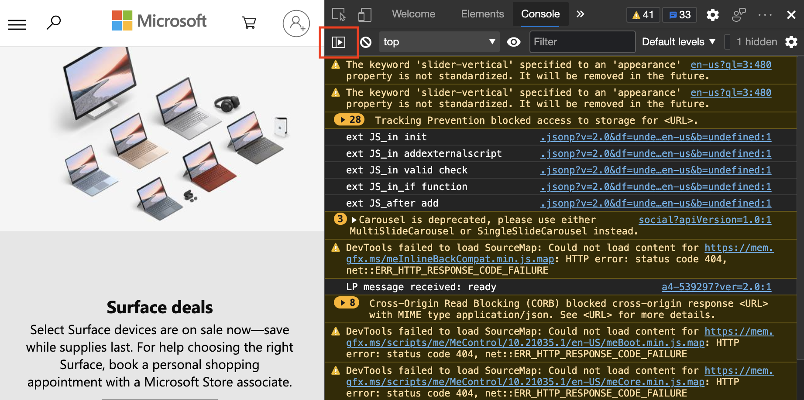
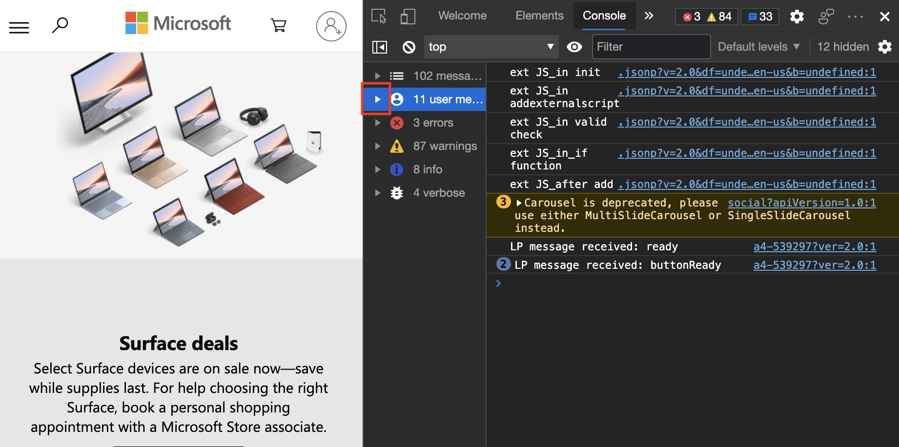

# Filter Console messages

Use the filter options of the DevTools **Console** to reduce the noise from excessive console log messages, to better see the type of log messages that you're looking for.

When you go to various webpages, you may find that the **Console** is flooded with all kinds of information.  Often the information isn't relevant to you, such as information about the page that another developer logged.  Or you might see logged information about violations and warnings about the performance of the current site, that you aren't able to change.  

You can filter console log messages in various ways:
*  Filter by log level.
*  Filter by text.
*  Filter by regular expression.
*  Filter by message source.

<!-- ====================================================================== -->
## Filter by log level

Each method of the `console` object has a severity level attached to it.  The severity levels are `Verbose`, `Info`, `Warning`, or `Error`.  Display the severity levels in the [API documentation](api.md).  For example, `console.log()` is an `Info`-level message, but `console.error()` is an `Error`-level message.

To filter messages in the **Console**, use the **Log Level** dropdown menu.  You may toggle the state of each level.  To turn off each level, remove the checkmark next to each.

Since no filter is applied, the following figure displays dozens of messages.  Next, reduce and manage the number of messages.

To hide all the Warning-level messages to cut down on the noise, click the **Log Levels** dropdown list, and then clear the `Warnings` level.

<!-- ====================================================================== -->
## Filter by text

To see more detail, to filter messages using text, type a string into the **Filter** text box.  For example, type **block** into the box to only display your messages about the browser blocking resources from loading.

<!-- ====================================================================== -->
## Filter by regular expression

[Regular expressions](https://developer.mozilla.org/docs/Web/JavaScript/Guide/Regular_Expressions) are a powerful way to filter messages.  For example, type `/^Tracking/` into the **Filter** text box to only display messages that start with the term `Tracking`.  If you're unfamiliar with regular expressions, [RegExr.com](https://regexr.com) is a great resource to learn about using regular expressions.

<!-- ====================================================================== -->
## Filter by message source

You can define what kind of messages you want to display, and where each message originated, by using the **Sidebar** of the **Console**.

1. Click the **Show console sidebar** button:

   

   When the **Sidebar** is open, you can display the overall number of messages and where each originated.  The options are `All messages`, `User Messages`, `Errors`, `Warnings`, `Info`, and `Verbose`.

   

1. Select any of the options to display only the messages of that type.  For example, to display user messages, click the user messages option to display less noise.

   

1. To filter more and expand the message category, click the triangle icon next to the message category.

   

1. Individual sources are revealed and listed.  Select a source, to display only messages that originate from that source:

   
