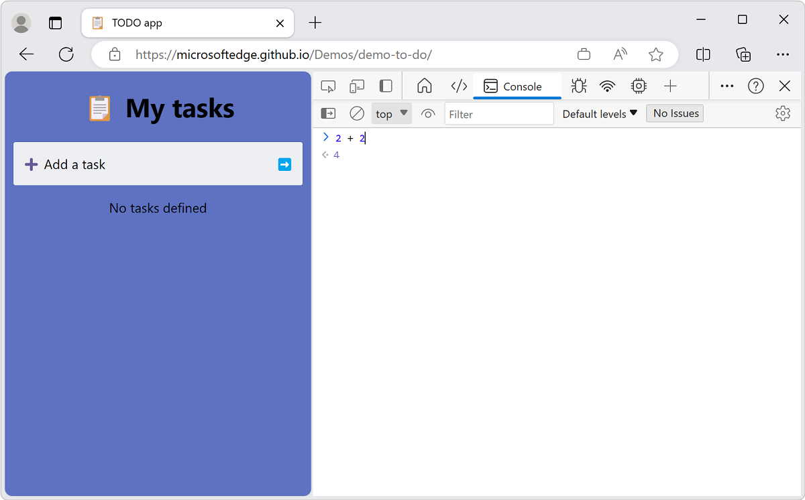
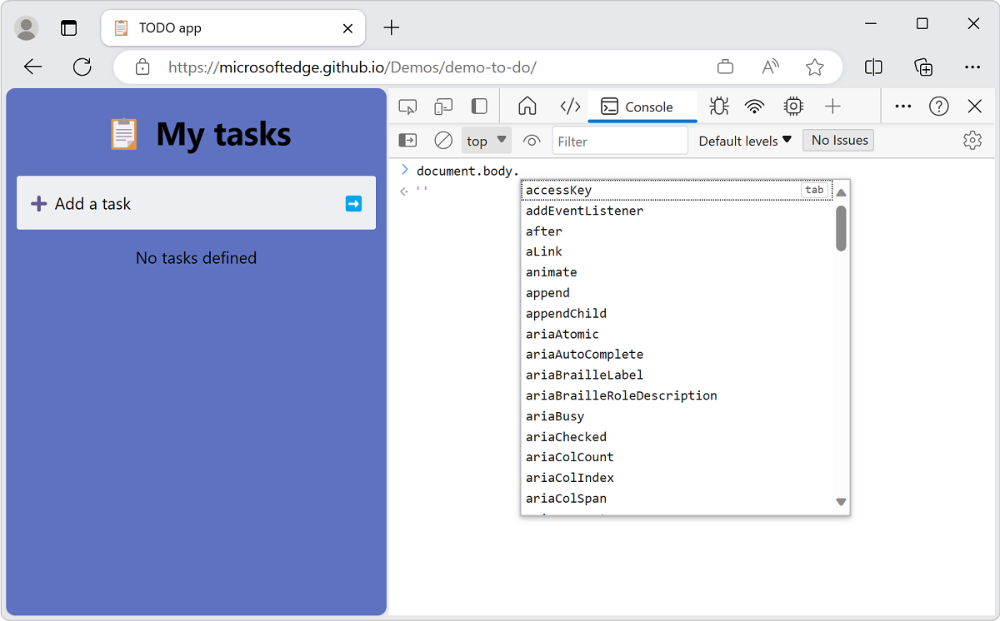
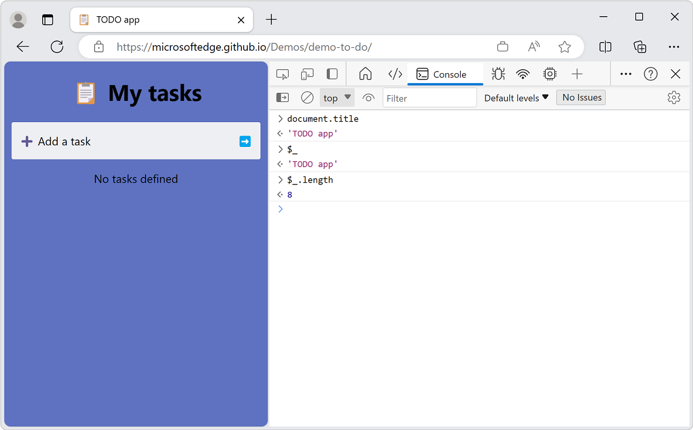
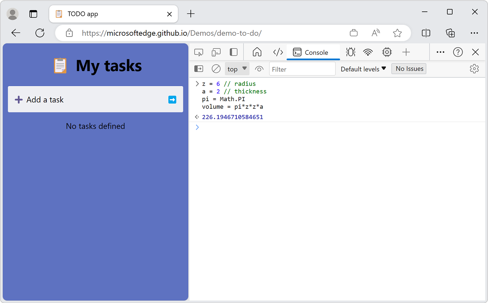
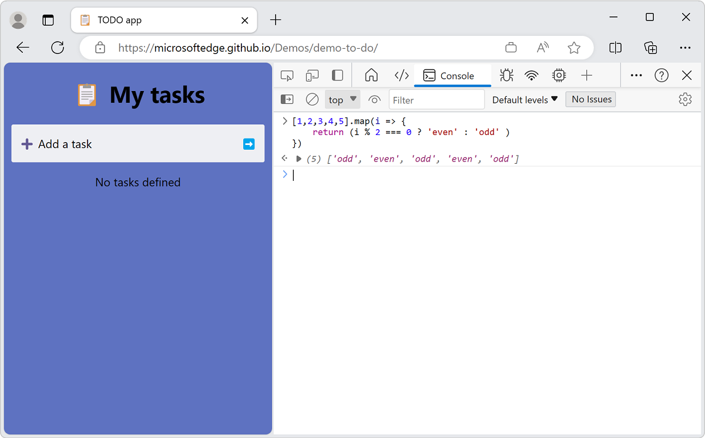
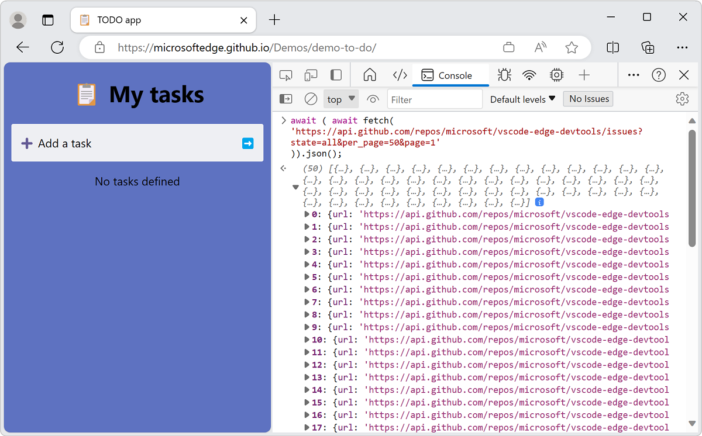
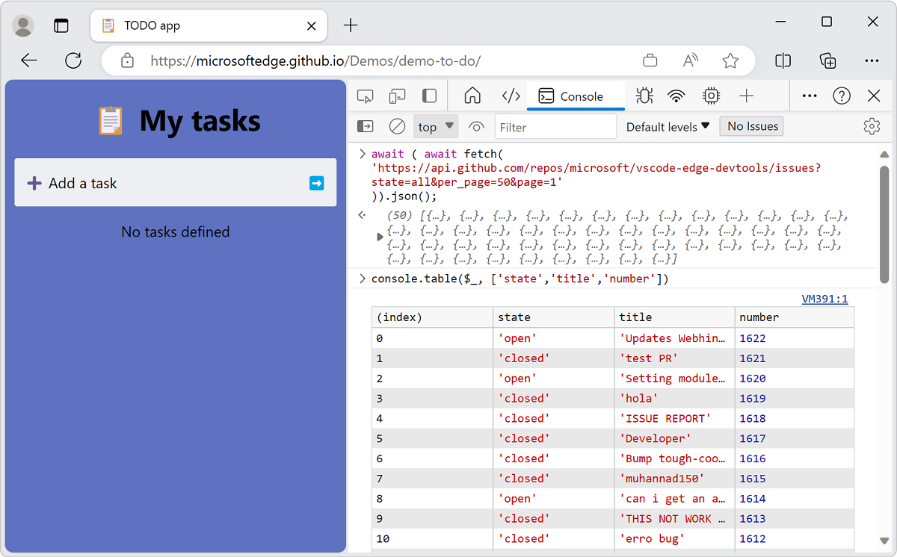

# Run JavaScript in the Console

You can enter any JavaScript expression, statement, or code snippet in the **Console**, and it runs immediately and interactively as you type.  This is possible because the **Console** tool in DevTools is a [REPL](https://wikipedia.org/wiki/Read%E2%80%93eval%E2%80%93print_loop) environment.  _REPL_ stands for Read, Evaluate, Print, and Loop.

The **Console**:
1. Reads the JavaScript that you type into it.
1. Evaluates your code.
1. Prints out the result of your expression.
1. Loops back to the first step.


To enter JavaScript statements and expressions interactively in the **Console**:

1. Right-click in a webpage and then select **Inspect**.  DevTools opens.  Or, press **Ctrl+Shift+J** \(Windows, Linux\) or **Command+Option+J** \(macOS\), to directly open the DevTools console.

1. If necessary, click in DevTools to give it focus, and then press **Esc** to open the **Console**.

1. Click in the **Console**, and then type `2+2`, without pressing **Enter**.

   The **Console** immediately displays the result `4` on the next line while you type.  The `Eager evaluation` feature helps you write valid JavaScript.  The **Console** displays the result while you type, regardless of whether your JavaScript is correct, and regardless of whether a valid result exists.

   

1. When you press **Enter**, the **Console** runs the JavaScript command (expression or statement), displays the result, and then moves the cursor down to allow you to enter the next JavaScript command.

   


<!-- ====================================================================== -->
## Autocompletion to write complex expressions

The **Console** helps you write complex JavaScript using autocompletion.  This feature is a great way to learn about JavaScript methods that you didn't know of before.

To try autocompletion while writing multi-part expressions:

1. Type `doc`.

1. Press the arrow keys to highlight `document` on the dropdown menu.

1. Press **Tab** to select `document`.

1. Type `.bo`.

1. Press **Tab** to select `document.body`.

1. Type another `.` to get a large list of possible properties and methods available on the body of the current webpage.

   


<!-- ====================================================================== -->
## Console history

As with many other command-line environments, a history of the commands that you entered is available for reuse.  Press **Up Arrow** to display the commands that you entered previously.  

Similarly, autocompletion keeps a history of the commands you previously typed.  You can type the first few letters of earlier commands, and your previous choices appear in a text box.

Also, the **Console** also offers quite a few [utility methods](utilities.md) that make your life easier.  For example, `$_` always contains the result of the last expression you ran in the **Console**.




<!-- ====================================================================== -->
## Multiline edits

By default, the **Console** only gives you one line to write your JavaScript expression.  You code runs when you press **Enter**. The one line limitation may frustrate you.  To work around the 1-line limitation, press **Shift+Enter** instead of **Enter**.  In the following example, the value displayed is the result of all the lines (statements) run in order:



If you start a multi-line statement in the **Console**, the code block is automatically recognized and indented.  For example, if you start a block statement, by entering a curly brace, the next line is automatically indented:




<!-- ====================================================================== -->
## Network requests using top-level await()

Other than in your own scripts, **Console** supports [top level await](https://github.com/tc39/proposal-top-level-await) to run arbitrary asynchronous JavaScript in it.  For example, use the `fetch` API without wrapping the `await` statement with an async function.

To get the last 50 issues that were filed on the [Microsoft Edge Developer Tools for Visual Studio Code](https://github.com/microsoft/vscode-edge-devtools) GitHub repo:

1. In DevTools, open the **Console**.

1. Copy and paste the following code snippet to get an object that contains 10 entries:

   ```javascript
   await ( await fetch(
   'https://api.github.com/repos/microsoft/vscode-edge-devtools/issues?state=all&per_page=50&page=1'
   )).json();
   ```

   

   The 10 entries are hard to recognize, since a lot of information is displayed.

1. Optionally, use the `console.table()` log method to only receive the information in which you're interested:

   

   To reuse the data returned from an expression, use the `copy()` utility method of the **Console**.

   <!-- todo: test: -->

1. Paste the following code.  It sends the request and copies the data from the response to the clipboard:

   ```javascript
   copy(await (await fetch(
   'https://api.github.com/repos/microsoft/vscode-edge-devtools/issues?state=all&per_page=50&page=1'
   )).json())
   ```
   
The **Console** is a great way to practice JavaScript and to do some quick calculations.  The real power is the fact that you have access to the [window](https://developer.mozilla.org/docs/Web/API/Window) object.  See [Interact with the DOM using the Console](console-dom-interaction.md).
