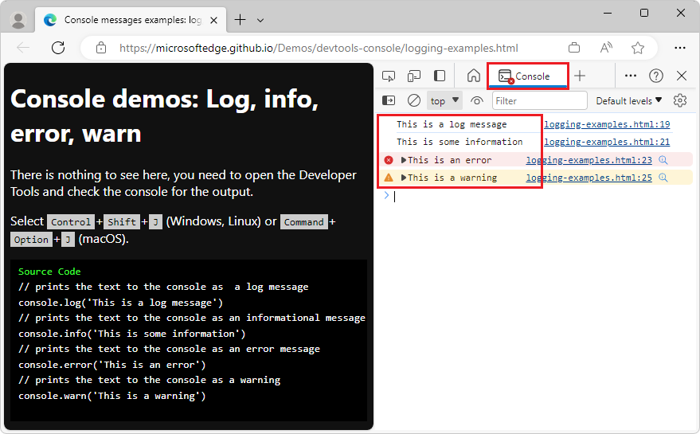
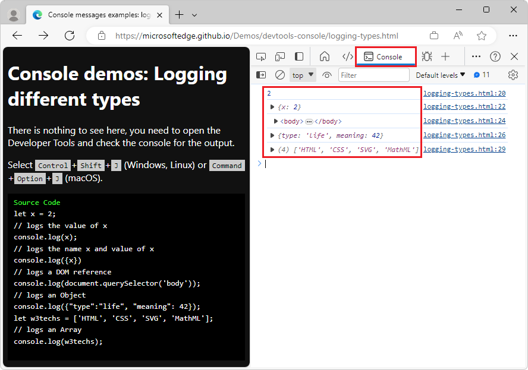
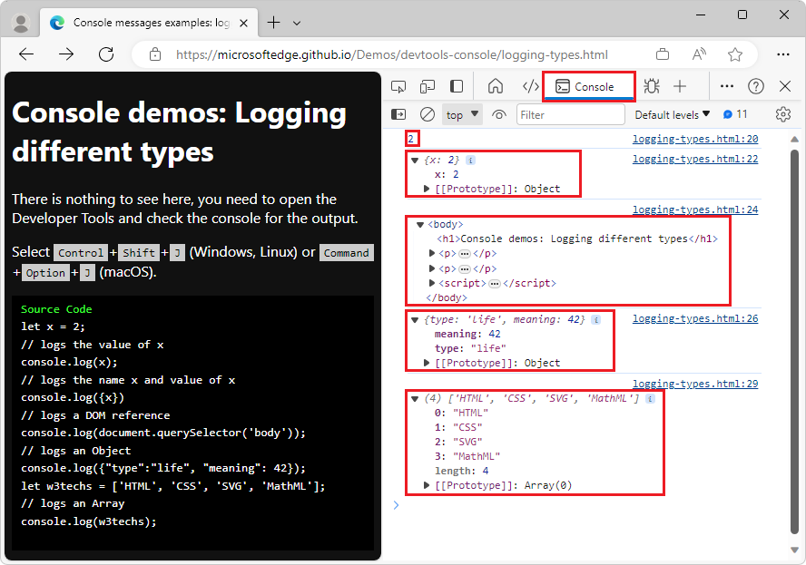
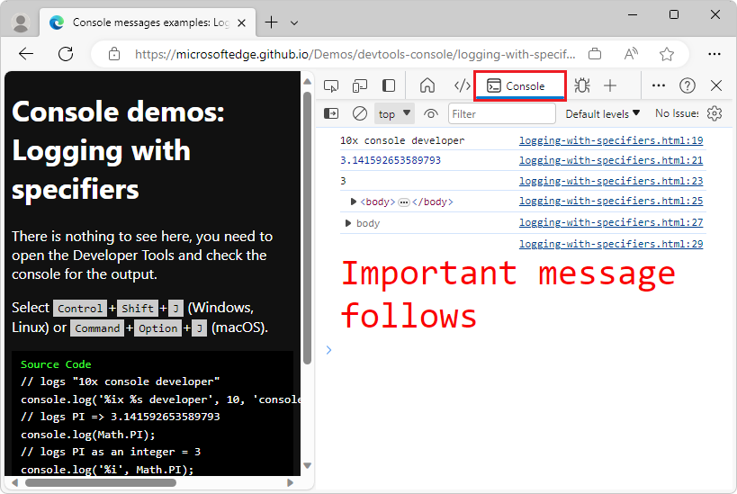
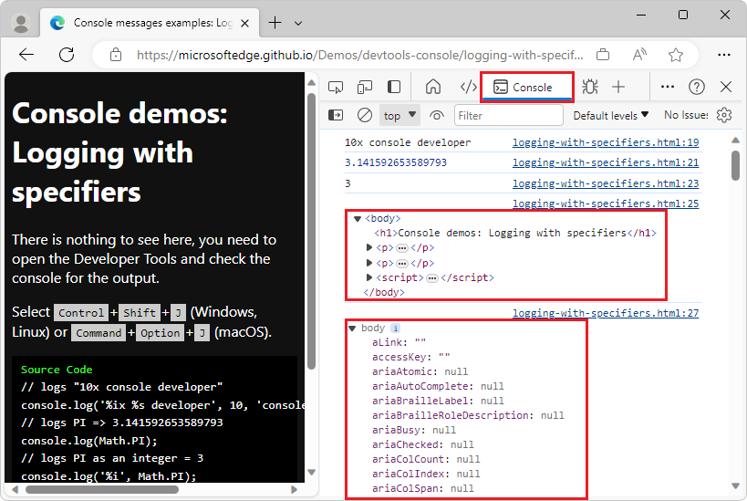
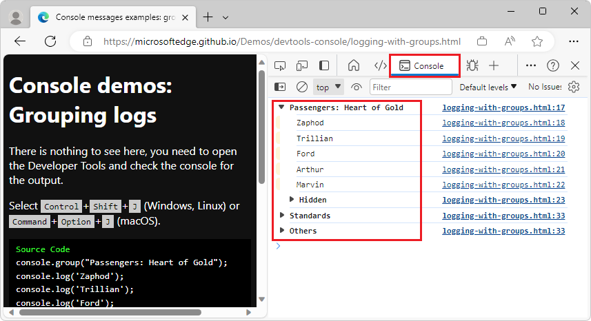
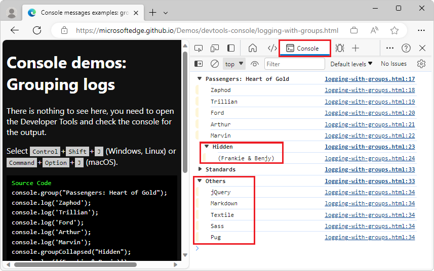
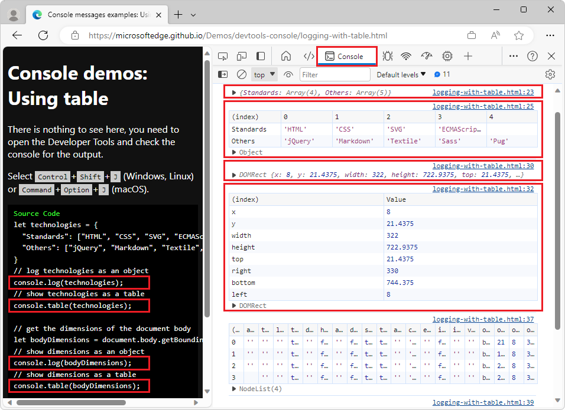
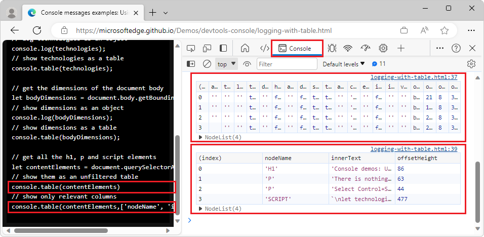

# Log messages in the Console tool

Ever since browsers started to offer developer tools, the **Console** is a favorite, because in most programming courses, you learn to output some kind of `print` or `log` command, to gain insights about what happens in your code.

Before DevTools, for JavaScript, you were limited to an `alert()` or `document.write()` statement to debug in the browser.  With DevTools, to log information in the **Console**, many methods of the `Console` object are available in the **Console**, listed in [Console object API Reference](./api.md).


<!-- ========================================================================== -->
## Levels of Console log messages: console.log, .info, .error, and .warn

The `console` object has methods to log various levels of messages:

* `console.log` - Prints the text to the **Console** as a log message.
* `console.info` - Prints the text to the **Console** as an informational message.
* `console.error` - Prints the text to the **Console** as an error message.
* `console.warn` - Prints the text to the **Console** as a warning.


<!-- ------------------------------ -->
#### Example code for levels of Console log messages

```javascript
// prints the text to the console as  a log message
console.log('This is a log message')

// prints the text to the console as an informational message
console.info('This is some information') 

// prints the text to the console as an error message
console.error('This is an error')

// prints the text to the console as a warning
console.warn('This is a warning') 
```


<!-- ------------------------------ -->
#### Demo webpage for levels of Console log messages

To try using the logging functions in the **Console**:

<!-- demo 1 of 6 -->

1. Open the demo webpage [Console messages examples: log, info, error, and warn](https://microsoftedge.github.io/Demos/devtools-console/logging-examples.html) in a new window or tab.

1. Press **Ctrl+Shift+J** (Windows, Linux) or **Command+Option+J** (macOS).

   DevTools opens, with the **Console** open in the **Activity Bar**.  The demo page has already sent the above log messages to the **Console**:

   

   The `log()` and `info()` methods seem to do the same thing.  Use `info()` and `log()` for different log tasks, because that allows you to [filter Console messages](console-filters.md), to display only a subset of log entries.
  
   The `error()` and `warn()` methods display an icon next to the message and a way to inspect the [stack trace](https://wikipedia.org/wiki/Stack_trace) of the message.

1. Copy and paste any of the examples into the **Console**, and then press **Enter**.

   Output is displayed in the **Console**, below the code that you entered.


<!-- ====================================================================== -->
## Logging various types of values

Instead of logging text values, you can send any valid JavaScript or DOM references to the **Console**.  The **Console** appropriately displays the various types of JavaScript values that you send to it from console log messages.  The **Console** displays a filtered and formatted representation of the results.


<!-- ------------------------------ -->
#### Example code for logging various types of values

```javascript
let x = 2;

// logs the value of x
console.log(x);

// logs the name x and value of x
console.log({x})   

// logs a DOM reference  
console.log(document.querySelector('body'));

// logs an Object
console.log({"type":"life", "meaning": 42});
let w3techs = ['HTML', 'CSS', 'SVG', 'MathML'];

// logs an Array
console.log(w3techs);
```


<!-- ------------------------------ -->
#### Demo webpage for logging various types of values

To use the `log` function to display different variable types:

<!-- demo 2 of 6 -->

1. Open the demo webpage [Console messages examples: Logging different types](https://microsoftedge.github.io/Demos/devtools-console/logging-types.html) in a new window or tab.

1. Press **Ctrl+Shift+J** (Windows, Linux) or **Command+Option+J** (macOS).

   DevTools opens, with the **Console** open in the **Activity Bar**, displaying several types of values.  Each type of result is displayed in a different way.

1. Expand each output entry to analyze each result in more detail.

   The second log message in the example code uses curly braces `{}` around the `x` variable, to output the name of the variable in addition to the value of the variable.  This syntax logs an object that contains a single property named `x`, instead of logging the value of `x` only.

   Logging variables of different types in the **Console**:

   

   Logging variables of different types in the **Console** with expanded, extra information:

   

1. Copy and paste any of the examples from the rendered webpage into the **Console**, such as `console.log({x})`, and then press **Enter**.

   Formatted output is displayed in the **Console**, below the code that you entered.


<!-- ====================================================================== -->
## Logging values using format specifiers

A feature of all the log methods is that you can use format specifiers in your log statement's message.  Format specifiers are part of a log message, and start with a percentage sign (`%`) character.

Use format specifiers to log certain values in different formats, and to convert between formats:

*  `%s` logs output as Strings.
*  `%i` or `%d` logs output as Integers.
*  `%f` logs output as a floating-point value.
*  `%o` logs output as an expandable DOM element.
*  `%O` logs output as an expandable JavaScript object.
*  `%c` allows you to style a message by using CSS properties.


<!-- ------------------------------ -->
#### Example code for logging values using format specifiers

```javascript
// logs "10x console developer"
console.log('%ix %s developer', 10, 'console');

// logs PI => 3.141592653589793
console.log(Math.PI); 

// logs PI as an integer = 3
console.log('%i', Math.PI); 

// logs the document body as a DOM node
console.log('%o', document.body); 

// logs the body of the document as a JavaScript object with all properties
console.log('%O', document.body); 

// shows the message as red and big
console.log('%cImportant message follows','color:red;font-size:40px')
```


<!-- ------------------------------ -->
#### Demo webpage for logging values using format specifiers

<!-- demo 3 -->

1. Open the demo page [Console messages examples: Logging with specifiers](https://microsoftedge.github.io/Demos/devtools-console/logging-with-specifiers.html) in a new tab or window.

1. Press **Ctrl+Shift+J** (Windows, Linux) or **Command+Option+J** (macOS).

   DevTools opens, with the **Console** open in the **Activity Bar**.  The webpage has already populated the **Console** with output.

   The first example demonstrates that the order of replacement of format specifiers is the parameter order following the string:

   ```javascript
   console.log('%ix %s developer', 10, 'console'); // logs "10x console developer"
   ```
   
1. Click the expander triangles in the output results, to expand the data that's output by the above `log` statements that are in the webpage.

1. If necessary, press **F5** to reload the page and re-populate the **Console** output.

   Format specifiers are used to log, format, and convert values:

   

1. In the **Console**, on the two `body` entries, click the triangles to expand the log results, to see the difference between the `%o` and `%O` format specifiers.

   The `body` element of the webpage is either displayed as an expandable DOM node (`console.log('%o', document.body);`), or as a full list of all JavaScript properties on the `body` element (`console.log('%O', document.body);`):

   


<!-- ====================================================================== -->
## Grouping log messages

If you log a lot of information, you can use the `group` and `groupCollapsed` methods to display log messages as expandable and collapsible groups in the **Console**.  Groups can be nested and named, to make the data easier to understand.


<!-- ------------------------------ -->
#### Example code for grouping log messages

```javascript
// Example 1: Nested groups, with the inner group hidden (collapsed):
console.group("Passengers: Heart of Gold");
console.log('Zaphod');
console.log('Trillian');
console.log('Ford');
console.log('Arthur');
console.log('Marvin');
console.groupCollapsed("Hidden");
console.log('(Frankie & Benjy)');
console.groupEnd("Hidden");
console.groupEnd("Passengers: Heart of Gold");


// Example 2:
let technologies = {
  "Standards": ["HTML", "CSS", "SVG", "ECMAScript"],
  "Others": ["jQuery", "Markdown", "Textile", "Sass", "Pug"]
}
for (tech in technologies) {
  console.groupCollapsed(tech);
  technologies[tech].forEach(t => console.log(t));
  console.groupEnd(tech);
}
```


<!-- ------------------------------ -->
#### Demo webpage for grouping log messages

<!-- demo 4 -->

1. Open the demo page [Console messages examples: Grouping logs](https://microsoftedge.github.io/Demos/devtools-console/logging-with-groups.html) in a new tab or window.

1. Press **Ctrl+Shift+J** (Windows, Linux) or **Command+Option+J** (macOS).

   DevTools opens, with the **Console** open in the **Activity Bar**.  The webpage has already populated the **Console** with output, logging many values as groups:

   

1. In the **Console** output, expand or collapse the sections:

   


<!-- ====================================================================== -->
## Displaying data as tables

As an alternative to outputting expandable objects, the `console.table()` method logs data as a table that you can sort by using the table headers, to make it easier to view the information.


<!-- ------------------------------ -->
#### Example code for displaying complex data as tables

```javascript
let technologies = {
  "Standards": ["HTML", "CSS", "SVG", "ECMAScript"],
  "Others": ["jQuery", "Markdown", "Textile", "Sass", "Pug"]
}
// log technologies as an object
console.log(technologies);
// show technologies as a table
console.table(technologies);

// get the dimensions of the document body
let bodyDimensions = document.body.getBoundingClientRect();
// show dimensions as an object
console.log(bodyDimensions);
// show dimensions as a table
console.table(bodyDimensions);
```

This code in the demo webpage produces the first four `console` outputs, with four line numbers shown on the right side of the **Console**.


<!-- ------------------------------ -->
#### Demo webpage for displaying complex data as tables

To show complex data as tables:

<!-- demo 5 -->

1. Open the demo page [Console messages examples: Using table](https://microsoftedge.github.io/Demos/devtools-console/logging-with-table.html) in a new window or tab.

1. Press **Ctrl+Shift+J** (Windows, Linux) or **Command+Option+J** (macOS).

   DevTools opens, with the **Console** open in the **Activity Bar**.  The webpage has already populated the **Console** with output.

1. In the **Console**, click the expander triangles.

   The data is output by using `console.table`, which makes the data easier to read:

   <!-- resume here -->

The output of `console.table` has a table format.  If you copy and paste a table from the **Console** into an app that supports tabular data, such as Microsoft Excel or Microsoft Word, the structuring of the output as rows and columns is preserved.


<!-- ------------------------------ -->
#### Specifying an array of properties to display as columns

If the data has named parameters, the `console.table()` method also allows you to specify an `Array` of columns for each property to display as a second parameter.  The following example shows how to specify an array of columns that is more readable:

The remaining code in the demo webpage shows:
1. How to output all the properties as columns, for the selected elements.
1. How to specify an array only of specified properties as columns, for the selected elements.

```javascript
// get all the h1, p and script elements
let contentElements = document.querySelectorAll(':is(h1,p,script)');
// show the elements as an unfiltered table
console.table(contentElements)
// show only relevant columns
console.table(contentElements, ['nodeName', 'innerText', 'offsetHeight'])
```

This code produces the final two `console` outputs, with two line numbers shown on the right side of the **Console**:
* `logging-with-table.html:37`
* `logging-with-table.html:39`



The final call to `console.table` filters the information that the `console.table()` method displays, by specifying an array of properties to display, as a second parameter.


<!-- ====================================================================== -->
## Log statements vs. breakpoint debugging and Live Expressions

You might be tempted to use the `log` methods as your main means to debug webpages, because log methods are simple to use.  However, consider the result of any `console.log()` request: released products shouldn't use any `log` statement that was used for debugging, because it could reveal inside information to people.  And excess noise is created in the **Console**.

So, instead of `log` statements, try using [Breakpoint Debugging](../javascript/breakpoints.md) or [Live Expressions](live-expressions.md).  You may find that your workflows are more effective and you get better results.


<!-- ====================================================================== -->
## See also

* [Console object API Reference](./api.md)
