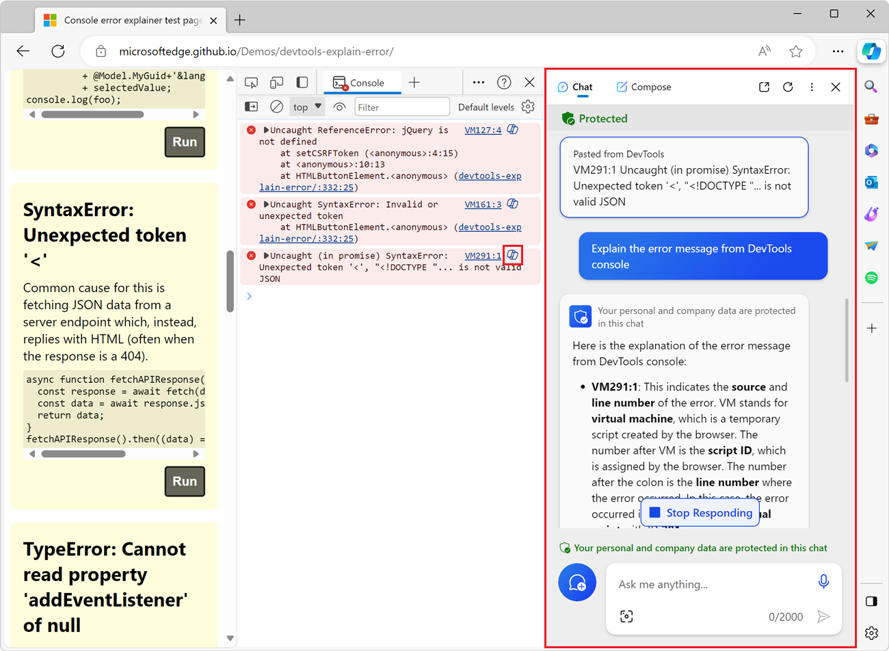
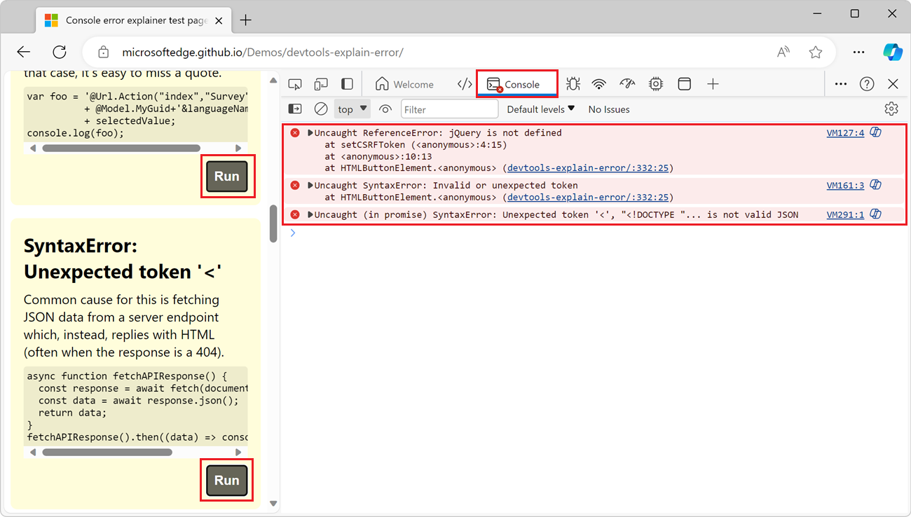

# Explain Console errors and warnings using Copilot in Edge

To help you understand errors and warnings, the **Console** tool in Microsoft Edge DevTools integrates Copilot in Microsoft Edge.

When inspecting a webpage with DevTools, you often see errors and warnings in the **Console** tool. These errors and warnings can sometimes be difficult to understand and fix. By using the **Explain this error** feature, you get more information about the error or warning in Copilot in Edge:

<!-- ------------------------------ -->
#### Supported scenarios

This feature is for use in standard browser windows, and is not available in the following scenarios:

| Scenario | Article |
|---|---|
| Browsing in an InPrivate window | [Browse InPrivate in Microsoft Edge](https://support.microsoft.com/microsoft-edge/browse-inprivate-in-microsoft-edge-cd2c9a48-0bc4-b98e-5e46-ac40c84e27e2) |
| Browsing with Kids Mode in Microsoft Edge | [Learn more about Kids Mode in Microsoft Edge](https://support.microsoft.com/microsoft-edge/learn-more-about-kids-mode-in-microsoft-edge-4bf0273c-1cbd-47a9-a8f3-895bc1f95bdd) |
| Using DevTools with a Microsoft Edge WebView2 control | [Debug WebView2 apps with Microsoft Edge DevTools](../../webview2/how-to/debug-devtools.md) |
| Using DevTools in a standalone Progressive Web App window | [Use a standalone app window](../../progressive-web-apps-chromium/how-to/best-practices.md#use-a-standalone-app-window) in _Best practices for PWAs_ |

<!-- ====================================================================== -->
## Enable Copilot in Edge

To use this explanation feature, enable Copilot in Edge:

1. Sign into Microsoft Edge.  See [Sign in to sync Microsoft Edge across devices](https://support.microsoft.com/microsoft-edge/sign-in-to-sync-microsoft-edge-across-devices-e6ffa79b-ed52-aa32-47e2-5d5597fe4674).

1. Make sure the Copilot icon () is visible in the top-right corner of the browser toolbar. If the Copilot icon isn't displayed, in Microsoft Edge, select **Settings and more** (**...**) > **Settings** > **Sidebar** > **Copilot**, and then turn on the **Show Copilot** toggle.

<!-- ====================================================================== -->
## Explain errors and warnings in the Console tool

To use Copilot to explain an error or warning in the **Console** tool:

1. If not done already, [enable Copilot in Edge](#enable-copilot-in-edge), as described above.

1. Open a web page that contains the errors you want to explain. For example, open the [Console error explainer test page](https://microsoftedge.github.io/Demos/devtools-explain-error/) in a new window or tab.

1. To open DevTools, right-click the webpage, and then select **Inspect**.  Or, press **Ctrl+Shift+I** (Windows, Linux) or **Command+Option+I** (macOS).  DevTools opens.

1. In DevTools, on the **Activity Bar**, select the **Console** tab.

1. In the rendered web page, click the **Run** button next to one or more error descriptions.

   The demo page then generates errors, which are shown in the **Console**:

   

1. In the **Console** tool, click the **ask Copilot: "Explain this error"** () button next to one of the error messages.

   Copilot opens in the Microsoft Edge sidebar, showing the error message, an **Explain the error message from DevTools console** request message, and then a response explaining the error:

   

1. To get more information about the error, in Copilot, enter additional questions.

<!-- ====================================================================== -->
## Provide feedback

The responses that Copilot in Edge provides when you use the above feature are automatically generated, so surprises and mistakes are possible. We're constantly improving the level of quality and accuracy of the responses, but if you see an incorrect response, let us know by adding a comment at: [Feedback for the Explain errors and source code in Copilot in Edge experiment](https://github.com/MicrosoftEdge/DevTools/issues/203).

<!-- ====================================================================== -->
## See also

* [Explain source code using Copilot in Edge](../javascript/copilot-explain-source-code.md)
