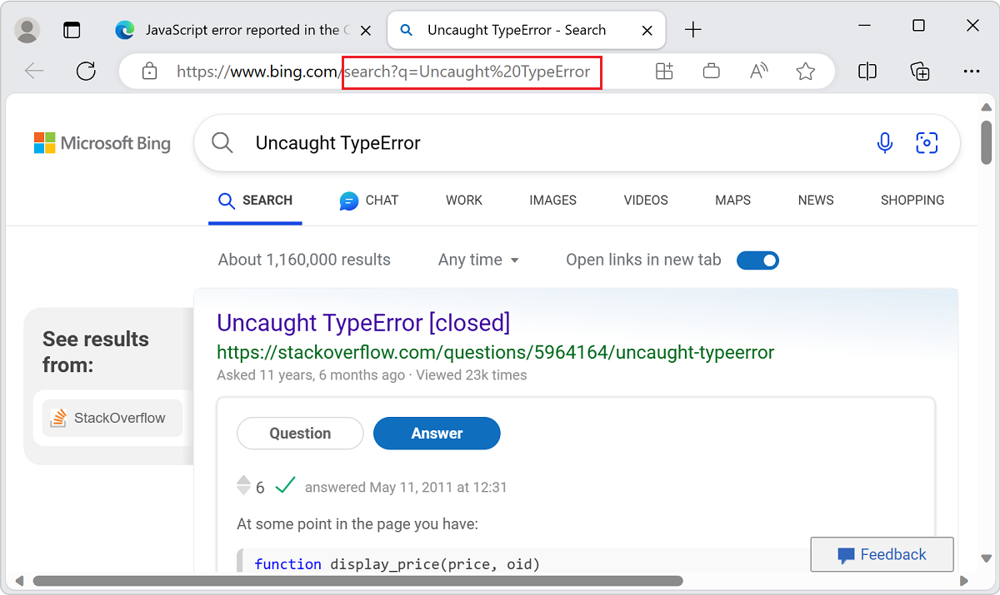

# Console overview

The **Console** is like an intelligent, rich command line within DevTools, and is great companion tool to use with others tools.  The **Console** provides a powerful way to script functionality, inspect the current webpage, and manipulate the current webpage using JavaScript.

The **Console** tool helps with several tasks, which are covered in more detail in the following articles:

* **Track down problems** to find out why something isn't working in the current project.  See [Fix JavaScript errors that are reported in the Console](console-debug-javascript.md).
* **Get information about the web project** in the browser as log messages.  See [Filter Console messages](console-filters.md).
* **Log information** in scripts for debugging purposes.  See [Log messages in the Console tool](console-log.md).
* **Try JavaScript expressions** live in a [REPL](https://wikipedia.org/wiki/Read%E2%80%93eval%E2%80%93print_loop) environment.  See [Run JavaScript in the Console](console-javascript.md).
* **Interact with the web project in the browser** using JavaScript.  See [Interact with the DOM using the Console](console-dom-interaction.md).

You can open the **Console** tool in the top or bottom of DevTools; it's shown here in upper part, on the **Activity Bar**:


The **Console** is shown here in the lower part of DevTools (the **Quick View** panel), with the **Elements** tool open above it:


The fastest way to directly open the **Console** is to press **Ctrl+Shift+J** (Windows, Linux) or **Command+Option+J** (macOS).


<!-- ====================================================================== -->
## Error reports and the Console

The **Console** is the default place where JavaScript and connectivity errors are reported.  For more information, see [Fixing JavaScript errors that are reported in the Console](console-debug-javascript.md).

DevTools gives detailed information about the error in the **Console**:


<!-- ====================================================================== -->
## Search the web for a Console error message string

Search the web for your **Console** error messages, right from within DevTools.  In the **Console**, many error messages have a **Search for this message on the Web** button, shown as a magnifying glass:


<!-- to set up screenshot, went to 
https://learn.microsoft.com/microsoft-edge/devtools-guide-chromium/console/console-debug-javascript to get a good page that has an error: 
https://microsoftedge.github.io/Demos/devtools-console/error.html -->

When you click the **Search for this message on the Web** button, a new tab opens in the browser and shows search results for the error message:




<!-- ====================================================================== -->
## Inspect and filter information on the current webpage

When you open DevTools on a webpage, there may be an overwhelming amount of information in the **Console**.  The amount of information becomes a problem when you need to identify important information.  To view the important information that needs action, use the [Issues](../issues/index.md) tool in DevTools.

Issues are gradually being moved from the **Console** to the **Issues** tool.  However, there's still a lot of information in the **Console**, which is why it's a good idea to know about the automated log and filter options in the **Console**.  For more information, see [Filter Console messages](console-filters.md).

DevTools with a **Console** full of messages:


<!-- ====================================================================== -->
## Log information to display in the Console

The most popular use case for the **Console** is logging information from your scripts using the `console.log()` method or other similar methods.


### Example code

```javascript
// prints the text to the console as  a log message
console.log('This is a log message');

// prints the text to the console as an informational message
console.info('This is some information'); 

// prints the text to the console as an error message
console.error('This is an error');

// prints the text to the console as a warning
console.warn('This is a warning');

// prints the geometry of the document body as an object
console.log(document.body.getBoundingClientRect());

// prints the geometry of the document body as a table
console.table(document.body.getBoundingClientRect());

// shows a list of techologies as a collapsed group
let technologies = ["HTML", "CSS", "SVG", "ECMAScript"];
console.groupCollapsed('Technolgies');
technologies.forEach(tech => {console.info(tech);})
console.groupEnd('Technolgies');
```

<!-- typos in the demo page are preserved above, at `Technolgies` -->


To log information to display in the Console:

1. Open the demo webpage [Console messages examples: log, info, error and warn](https://microsoftedge.github.io/Demos/devtools-console/logging-demo.html) in a new window or tab.

1. To open the **Console**, press **Ctrl+Shift+J** (Windows, Linux) or **Command+Option+J** (macOS).

   The **Console** displays the resulting messages that are caused by the demo code:

   

1. Paste the above code into the **Console**, and then press **Enter**.


   If you get a message: `Uncaught SyntaxError: Identifier 'technologies' has already been declared`:

1. Open a new tab or window.

1. To open the **Console**, press **Ctrl+Shift+J** (Windows, Linux) or **Command+Option+J** (macOS).

1. Paste the above code into the **Console**, and then press **Enter**.

Many useful methods are available when you work with the **Console**.  For more information, see [Log messages in the Console tool](console-log.md).


<!-- ====================================================================== -->
## Try your JavaScript live in the Console

The **Console** isn't only a place to log information.  The **Console** is a [REPL](https://wikipedia.org/wiki/Read%E2%80%93eval%E2%80%93print_loop) environment.  When you write any JavaScript in the **Console**, the code runs immediately.  You may find it useful to test some new JavaScript features or to do some quick calculations.  Also, you get all of the features you expect from a modern editing environment, such as autocompletion, syntax highlighting, and history.

To try running JavaScript in the Console:

1. Open the **Console**.

1. Type `2+2`.

The **Console** displays the result of `2+2` live as you type it, displaying the result `4` on the following line:


This **Eager evaluation** feature is useful to debug and verify that you aren't making mistakes in your code.

To run the JavaScript expression in the **Console** and optionally display a result, press **Enter**.  Then, you can write the next JavaScript code to run in the **Console**.

Running several lines of JavaScript code in succession:


By default, you run JavaScript code on a single line.  To run a line, type your JavaScript and then press **Enter**.  To work around the single-line limitation, press **Shift+Enter** instead of **Enter**.

Similar to other command-line experiences, to access your previous JavaScript commands, press **Up Arrow**.  The autocompletion feature of the **Console** is a great way to learn about unfamiliar methods.

To try autocompletion:

1. Open the **Console**.
1. Type `doc`.
1. Select `document` from the dropdown menu.
1. Press **Tab** to select `document`.
1. Type `.bo`.
1. Press **Tab** to select `document.body`.
1. Type another `.` to display the complete list of properties and methods available on the body of the current webpage.

For more information about all the ways to work with **Console**, see [Console as a JavaScript environment](console-javascript.md).

Autocompletion of JavaScript expressions in the **Console**:


<!-- ====================================================================== -->
## Interact with the current webpage in the browser

The **Console** has access to the [Window](https://developer.mozilla.org/docs/Web/API/Window) object of the browser.  You can write scripts that interact with the current webpage, by reading data from the DOM and assigning data to DOM elements.


### Reading from the DOM tree in the Console

To use a JavaScript expression to read from the current page by reading a selected element from the DOM tree:

1. Open the **Console**.

1. Paste the following code into the **Console**, and then press **Enter**:

   ```javascript
   document.querySelector('h1').innerHTML
   ```

   This expression selects the first heading-level 1 from the DOM and then selects the HTML content that's contained between the `<h1>` start and end tags.  The **Console** displays the output of the expression, which is the text of the heading:

   

You have read from the DOM representation of the webpage, by entering a JavaScript expression in the **Console** and displaying the output in the **Console**.


### Writing to the DOM tree and webpage from the Console

You can also change the rendered webpage, by changing the DOM (or _writing to_ the DOM), from within the **Console**.

To change the rendered webpage:

1. Open the **Console**.

1. Paste the following code into the **Console**, and then press **Enter**:

   ```javascript
   document.querySelector('h1').innerHTML = 'Rocking the Console';
   ```

   The above JavaScript expression uses the `=` sign to assign a value to the selected DOM item.  The evaluated value of the expression is a string for a heading, in this example.  The expression's value (the heading string) is shown both in the **Console** and in the rendered webpage:

   

   You changed the main heading of the webpage to **Rocking the Console**.


### Using the $$ Console utility method to 

The **Console Utility** methods make it easy to access and manipulate the current webpage.

For example, to add a green border around all the links in the current webpage:

1. Open the **Console**.

1. Paste the following code into the **Console**, and then press **Enter**:

   ```javascript
   $$('a').forEach(a => a.style.border='1px solid lime');
   ```

   The `$$(selector)` console utility function is "Query selector all".  This DOM query selector function returns an array of all the elements that match the specified CSS selector, like the JavaScript function `document.querySelectorAll()`.  In this example, we select all the `<a>` hyperlink elements and then apply a green box around them:

   

For more information, see [Console tool utility functions and selectors](utilities.md).


<!-- ====================================================================== -->
## See also

<!-- if an article's title is adequately descriptive, and the article is in the same TOC bucket as the present article, don't much need a link here: -->
* [Interact with the DOM using the Console](console-dom-interaction.md).
* [Console features reference](reference.md)
* [Console object API Reference](api.md)
* [Console tool utility functions and selectors](utilities.md)
