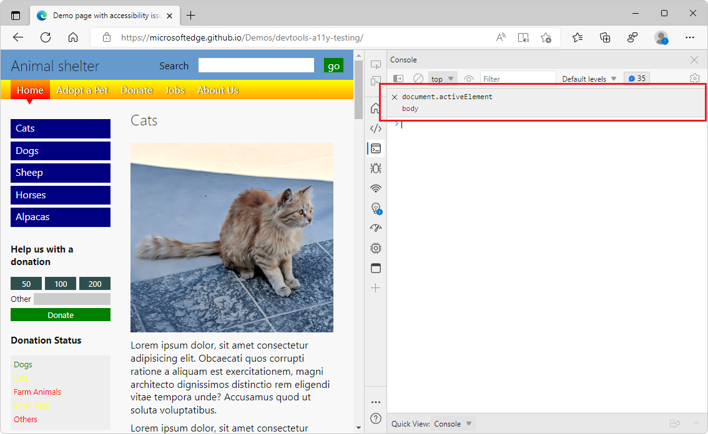
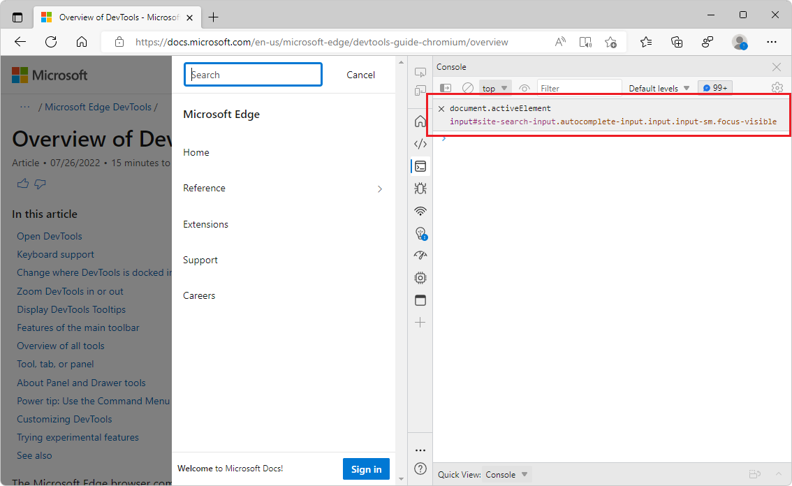
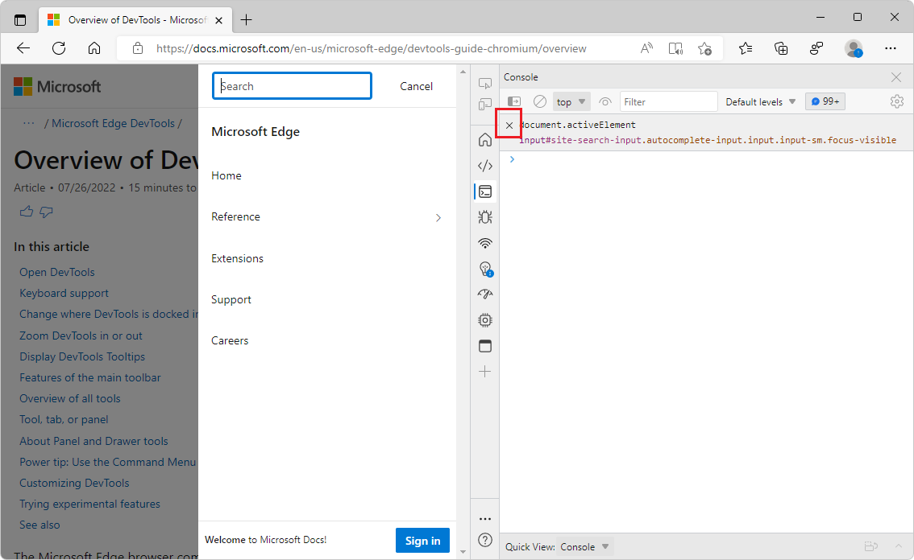
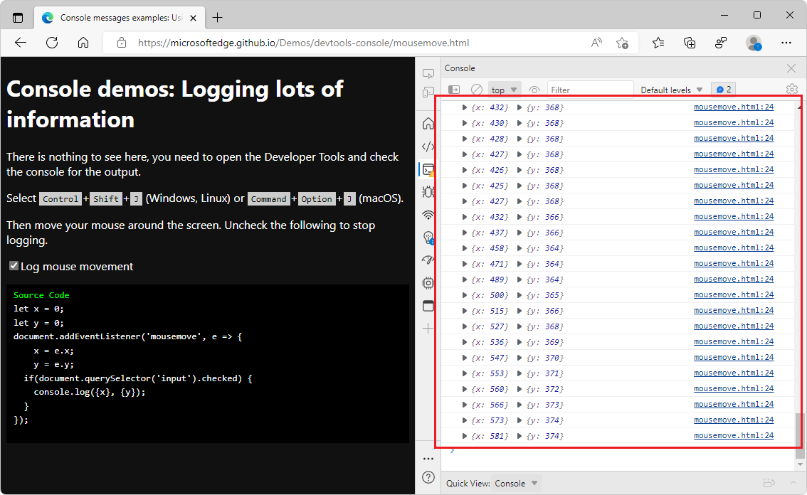
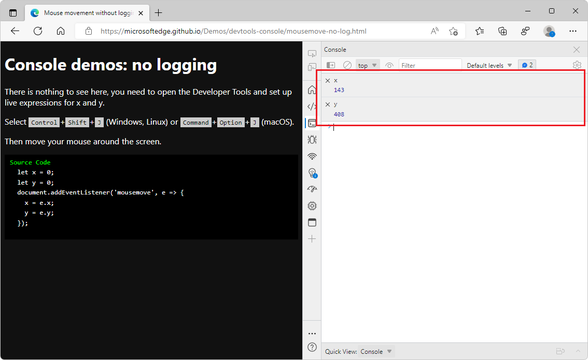

# Monitor changes in JavaScript using Live Expressions

<!-- very short article in other repo:
Watch JavaScript values in real-time with Live Expressions -->

**Live Expressions** are a great way to monitor JavaScript expressions that change a lot.  Instead of generating many **Console** messages to read and navigate, you can pin your specific JavaScript expressions to the top of the **Console**.

<!-- ====================================================================== -->
## Add a new live expression

To add a live expression:

1. Open the [accessibility-testing demo webpage](https://microsoftedge.github.io/Demos/devtools-a11y-testing/) in a new window or tab.

1. Right-click anywhere in the webpage and then select **Inspect**.  Or, press **F12**.  DevTools opens next to the webpage.

1. In DevTools, open the **Console**.

1. In the **Console**, click the **Create live expression** () icon next to the **Filter** text box.

   A text box opens:

   

1. Enter the JavaScript expression `document.activeElement` into the text box.  A Live Expression can be any valid JavaScript expression.

1. To save the expression, press `Ctrl`+**Enter** (Windows, Linux) or `Command`+**Enter** (macOS).  Or, click outside of the **Live Expression** text box.

   The expression is now live, and displays `body` as the result:

   <!-- update the captures, they assume that you're not reading the present article or accessibility demo page, but are reading the Dev Tools Overview article: -->

   

1. Click different parts of the webpage, or press **Tab** and **Shift+Tab** to move around in the webpage, the `document.activeElement` Live Expression value changes.

   In the accessibility-testing demo webpage, when you **Tab** to put focus on the **Other** text box in the **Donation** section, the Live Expression value reads `input#freedonation.smallinput`.

   <!-- revise the step & the capture after it: -->

1. In that same window, go to the webpage [Overview of DevTools](../overview.md), and then click the **Docs** button in the upper left.

   The Live Expression value changes to `button.nav-bar-button.focus-visible`:

   

1. To change the value again, open and click the **Search** text box on the webpage.

   The Live Expression value changes to `input#site-search-input.autocomplete-input.input.is-small.focus-visible`:

   

<!-- ====================================================================== -->
## Remove Live Expressions

A Live Expression is available as long as you keep it active.

*  To get rid of a Live Expression, click the `x` next to it:

   

<!-- ====================================================================== -->
## Replace Console logging with Live Expressions

You can create as many Live Expressions as you want, and persist each Live Expression across browser sessions and windows.  Live Expressions are a way to cut down on noise in your debugging workflow.

### Using Console logging to display mouse coordinates

To monitor the mouse movement in the current webpage:

1. Open the demo webpage [Logging Mouse Movement demo](https://microsoftedge.github.io/Demos/devtools-console/mousemove.html) in a new window or tab.

1. Press **Ctrl+Shift+J** (Windows, Linux) or **Command+Option+J** (macOS).  The **Console** tool opens in DevTools, next to the demo webpage.

1. Move your mouse around over the rendered demo webpage.

   Many log messages are output, displayed in the **Console**:

   

The large amount of information slows down your debugging process, and makes it hard to see the changes that you're trying to monitor.  As the **Console** displays more messages when you move your mouse, the values that you want to see scroll off the screen.

### Using Live Expressions to display mouse coordinates

Use Live Expressions to monitor the mouse movement in the current webpage, without relying on verbose log messages.

To use Live Expressions to avoid excessive Console log messages:

1. Open the demo webpage [Mouse movement without logging demo](https://microsoftedge.github.io/Demos/devtools-console/mousemove-no-log.html) in a new window or tab.

1. Press **Ctrl+Shift+J** (Windows, Linux) or **Command+Option+J** (macOS).  The **Console** tool opens in DevTools, next to the demo webpage.

1. Move your mouse around.  No log messages are output.

   Enter two Live Expressions: the expression `x`, and the expression `y`, as follows:

1. In the **Console** tool, click the **Create live expression** () icon next to the **Filter** text box.

1. Enter the JavaScript expression `x` into the text box, and then click outside of the **Live Expression** text box.  Repeat for `y`.  If needed, see [Add a new live expression](#add-a-new-live-expression), above.

1. Move your mouse around.

   Now in the DevTools Console, the Live Expression value is updated, below the Live Expression, showing the `x` and `y` coordinates of the mouse:

   

When you use **Live Expressions**, you always get the information on the same part of your screen, and keep **Console** logs for values that don't change as much.

**Live Expressions** run exclusively on your computer, and you don't need to change anything in your code to display the expression and its result.  **Live Expressions** are a great way to ensure that you only display the information that you want to debug.  Live Expressions also help you limit the noise on your users' computers.
