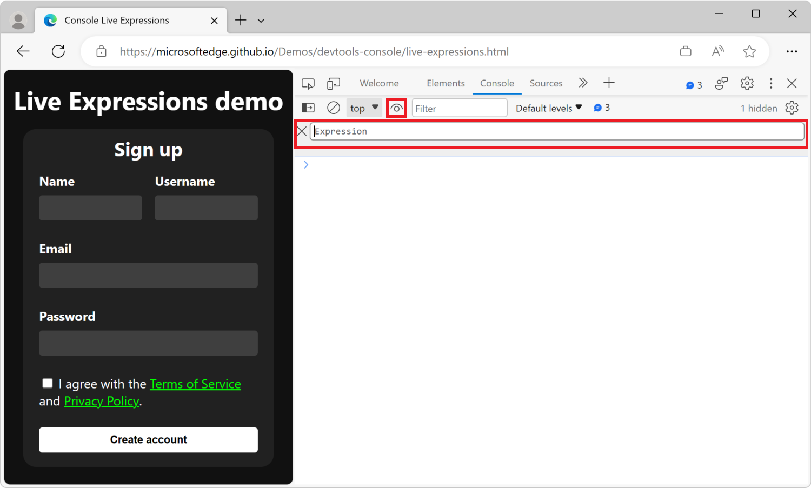
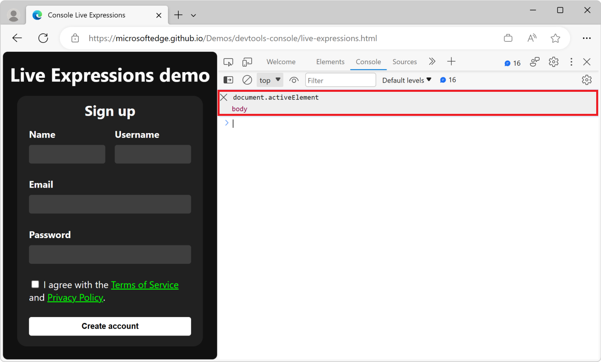
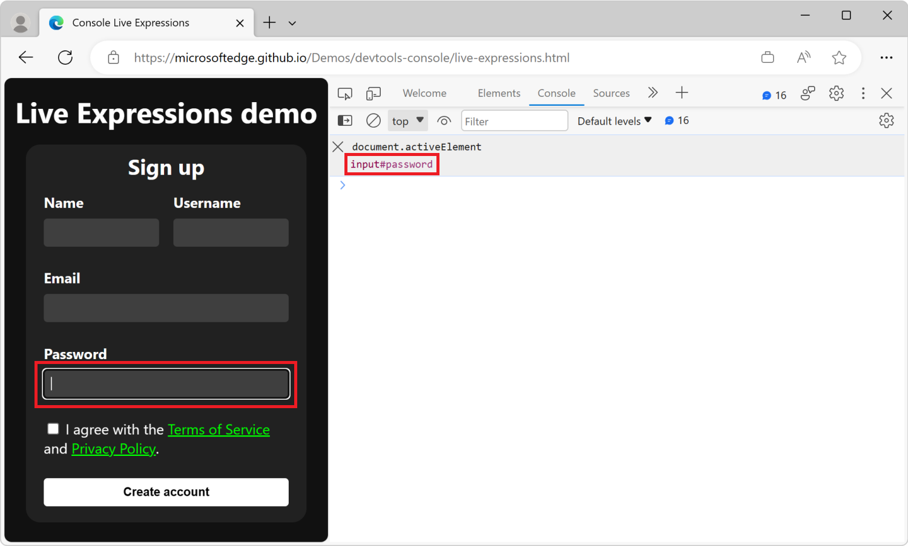
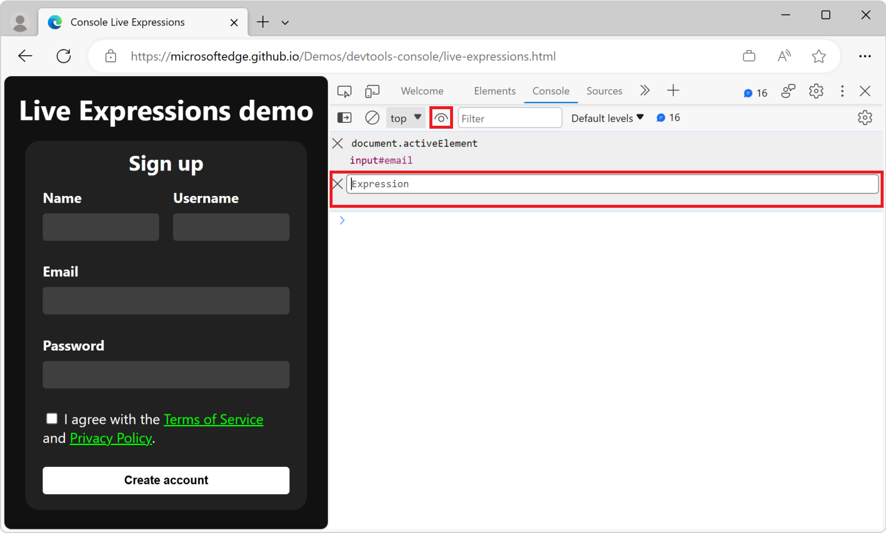
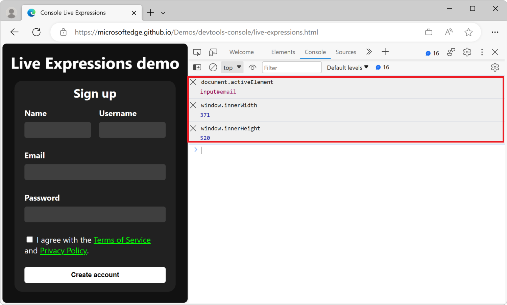
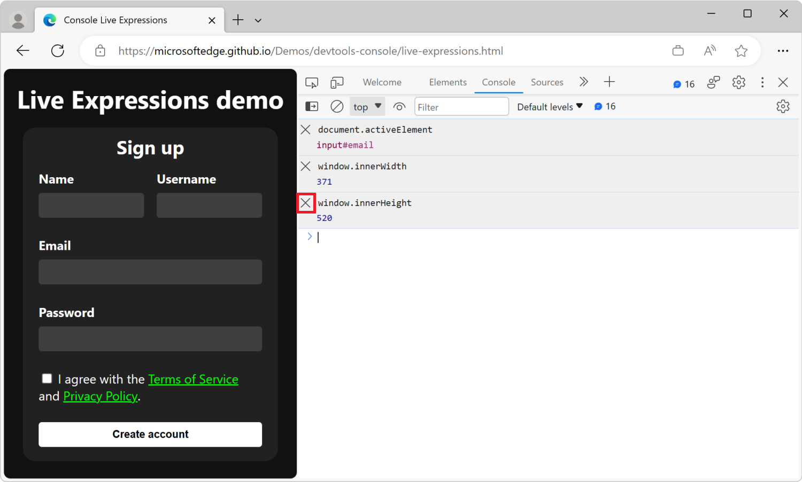
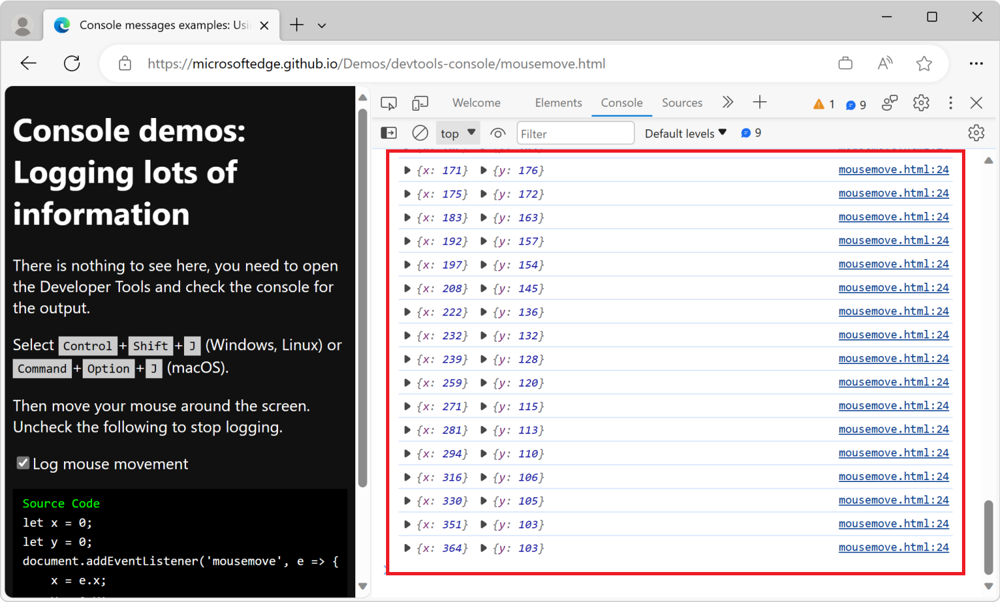
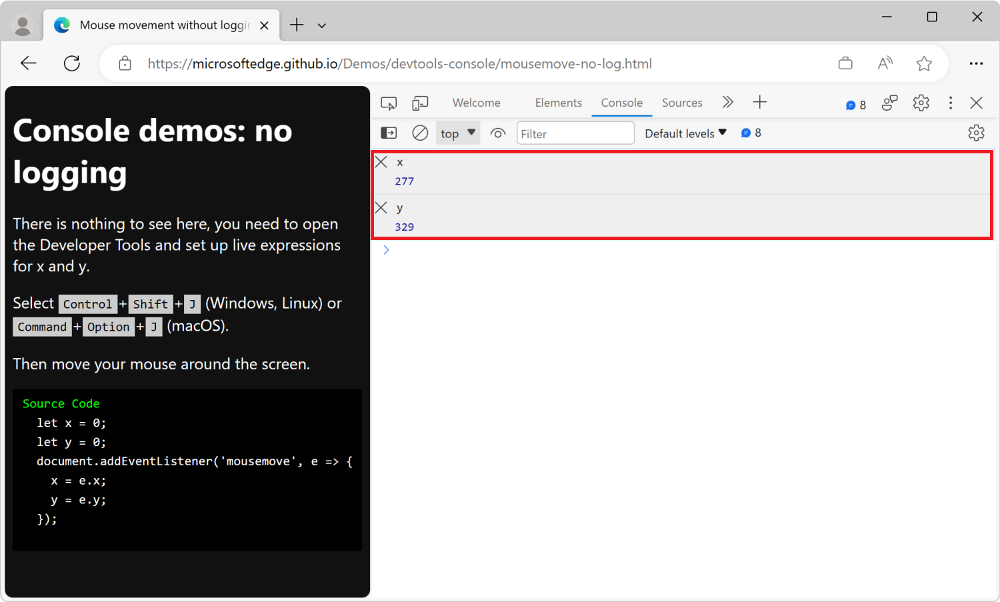

# Monitor changes in JavaScript using Live Expressions

**Live Expressions** are a great way to monitor the value of JavaScript expressions that change a lot over time.  Instead of generating many distinct **Console** messages that you have to read and scroll through, you can pin JavaScript expressions to the top of the **Console** tool.

With **Live Expressions**, you see the value of your JavaScript expressions at the top of the **Console** tool, always in the same place, and you can keep using **Console** logs for values that don't change as often.

**Live Expressions** run exclusively on your computer, and you don't need to change anything in your code to display their values.

<!-- ====================================================================== -->
## Add a new live expression

To add a live expression:

1. Open the [live expression demo webpage](https://microsoftedge.github.io/Demos/devtools-console/live-expressions.html) in a new window or tab.

1. Right-click anywhere in the webpage and then select **Inspect**.  Or, press **F12**.  DevTools opens next to the webpage.

1. In DevTools, open the **Console** tool.

1. In the **Console**, click the **Create live expression** () icon next to the **Filter** text box.

   A text box appears:

   

1. Enter the JavaScript expression `document.activeElement` into the text box.  A Live Expression can be any valid JavaScript expression.

1. To save the expression, press **Ctrl+Enter** (Windows, Linux) or **Command+Enter** (macOS).  Or, click outside of the **Live Expression** text box.

   The expression is now live, and displays `body` as the result:

   

1. Click different parts of the webpage, or press **Tab** or **Shift+Tab** to move the focus around in the webpage.

   The `document.activeElement` Live Expression value changes to reflect the currently focused element in real time:

   

<!-- ====================================================================== -->
## Add more live expressions

You can add multiple Live Expressions to the **Console** tool.  Each Live Expression is evaluated independently, and the results are displayed in the order that you add them.

To add a second Live Expression:

1. In the **Console** tool, click the **Create live expression** () icon next to the **Filter** text box.

   A new text box appears below the first Live Expression:

   

1. Enter a new JavaScript expression in the text box, for example `window.innerWidth` to display the width of the browser window.

1. Repeat the steps to add another Live Expression for `window.innerHeight`.

   The **Console** tool now displays three Live Expressions:

   

<!-- ====================================================================== -->
## Remove Live Expressions

To get rid of a Live Expression, click the **Close** () icon next to the expression:

<!-- ====================================================================== -->
## Replace Console logging with Live Expressions

You can create as many Live Expressions as you want, and persist each Live Expression across browser sessions and windows.  Live Expressions are a way to cut down on noise in your debugging workflow.

### Use Console logging to display mouse coordinates

To monitor the mouse movement in the current webpage:

1. Open the demo webpage [Logging Mouse Movement demo](https://microsoftedge.github.io/Demos/devtools-console/mousemove.html) in a new window or tab.

1. Press **Ctrl+Shift+J** (Windows, Linux) or **Command+Option+J** (macOS).  The **Console** tool opens in DevTools, next to the demo webpage.

1. Move your mouse around over the rendered demo webpage.

   Many log messages appear in the **Console**:

   

The large amount of information slows down your debugging process, and makes it hard to see the changes that you're trying to monitor.  As the **Console** displays more messages when you move your mouse, the values that you want to see scroll off the screen.

### Use Live Expressions to display mouse coordinates

Use Live Expressions to monitor the mouse movement in the current webpage, without relying on verbose log messages.

To use Live Expressions to avoid excessive Console log messages:

1. Open the demo webpage [Mouse movement without logging demo](https://microsoftedge.github.io/Demos/devtools-console/mousemove-no-log.html) in a new window or tab.

   This demo webpage uses JavaScript to track the current position of the mouse and stores the coordinates in the `x` and `y` global variables.

1. Press **Ctrl+Shift+J** (Windows, Linux) or **Command+Option+J** (macOS).  The **Console** tool opens in DevTools, next to the demo webpage.

1. Move your mouse around.
   
   The values of the `x` and `y` variables are updated, but no log messages are displayed.

1. In the **Console** tool, click the **Create live expression** () icon next to the **Filter** text box, and then enter the JavaScript expression `x`.

1. Repeat the above step to add a second Live Expression for `y`.

1. Move your mouse around in the rendered webpage.

   Now in the **Console**, the values of the `x` and `y` Live Expressions are updated in real time:

   
