<!-- Copyright Kayce Basques

   Licensed under the Apache License, Version 2.0 (the "License");
   you may not use this file except in compliance with the License.
   You may obtain a copy of the License at

       https://www.apache.org/licenses/LICENSE-2.0

   Unless required by applicable law or agreed to in writing, software
   distributed under the License is distributed on an "AS IS" BASIS,
   WITHOUT WARRANTIES OR CONDITIONS OF ANY KIND, either express or implied.
   See the License for the specific language governing permissions and
   limitations under the License.  -->
# Console features reference

This article is an outline of the features of the **Console**.

**Contents:**

* [Open the Console](#open-the-console)
   * [Open the Console tool](#open-the-console-tool)
   * [Open the Console tool in the Drawer](#open-the-console-tool-in-the-drawer)
   * [Open Console Settings](#open-console-settings)
   * [Open the Console Sidebar](#open-the-console-sidebar)
* [View messages](#view-messages)
   * [Turn off message grouping](#turn-off-message-grouping)
   * [Log XHR and Fetch requests](#log-xhr-and-fetch-requests)
   * [Persist messages across page loads](#persist-messages-across-page-loads)
   * [Hide network messages](#hide-network-messages)
* [Filter messages](#filter-messages)
   * [Filter out browser messages](#filter-out-browser-messages)
   * [Filter by log level](#filter-by-log-level)
   * [Filter messages by URL](#filter-messages-by-url)
   * [Filter out messages from different contexts](#filter-out-messages-from-different-contexts)
   * [Filter out messages that don't match a regular expression pattern](#filter-out-messages-that-dont-match-a-regular-expression-pattern)
* [Run JavaScript](#run-javascript)
   * [Rerun expressions from history](#rerun-expressions-from-history)
   * [Watch the value of an expression in real time with Live Expressions](#watch-the-value-of-an-expression-in-real-time-with-live-expressions)
   * [Turn off Eager Evaluation](#turn-off-eager-evaluation)
   * [Turn off autocomplete from history](#turn-off-autocomplete-from-history)
   * [Select JavaScript context](#select-javascript-context)
* [Clear the Console](#clear-the-console)

<!-- ====================================================================== -->
## Open the Console

You can open the **Console** as a [tool in the upper pane](#open-the-console-tool) or as a [tool in the Drawer](#open-the-console-tool-in-the-drawer).

### Open the Console tool

Press **Ctrl+Shift+J** (Windows, Linux) or **Command+Option+J** (macOS).

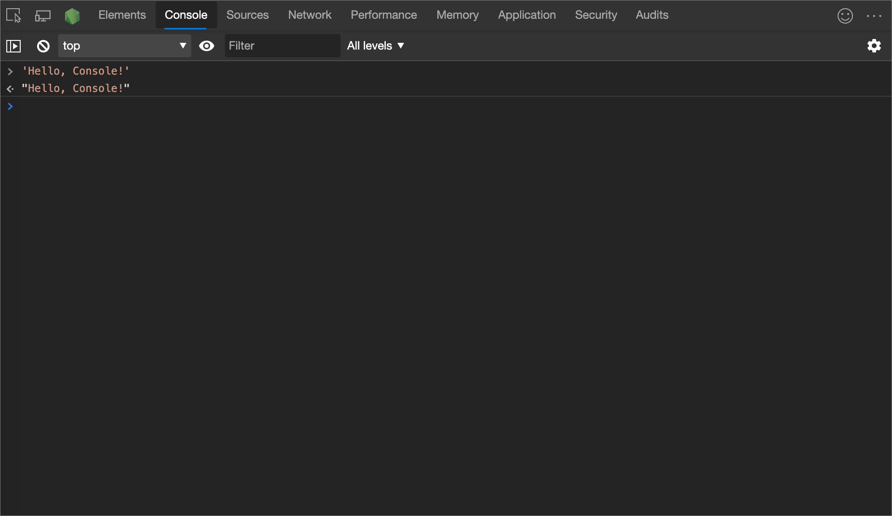

To open the **Console** tool from the [Command Menu](../command-menu/index.md), type `Console` and then run the **Show Console** command that has the **Panel** badge next to it.

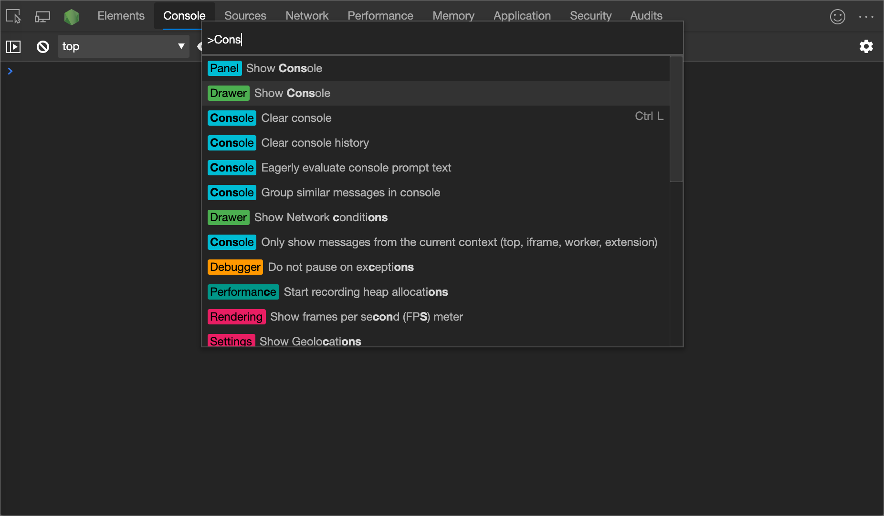

### Open the Console tool in the Drawer

Press **Esc**.  Or, click **Customize and control DevTools** (`...`) and then select **Show console drawer**.

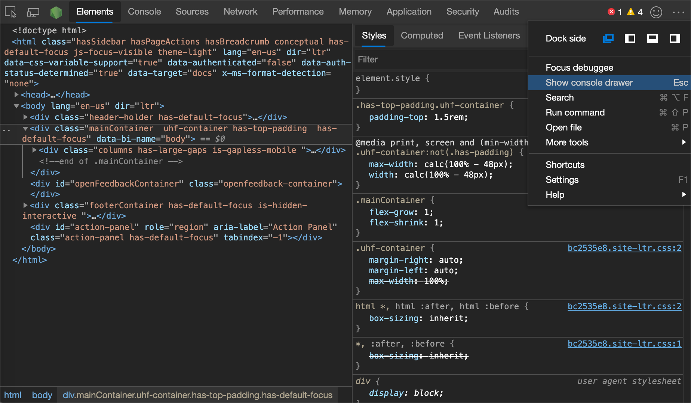

The Drawer pops up in the bottom of the DevTools window, with the **Console** tool open.

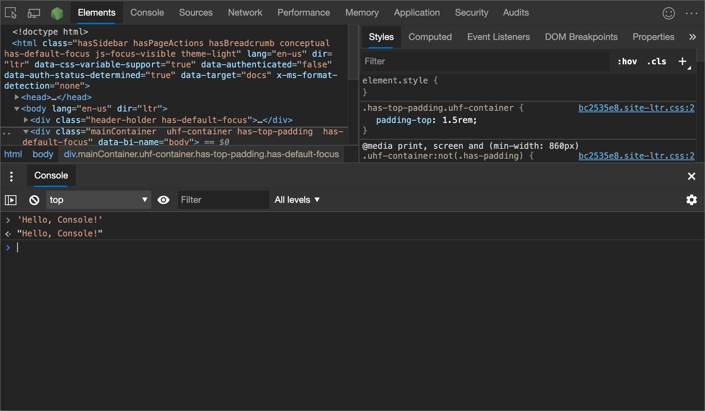

To open the **Console** tool from the [Command Menu](../command-menu/index.md), type **Console** and then run the **Show Console** command that has the **Drawer** badge next to it.

### Open Console Settings

Click the **Console Settings** () button.

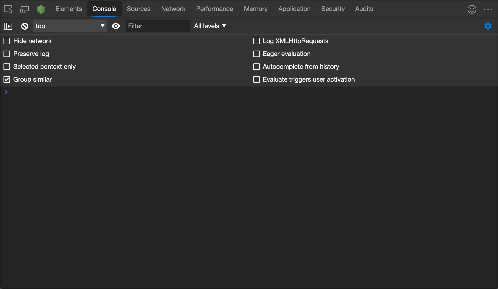

### Open the Console Sidebar

To display the **Sidebar**, click **Show console sidebar** ().  The **Sidebar** helps you filter.

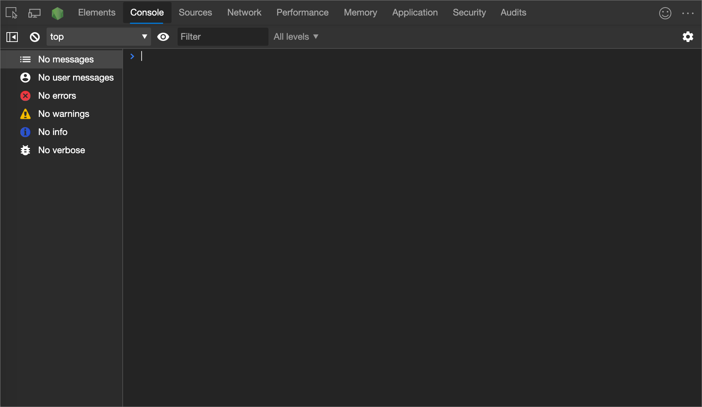

<!-- ====================================================================== -->
## View messages

This section contains features that change how messages are presented in the Console.  For a hands-on walkthrough, see [View messages](index.md#inspect-and-filter-information-on-the-current-webpage).

### Turn off message grouping

To turn off the default message grouping behavior of the **Console**, click the **Console Settings** () button and then select the checkbox next to **Group similar**.  For an example, see [Log XHR and Fetch requests](#log-xhr-and-fetch-requests).

### Log XHR and Fetch requests

To log all `XMLHttpRequest` and `Fetch` requests to the **Console** as each happens, click the **Console Settings** () button and then select the checkbox next to **Log XMLHttpRequests**.

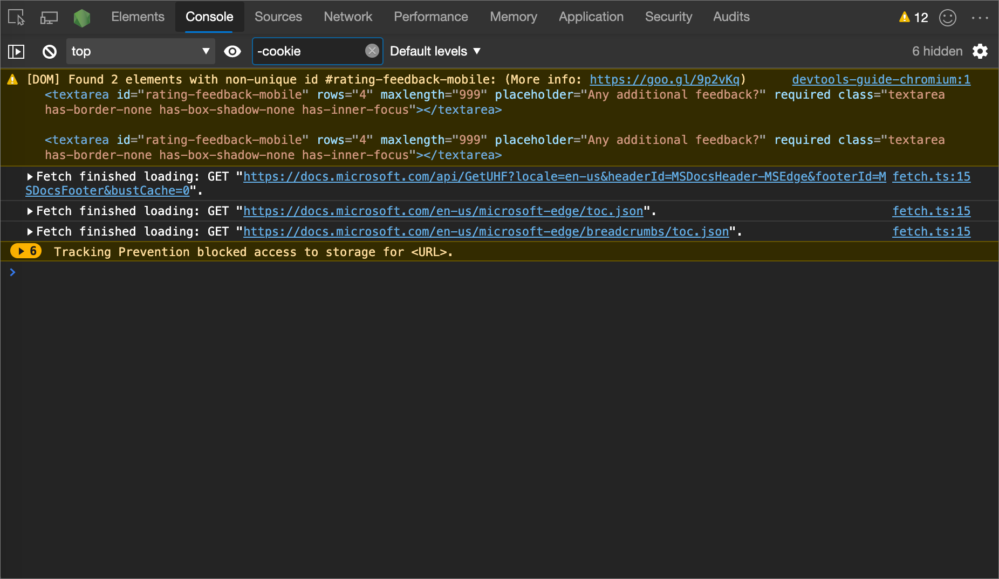

The top message in previous figure displays the default grouping behavior of the **Console**.  <!--  In the following figure, the same log is displayed after you [turn off message grouping](#turn-off-message-grouping).  -->

<!--
> ##### Old Figure 9
> How the logged `XMLHttpRequest` and `Fetch` requests look after ungrouping
> 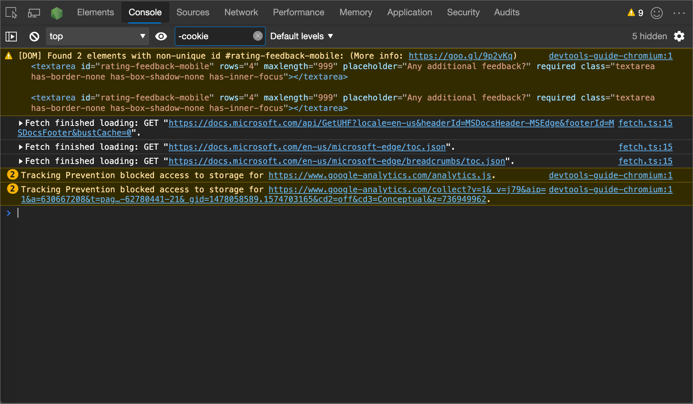
-->

<!--todo: add example for ungrouping console items  -->

### Persist messages across page loads

When you load a new webpage, the default action clears the **Console**.  To persist messages across page loads, click the **Console Settings** () button and then select the checkbox next to **Preserve Log**.

### Hide network messages

The default action for Microsoft Edge is to logs network messages to the **Console**.  In the following figure, the selected message represents an HTTP status code of `429`.

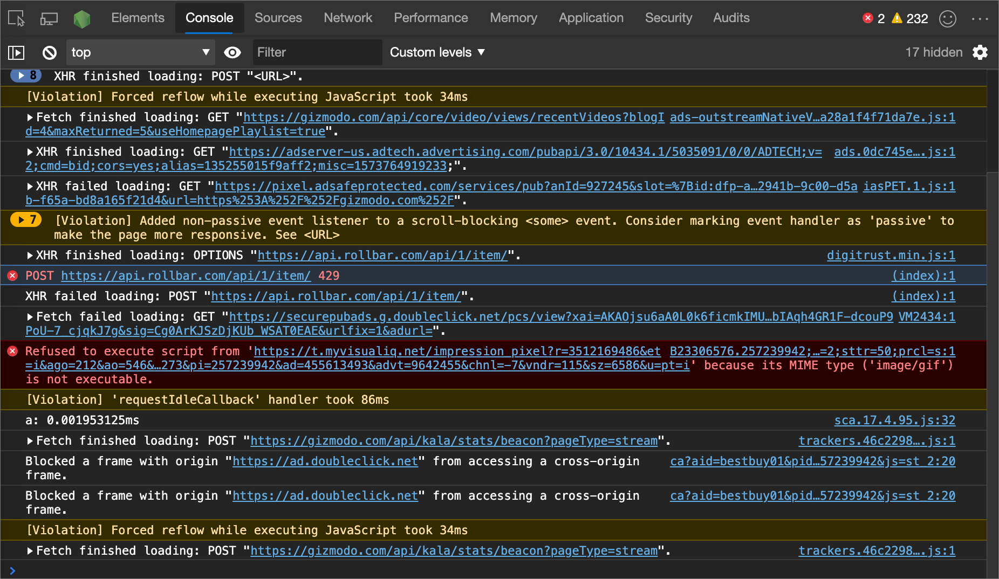

To hide network messages:

1. Click the **Console Settings** () button.

1. Select the checkbox next to **Hide Network**.

<!-- ====================================================================== -->
## Filter messages

There are multiple ways to filter out messages in the **Console**.

### Filter out browser messages

To only display messages that came from the JavaScript of the webpage, [Open the Console Sidebar](#open-the-console-sidebar) and then click **# user messages**.

### Filter by log level

DevTools assigns each `console.*` method one of the four severity levels:

*  `Error`
*  `Info`
*  `Verbose`
*  `Warning`

For example, `console.log()` is in the `Info` group, but `console.error()` is in the `Error` group.  The [Console object API Reference](api.md) describes the severity level of each applicable method.  Every message that the browser logs to the Console has a severity level too.

You can hide any level of messages that you're not interested in.  For example, if you're only interested in `Error` messages, you can hide the other three groups.

To filter the messages, click the **Log Levels** dropdown list and then select `Verbose`, `Info`, `Warning`, or `Error`.

To use the log level to filter, [open the Console Sidebar](#open-the-console-sidebar) and then select **Errors**, **Warnings**, **Info**, or **Verbose**.

### Filter messages by URL

Type `url:` followed by a URL to only view messages that came from that URL.  After you type `url:`, DevTools displays all relevant URLs.  Domains also work.  For example, if `https://example.com/a.js` and `https://example.com/b.js` are logging messages, `url:https://example.com` allows you to focus on the messages from these two scripts.

To hide messages from a URL, type `-url:`.  It's a negative URL filter.

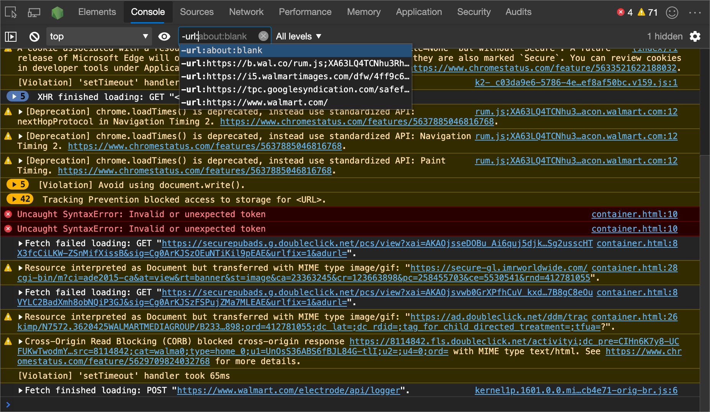

To display messages from a single URL:

1. [Open the Console Sidebar](#open-the-console-sidebar).

1. Expand the **# user messages** section.

1. Select the URL of the script that contains the messages that you want to focus on.

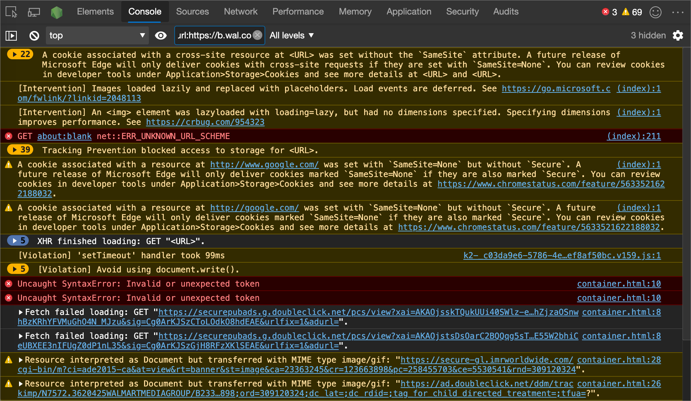

### Filter out messages from different contexts

Suppose that you have an advertisement (ad) on your webpage.  The ad is embedded in an `<iframe>` and generates many messages in your **Console**.  Because the ad is running in a different [JavaScript context](#select-javascript-context), one way to hide the messages is to click the **Console Settings** () button and then select the checkbox next to **Selected Context Only**.

### Filter out messages that don't match a regular expression pattern

Type a regular expression such as `/[gm][ta][mi]/` in the **Filter** text box to filter out any messages that don't match that pattern.  DevTools checks whether the pattern is found in the message text or in the script that caused the message to be logged.

<!-- ====================================================================== -->
## Run JavaScript

This section contains features related to running JavaScript in the **Console**.  For a hands-on walkthrough, see [Run JavaScript](console-javascript.md).

### Rerun expressions from history

Press **Up Arrow** to cycle through the history of JavaScript expressions that you ran earlier in the **Console**.  Press **Enter** to run that expression again.

### Watch the value of an expression in real time with Live Expressions

If you find yourself typing the same JavaScript expression in the **Console** repeatedly, you might find it easier to create a **Live Expression**.  With **Live Expressions**, you type an expression once and then pin it to the top of your **Console**.  The value of the expression updates in near real time.  See [Watch JavaScript Expression Values In Real-Time With Live Expressions](live-expressions.md).

### Turn off Eager Evaluation

**Eager Evaluation** displays a preview of the return value as you type JavaScript expressions in the **Console**.  To turn off the return value previews:

1. Click the **Console Settings** () button.
1. Clear the checkbox next to **Eager Evaluation**.

### Turn off autocomplete from history

As you type out an expression, the autocomplete popup window for the **Console** displays expressions that you ran earlier.  The expressions are pre-pended with the `>` character.  To stop displaying expressions from your history, click the **Console Settings** () button and then clear the checkbox next to **Autocomplete From History** checkbox.

In the following figure, `document.querySelector('a')` and `document.querySelector('img')` are expressions that were evaluated earlier.

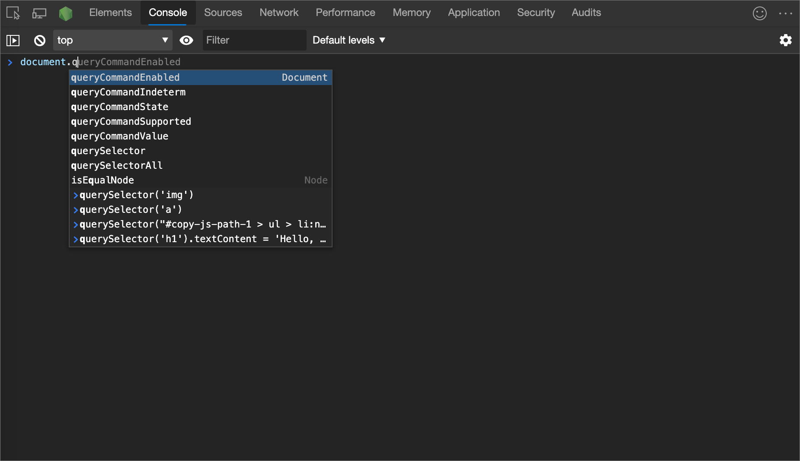

### Select JavaScript context

By default, the **JavaScript Context** dropdown list is set to **top**, which represents the main webpage's [browsing context](https://developer.mozilla.org/docs/Glossary/Browsing_context).

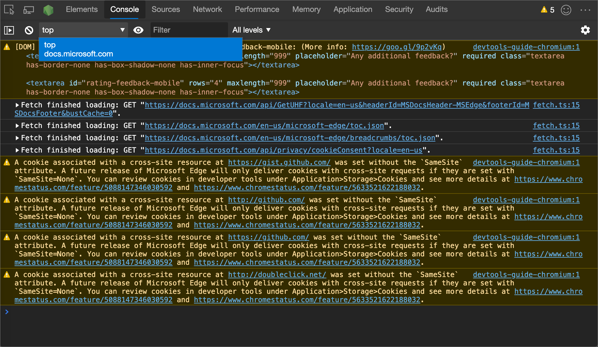

Suppose you have an ad on your webpage embedded in an `<iframe>`, and you want to run JavaScript to tweak the DOM of the ad.  Click the **JavaScript Context** dropdown list and then select the browsing context of the ad:

<!-- ====================================================================== -->
## Clear the Console

To clear the Console, use any of the following approaches:

*  Click **Clear Console** ().

*  Right-click a message and then select **Clear Console**.

*  Type `clear()` in the Console and then press **Enter**.

*  Call `console.clear()` from your webpage's JavaScript.

*  Press **Ctrl+L** while the Console is in focus.

<!-- ====================================================================== -->
## See also

<!-- if an article's title is adequately descriptive, and the article is in the same TOC bucket as the present article, don't much need a link here: -->
* [Log messages in the Console tool](console-log.md) - How to filter log messages such as Info, Warnings, and Errors in the Console.
* [Get started with running JavaScript in the Console](console-javascript.md) - Steps to walk you through issuing JavaScript statements and expressions in the Console.
* [Console object API Reference](api.md) - Functions and expressions that you can enter in the Console to write messages to the Console, such as `console.log()`.
* [Console tool utility functions and selectors](utilities.md) - Convenience functions that you can enter in the **Console** tool, such as`monitorEvents()`.

<!-- ====================================================================== -->
> [!NOTE]
> Portions of this page are modifications based on work created and [shared by Google](https://developers.google.com/terms/site-policies) and used according to terms described in the [Creative Commons Attribution 4.0 International License](https://creativecommons.org/licenses/by/4.0).
> The original page is found [here](https://developer.chrome.com/docs/devtools/console/reference/) and is authored by [Kayce Basques](https://developers.google.com/web/resources/contributors#kayce-basques) (Technical Writer, Chrome DevTools \& Lighthouse).

This work is licensed under a [Creative Commons Attribution 4.0 International License](https://creativecommons.org/licenses/by/4.0).
