<!-- Copyright Kayce Basques

   Licensed under the Apache License, Version 2.0 (the "License");
   you may not use this file except in compliance with the License.
   You may obtain a copy of the License at

       https://www.apache.org/licenses/LICENSE-2.0

   Unless required by applicable law or agreed to in writing, software
   distributed under the License is distributed on an "AS IS" BASIS,
   WITHOUT WARRANTIES OR CONDITIONS OF ANY KIND, either express or implied.
   See the License for the specific language governing permissions and
   limitations under the License.  -->
# Console tool utility functions and selectors
<!-- orig:
# Console Utilities API reference
-->

The Console Utilities API contains a collection of convenience functions for performing common tasks, such as:
*  Selecting and inspecting DOM elements.
*  Displaying data in a readable format.
*  Stopping and starting the profiler.
*  Monitoring DOM events.

These commands only work by entering them directly into the DevTools **Console**; you can't call these commands from scripts.


<!-- ====================================================================== -->
## Summary

| Function | Description |
|---|---|
| [$_](#recently-evaluated-expression) | Returns the value of the most recently evaluated expression. |
| [$0 - $4](#recently-selected-element-or-javascript-object) | Returns a recently selected element or JavaScript object. |
| [$(selector)](#query-selector) | Query selector; returns the reference to the first DOM element with the specified CSS selector, like `document.querySelector()`. |
| [$$(selector, [startNode])](#query-selector-all) | Query selector all; returns an array of elements that match the specified CSS selector, like `document.querySelectorAll()`. |
| [$x(path, [startNode])](#xpath) | Returns an array of DOM elements that match the specified XPath expression. |
| [clear()](#clear) | Clears the console of its history. |
| [copy(object)](#copy) | Copies a string representation of the specified object to the clipboard. |
| [debug(function)](#debug) | When the specified function is called, the debugger is invoked and breaks inside the function on the Sources panel. |
| [dir(object)](#dir) | Displays an object-style listing of all of the properties for the specified object, like `console.dir()`. |
| [dirxml(object)](#dirxml) | Prints an XML representation of the specified object, as displayed in the **Elements** tool, like `console.dirxml()`. |
| [inspect(object/function)](#inspect) | Opens and selects the specified DOM element in the **Elements** tool, or the specified JavaScript heap object in the **Memory** tool. |
| [getEventListeners(object)](#geteventlisteners) | Returns the event listeners that are registered on the specified object. |
| [keys(object)](#keys) | Returns an array containing the names of the properties belonging to the specified object. |
| [monitor(function)](#monitor) | Logs a message to the console that indicates the function name, along with the arguments passed to the function as part of a request. |
| [monitorEvents(object[, events])](#monitorevents) | When one of the specified events occurs on the specified object, the event object is logged to the console. |
| [profile([name])](#profile) | Starts a JavaScript CPU profiling session with an optional name. |
| [profileEnd([name])](#profileend) | Completes a JavaScript CPU profiling session and displays the results in the **Memory** tool. |
| [queryObjects(Constructor)](#queryobjects) | Returns an array of the objects that were created by the specified constructor. |
| [table(data[, columns])](#table) | Logs object data, formatted as a table with column headings, for the specified data object. |
| [undebug(function)](#undebug) | Stops the debug of the specified function, so that when the function is requested, the debugger is no longer invoked. |
| [unmonitor(function)](#unmonitor) | Stops the monitoring of the specified function. |
| [unmonitorEvents(object[, events])](#unmonitorevents) | Stops monitoring events for the specified object and events. |
| [values(object)](#values) | Returns an array containing the values of all properties belonging to the specified object. |

<br/><br/>

---

<!-- ====================================================================== -->
## Recently evaluated expression
<!-- planned new heading to troubleshoot: -->
<!-- ## $_ (Recent expression value) -->

<!-- summary to bubble up: -->
Returns the value of the most recently evaluated expression.

**Syntax:**

```javascript
$_
```

### Example 1

1. To open the **Console** tool: In Edge, click **Settings and more**, hover over **More tools**, and then select **Developer tools**.  DevTools opens next to the present webpage.  Click the **Console** tab.

1. Click in the **Console**, type the expression `2+2`, and then press **Enter**:

   In the following figure, a simple expression (`2+2`) is evaluated.  The `$_` property is then evaluated, which contains the same value:

   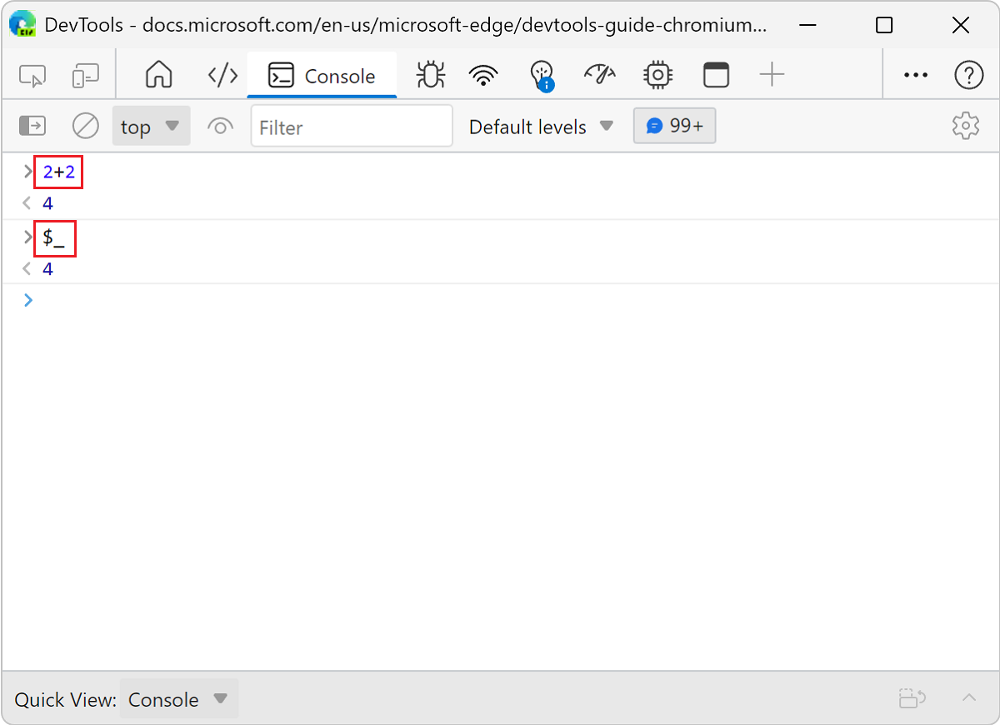

   ```javascript
   2+2
   ```
   
   The simple expression (`2+2`) is evaluated as you type, and the Console outputs the number `4`.  The `$_` property takes on the value `4`.

1. Type the expression `$_`, and then press **Enter**:

   ```javascript
   $_
   ```

   The value of the `$_` property is the value of the previously evaluated expression; the number 4.

   


### Example 2

1. To open the **Console** tool: In Edge, click **Settings and more**, hover over **More tools**, and then select **Developer tools**.  DevTools opens next to the present webpage.  Click the **Console** tab.

1. Paste the following code into the **Console**, and then press **Enter**:

   ```javascript
   ["john", "paul", "george", "ringo"]
   ```
   
   The evaluated expression is an array of names.

1. Type the following code into the **Console**, and then press **Enter**:

   ```javascript
   $_
   ```

   `$_` represents the previously evaluated expression, which is an array of names.

   
1. Type the following code into the **Console**, and then press **Enter**:

   ```javascript
   $_.length
   ```

   The expression `$_.length` is evaluated to find the length of the array, which is the number 4.  `$_` now takes on the value 4, instead of an array of names.
   
1. Type the following code into the **Console**, and then press **Enter**:

   ```javascript
   $_
   ```
   
   `$_` represents the previously evaluated expression, which is now the number 4.


   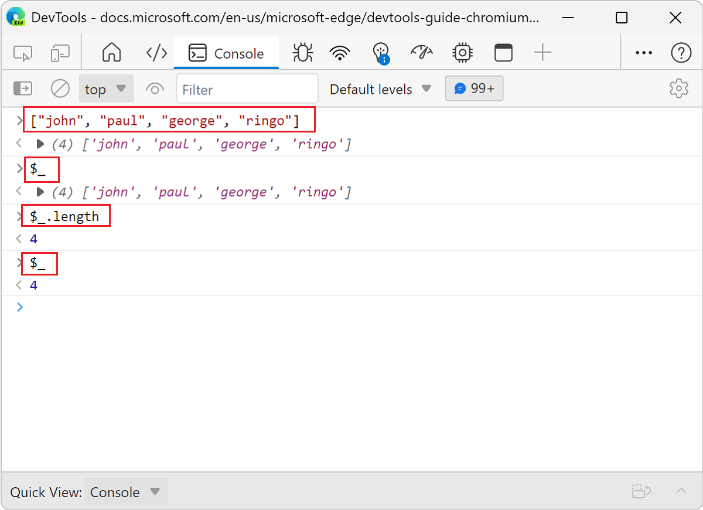


<br/><br/>

---

<!-- ====================================================================== -->
## Recently selected element or JavaScript object
<!-- planned new heading to troubleshoot: -->
<!-- ## $0 - $4 -->

<!-- summary to bubble up: -->
Returns a recently selected element or JavaScript object.

<!-- add'l info -->
`$0` returns the most recently selected element or JavaScript object, `$1` returns the second most recently selected one, and so on.  The `$0`, `$1`, `$2`, `$3`, and `$4` commands work as a historical reference to the last five DOM elements that were inspected within the **Elements** tool, or the last five JavaScript heap objects that were selected in the **Memory** tool.

### Syntax

```javascript
$0
```

### Example

In the following figure, an `img` element is selected in the **Elements** tool.  In the **Console** drawer, `$0` has been evaluated and displays the same element:

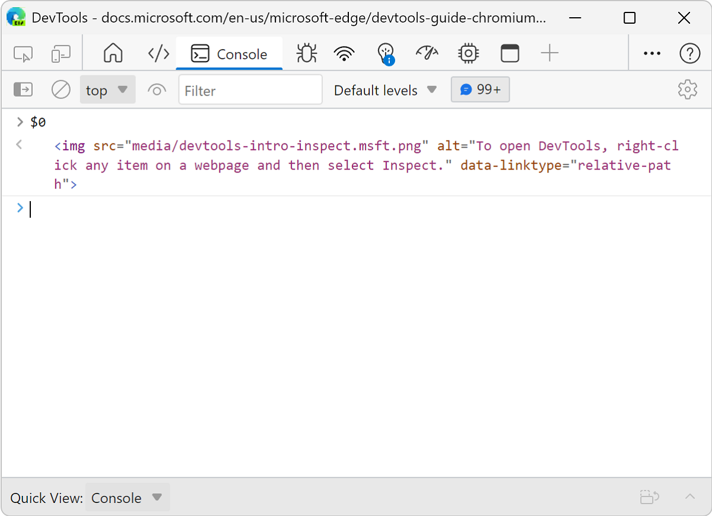

The following image shows a different element selected in the same webpage.  The `$0` now refers to the newly selected element, while `$1` returns the previously selected element:

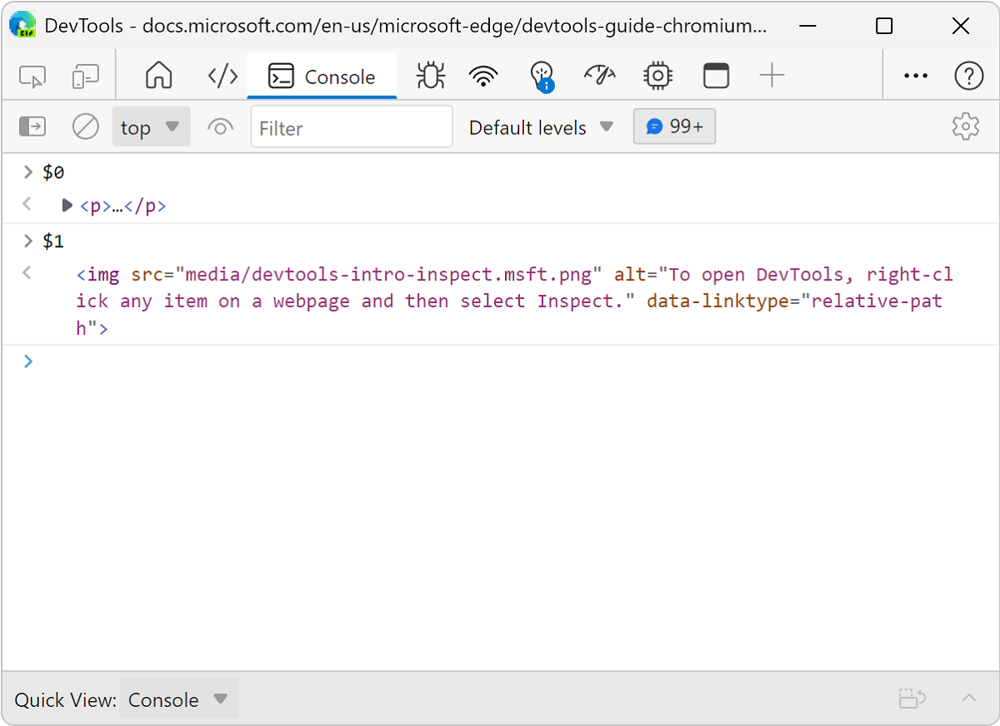

<br/><br/>

---

<!-- ====================================================================== -->
## Query selector
<!-- planned new heading to troubleshoot: -->
<!-- ## $(selector) -->

<!-- summary to bubble up: -->
Query selector; returns the reference to the first DOM element with the specified CSS selector, like `document.querySelector()`.

<!-- add'l info -->
This function is an alias for the [document.querySelector()](https://developer.mozilla.org/docs/Web/API/Document/querySelector) function.

### Syntax

```javascript
$(selector, [startNode])
```

### Example

In the following figure, `$('img')` returns a reference to the first `` element in the webpage:

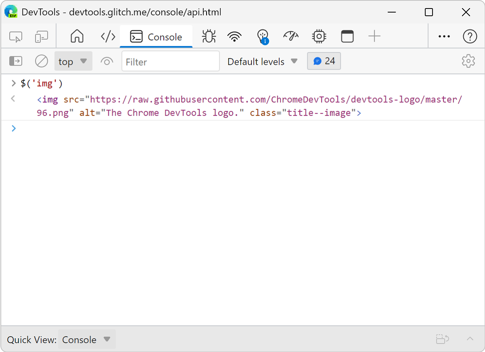

Right-click the returned result and then select **Reveal in Elements Panel** to find it in the DOM, or **Scroll in to View** to show it on the page.

### Example

The following example returns a reference to the currently selected element and displays its `src` property:

```javascript
$('img').src
```

Result:

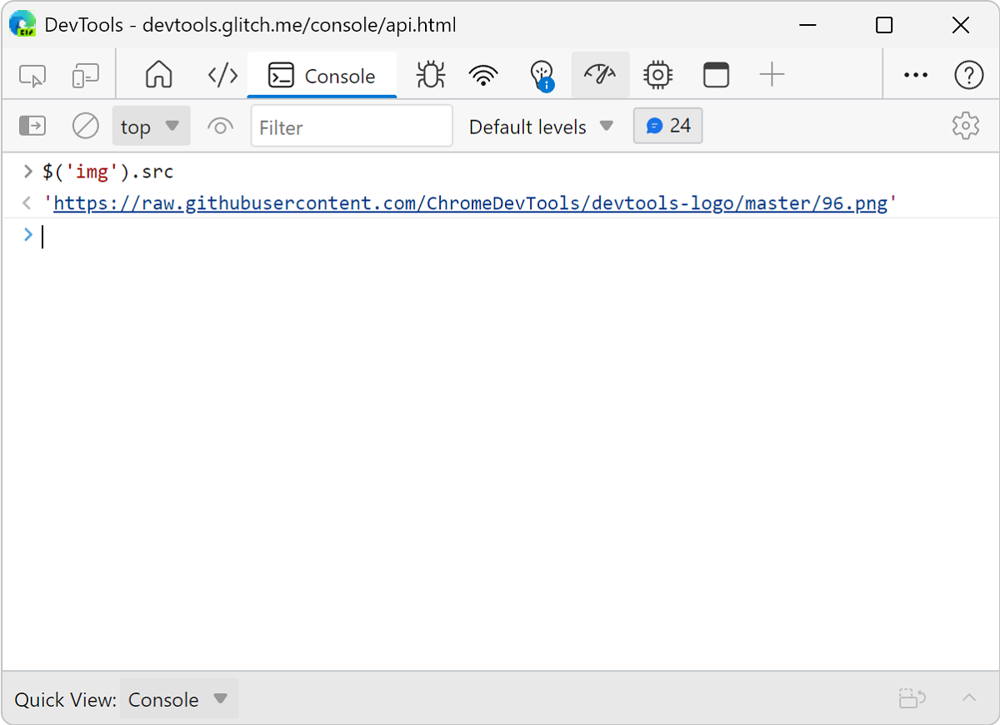

This function also supports a second parameter, `startNode`, that specifies an element or node from which to search for elements.  The default value of the parameter is `document`.

### Example

```javascript
$('img', document.querySelector('title--image')).src
```

Result: the first `img` element after the `title--image` element is found, and the `src` property of the `img` element is returned:

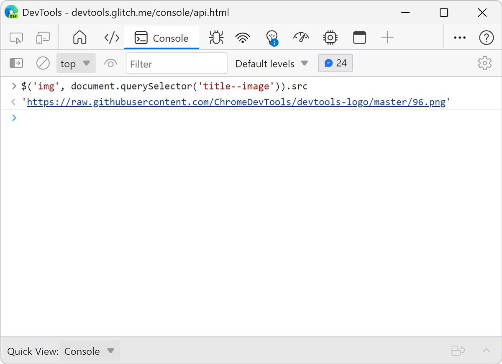

> [!NOTE]
> If you are using a library such as jQuery that uses `$`, the functionality is overwritten, and `$` corresponds to the implementation from that library.

<br/><br/>

---

<!-- ====================================================================== -->
## Query selector all
<!-- planned new heading to troubleshoot: -->
<!-- ## \$\$(selector, \[startNode\]) -->

<!-- summary to bubble up: -->
Query selector all; returns an array of elements that match the specified CSS selector, like `document.querySelectorAll()`.

<!-- add'l info -->
This function is equivalent to [document.querySelectorAll()](https://developer.mozilla.org/docs/Web/API/Document/querySelectorAll).

### Syntax

```javascript
$$(selector, [startNode])
```

### Example

In the following example, `$$()` creates an array of all `` elements in the current webpage, and displays the value of the `src` property for each element:

```javascript
var images = $$('img');
for (each in images) {
    console.log(images[each].src);
}
```

Result:

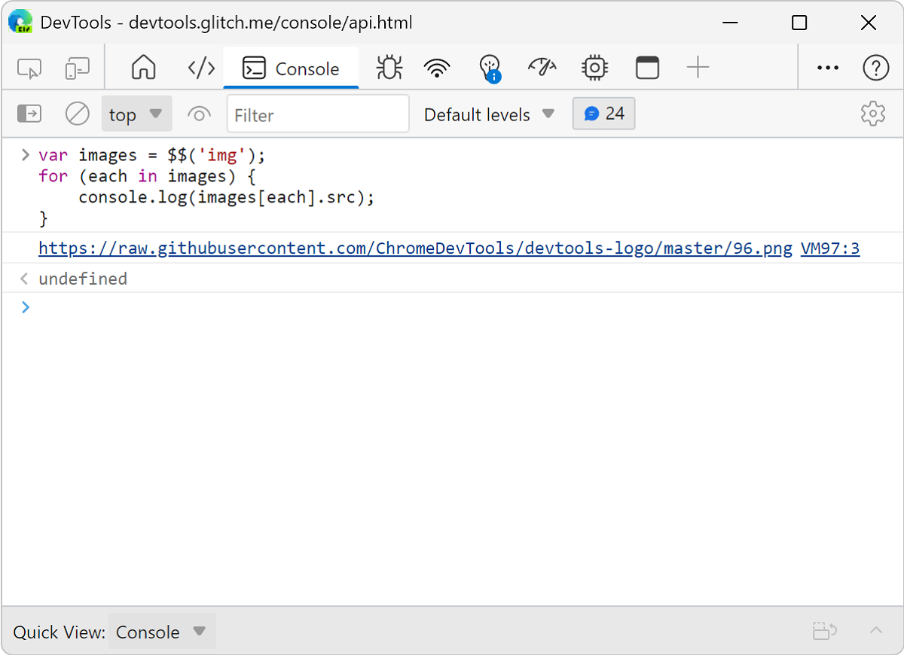

This query selector function also supports a second parameter, `startNode`, that specifies an element or node from which to search for elements.  The default value of the parameter is `document`.

### Example

The following, modified version of the previous example uses `$$()` to create an array of all `` elements that appear in the current webpage after the selected node:

```javascript
var images = $$('img', document.querySelector(`title--image`));
for (each in images) {
   console.log(images[each].src);
}
```

Here's the result.  `$$()` selects all images that appear after the specified `<div>` element in the webpage, and displays the sources:

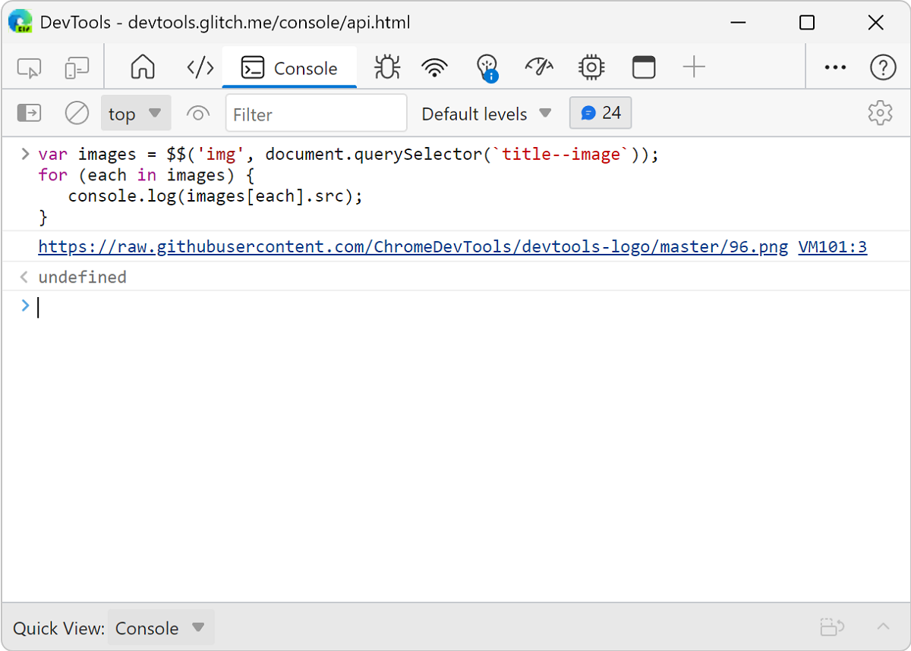

> [!NOTE]
> Press `Shift`+**Enter** in the **Console** to start a new line without running the script.

<br/><br/>

---

<!-- ====================================================================== -->
## XPath
<!-- planned new heading to troubleshoot: -->
<!-- ## \$x(path, \[startNode\]) -->

<!-- summary to bubble up: -->
Returns an array of DOM elements that match the specified XPath expression.

<!-- add'l info: n/a -->

### Syntax

```javascript
$x(path, [startNode])
```

### Example

In the following example, all of the `<p>` elements on the webpage are returned:

```javascript
$x("//p")
```

Result:

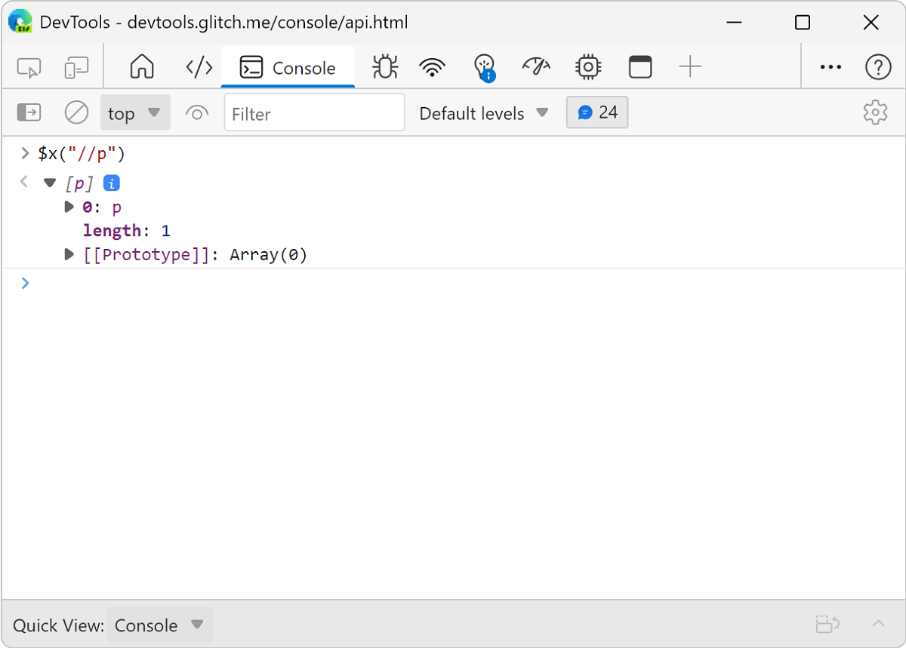

### Example

In the following example, all of the `<p>` elements that contain `<a>` elements are returned:

```javascript
$x("//p[a]")
```

Result:

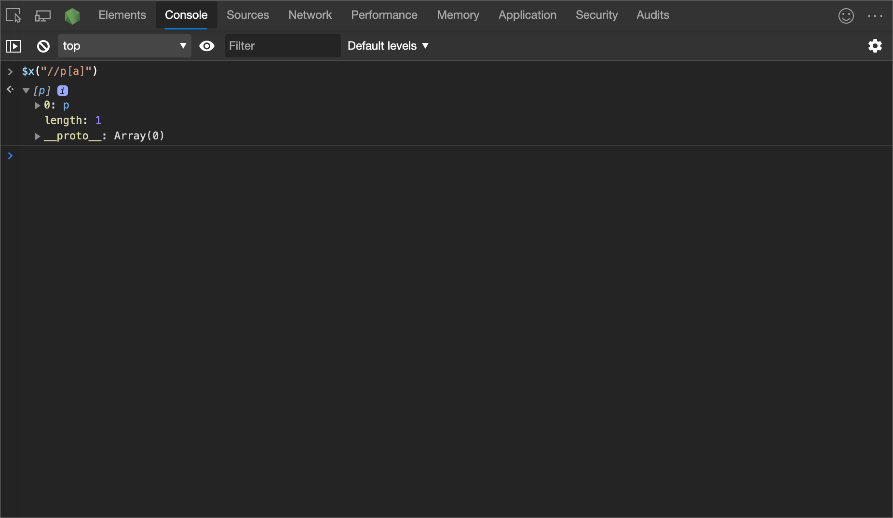

Similar to the other selector commands, `$x(path)` has an optional second parameter, `startNode`, that specifies an element or node from which to search for elements:

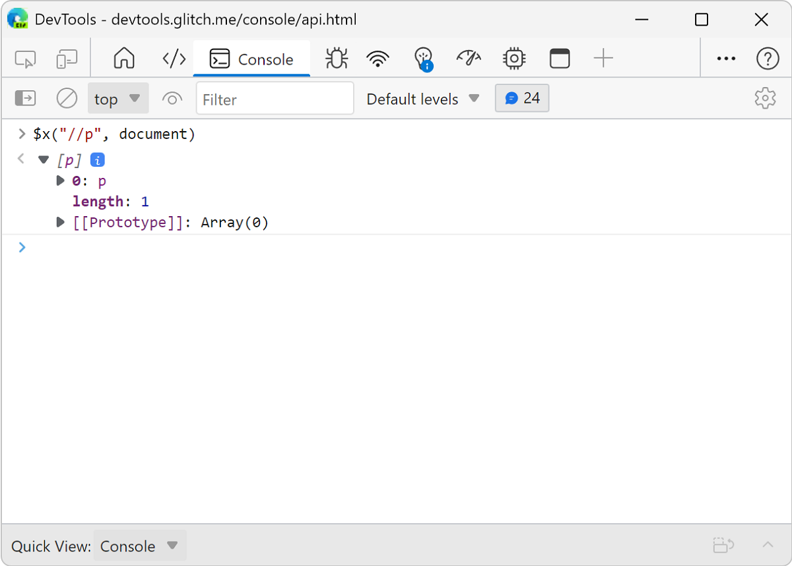

<br/><br/>

---

<!-- ====================================================================== -->
## clear
<!-- planned new heading to troubleshoot: -->
<!-- ## clear() -->

<!-- summary to bubble up: -->
Clears the console of its history.

<!-- add'l info: n/a -->

### Syntax

```javascript
clear()
```

### Example

```javascript
clear()
```

<br/><br/>

---

<!-- ====================================================================== -->
## copy
<!-- ## copy(object) -->

<!-- summary to bubble up: -->
Copies a string representation of the specified object to the clipboard.

<!-- add'l info: n/a -->

### Syntax

```javascript
copy(object)
```

### Example

```javascript
copy($0)
```

<br/><br/>

---

<!-- ====================================================================== -->
## debug
<!-- ## debug(function) -->

<!-- summary to bubble up: -->
When the specified function is called, the debugger is invoked and breaks inside the function on the Sources panel.

<!-- add'l info -->
After the debugger is paused, you can then step through the code and debug it.

### Syntax

```javascript
debug(function)
```

>[!NOTE]
> The [Chromium issue #1050237](https://crbug.com/1050237) is tracking a bug with the `debug()` function.  If you encounter the issue, try using [breakpoints](../javascript/breakpoints.md) instead.

### Example

```javascript
debug("debug");
```

Result:

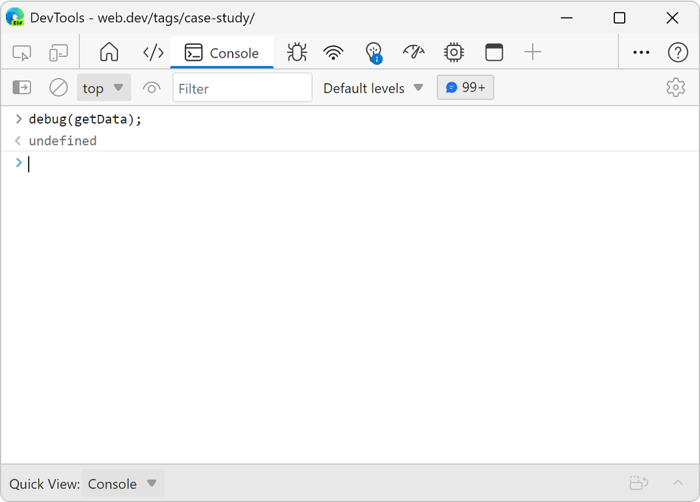

Use `undebug(function)` to stop breaking on the function, or use the UI to turn off all breakpoints.

For more information on breakpoints, see [Pause your code with breakpoints](../javascript/breakpoints.md).

<br/><br/>

---

<!-- ====================================================================== -->
## dir
<!-- ## dir(object) -->

<!-- summary to bubble up: -->
Displays an object-style listing of all of the properties for the specified object, like `console.dir()`.

<!-- add'l info -->
This function is an alias for [console.dir()](https://developer.mozilla.org/docs/Web/API/Console/dir).

### Syntax

```javascript
dir(object)
```

Evaluate `document.head` in the **Console** to display the HTML between the `<head>` and `</head>` tags.

### Example

In the following example, an object-style listing is displayed after using `console.dir()` in the **Console**:

```javascript
document.head;
dir(document.head);
```

Result:

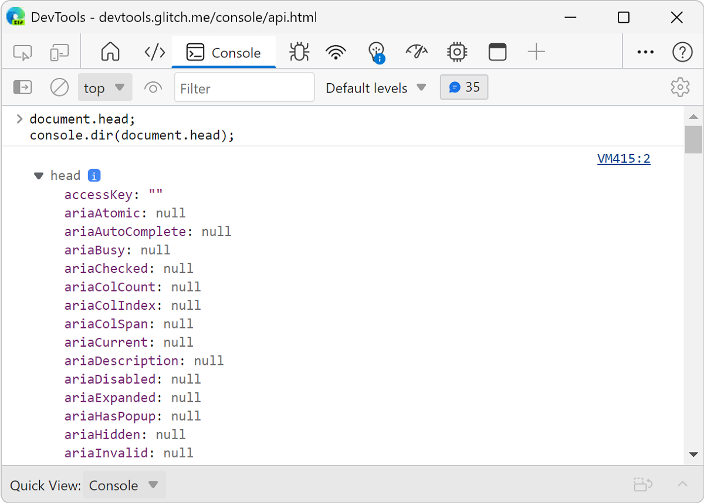

For more information, see [console.dir()](api.md#dir) in the Console API.

<br/><br/>

---

<!-- ====================================================================== -->
## dirxml
<!-- ## dirxml(object) -->

<!-- summary to bubble up: -->
Prints an XML representation of the specified object, as displayed in the **Elements** tool, like `console.dirxml()`.

<!-- add'l info -->
This function is equivalent to [console.dirxml()](https://developer.mozilla.org/docs/Web/API/Console/dirxml).

### Syntax

```javascript
dirxml(object)
```

<br/><br/>

---

<!-- ====================================================================== -->
## inspect
<!-- ## inspect(object/function) -->

<!-- summary to bubble up: -->
Opens and selects the specified DOM element in the **Elements** tool, or the specified JavaScript heap object in the **Memory** tool.

<!-- add'l info -->
* For a DOM element, this function opens and selects the specified DOM element in the **Elements** tool.
* For a JavaScript heap object, this function opens the specified JavaScript heap object in the **Memory** tool.

### Syntax

```javascript
inspect(object/function)
```

### Example

In the following example, the `document.body` opens in the **Elements** tool:

```javascript
inspect(document.body);
```

Result:

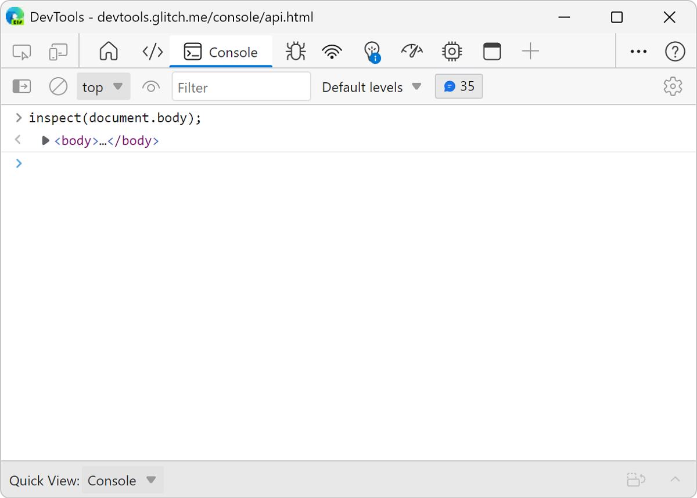

When passing a function to inspect, the function opens the webpage in the **Sources** tool for you to inspect.

<br/><br/>

---

<!-- ====================================================================== -->
## getEventListeners
<!-- ## getEventListeners(object) -->

<!-- summary to bubble up: -->
Returns the event listeners that are registered on the specified object.

<!-- add'l info -->
The return value is an object that contains an array for each registered event type (such as `click` or `keydown`).  The members of each array are objects that describe the listener registered for each type.

### Syntax

```javascript
getEventListeners(object)
```

### Example

In the following example, all of the event listeners that are registered on the `document` object are listed:

```javascript
getEventListeners(document);
```

Result:

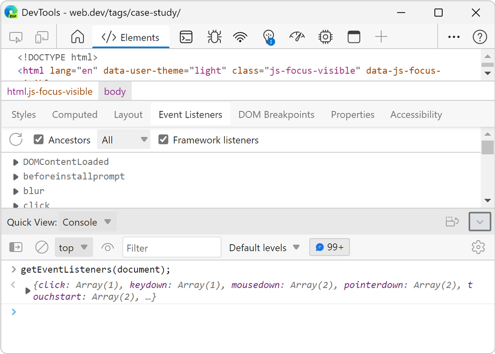

If more than one listener is registered on the specified object, then the array contains a member for each listener.  In the following figure, two event listeners are registered on the `document` element for the `click` event:

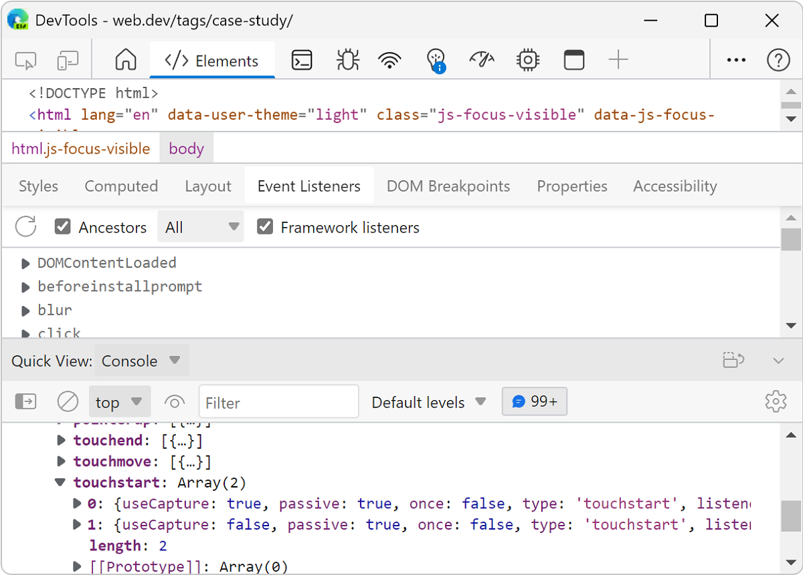

You can further expand each of the following objects to explore their properties.  Here's an expanded view of the listener object:

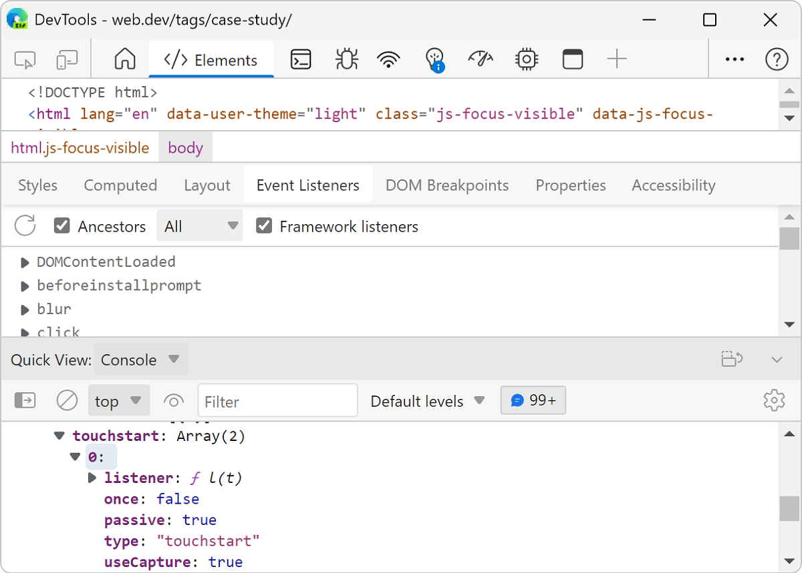

<br/><br/>

---

<!-- ====================================================================== -->
## keys
<!-- ## keys(object) -->

<!-- summary to bubble up: -->
Returns an array containing the names of the properties belonging to the specified object.

<!-- add'l info -->
To get the associated values of the same properties, use `values()`.

### Syntax

```javascript
keys(object)
```

### Example

Suppose your application defines the following object:

```javascript
var player1 = {"name": "Ted", "level": 42}
```

In the following code, the result assumes `player1` was defined in the global namespace (for simplicity) before you type `keys(player1)` and `values(player1)` in the console:

```javascript
keys(player1)

values(player1)
```

Result:

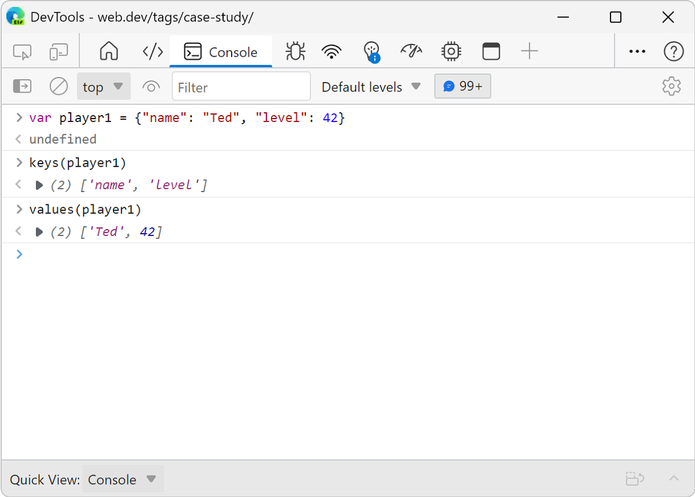

<br/><br/>

---

<!-- ====================================================================== -->
## monitor
<!-- ## monitor(function) -->

<!-- summary to bubble up: -->
Logs a message to the console that indicates the function name, along with the arguments passed to the function as part of a request.

<!-- add'l info: n/a -->

### Syntax

```javascript
monitor(function)
```

### Example

```javascript
function sum(x, y) {
    return x + y;
}
monitor(sum);
```

Result:

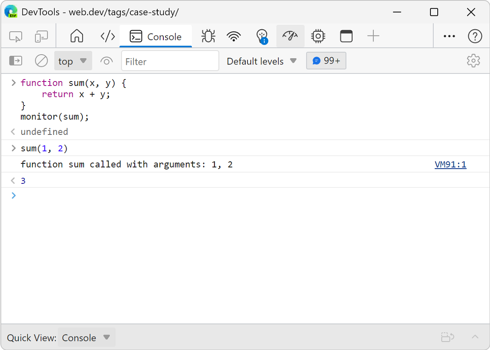

To end monitoring, use `unmonitor(function)`.

<br/><br/>

---

<!-- ====================================================================== -->
## monitorEvents
<!-- ## monitorEvents(object\[, events\]) -->

<!-- summary to bubble up: -->
When one of the specified events occurs on the specified object, the event object is logged to the console.

<!-- add'l info -->
You can specify a single event to monitor, an array of events, or one of the generic events types that are mapped to a predefined collection of events.

### Syntax

```javascript
monitorEvents(object[, events])
```

### Example

The following code monitors all resize events on the window object:

```javascript
monitorEvents(window, "resize");
```

Result:

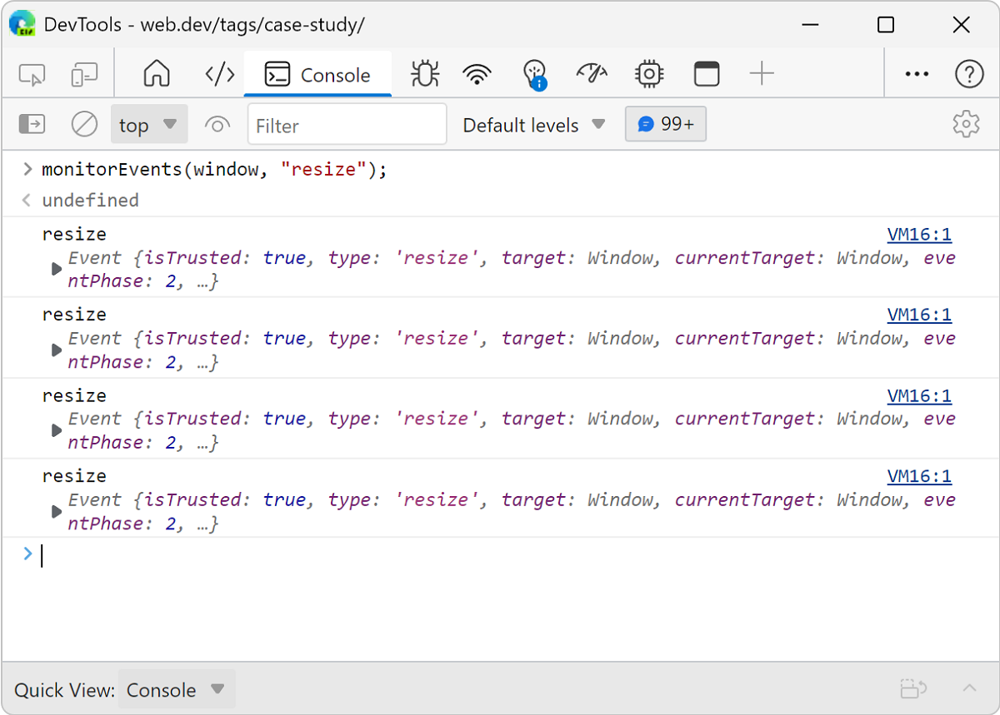

### Example

The following code defines an array to monitor both `resize` and `scroll` events on the window object:

```javascript
monitorEvents(window, ["resize", "scroll"]);
```

### Specifying an event type

You can also specify one of the available types of events, strings that map to predefined sets of events.  The following table shows the available event types and the associated event mappings:

| Event type | Corresponding mapped events |
|:--- |:--- |
| `mouse` | "click", "dblclick", "mousedown", "mousemove", "mouseout", "mouseover", "mouseup", "mousewheel" |
| `key` | "keydown", "keypress", "keyup", "textInput" |
| `touch` | "touchcancel", "touchend", "touchmove", "touchstart" |
| `Ctrl` | "blur", "change", "focus", "reset", "resize", "scroll", "select", "submit", "zoom" |

### Example

In the following code, the `key` event type corresponding to `key` events on an input text field are currently selected in the **Elements** tool:

```javascript
monitorEvents($0, "key");
```

Here's the sample output after typing a character in the text field:

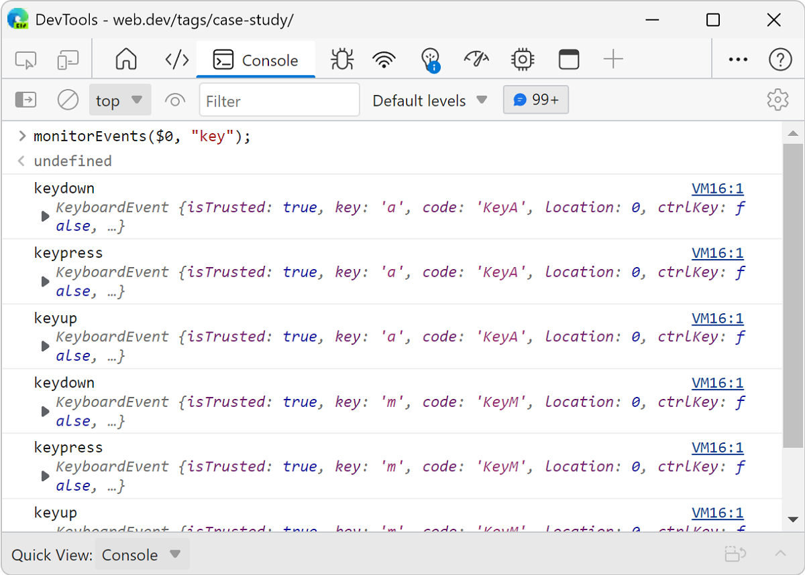

<br/><br/>

---

<!-- ====================================================================== -->
## profile
<!-- ## profile([name]) -->

<!-- summary to bubble up: -->
Starts a JavaScript CPU profiling session with an optional name.

<!-- add'l info -->
To complete the profile and display the results in the **Memory** tool, call [profileEnd()](#profileend).  <!-- See [Speed Up JavaScript Runtime](../rendering-tools/js-runtime.md).  -->

### Syntax

```javascript
profile([name])
```

### Example

To start profiling, call `profile()`:

```javascript
profile("My profile")
```

To stop profiling and display the results in the **Memory** tool, call [profileEnd()](#profileend).

Profiles can also be nested:

```javascript
profile('A');
profile('B');
profileEnd('A');
profileEnd('B');
```

The result is the same, regardless of the order.  The result appears as a Heap Snapshot in the **Memory** tool, with grouped profiles:

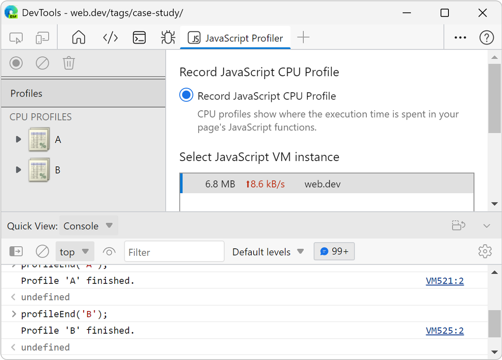

> [!NOTE]
> Multiple CPU profiles can operate at the same time, and you aren't required to close-out each profile in creation order.

<br/><br/>

---

<!-- ====================================================================== -->
## profileEnd
<!-- ## profileEnd([name]) -->

<!-- summary to bubble up: -->
Completes a JavaScript CPU profiling session and displays the results in the **Memory** tool.

<!-- add'l info -->
To call this function, you must be running the [profile()](#profile) function.  <!-- See [Speed Up JavaScript Runtime](../rendering-tools/js-runtime.md).  -->

### Syntax

```javascript
profileEnd([name])
```

### Example

1. Run the [profile()](#profile) function to start profiling.

1. Run the `profileEnd()` function to stop profiling and display the results in the **Memory** tool:

    ```javascript
    profileEnd("My profile")
    ```

For more information, see [profile](#profile), above.

<br/><br/>

---

<!-- ====================================================================== -->
## queryObjects
<!-- ## queryObjects(Constructor) -->

<!-- summary to bubble up: -->
Returns an array of the objects that were created by the specified constructor.

<!-- add'l info -->
The scope of `queryObjects()` is the currently selected runtime context in the **Console**.

### Syntax

```javascript
queryObjects(Constructor)
```

### Example

* `queryObjects(promise)` returns all instances of `Promise`.

* `queryObjects(HTMLElement)` returns all HTML elements.

*  `queryObjects(functionName)` returns all objects that were instantiated using `new functionName()`.

<br/><br/>

---

<!-- ====================================================================== -->
## table
<!-- ## table(data\[, columns\]) -->

<!-- summary to bubble up: -->
Logs object data, formatted as a table with column headings, for the specified data object.

<!-- add'l info: n/a -->
For example, using this function, you can display a list of people's names as a table, in the **Console**.

### Syntax

```javascript
table(data[, columns])
```

### Example

The following code displays a list of names using a table in the console, with the column headings defaulting to the variable names:

```javascript
var names = {
    0: {
        firstName:  "John",
        lastName:  "Smith"
    },
    1:  {
        firstName:  "Jane",
        lastName:  "Doe"
    }
};
table(names);
```

Result:

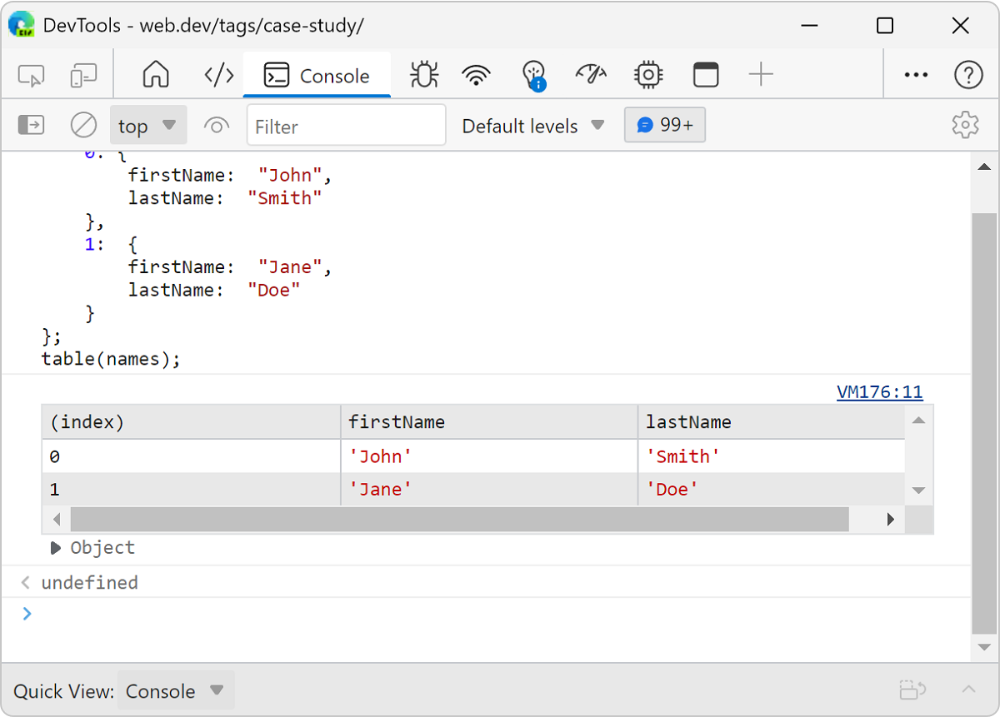

<br/><br/>

---

<!-- ====================================================================== -->
## undebug
<!-- ## undebug(function) -->

<!-- summary to bubble up: -->
Stops the debug of the specified function, so that when the function is requested, the debugger is no longer invoked.

<!-- add'l info: n/a -->

### Syntax

```javascript
undebug(function)
```

### Example

```javascript
undebug(getData);
```

<br/><br/>

---

<!-- ====================================================================== -->
## unmonitor
<!-- ## unmonitor(function) -->

<!-- summary to bubble up: -->
Stops the monitoring of the specified function.

<!-- add'l info -->
This function is used together with [monitor()](#monitor).

### Syntax

```javascript
unmonitor(function)
```

### Example

```javascript
unmonitor(getData);
```

<br/><br/>

---

<!-- ====================================================================== -->
## unmonitorEvents
<!-- ## unmonitorEvents(object\[, events\]) -->

<!-- summary to bubble up: -->
Stops monitoring events for the specified object and events.

<!-- add'l info: n/a -->

### Syntax

```javascript
unmonitorEvents(object[, events])
```

### Example

The following code stops all event monitoring on the `window` object:

```javascript
unmonitorEvents(window);
```

You can also selectively stop monitoring specific events on an object.  For example, the following code starts monitoring all `mouse` events on the currently selected element, and then stops monitoring `mousemove` events (perhaps to reduce noise in the console output):

```javascript
monitorEvents($0, "mouse");
unmonitorEvents($0, "mousemove");
```

<br/><br/>

---

<!-- ====================================================================== -->
## values
<!-- ## values(object) -->

<!-- summary to bubble up: -->
Returns an array containing the values of all properties belonging to the specified object.

<!-- add'l info: n/a -->

### Syntax

```javascript
values(object)
```

### Example

```javascript
values(object);
```

<br/><br/>

---

<!-- ====================================================================== -->
## See also

<!-- if an article's title is adequately descriptive, and the article is in the same TOC bucket as the present article, don't much need a link here: -->
* [Console features reference](reference.md)
* [Console object API Reference](api.md) - `console.*` functions, such as `console.log()` and `console.error()`.


<!-- ====================================================================== -->
> [!NOTE]
> Portions of this page are modifications based on work created and [shared by Google](https://developers.google.com/terms/site-policies) and used according to terms described in the [Creative Commons Attribution 4.0 International License](https://creativecommons.org/licenses/by/4.0).
> The original page is found [here](https://developer.chrome.com/docs/devtools/console/utilities/) and is authored by [Kayce Basques](https://developers.google.com/web/resources/contributors#kayce-basques) (Technical Writer, Chrome DevTools \& Lighthouse).

[](https://creativecommons.org/licenses/by/4.0)
This work is licensed under a [Creative Commons Attribution 4.0 International License](https://creativecommons.org/licenses/by/4.0).
