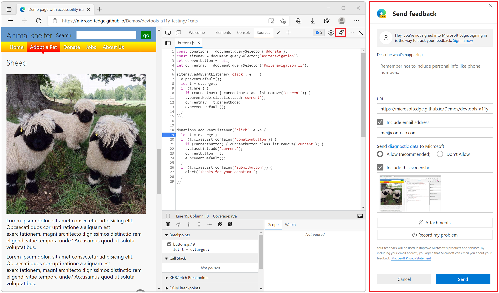

# Contact the Microsoft Edge DevTools team

Send your feedback to help improve Microsoft Edge DevTools.  Contact the Microsoft Edge DevTools team to submit feature requests or bug reports, or ask questions about Microsoft Edge DevTools.

There are several ways to get in touch with the Microsoft Edge DevTools team:

* Using the **Send feedback** window to quickly report bugs while using DevTools.
* Using the DevTools repo to submit feature requests, bugs, questions, and have conversations with the team.
* Using The Web We Want initiative to submit cross-browser suggestions.
* Using the edge-developer repo to submit documentation issues.

<!-- ====================================================================== -->
## Use the Send feedback window

To report a bug while using DevTools or to request a new feature, [open DevTools](index.md#open-devtools) and then click the **Send feedback** icon.  Or, in DevTools, press `Alt`+`Shift`+`I` (Windows, Linux) or `Option`+`Shift`+`I` (macOS).  This approach creates a tracked issue for the Microsoft Edge development team.

Clicking the **Send feedback** icon opens a **Send feedback** window which you can use to describe the bug you found or the feature request you have.

<!-- ====================================================================== -->
## Use the DevTools repo

To have discussions with the DevTools team and DevTools community about bugs or features, use the DevTools repository on GitHub.

You can [create a new issue](https://github.com/MicrosoftEdge/DevTools/issues/new/choose) on the repo or [search for existing issues](https://github.com/MicrosoftEdge/DevTools/issues) and join conversations.

Using the DevTools repo is useful to have longer conversations, especially when you need more than report a bug. On the repo, you can share ideas and tips with others, explain your workflows and use cases in details with the team, and generally have more meaningful interactions with the community.

<!-- ====================================================================== -->
## Submit a cross-browser suggestion to the Web We Want

To make a feature request across browser teams or standards bodies, submit a request at [The Web We Want initiative](../web-we-want/index.md).

The Web We Want is a cross-browser initiative to identify missing features for web standards or browsers.  Use this communication channel to let browser vendors and standards groups know your request.

*  Submit web platform or developer tool features.
*  View the list of submitted Wants, and vote on them.
*  Participate in discussions.
*  Use the links to resources.

You can follow the Web We Want initiative on Twitter or LinkedIn, and participate in surveys to prioritize submitted Wants.

<!-- ====================================================================== -->
## File a documentation issue

To enter a GitHub issue from within a documentation article, in the **Feedback** section at the bottom of an article, select the **This page** button.

Or you can [file an issue](https://github.com/MicrosoftDocs/edge-developer/issues/new?title=[DevTools%20Docs%20Feedback]) against the Microsoft Edge Developer documentation, directly in the `edge-developer` repo.
