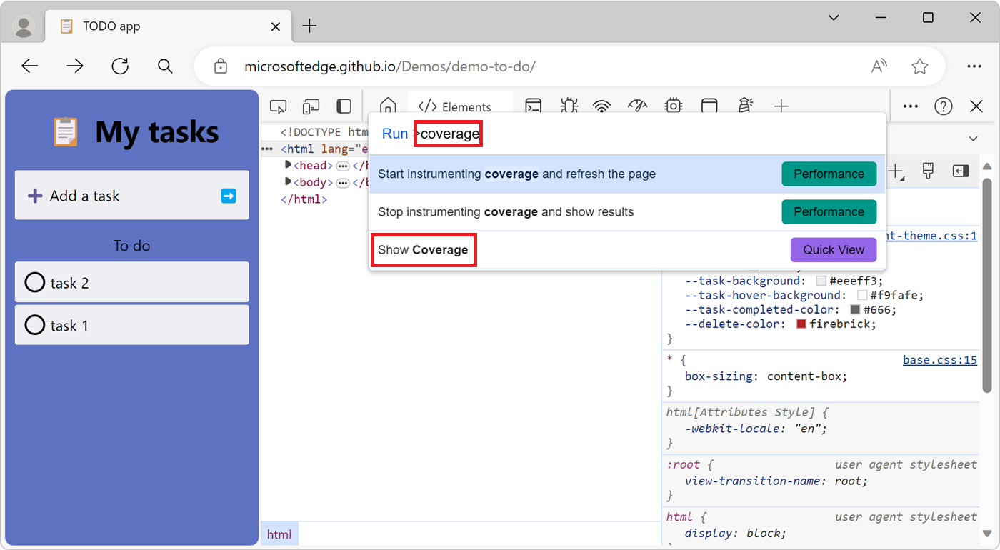
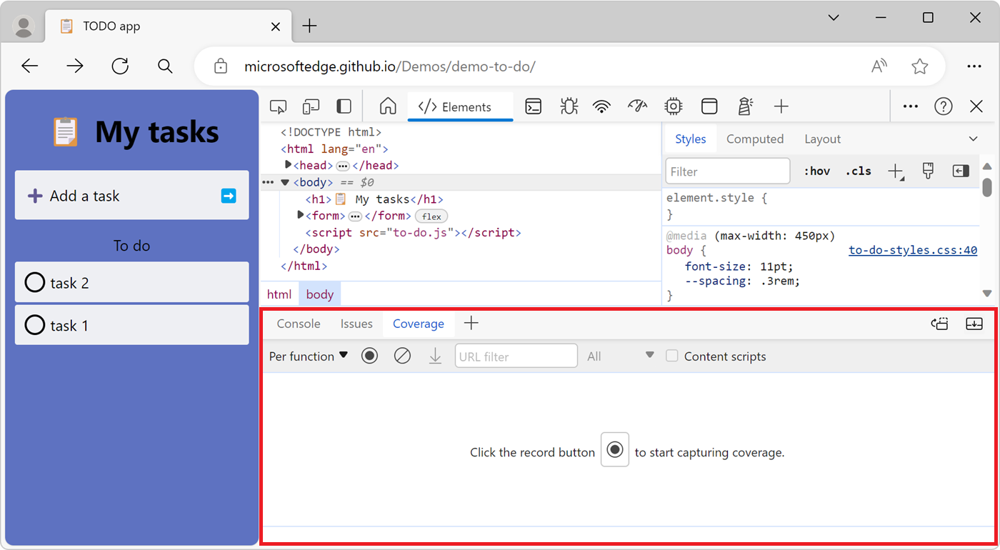
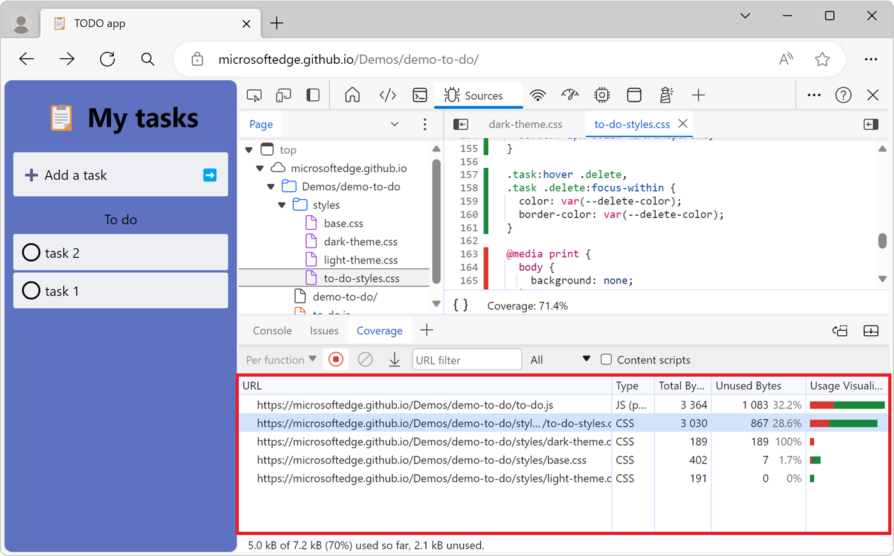

<!-- Copyright Kayce Basques

   Licensed under the Apache License, Version 2.0 (the "License");
   you may not use this file except in compliance with the License.
   You may obtain a copy of the License at

       https://www.apache.org/licenses/LICENSE-2.0

   Unless required by applicable law or agreed to in writing, software
   distributed under the License is distributed on an "AS IS" BASIS,
   WITHOUT WARRANTIES OR CONDITIONS OF ANY KIND, either express or implied.
   See the License for the specific language governing permissions and
   limitations under the License.  -->
# Find unused JavaScript and CSS code with the Coverage tool

The **Coverage** tool helps you find unused JavaScript and CSS code.  Removing unused code can speed up your page load and save your mobile users cellular data.

This guide covers how to find unused code by using the **Coverage** tool. This guide doesn't cover how to refactor a codebase to avoid unused code, because refactoring code depends on your technology stack.


<!-- ====================================================================== -->
## Overview

Shipping unused JavaScript or CSS is a common problem in web development.  For example, suppose that you want to use the [Bootstrap button component](https://getbootstrap.com/docs/4.3/components/buttons) on your page.  To use the button component, you need to add a link to the Bootstrap stylesheet in your HTML, like this:

```html
<html>
  <head>
    <link rel="stylesheet" href="https://cdn.jsdelivr.net/npm/bootstrap@5.3.2/dist/css/bootstrap.min.css">
  </head>
  <body>
    <button class="btn btn-primary">Button</button>
  </body>
</html>
```

This stylesheet doesn't just include the code for the Bootstrap button component; it contains the CSS for _all_ of the Bootstrap components.  Because your page only uses the button component, you're making users download extra code that they don't need.  The **Coverage** tool helps you find unused code such as this.


<!-- ====================================================================== -->
## Open the Coverage tool

To find unused code in your page, use the **Coverage** tool:

1. To open DevTools, right-click the webpage, and then select **Inspect**.  Or, press **Ctrl+Shift+I** (Windows, Linux) or **Command+Option+I** (macOS).  DevTools opens.

1. In DevTools, open the **Command Menu**. To open the **Command Menu**, press **Ctrl+Shift+P** (Windows, Linux) or **Command+Shift+P** (macOS).

1. Start typing **coverage**, press the **Down Arrow** key to highlight the **Show Coverage** command, and then press **Enter**:

   

   The **Coverage** tool opens in the **Quick View** panel at the bottom of DevTools:

   


<!-- ====================================================================== -->
## Record code coverage

1. Click one of the following buttons in the **Coverage** tool:

   *  To see what code is needed to load the page, click the **Start instrumenting coverage and refresh the page** () button.

   *  To see what code is used after interacting with the page, click the **Instrument coverage** () button.

1. To stop recording code coverage, click the **Stop instrumenting coverage and show results** () button.


<!-- ====================================================================== -->
## Analyze code coverage

The table in the **Coverage** tool displays the resources that were analyzed, and how much code is used within each resource.  Click a row to open that resource in the **Sources** tool and display a code coverage report that gives a line-by-line breakdown of used code and unused code:



Columns in the code coverage report:

| Column | Description |
| --- | --- |
| **URL** | The URL of the resource that was analyzed. |
| **Type** | Whether the resource contains CSS, JavaScript, or both. |
| **Total Bytes** | The total size of the resource in bytes. |
| **Unused Bytes** | The number of bytes that weren't used. |
| **Usage Visualization** | A visualization of the **Total Bytes** and **Unused Bytes** columns.  The green section of the bar is used bytes.  The red section of the bar is unused bytes. |


<!-- ====================================================================== -->
> [!NOTE]
> Portions of this page are modifications based on work created and [shared by Google](https://developers.google.com/terms/site-policies) and used according to terms described in the [Creative Commons Attribution 4.0 International License](https://creativecommons.org/licenses/by/4.0).
> The original page is found [here](https://developer.chrome.com/docs/devtools/coverage/) and is authored by [Kayce Basques](https://developers.google.com/web/resources/contributors#kayce-basques) (Technical Writer, Chrome DevTools \& Lighthouse).

[](https://creativecommons.org/licenses/by/4.0)
This work is licensed under a [Creative Commons Attribution 4.0 International License](https://creativecommons.org/licenses/by/4.0).
