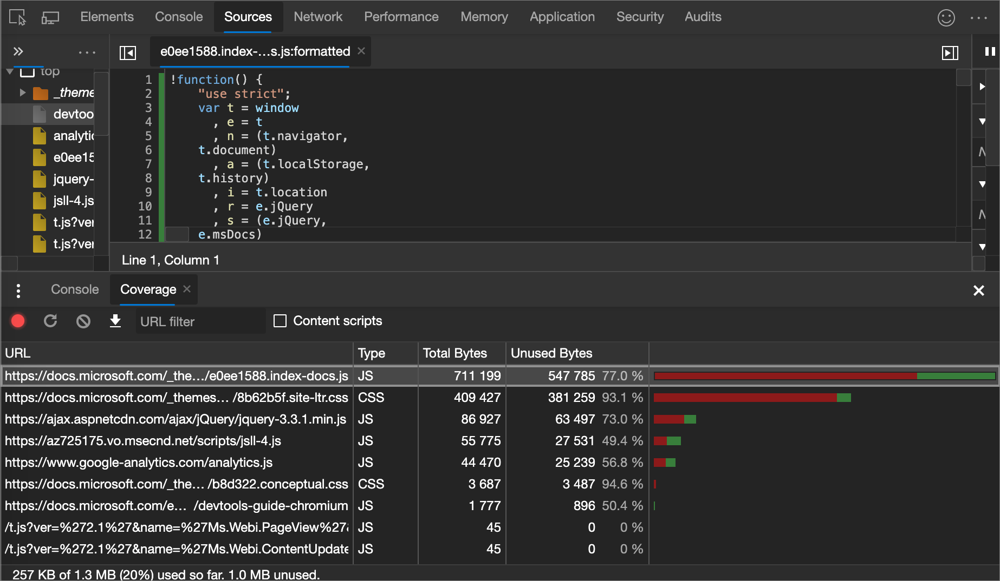
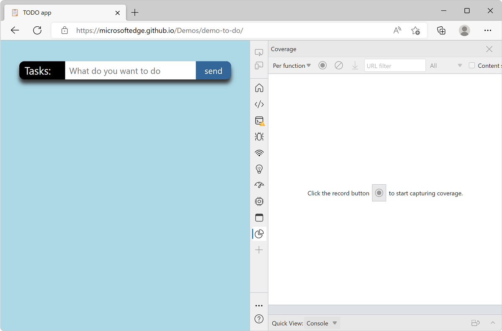
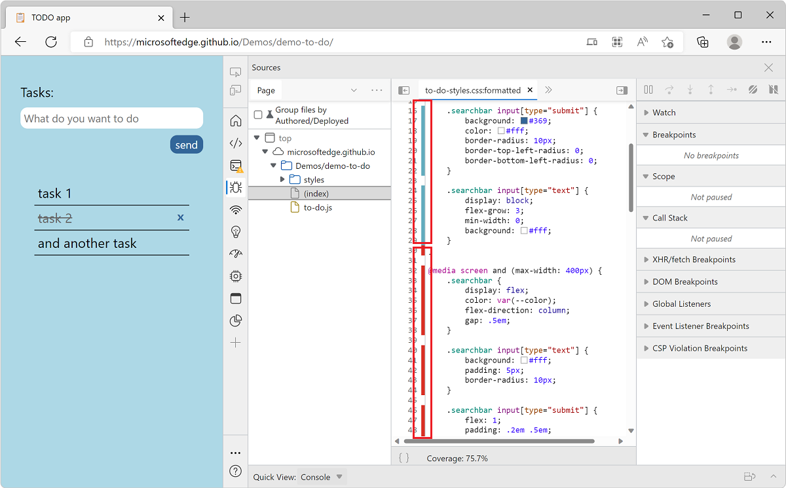

<!-- Copyright Kayce Basques

   Licensed under the Apache License, Version 2.0 (the "License");
   you may not use this file except in compliance with the License.
   You may obtain a copy of the License at

       https://www.apache.org/licenses/LICENSE-2.0

   Unless required by applicable law or agreed to in writing, software
   distributed under the License is distributed on an "AS IS" BASIS,
   WITHOUT WARRANTIES OR CONDITIONS OF ANY KIND, either express or implied.
   See the License for the specific language governing permissions and
   limitations under the License.  -->
# Find unused JavaScript and CSS code with the Coverage tool

The Coverage tool can help you find unused JavaScript and CSS code.  Removing unused code can speed up your page load and save your mobile users cellular data.



Finding unused code is relatively easy.  But refactoring a codebase so that each page only ships the JavaScript and CSS that it needs can be difficult.  This guide doesn't cover how to refactor a codebase to avoid unused code, because this refactoring depends on your technology stack.


<!-- ====================================================================== -->
## Overview

Shipping unused JavaScript or CSS is a common problem in web development.  For example, suppose that you want to use the [Bootstrap button component](https://getbootstrap.com/docs/4.3/components/buttons) on your page.  To use the button component, you need to add a link to the Bootstrap stylesheet in your HTML, like this:

```html
<head>
    ...
    <link rel="stylesheet" href="https://stackpath.bootstrapcdn.com/bootstrap/4.3.1/css/bootstrap.min.css" integrity="sha384-ggOyR0iXCbMQv3Xipma34MD+dH/1fQ784/j6cY/iJTQUOhcWr7x9JvoRxT2MZw1T" crossorigin="anonymous">
    ...
</head>
```

This stylesheet doesn't just include the code for the button component.  It contains the CSS for _all_ of the Bootstrap components.  But you're not using any of the other Bootstrap components.  So your page is downloading a bunch of CSS that it doesn't need.

This extra CSS is a problem for the following reasons:

*  The extra code slows down your page load.  <!-- See [Render-Blocking CSS](/web/fundamentals/performance/critical-rendering-path/render-blocking-css). -->

*  If a user accesses the page on a mobile device, the extra code uses up their cellular data.


<!-- ====================================================================== -->
## Open the Coverage tool

1. [Open the Command Menu](../command-menu/index.md).

1. Start typing `coverage`, select the **Show Coverage** command, and then press `Enter`.  The **Coverage** tool opens in the **Drawer**.

   


<!-- ====================================================================== -->
## Record code coverage

1. Click one of the following buttons in the **Coverage** tool:

   *  Click **Start Instrumenting Coverage And Reload Page** ()<!--todo: check UI string--> if you want to see what code is needed to load the page.

   *  Click **Instrument Coverage** () if you want to see what code is used after interacting with the page.

1. Click **Stop Instrumenting Coverage And Show Results** ()<!--todo: check UI string--> when you want to stop recording code coverage.


<!-- ====================================================================== -->
## Analyze code coverage

The table in the **Coverage** tool displays the resources that were analyzed, and how much code is used within each resource.  Click a row to open that resource in the **Sources** tool and display a line-by-line breakdown of used code and unused code.

A code coverage report:



Columns in the code coverage report:

| Column | Description |
| --- | --- |
| **URL** | The URL of the resource that was analyzed. |
| **Type** | Whether the resource contains CSS, JavaScript, or both. |
| **Total Bytes** | The total size of the resource in bytes. |
| **Unused Bytes** | The number of bytes that weren't used. |
| Last, unnamed column | A visualization of the **Total Bytes** and **Unused Bytes** columns.  The red section of the bar is unused bytes.  The green section is used bytes. |


<!-- ====================================================================== -->
> [!NOTE]
> Portions of this page are modifications based on work created and [shared by Google](https://developers.google.com/terms/site-policies) and used according to terms described in the [Creative Commons Attribution 4.0 International License](https://creativecommons.org/licenses/by/4.0).
> The original page is found [here](https://developer.chrome.com/docs/devtools/coverage/) and is authored by [Kayce Basques](https://developers.google.com/web/resources/contributors#kayce-basques) (Technical Writer, Chrome DevTools \& Lighthouse).

[](https://creativecommons.org/licenses/by/4.0)
This work is licensed under a [Creative Commons Attribution 4.0 International License](https://creativecommons.org/licenses/by/4.0).
