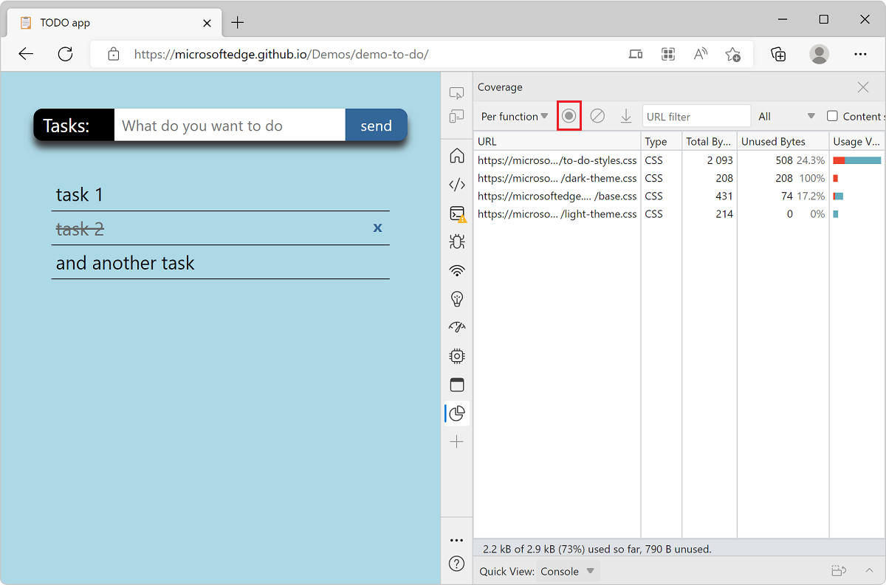
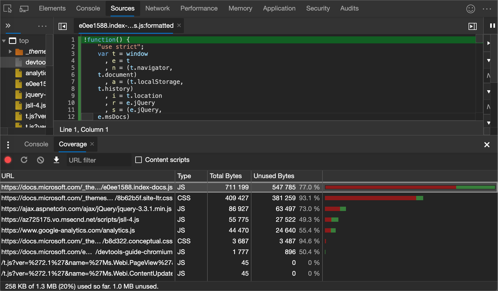

<!-- Copyright Kayce Basques

   Licensed under the Apache License, Version 2.0 (the "License");
   you may not use this file except in compliance with the License.
   You may obtain a copy of the License at

       https://www.apache.org/licenses/LICENSE-2.0

   Unless required by applicable law or agreed to in writing, software
   distributed under the License is distributed on an "AS IS" BASIS,
   WITHOUT WARRANTIES OR CONDITIONS OF ANY KIND, either express or implied.
   See the License for the specific language governing permissions and
   limitations under the License.  -->
# Find unused JavaScript and CSS code with the Coverage tool

Shipping unused JavaScript or CSS is a common problem in web development for the following reasons:

Finding unused code is relatively easy.  But refactoring a codebase so that each page only ships the JavaScript and CSS that it needs can be difficult.  This guide doesn't cover how to refactor a codebase to avoid unused code, because this refactoring depends on your technology stack.

<!-- ====================================================================== -->
## Open the Coverage tool

1. [Open the Command Menu](../command-menu/index.md): press `Ctrl`+`Shift`+`P` (Windows, Linux) or `Command`+`Shift`+`P` (macOS).

1. Start typing `coverage`, select the **Show Coverage** command, and then press `Enter`.  The **Coverage** tool opens.

   

You can also open the **Coverage** tool by click **More tools** (`+`) and selecting **Coverage** from the list.

<!-- ====================================================================== -->
## Open the Coverage tool

1. [Open the Command Menu](../command-menu/index.md).

1. Start typing `coverage`, select the **Show Coverage** command, and then press `Enter`.  The **Coverage** tool opens in the **Drawer**.

   

1. Navigate to the [TODO app](https://microsoftedge.github.io/Demos/demo-to-do/) in a tab.

1. [Open the **Coverage** tool](#open-the-coverage-tool).

1. Click one of the following buttons in the **Coverage** tool:

   *  Click **Start Instrumenting Coverage And Reload Page** ()<!--todo: check UI string--> if you want to see what code is needed to load the page.

   *  Click **Instrument Coverage** () if you want to see what code is used after interacting with the page.

1. Interact with the page while instrumentation is being recorded. For example, add a few tasks in the TODO app.

1. Click **Stop Instrumenting Coverage And Show Results** () when you want to stop recording code coverage.

   

<!-- ====================================================================== -->
## Analyze code coverage

Columns in the code coverage report:

| Column | Description |
| --- | --- |
| **URL** | The URL of the resource that was analyzed. |
| **Type** | Whether the resource contains CSS, JavaScript, or both. |
| **Total Bytes** | The total size of the resource in bytes. |
| **Unused Bytes** | The number of bytes that weren't used. |
| Last, unnamed column | A visualization of the **Total Bytes** and **Unused Bytes** columns.  The red section of the bar is unused bytes.  The green section is used bytes. |

Click a row to open the corresponding resource in the **Sources** tool and display a line-by-line breakdown of used code and unused code.

Lines that contain code that was used during the recording are highlighted in blue and unused lines are highlighted in red.

<!-- ====================================================================== -->
> [!NOTE]
> Portions of this page are modifications based on work created and [shared by Google](https://developers.google.com/terms/site-policies) and used according to terms described in the [Creative Commons Attribution 4.0 International License](https://creativecommons.org/licenses/by/4.0).
> The original page is found [here](https://developer.chrome.com/docs/devtools/coverage/) and is authored by [Kayce Basques](https://developers.google.com/web/resources/contributors#kayce-basques) (Technical Writer, Chrome DevTools \& Lighthouse).

This work is licensed under a [Creative Commons Attribution 4.0 International License](https://creativecommons.org/licenses/by/4.0).
