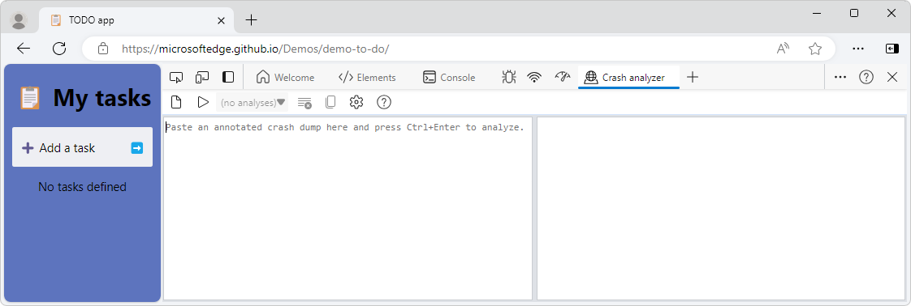
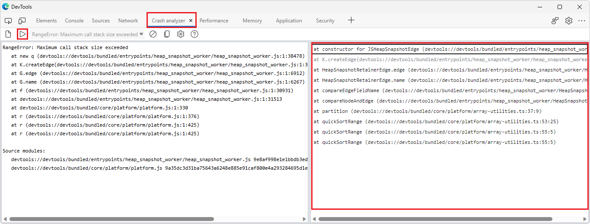
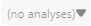
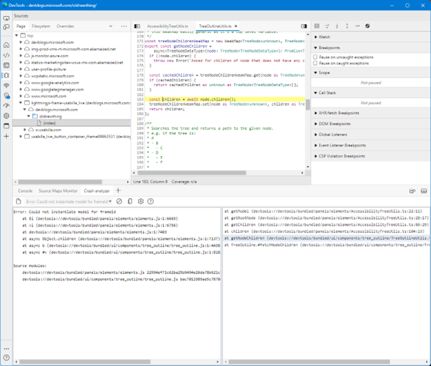

# Crash analyzer tool

Use the **Crash analyzer** tool to analyze Microsoft Edge crashes.  The **Crash Analyzer** tool accelerates diagnosing JavaScript errors in production.  In the **Crash analyzer** tool, you can input a JavaScript stack trace, such as for non-fatal JavaScript exceptions, and then have your sourcemaps applied to the stack trace so that you can debug faster.  The **Crash Analyzer** tool enables you to take a minified JavaScript stack trace and rapidly work backwards to determine what lines of code caused the error.


<!-- todo: 
maybe use page/file:
https://devblogs.microsoft.com/oldnewthing/
devtools://devtools/bundled/panels/elements/elements.js
devtools://devtools/bundled/ui/components/tree_outline/tree_outline.js

show stacktrace content in DevTools
-->

When a web app crashes or hangs unexpectedly, this can result in data loss and a poor user experience.  The **Crash analyzer** tool helps you identify the cause of these crashes.  Use the **Crash analyzer** tool to analyze the memory state of your web app at the time of a crash.  You can access The **Crash analyzer** tool from the **Memory** tool, which displays a list of recent crashes that occurred in your web app.  You can also trigger a crash dump manually by clicking the **Take snapshot** button.
 
When you select a crash from the list, you can see a detailed report of the crash, including:
* The call stack.
* The heap snapshot.
* The exception message.

You can also inspect the values of the variables and objects in the heap, to see how they relate to the code that caused the crash.  This helps pinpoint the exact line of code that triggered the crash, and identify any memory leaks, infinite loops, or other bugs that may have contributed to it.

The **Crash analyzer** tool helps debug and diagnose crashes that occur in any web app, regardless of the framework or library you use.  This tool can also help you test and optimize your web app for different browsers and devices, by comparing the crash reports from different scenarios and environments.


<!-- ====================================================================== -->
## Open the Crash analyzer tool

The **Crash analyzer** tool is a Quick View tool; by default, it opens in the **Quick View** panel, so that you can use it alongside the other tools that are open in the **Activity bar**.


<!-- ------------------------------ -->
#### From the More tools menu

To open the **Crash analyzer** tool by using the DevTools **More tools** menu:

1. In Microsoft Edge, select **Settings and more** () > **More tools** > **Open Developer tools** (**Ctrl+Shift+I** (Windows, Linux) or **Command+Option+I** (macOS)).  DevTools opens.

1. In DevTools, press **Esc** to open the **Quick View** toolbar at the bottom (if not open already).  In the **Quick View** toolbar, click the **More tools** () button, and then select **Crash analyzer**.


<!-- ------------------------------ -->
#### From the Command Menu

To open the **Crash analyzer** tool by using the Command Menu:

1. In Microsoft Edge, select **Settings and more** () > **More tools** > **Open Developer tools** (**Ctrl+Shift+I** (Windows, Linux) or **Command+Option+I** (macOS)).  DevTools opens.

1. In DevTools, click the **Customize and control DevTools** () button, and then select **Run command**.  Or, when DevTools has focus, press **Ctrl+Shift+P** (Windows, Linux) or **Command+Shift+P** (macOS).  The Command Menu opens.

1. Start typing **crash analyzer**, and then select the **Show Crash analyzer [Quick View]** command.  The **Crash analyzer** tool opens in the **Quick View** panel.


<!-- ====================================================================== -->
## Reporting non-fatal JavaScript exceptions or similar data to tools

To report non-fatal JavaScript exceptions (or similar data) to tools such as Azure Application Insights:

1. Produce a specially-formatted stack trace that includes a section called `Source modules`.  The `Source modules` section contains the sourcemap references to the JavaScript functions that were part of the error stack trace.  You can produce such a stack trace by using the [Crash Analyzer Support](https://www.npmjs.com/package/@microsoft/edge-devtools-crash-analyzer-support) npm package.  To install that npm package, at a command prompt, such as git bash, enter the install command that's shown at the above page: `npm i @microsoft/edge-devtools-crash-analyzer-support`.

1. Receive the stack trace from a browser that's running your code.  One way to do this is by using Azure Application Insights; see [Application Insights overview](/azure/azure-monitor/app/app-insights-overview).

1. Once you have a stack trace, paste it into the left pane of the **Crash analyzer** tool.

1. In the **Crash analyzer** tool, click the **Analyze** () button (or press **Ctrl+Enter**).  The right-hand pane shows the original file names and function names that make up the stack trace:

   
   <!-- todo: update png, and write out all steps in this list to reproduce the screenshot -->

1. Click through the individual stack frames, to see the lines in your original code that caused the error.


<!-- ====================================================================== -->
## UI items
<!-- todo: rewrite as task-oriented sections -->

The **Crash analyzer** tool has the following UI items:

| UI item | Description |
|---|---|
| Left pane | The stack trace (annotated crash dump) to analyze. |
| Right pane | Displays the original file names and function names that make up the stack trace. |
| The **New analysis** () button | Creates a new analysis. |
| The **Analyze** () button | Creates a new analysis. |
| The **Analyses** () dropdown list | Shows the list of analyses. |
| The **Remove this analysis** () button | Removes the present analysis. |
| The **Copy unminified stack trace** () button | Copies the full, unminified stack trace, as a stack trace in the conventional V8 stack trace format, except with resolved function names, source file names, and line and column numbers. |
| The **Open Symbol Server settings** () button | Display or modify the Symbol Server settings. |
| The **How to use** () button | Opens the present article. |


<!-- ====================================================================== -->
## Storing source maps using Azure Artifacts Symbol Server

The **Crash analyzer** tool works best if your source maps are securely stored using Azure Artifacts Symbol Server.  This is because source maps are retrieved on demand when analyzing your error, and the exact version which produced the error message might not be cached on your development machine.

See [Securely debug original code by publishing source maps to the Azure Artifacts symbol server](../javascript/publish-source-maps-to-azure.md).


<!-- ====================================================================== -->
## Required stack trace format

Your code must produce a stack trace in the format conventionally produced by the V8 JavaScript engine, with additional metadata about the scripts being executed.  Here's an example stack trace that was produced by Microsoft Edge DevTools:

```
Error: Could not instantiate model for frameId
    at Ei (devtools://devtools/bundled/panels/elements/elements.js:1:6669)
    at vi (devtools://devtools/bundled/panels/elements/elements.js:1:6756)
    at devtools://devtools/bundled/panels/elements/elements.js:1:7403
    at async Object.children (devtools://devtools/bundled/panels/elements/elements.js:1:7137)
    at async b (devtools://devtools/bundled/ui/components/tree_outline/tree_outline.js:1:4438)
    at async #v (devtools://devtools/bundled/ui/components/tree_outline/tree_outline.js:1:8182)

Source modules:
    devtools://devtools/bundled/panels/elements/elements.js 22994ef71c62ba25b9494e26da78b621c5995bff1830c183035b4c1eb7c6b12b
    devtools://devtools/bundled/ui/components/tree_outline/tree_outline.js bac7011989ae5c7870c7f2964e88a51306eb2d520236329f09be5f5850105a42
```

The additional metadata is the line `Source modules:` and the lines below it.  Each line in that section is parsed as follows:

* The line must end with a 64-character line of hexadecimal characters corresponding to the SHA-256 hash of the script being executed.  This is a byte-for-byte hash of the content for each JavaScript file.

* The rest of the line is trimmed and treated as the module name, such as `/panels/elements/elements.js`.  The module name should correspond to file names listed in the main part of the stack trace.


<!-- ====================================================================== -->
## Producing the required stack trace format

Although you can construct the above format manually, this format can also be produced by installing a hook with V8's [Stack trace API](https://v8.dev/docs/stack-trace-api).  Include the following TypeScript file in your application.  For every script entrypoint (such as main application, or Worker), call the `installErrorStackModuleAnnotations(Error)` function, as shown below.

```typescript
// Copyright (C) Microsoft Corp. All rights reserved.
// Use of this source code is governed by a BSD-style license that can be
// found in the LICENSE file.

// Defined by V8 builtins
interface CallSite {
  getThis(): unknown;
  getTypeName(): string;
  getFunction(): Function;
  getFunctionName(): string;
  getMethodName(): string;
  getFileName(): string;
  getLineNumber(): number;
  getColumnNumber(): number;
  getEvalOrigin(): string|undefined;
  isTopLevel(): boolean;
  isEval(): boolean;
  isNative(): boolean;
  isConstructor(): boolean;
  isAsync(): boolean;
  isPromiseAll(): boolean;
  isPromiseAny(): boolean;
  getPromiseIndex(): number|undefined;

  getScriptHash?: () => string;
}

export interface ErrorConstructor {
  prepareStackTrace: StackTracePreparer|undefined;
}
type StackTracePreparer = (error: Error, frames: CallSite[]) => string|undefined;

/**
 * Collects unique module information (name and hash).
 *
 * @param frames The list of stack frames received from `Error.prepareStackTrace`.
 * @returns A string containing the source modules list, or undefined no script hashes were available.
 * @requires The `getScriptHash` function on `CallSite` must be present because it is asserted within this function.
 */
function collectModuleInformation(frames: CallSite[]): string|undefined {
  const sourceHashMap = new Map</* file name */ string, /* hash */ string>();
  for (const frame of frames) {
    const file = frame.getFileName();
    // eslint-disable-next-line @typescript-eslint/no-non-null-assertion
    const hash = frame.getScriptHash!();
    if (file && hash) {
      sourceHashMap.set(file, hash);
    }
  }

  if (sourceHashMap.size) {
    const resultLines = ['', 'Source modules:'];
    for (const [file, hash] of sourceHashMap.entries()) {
      resultLines.push(`    ${file} ${hash}`);
    }

    return resultLines.join('\n');
  }

  return undefined;
}

let originalPST: StackTracePreparer|undefined;
/**
 * This is the "long-term" `prepareStackTrace` callback. It applies either the previous `prepareStackTrace`, if one
 * exists, or defers to the built-in stack generator provided by V8. After the previous stack is generated, this
 * collects a list of unique source module information, and outputs them to the end of the stack trace.
 *
 * @param error The error object to inspect.
 * @param frames The list of stack frames from V8.
 * @returns A string representing the stack trace, or undefined if we're not overriding it.
 */
function prepareStackTraceWithSourceModules(error: Error, frames: CallSite[]): string|undefined {
  let originalStack: string|undefined;
  if (originalPST) {
    originalStack = originalPST.apply(Error, [error, frames]);
  } else {
    // prepareStackTrace guards against reentrancy
    originalStack = error.stack;
  }

  const moduleInformation = collectModuleInformation(frames);
  if (moduleInformation) {
    return originalStack + '\n' + collectModuleInformation(frames);
  }

  return originalStack;
}

/**
 * Installs a hook to collect source hash information if it is available. You should be able to install this
 * by writing:
 *
 * ```ts
 * installErrorStackModuleAnnotations(Error);
 * ```
 *
 * @param errorConstructor The `Error` constructor.
 */
export function installErrorStackModuleAnnotations(errorConstructor: ErrorConstructor): void {
  /**
   * This is the `prepareStackTrace` callback installed initially. The first time this function is called with
   * an array with one or more `CallSite` objects in `frames`, it tests to see whether the `getScriptHash()` function
   * is present. If it is not, it unhooks from execution. If it is present, it removes this hook, but installs the
   * `prepareStackTraceWithSourceModules` function above.
   *
   * @param error The error object to inspect.
   * @param frames The list of stack frames from V8.
   * @returns A string representing the stack trace, or undefined if we're not overriding it.
   */
  function firstPrepareStackTrace(error: Error, frames: CallSite[]): string|undefined {
    // During the first run, we need to ensure that the `getScriptHash`
    // function exists. If it is not, we excuse ourselves from execution.

    if (frames.length > 0) {
      if ('getScriptHash' in frames[0].constructor.prototype) {
        errorConstructor.prepareStackTrace = prepareStackTraceWithSourceModules;
        return prepareStackTraceWithSourceModules.apply(errorConstructor, [error, frames]);
      }

      // 'getScriptHash' is not present, which means the experiment
      // is not enabled. Unhook ourselves from execution.
      errorConstructor.prepareStackTrace = originalPST;
    }

    // If we've exited the block, it means that either there were no frames
    // or the experiment was disabled. Either way, we need to call the original
    // format function, if it exists, or fall back.

    if (typeof originalPST === 'function') {
      return originalPST.apply(errorConstructor, [error, frames]);
    }

    // Default back to conventional stack. V8 guards against reentrancy,
    // so this will not result in a stack overflow
    return error.stack;
  }
  if (errorConstructor.prepareStackTrace?.name === 'firstPrepareStackTrace') {
    return;
  }

  originalPST = errorConstructor.prepareStackTrace;
  errorConstructor.prepareStackTrace = firstPrepareStackTrace;
}
```

The above TypeScript file calls `getScriptHash`, which is in the V8 Call Stack API.  `getScriptHash` returns an empty string if the script is opaque (that is, a cross-origin script).  `getScriptHash` is available in Edge > 99 and other Chromium versions > 101, as well as Node.js 19+.  This code goes out of its way to avoid installing itself multiple times, and will unhook itself at runtime if it detects that `getScriptHash` is not present.


<!-- ====================================================================== -->
## Using the Crash analyzer tool

To use the **Crash analyzer** tool:

1. Open DevTools **Settings** (**F1**), and then open the **Crash analyzer** tool in either the **Activity Bar** or the **Quick View** panel.  The **Quick View** panel is recommended, to use the tool side-by-side with other tools.

1. Paste your enhanced call stack into the left panel of the **Crash analyzer** tool:

   

1. In the **Crash analyzer** tool, click the **Analyze** () button (or press **Ctrl+Enter**).

   This loads the source maps that correspond to the source modules, and attempts to unminify any stack frames for which JavaScript or TypeScript source content was contained in the source map.  Additionally, if the source content was contained for a frame, clicking on the frame will open that source content in the **Sources** tool and highlight the line in question:

   
 
1. You can further copy the unminified stack trace by clicking the **Copy** button on the toolbar.  That produces (and copies to the clipboard) a stack trace in the conventional V8 stack trace format, except with resolved function names, source files, and line/column pairs also resolved:

```
Error: Could not instantiate model for frameId
    at getModel (devtools://devtools/bundled/panels/elements/AccessibilityTreeUtils.ts:22:11)
    at getRootNode (devtools://devtools/bundled/panels/elements/AccessibilityTreeUtils.ts:28:17)
    at getChildren (devtools://devtools/bundled/panels/elements/AccessibilityTreeUtils.ts:86:29)
    at children (devtools://devtools/bundled/panels/elements/AccessibilityTreeUtils.ts:104:13)
    at getNodeChildren (devtools://devtools/bundled/ui/components/tree_outline/TreeOutlineUtils.ts:183:9)
    at TreeOutline.#fetchNodeChildren (devtools://devtools/bundled/ui/components/tree_outline/TreeOutline.ts:282:11)
```

<!-- ====================================================================== -->
## Providing feedback

Leave feedback in the [MicrosoftEdge / DevTools](https://github.com/microsoftedge/devtools) feedback repo and let us know what works well, what doesn't, and what you'd like for such features.


<!-- ====================================================================== -->
## See also

* [Map the processed code to your original source code, for debugging](../javascript/source-maps.md) - source maps.
* [Crash analyzer tool is available by default](../whats-new/2024/03/devtools-123.md#crash-analyzer-tool-is-available-by-default) in _What's New in DevTools (Microsoft Edge 123)_.
* [Debug JavaScript error stack traces by using the Crash Analyzer tool](../whats-new/2023/05/devtools-113.md#debug-javascript-error-stack-traces-by-using-the-crash-analyzer-tool) in _What's New in DevTools (Microsoft Edge 113)_.
* [throw - JavaScript | MDN Web Docs](https://developer.mozilla.org/docs/Web/JavaScript/Reference/Statements/throw)
* [Application Insights overview](/azure/azure-monitor/app/app-insights-overview)
* [Crash Analyzer Support npm module](https://www.npmjs.com/package/@microsoft/edge-devtools-crash-analyzer-support)
* [devtools-console demo page](https://microsoftedge.github.io/Demos/devtools-console/error.html)
* [devtools-explain-error demo page](https://microsoftedge.github.io/Demos/devtools-explain-error/)
* [Fix JavaScript errors that are reported in the Console](../console/console-debug-javascript.md)
