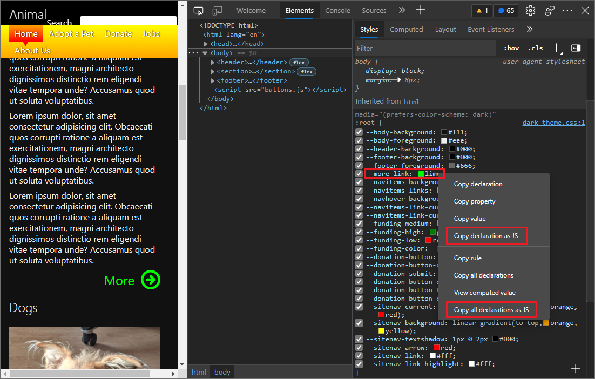

<!-- Copyright Alex Rudenko

   Licensed under the Apache License, Version 2.0 (the "License");
   you may not use this file except in compliance with the License.
   You may obtain a copy of the License at

       https://www.apache.org/licenses/LICENSE-2.0

   Unless required by applicable law or agreed to in writing, software
   distributed under the License is distributed on an "AS IS" BASIS,
   WITHOUT WARRANTIES OR CONDITIONS OF ANY KIND, either express or implied.
   See the License for the specific language governing permissions and
   limitations under the License. -->
# Style editing for CSS-in-JS frameworks

In the **Styles** tab, you can copy declarations for a style rule in a way that's formatted for JavaScript and ready to paste into a JavaScript file.  This includes style rules that were defined by CSS-in-JS function calls.  You can also edit style rules that were initially defined by a CSS-in-JS function call.


<!-- ====================================================================== -->
## Copying style rule declarations to paste them with JavaScript syntax

From the **Styles** pane, you can copy declarations for a style rule in a way that's formatted for JavaScript and ready to paste into a JavaScript file.

When using CSS-in-JS libraries, you can copy CSS declarations (a CSS property and value) so that they are automatically formatted for JavaScript.  You don't have to manually edit the copied CSS to match JavaScript's syntax.  You can copy a single CSS declaration or all the declarations in a style rule, and then paste them directly into a JavaScript file without having syntax issues.

To copy a style rule as JavaScript:

1. In DevTools, open the **Elements** tool, and then click the **Styles** tab.

1. Right-click a declaration in a style rule, and then select **Copy declaration as JS** or **Copy all declarations as JS**.

1. Paste the copied CSS into a JavaScript file in your text editor, such as Visual Studio Code.  For example: `'--more-link': 'lime'`.

   

To learn more about viewing and changing CSS, see [CSS features reference](reference.md).


<!-- ====================================================================== -->
## Editing style rules that were initially defined by a CSSOM function

<!-- from https://learn.microsoft.com/microsoft-edge/devtools-guide-chromium/whats-new/2020/06/devtools#style-editing-for-css-in-js-frameworks -->

The **Styles** pane supports editing styles that were created with the [CSS Object Model (CSSOM)](https://developer.mozilla.org/docs/Web/API/CSS_Object_Model) APIs.  Many CSS-in-JS frameworks and libraries use the CSS Object Model APIs under the hood to construct styles.

You can edit styles that were added in JavaScript using the `CSSStyleSheet` interface, which is a way to create and distribute reusable styles when using [Shadow DOM](https://developer.mozilla.org/docs/Web/Web_Components/Using_shadow_DOM).  See [The `CSSStyleSheet` Interface](https://www.w3.org/TR/cssom-1/#the-cssstylesheet-interface) in _CSS Object Model (CSSOM)_.


#### Example

In this sample code, style rules are initially defined by calling a CSS Object Model (CSSOM) function, and then the style rules are edited using the **Styles** pane.  The `CSSStyleSheet` object contains the CSSOM APIs, such as `insertRule()`.  The `h1` styles that were initially added by a `CSSStyleSheet` function are then editable in the **Styles** pane.

```javascript
//Add CSS-in-JS button

function addStyle() {
  const sheet = new CSSStyleSheet();
  sheet.insertRule(`h1 {
    background: pink;
    text-transform: uppercase;
  }`);
  document.adoptedStyleSheets = [sheet];
}
```

This sample demonstrates changing the `background` property of the `h1` styles that are added by the CSS Object Model function `insertRule()`.  The `background` color is initially set by calling a CSS Object Model function, and then can be changed from `pink` to `lightblue` by using the **Styles** pane.


Give this feature a try with a [sample that uses CSS-in-JS](https://codepen.io/zoherghadyali/full/abdGrPZ).


<!-- ====================================================================== -->
## What is CSS-in-JS?

This section is an excerpt from the blog post [CSS-in-JS support in DevTools](https://developer.chrome.com/blog/css-in-js/).

Here's what we mean by _CSS-in-JS_, and how it's different from regular CSS.  The definition of _CSS-in-JS_ is somewhat vague.  In a broad sense, it's an approach for managing CSS code using JavaScript.  For example, it could mean that the CSS content is defined using JavaScript and the final CSS output is generated on-the-fly by the app.

In the context of DevTools, _CSS-in-JS_ means that the CSS content is injected into the page by the CSS Object Model APIs.  Regular CSS is injected using `<style>` or `<link>` elements, and it has a static source (such as a DOM node or a network resource).  In contrast, CSS-in-JS often doesn't have a static source.

A special case here is that the content of a `<style>` element can be updated by using the CSS Object Model API, causing the source to become out of sync with the actual CSS stylesheet.

If you use any CSS-in-JS library (such as styled-component, Emotion, or JSS), the library might inject styles using CSS Object Model APIs under the hood, depending on the mode of development and the browser.

Let's look at some examples of how you can inject a stylesheet by using the CSS Object Model API, similar to the approach used by some CSS-in-JS libraries.

```javascript
// Insert new rule to an existing CSS stylesheet
const element = document.querySelector('style');
const stylesheet = element.sheet;
stylesheet.replaceSync('.some { color: blue; }');
stylesheet.insertRule('.some { color: green; }');
```

You can create a completely new stylesheet as well:

```javascript
// Create a completely new stylesheet
const sheet = new CSSStyleSheet();
stylesheet.replaceSync('.some { color: blue; }');
stylesheet.insertRule('.some { color: green; }');
```

```javascript
// Apply constructed stylesheet to the document
document.adoptedStyleSheets = [...document.adoptedStyleSheets, sheet];
```


<!-- ====================================================================== -->
## CSS support in DevTools

In DevTools, the most commonly used feature when dealing with CSS is the **Styles** pane.  In the **Styles** pane, you can view what CSS-in-JS rules apply to a particular element.  You can also edit the CSS-in-JS rules and see the changes on the page in real time.

The **Styles** pane supports CSS rules that you can modify by using the CSS Object Model APIs.  CSS-in-JS styles are sometimes described as _constructed_, to indicate that these styles were constructed by using Web APIs.

<!-- video https://storage.googleapis.com/chrome-gcs-uploader.appspot.com/video/dPDCek3EhZgLQPGtEG3y0fTn4v82/Jy8q9gPbQknRturLyCsq.mp4 -->


<!-- ====================================================================== -->
> [!NOTE]
> Portions of this page are modifications based on work created and [shared by Google](https://developers.google.com/terms/site-policies) and used according to terms described in the [Creative Commons Attribution 4.0 International License](https://creativecommons.org/licenses/by/4.0).
> The original page is found [here](https://developer.chrome.com/blog/css-in-js/) and is authored by [Alex Rudenko](https://developers.google.com/web/resources/contributors#alex-rudenko) (Technical Writer, Chrome DevTools \& Lighthouse).

[](https://creativecommons.org/licenses/by/4.0)
This work is licensed under a [Creative Commons Attribution 4.0 International License](https://creativecommons.org/licenses/by/4.0).
