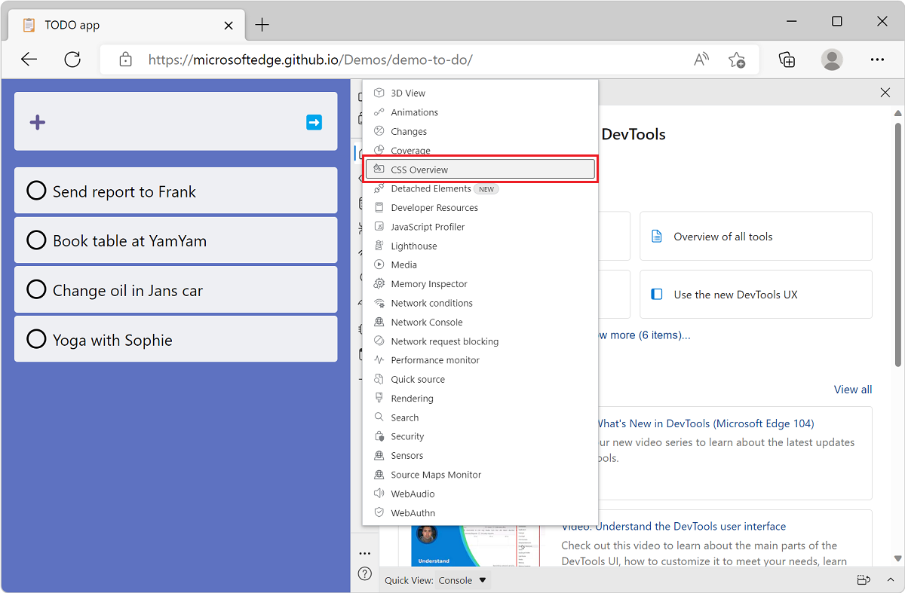
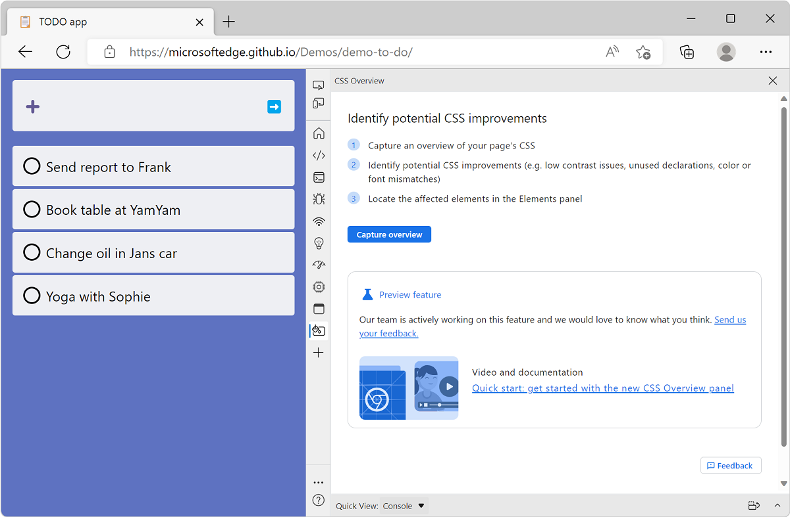
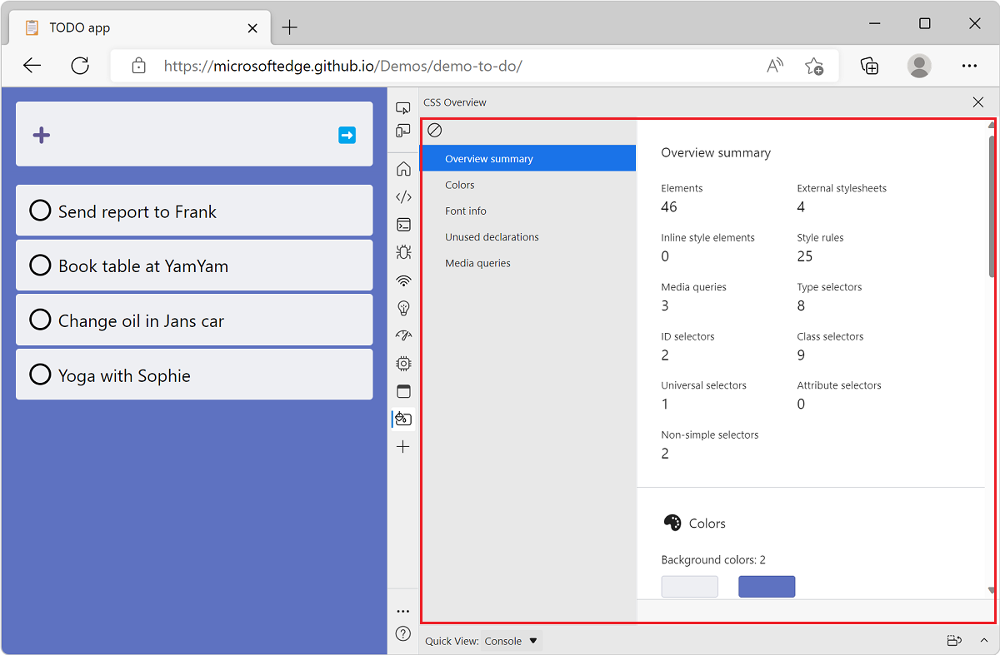
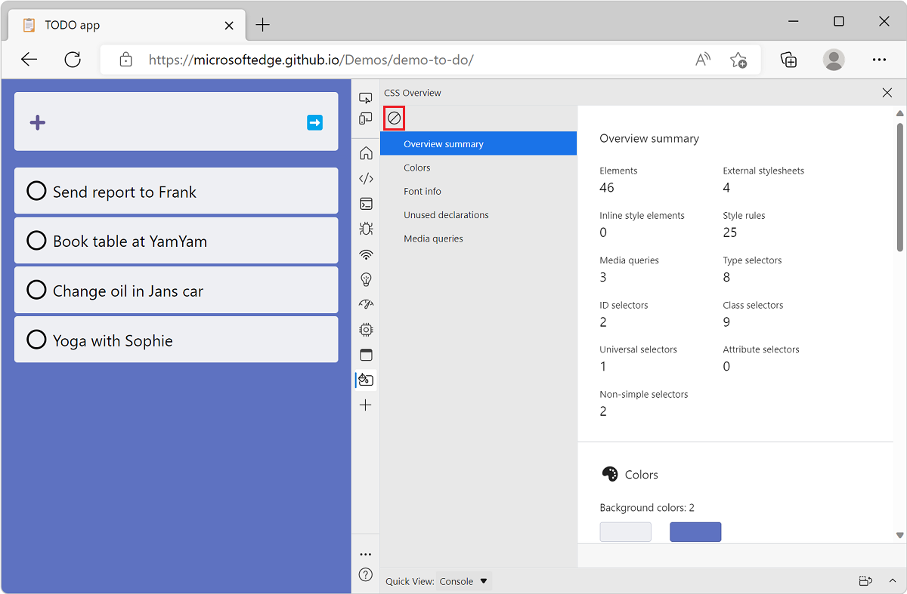
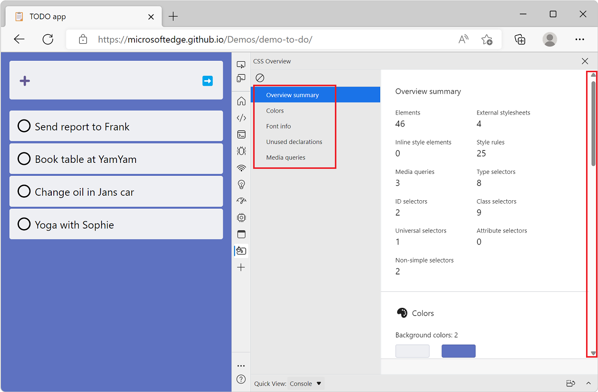

# Identify potential CSS improvements

The **CSS Overview** tool captures an overview of the CSS code used on a webpage and displays a report about the colors, fonts, and media-queries used. The tool also identifies potential color contrast issues and unused CSS declarations issues.

<!-- ====================================================================== -->
## Open the CSS Overview tool

To open the **CSS Overview** tool:

1. Navigate to the [TODO list demo app](https://microsoftedge.github.io/Demos/demo-to-do/) in Microsoft Edge, or to your own webpage.

1. Open DevTools by pressing `F12` or `Ctrl`+`Shift`+`I` (Windows, Linux) or `Command`+`Option`+`I` (macOS).

1. In the main toolbar, click **More Tools** and select **CSS Overview** from the list.

   

1. The **CSS Overview** tool opens and shows a welcome screen.

   

<!-- ====================================================================== -->
## Capture a CSS overview report

Start using the tool by capturing a new report. Click **Capture overview**, the overview report appears.

If you make changes to your webpage and want to view a new report, click **Clear overview** and then capture a new overview.

<!-- ====================================================================== -->
## Understand the report

The overview report contains information organized in several sections:

* **Summary**: statistics about key CSS rules, selectors, and media queries on the page.
* **Colors**: colors used on the page.
* **Font info**: list of fonts on the page.
* **Unused declarations**: list of unused CSS declarations.
* **Media queries**: list of media queries.

To review the above sections, scroll through the report, or use the table of content sidebar.

### Summary

The **Summary** section is useful to get a quick overview of your CSS code. It provides the number of external and inline stylesheets, the number of CSS rules, the number of selectors and their various types, and the number of media queries.

This can be used to assess the volume and consistency of your CSS codebase on a given webpage. For example, if you decided to only use class selectors, the **Summary** section will make it quick to detect other types of selectors like ID or attribute.

### Colors

The **Colors** section lists all the colors used on the webpage, and groups them by background, text, fill, and border categories.

This can be useful to discover cases when several similar colors are used instead of one common color. CSS custom properties (also known as CSS variables) can be used to avoid repeating colors throughout a CSS file and therefore avoid this problem. Learn more about CSS variables on [MDN](https://developer.mozilla.org/en-US/docs/Web/CSS/--*)).

The **Colors** section also contains a list of color contrast issues on the page. To learn more, see [View elements with color contrast issues](#view-elements-with-color-contrast-issues).

### Font info

The **Font info** section lists all the font families used on the webpage and provides details about which sizes, weights, and line heights are used for each.

When designing a webpage, using consistent typography settings can sometimes help reach a more aesthetically-pleasing result. The **Font info** section can therefore be useful to detect when too many different fonts or font styles are used.

### Unused declarations

<!-- ====================================================================== -->
## View elements with color contrast issues

To view a list of elements that have a color contrast issue, on **Contrast issues**, click **Text**.  To open the element in the **Elements** tool, click an element in the list.  To help fix contrast issues, the Microsoft Edge DevTools [automatically provide color suggestions](../08/devtools.md#accessible-color-suggestion-in-the-styles-pane).

The **CSS Overview** tool displays a summary of CSS-related information about the webpage.  This tool lists the colors, fonts, and media queries the webpage uses.  The tool also lists the elements on your page that have color contrast issues, and the unused CSS declarations.  The [CSS Overview Accessible Colors Demo](https://css-overview-accessible-colors-demo.glitch.me) page has an example of a color contrast issue.

To view a list of elements that have a color contrast issue, on **Contrast issues**, click **Text**.  

To open the element in the **Elements** tool, click an element in the list.  To help fix contrast issues, DevTools [automatically provides color suggestions](../whats-new/2020/08/devtools.md#accessible-color-suggestion-in-the-styles-pane).

Hover to highlight (also click on arrow). And click on node to open in Elements tool.

<!-- ====================================================================== -->
## View unused CSS declarations