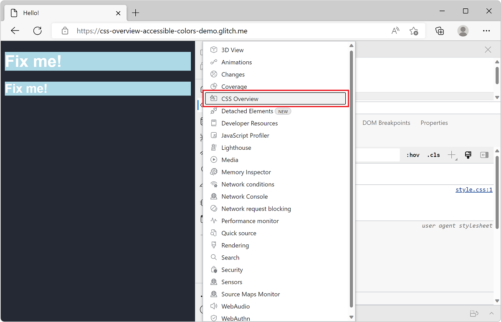
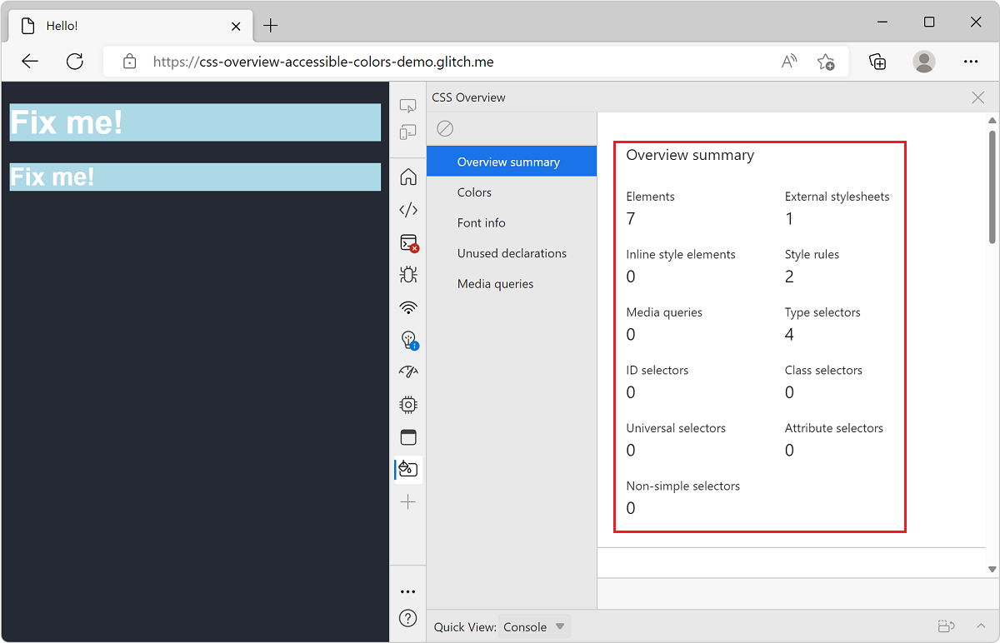
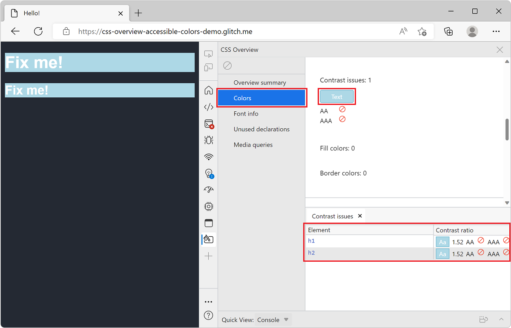

<!-- Copyright Kayce Basques

   Licensed under the Apache License, Version 2.0 (the "License");
   you may not use this file except in compliance with the License.
   You may obtain a copy of the License at

       https://www.apache.org/licenses/LICENSE-2.0

   Unless required by applicable law or agreed to in writing, software
   distributed under the License is distributed on an "AS IS" BASIS,
   WITHOUT WARRANTIES OR CONDITIONS OF ANY KIND, either express or implied.
   See the License for the specific language governing permissions and
   limitations under the License.  -->
# CSS Overview tool

<!-- the what's new entry is:
https://docs.microsoft.com/microsoft-edge/devtools-guide-chromium/whats-new/2020/10/devtools#view-and-fix-color-contrast-issues-in-the-css-overview-tool
# What's New in DevTools (Microsoft Edge 87)
### View and fix color contrast issues in the CSS Overview tool -->

The **CSS Overview** tool displays a summary of CSS-related information about the webpage.  This tool lists the colors, fonts, and media queries the webpage uses.  The tool also lists the elements on your page that have color contrast issues, and the unused CSS declarations.

<!-- ====================================================================== -->
## Open the CSS Overview tool

1. Navigate to a page you want to inspect. You can use the [CSS Overview Accessible Colors Demo](https://css-overview-accessible-colors-demo.glitch.me) page which has an example of a color contrast issue.

1. Open DevTools by pressing `F12`.

1. Click **More tools** (`+`) and select **CSS Overview** from the list.

   

1. In the **CSS Overview** tool, click **Capture overview**. The overview summary is displayed.

   

1. Click **Colors**, **Font info**, **Unused declarations**, or **Media queries** in the tool sidebar to view the corresponding information.

<!-- ====================================================================== -->
## Find color contrast issues

To view a list of elements that have a color contrast issue:

1. Click **Colors** in the sidebar.

1. Scroll down to the **Contrast issues** section.

1. Click **Text** to view the problematic elements.

   

To open the element with a contrast issue in the **Elements** tool, click the element in the list.

To help fix contrast issues, see [Test text-color contrast using the Color Picker](../accessibility/color-picker.md).

<!-- ====================================================================== -->
> [!NOTE]
> Portions of this page are modifications based on work created and [shared by Google](https://developers.google.com/terms/site-policies) and used according to terms described in the [Creative Commons Attribution 4.0 International License](https://creativecommons.org/licenses/by/4.0).
> The original page is found [here](https://developer.chrome.com/docs/devtools/css-overview/) and is authored by [Jecelyn Yeen](https://developers.google.com/web/resources/contributors#jecelyn-yeen) (Developer advocate, Chrome DevTools).

This work is licensed under a [Creative Commons Attribution 4.0 International License](https://creativecommons.org/licenses/by/4.0).
