# Optimize CSS styles with the CSS Overview tool

The **CSS Overview** tool captures an overview of the CSS code used on a webpage and displays a report about the colors, fonts, and media-queries used. The tool also identifies potential color contrast issues and unused CSS declarations issues.

<!-- ====================================================================== -->
## Open the CSS Overview tool

To open the **CSS Overview** tool:

1. Navigate to the [TODO list demo app](https://microsoftedge.github.io/Demos/demo-to-do/) in Microsoft Edge, or to your own webpage.

1. Open DevTools by pressing **F12** or **Ctrl+Shift+I** (Windows, Linux) or **Command+Option+I** (macOS).

1. In the main toolbar, click **More Tools** and select **CSS Overview** from the list.

   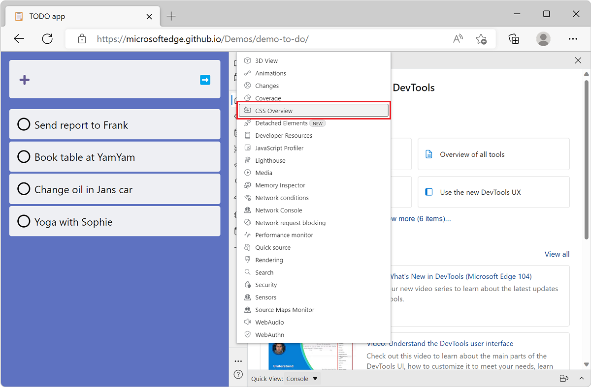

1. The **CSS Overview** tool opens and shows a welcome screen.

   

<!-- ====================================================================== -->
## Capture a CSS overview report

Start using the tool by capturing a new report. Click **Capture overview**, the overview report appears.

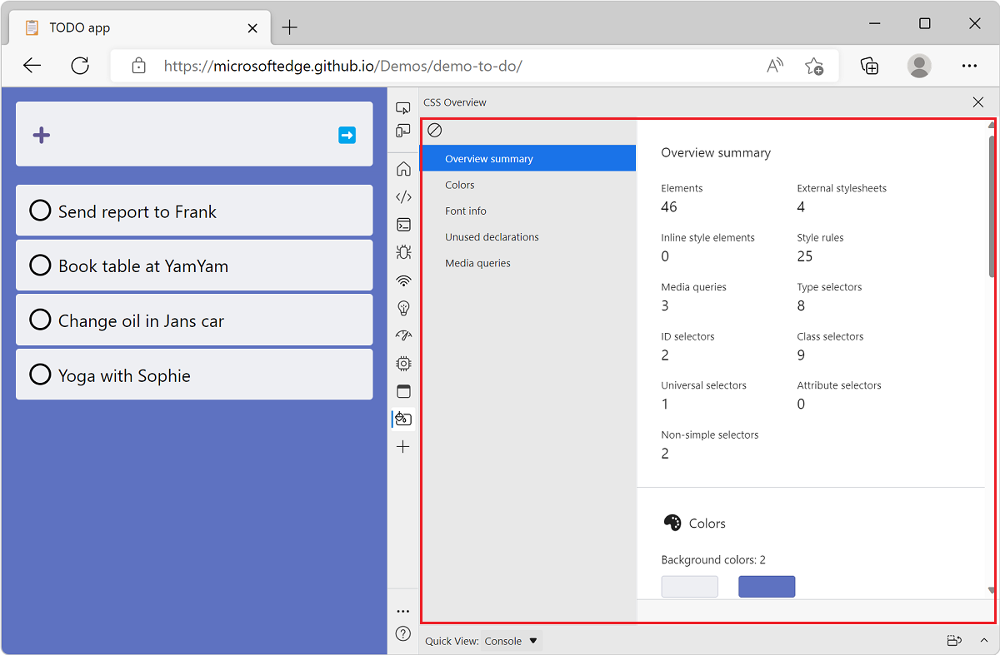

If you make changes to your webpage and want to view a new report, click **Clear overview** and then capture a new overview.

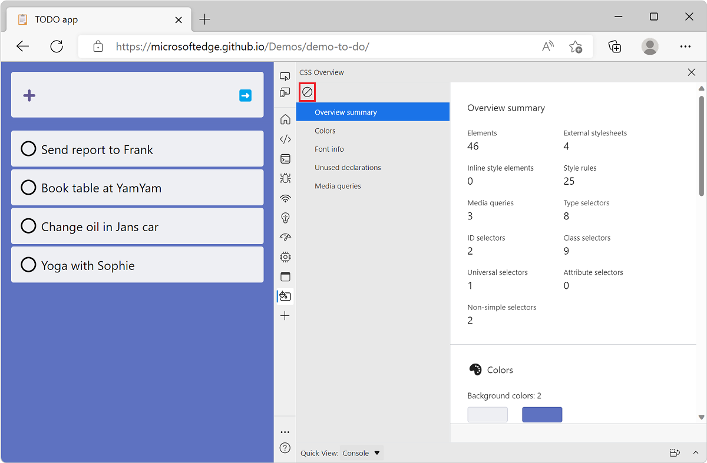

<!-- ====================================================================== -->
## Understand the report

The CSS overview report contains information organized into several sections:

* **Overview summary**: Statistics about key CSS rules, selectors, and media queries on the page.
* **Colors**: Colors used on the page.
* **Font info**: List of fonts on the page.
* **Unused declarations**: List of unused CSS declarations.
* **Media queries**: List of media queries.

To view the sections of the report, use the scrollbar or click the sections in the sidebar:

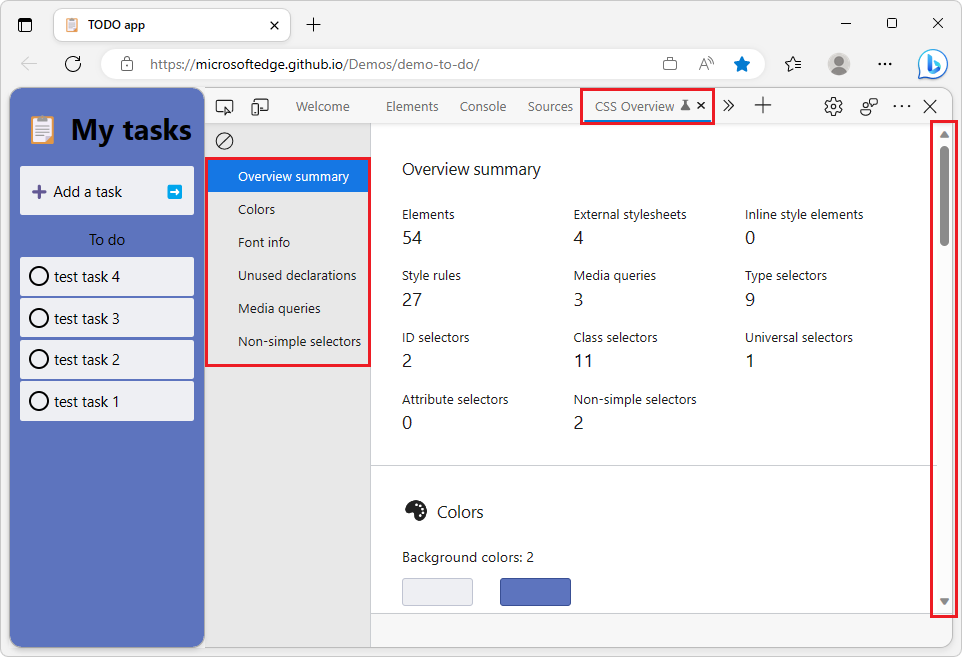

<!-- ------------------------------ -->
#### Overview summary

The **Overview summary** section of the CSS overview report is useful to get a quick overview of your CSS code. It provides the number of external and inline stylesheets, the number of CSS rules, the number of selectors and their various types, and the number of media queries.

This can be used to assess the volume and consistency of your CSS codebase on a given webpage. For example, if you decided to only use class selectors, the **Summary** section will make it quick to detect other types of selectors like ID or attribute.

<!-- ------------------------------ -->
#### Colors section

The **Colors** section of the CSS overview report lists all the colors used on the webpage, and groups them by background, text, fill, and border categories.

This can be useful to discover cases when several similar colors are used instead of one common color. CSS custom properties (also known as CSS variables) can be used to avoid repeating colors throughout a CSS file and therefore avoid this problem. Learn more about CSS variables on [MDN](https://developer.mozilla.org/docs/Web/CSS/--*).

The **Colors** section also contains a list of color contrast issues on the page.  See [View elements with color contrast issues](#view-elements-with-color-contrast-issues), below.

<!-- ------------------------------ -->
#### Font info section

The **Font info** section of the CSS overview report lists all the font families used on the webpage and provides details about which sizes, weights, and line heights are used for each.

When designing a webpage, using consistent typography settings can help reach a more aesthetically-pleasing result. The **Font info** section can be useful to detect when too many different fonts or font styles are used.

Each font in the **Font info** section contains links to the DOM elements they apply to. To reveal the elements a given font applies to:

1. On the overview report, click **Font info** in the sidebar to scroll to the relevant section of the report.

1. Find the font family and the size, weight, or line-height you are interested in.

1. Click the **X occurrences** link next to it to reveal the list of elements.

1. Move your mouse over the elements in the list to highlight them in the rendered page.

   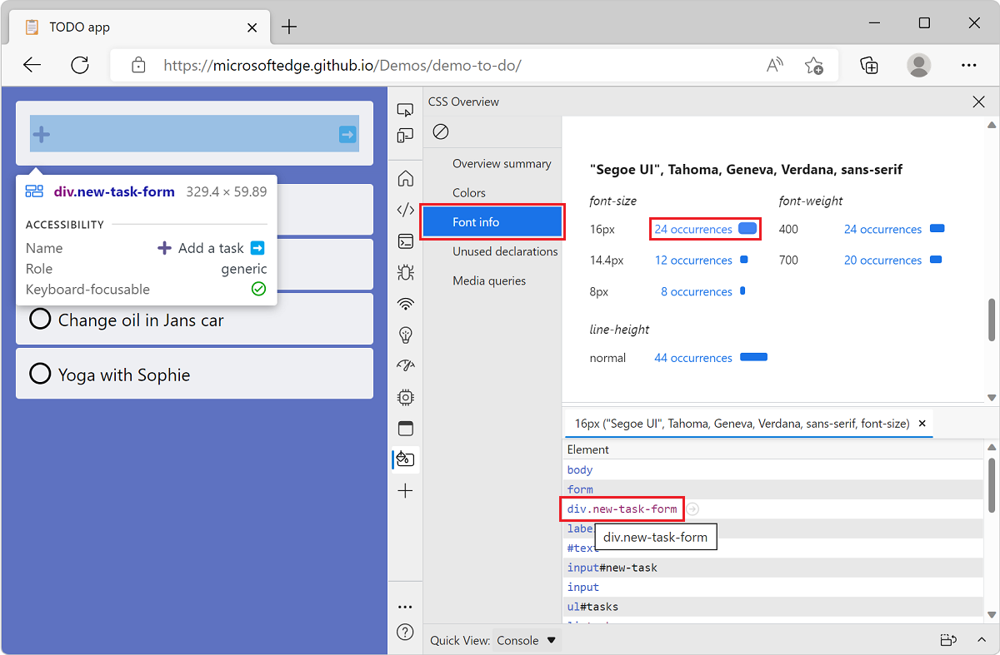

1. Click an element to automatically open the **Elements** tool with that element selected.

   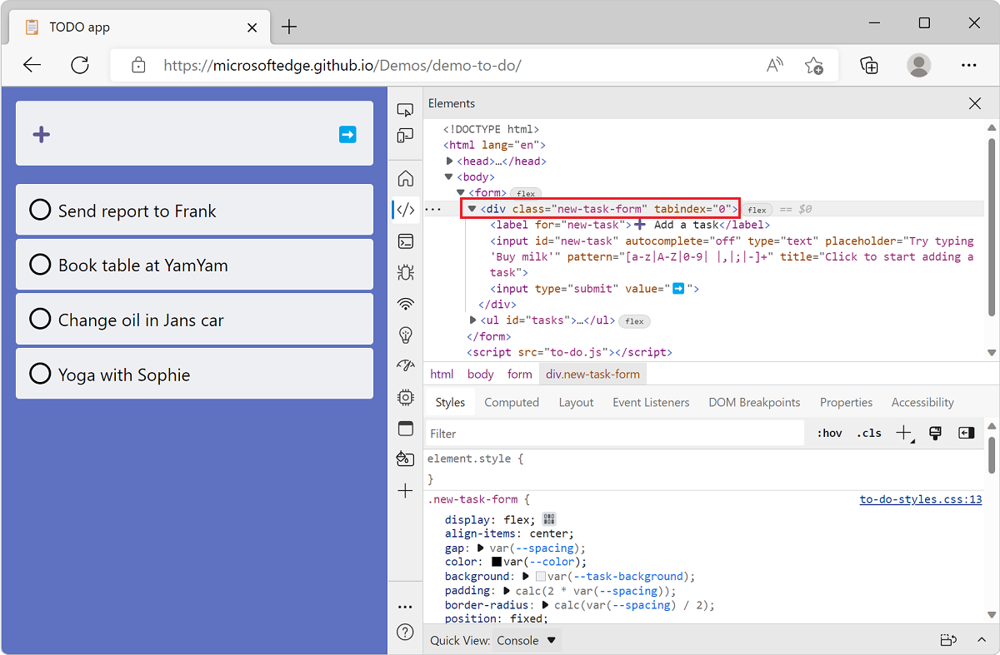

<!-- ------------------------------ -->
#### Unused declarations

The **Unused declarations** section of the CSS overview report lists some of the CSS declarations that don't have an effect on their target elements.

CSS declarations are key/value pairs such as `top: 42px`. CSS declarations are contained in CSS rules, and rules target specific elements on the webpage. Depending on other styles applied to an element, a CSS declaration may not have any effect.

As an example, the `top: 42px` declaration will not have any effect if the element it targets is not positioned with `position: absolute` or `position: relative` for example.

These cases may be hard to find and the **Unused declarations** section helps by listing some of them. Note that not all possible cases are listed. For now, the following cases are reported:

<!-- This part of the tool will get refactored when the Authoring Hints feature is completed.
So this list will need to be updated then. -->
* When the `top`, `right`, `bottom`, or `left` properties are used on statically positioned elements.
* When the `width` or `height` properties are used on inline elements.
* When the `vertical-align` property is used on elements that are not inline or table cells.

<!-- ------------------------------ -->
#### Media queries

The **Media queries** section of the CSS overview report lists the CSS media queries found on the webpage.

CSS media queries can be used to apply specific styles depending on the media type (for example `print` or `screen`) or depending on the viewport size. This is often used to make webpages respond to the available space.

When a CSS codebase becomes complex, keeping track of all the CSS media queries can be hard. The **Media queries** section makes this easier. Each media query in the section also contains a link to the CSS file it's defined in. To reveal that file:

1. On the overview report, click **Media queries** in the sidebar to scroll to the relevant section of the report.

1. In the report, find the media query you are interested in.

1. Click the **X occurrences** link next to it to reveal the corresponding files.

   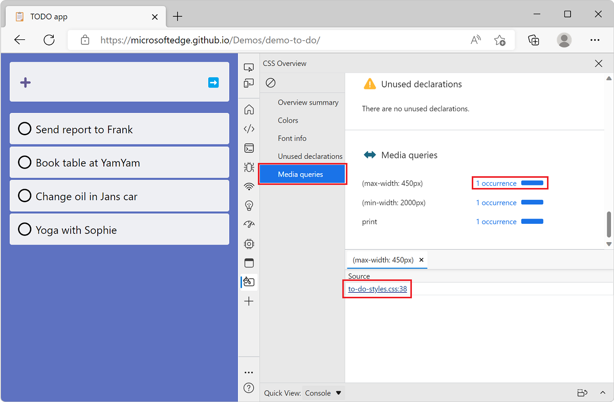

1. Click one of the files to automatically open the **Sources** tool with that file opened.

   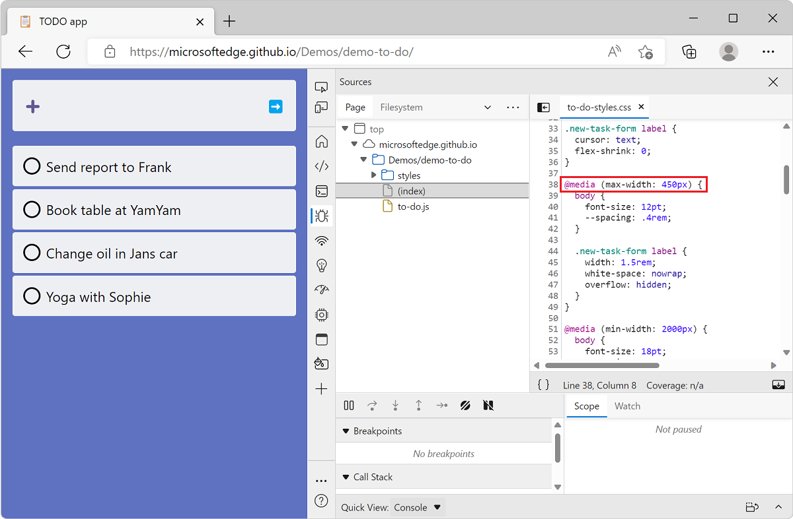

<!-- ------------------------------ -->
#### Non-simple selectors

The **Non-simple selectors** section of the CSS overview report lists the CSS non-simple selectors found on the webpage.

In CSS, simple selectors are selectors with only a single component (for example, a single `id` selector or type selector).  These selectors are not combined with other selector components or combinators.  All basic selectors, attributes, and single pseudo-classes and pseudo-elements are simple selectors.

Non-simple selectors are more complicated and tend to match more elements, potentially resulting in long-running **Recalculate Styles** events in the **Performance** tool.  You can try to change these selectors so that they are more specific and match fewer elements, reducing the amount of time the browser takes to calculate styles in the following cases:

- When elements are added to or removed from the DOM.
- When an element's attributes are changed, such as `class` or `id`.
- When user input occurs, such as a mouse move or a change of focus, which can affect `:hover` rules.

To see the list of non-simple selectors, on the overview report, click **Non-simple selectors** in the sidebar to scroll to the relevant section of the report:

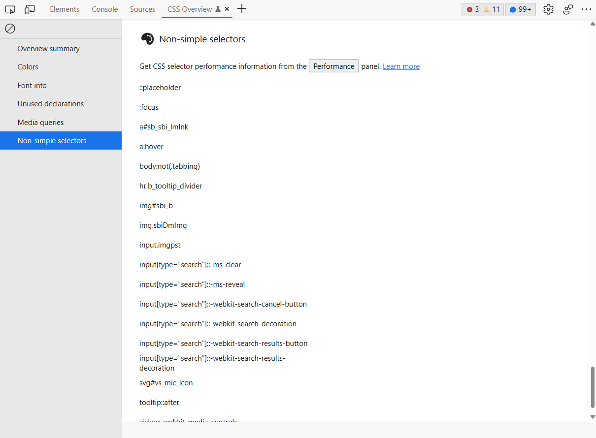

From here, you can further analyze the impact of your changes and individual selector performance by using the **Selector Stats** feature in the **Performance** tool.

###### See also

* [Structure of a selector](https://developer.mozilla.org/docs/Web/CSS/CSS_Selectors#structure_of_a_selector) in _CSS selectors_.
* [Analyze selector performance during Recalculate Style events](../evaluate-performance/selector-stats.md)

<!-- ====================================================================== -->
## View elements with color contrast issues

The **Colors** section of the overview report can also be used to find color contrast issues on a webpage. If the current webpage contains elements where the contrast between the font color and the background color is insufficient, the **Contrast issues** sub-section will be displayed.

To find color contrast issues:

1. Navigate to the [Animal Shelter](https://microsoftedge.github.io/Demos/devtools-a11y-testing/) demo website, which has color contrast issues, in Microsoft Edge. Or navigate to your own website.

1. Open DevTools by pressing **Ctrl+Shift+I** (Windows, Linux) or **Command+Option+I** (macOS).

1. In the main toolbar, click **More Tools** and select **CSS Overview** from the list.

1. In the **CSS Overview** tool, click **Capture overview** and then click **Colors** in the overview report sidebar.

1. Scroll down to the **Contrast issues** sub-section to view all issues.

   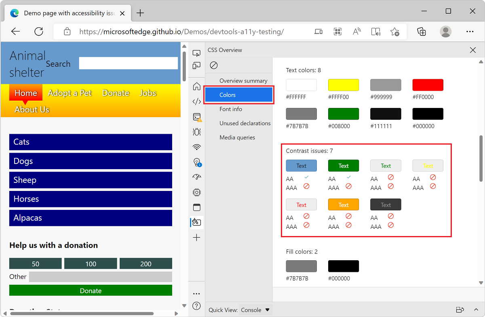

1. To view the elements that have a particular color contrast issue, choose the issue you want to fix and click **Text**. The corresponding elements are listed.

   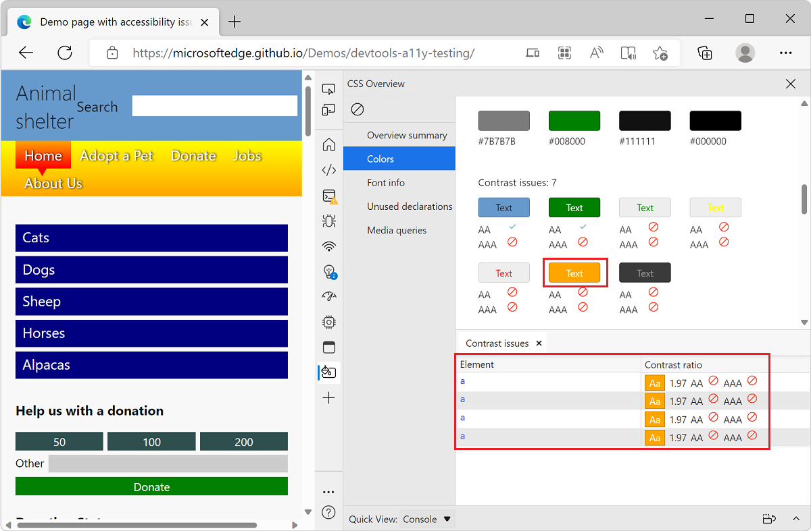

1. To open the corresponding element in the **Elements** tool, click an element in the list.
  
   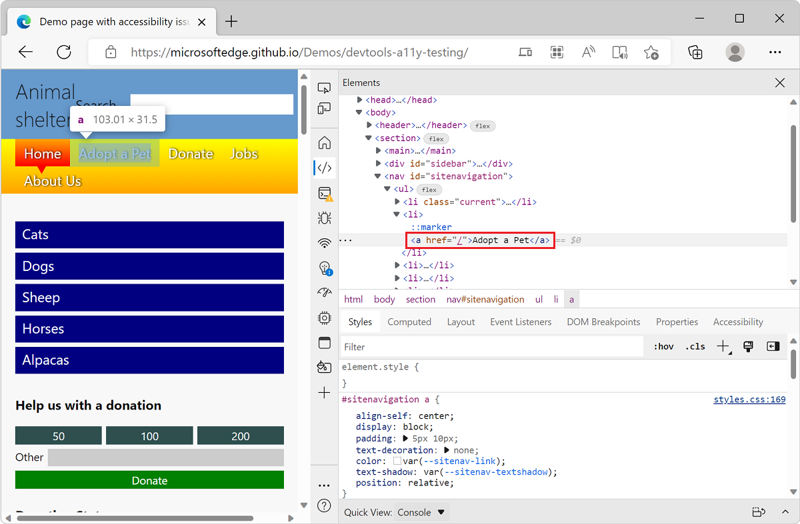

To help fix contrast issues, check out the [Text contrast](../accessibility/reference.md#text-contrast) section of the accessibility-testing DevTools features.

<!-- ====================================================================== -->
## See also

* [Structure of a selector](https://developer.mozilla.org/docs/Web/CSS/CSS_Selectors#structure_of_a_selector) in _CSS selectors_.
* [Analyze selector performance during Recalculate Style events](../evaluate-performance/selector-stats.md)
