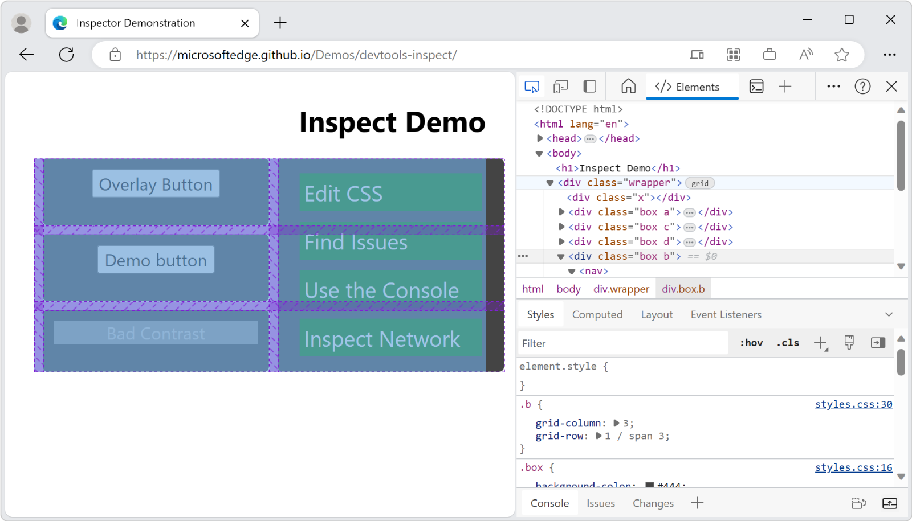

# Analyze pages using the Inspect tool

Use the **Inspect** tool to see information about an item within a rendered webpage.

* When the **Inspect** tool is active, you _hover_ over items in the webpage, and DevTools adds an information overlay information and grid highlighting on the webpage.

* When you _click_ an item in the webpage, the DOM tree in the **Elements** tool is automatically updated to show the DOM element that corresponds to the clicked item in the rendered webpage, and its CSS styling in the **Styles** tab.

<!-- ====================================================================== -->
## Activating the Inspect tool

To try out the **Inspect** tool:

1. Open the [Inspect Demo](https://microsoftedge.github.io/Demos/devtools-inspect) page in a new window or tab.

1. Right-click anywhere in the demo webpage and then select **Inspect**, to open DevTools.

1. In the upper left corner of DevTools, click the **Inspect tool** () button.  Or, when DevTools has focus, press **Ctrl+Shift+C** (Windows, Linux) or **Command+Shift+C** (macOS).

   

   The button icon turns blue (), indicating that the **Inspect** tool is active.

1. In the rendered webpage, hover over items and watch the information overlay and grid highlighting.

1. Click an item in the rendered webpage.

   The DOM tree in the **Elements** tool is automatically updated to show the DOM element that corresponds to the clicked item in the rendered webpage, and its CSS styling in the **Styles** tab.  Clicking in the webpage also turns off **Inspect** mode in the webpage.

<!-- ====================================================================== -->
## Getting element information from the Inspect overlay

When the **Inspect** tool is active, hovering over any element on the rendered webpage displays the **Inspect** overlay.  The **Inspect** overlay displays general and accessibility information about that element.

When you hover over a page element on the rendered page, the DOM tree automatically expands to highlight the element that you are hovering over.

The **Inspect** overlay shows the following information about the element:

* The name of the element.
* The element's dimensions, in pixels.
* The element's color, as a hexadecimal value and a color swatch.
* The element's font settings.
* The element's margin and padding, in pixels.

Which information is shown depends on the type of element and the styles applied to it.  If the element is positioned using CSS grid or CSS flexbox, a different icon appears next to the element's name in the Inspect overlay:

The **Accessibility** section of the **Inspect** overlay displays information about:

* Text-color contrast.
* The name and the role of the element that's reported to assistive technology.
* Whether the element is keyboard focusable.

For example, in the [Inspect Demo](https://microsoftedge.github.io/Demos/devtools-inspect) page, for the `Bad Contrast` button, the **Inspect** overlay has a warning icon next to the contrast value of 1.77.  The **Inspect** overlay also shows that the button isn't focusable via keyboard.  The button can't be navigated to via keyboard, because the button is implemented as a `
` element with a class of `button`, instead of being implemented as a `<button>` element.

<!-- ====================================================================== -->
## Inspecting non-accessible elements

Elements that have the CSS property of `pointer-events: none` aren't available to the **Inspect** tool.  In the [Inspect Demo](https://microsoftedge.github.io/Demos/devtools-inspect) page, hover over the `Overlay Button` and you will see that the parent element (`div.wrapper`) is shown instead of the `Overlay Button`.

To inspect elements that have the CSS property of `pointer-events: none`, press **Shift** while hovering over the element.  There's also a color overlay on page layout regions, indicating that you are in an advanced selection mode.

<!-- ====================================================================== -->
## Selecting the element and terminating Inspect mode

When you click an element in the rendered page:

*  The **Inspect** tool is deactivated.
*  The corresponding DOM node is highlighted.
*  The **Styles** tool shows the CSS that's applied to the element.

<!-- ====================================================================== -->
## Persisting the Inspect tool's tooltip and grid color overlay
<!-- keep sync'd:
* [Persisting the Inspect tool's tooltip and grid color overlay](../accessibility/navigation.md#persisting-the-inspect-tools-tooltip-and-grid-color-overlay) in _Navigate DevTools with assistive technology_ -->

When using the **Inspect** tool and moving around the rendered webpage, you can keep the current **Inspect** overlay displayed.  Press and hold **Ctrl+Alt** (Windows, Linux) or **Ctrl+Option** (macOS) while you move around in the rendered webpage.  The existing tooltip and grid color overlay for the **Inspect** tool remains displayed while you hover over different parts of the rendered webpage.

<!-- ====================================================================== -->
## Temporarily hiding the Inspect element tooltip

To hide the **Inspect** tool's overlay while you move the mouse pointer over the rendered webpage, press and hold **Ctrl**.

<!-- ====================================================================== -->
## See also

* [Use the Inspect tool to detect accessibility issues by hovering over the webpage](../accessibility/test-inspect-tool.md)
