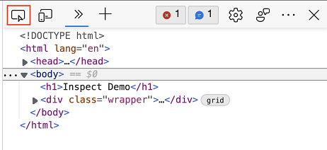
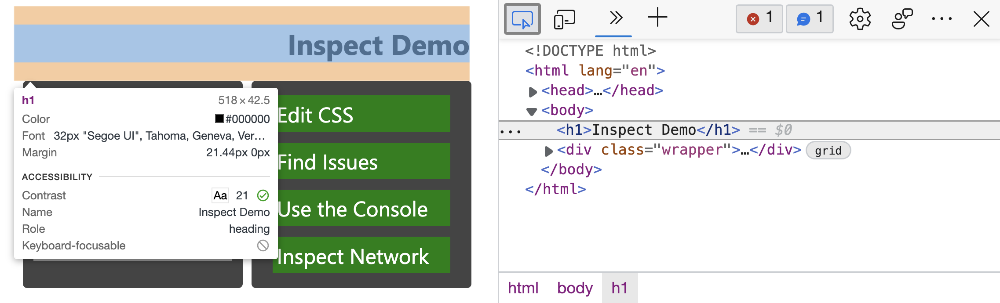
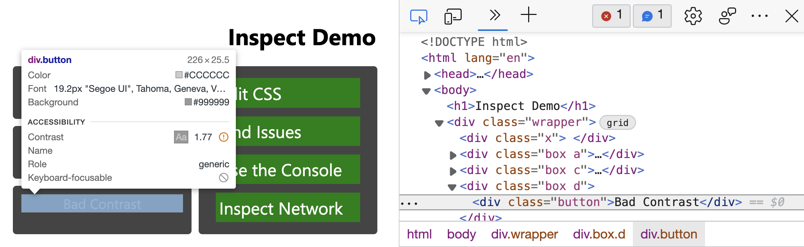
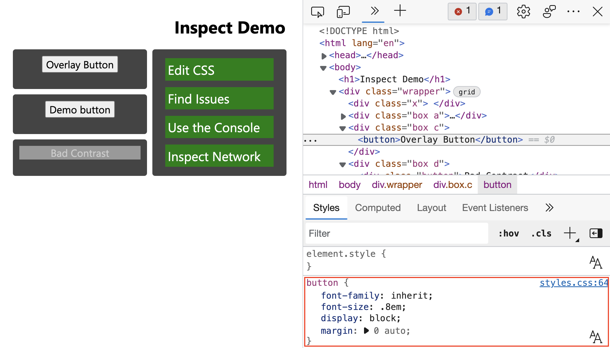

# Analyze HTML pages using the Inspect tool

This article shows how to use the **Inspect** tool to preview information about an element, and how to select an element in the current document.  To try out the **Inspect** tool now, open the [Inspect Demo](https://microsoftedge.github.io/DevToolsSamples/inspector/inspector-demo.html) page in a different tab or window while reading this article.

The **Inspect** tool button is in the upper-left corner of DevTools.  When you select the **Inspect** tool button, the button turns blue, indicating that the **Inspect** tool is active.

Or, press `Control`+`Shift`+`C` (Windows, Linux) or `Command`+`Shift`+`C` (macOS), to activate the **Inspect** tool.

<!-- ====================================================================== -->
## Getting element information from the Inspect overlay

When the **Inspect** tool is active, hovering over any element on the rendered webpage displays the **Inspect** overlay.  The **Inspect** overlay displays general and accessibility information about that element.

When you hover over a page element on the rendered page, the DOM tree automatically expands to highlight the element that you are hovering over.

The **Inspect** overlay shows the following information about the element:

* The name of the element.
* The element's dimensions, in pixels.
* The element's color, as a hexadecimal value and a color swatch.
* The element's font settings.
* The element's margin and padding, in pixels.

Which information is shown depends on the type of element and the styles applied to it.  If the element is positioned using CSS grid or CSS flexbox, a different icon appears next to the element's name in the Inspect overlay:

The **Accessibility** section of the **Inspect** overlay displays information about:

* Text-color contrast.
* The name and the role of the element that's reported to assistive technology.
* Whether the element is keyboard focusable.

For example, in the demo page, for the `Bad Contrast` button, the **Inspect** overlay has a warning icon next to the contrast value of 1.77.  The **Inspect** overlay also shows that the button isn't focusable via keyboard.  The button can't be navigated to via keyboard, because the button is implemented as a `
` element with a class of `button`, instead of being implemented as a `<button>` element.

<!-- ====================================================================== -->
## Inspecting non-accessible elements

Elements that have the CSS property of `pointer-events: none` aren't available to the **Inspect** tool.  In the demo page, hover over the `Overlay Button` and you will see that the parent element (`div.wrapper`) is shown instead.

To inspect elements that have the CSS property of `pointer-events: none`, press `Shift` while hovering over the element.  There's also a color overlay showing you that you are in an advanced selection mode.

<!-- ====================================================================== -->
## Selecting the element and terminating Inspect mode

If you click any element, the **Inspect** tool deactivates, the DOM node is highlighted, and the **Styles** tool shows the CSS that's applied to the element:

