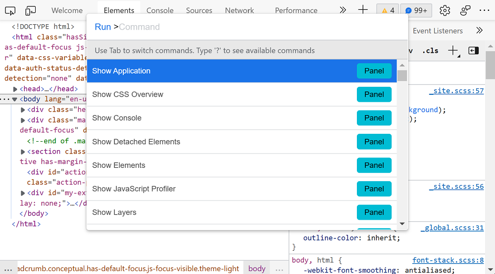
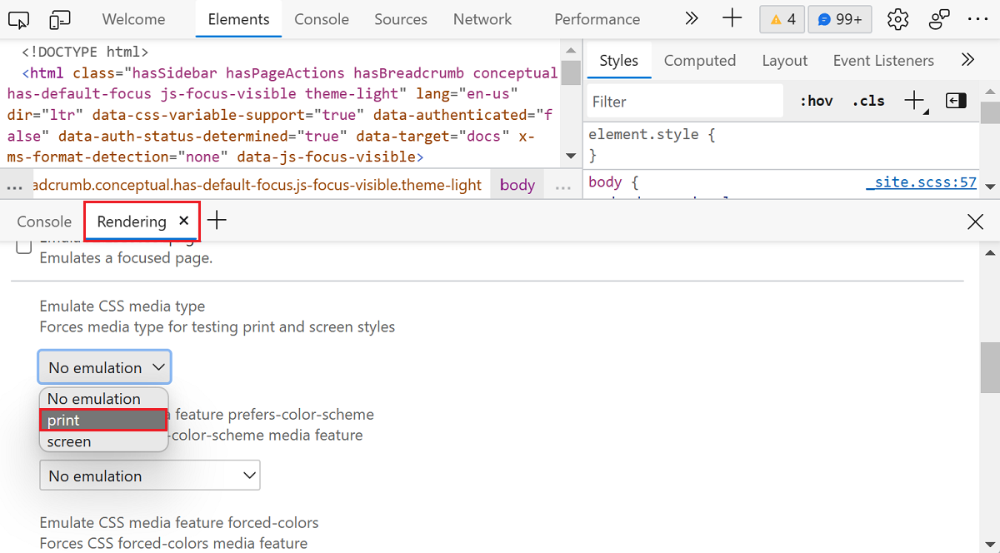

<!-- Copyright Kayce Basques

   Licensed under the Apache License, Version 2.0 (the "License");
   you may not use this file except in compliance with the License.
   You may obtain a copy of the License at

       https://www.apache.org/licenses/LICENSE-2.0

   Unless required by applicable law or agreed to in writing, software
   distributed under the License is distributed on an "AS IS" BASIS,
   WITHOUT WARRANTIES OR CONDITIONS OF ANY KIND, either express or implied.
   See the License for the specific language governing permissions and
   limitations under the License.  -->
# Force print preview mode

The [print media query](https://developer.mozilla.org/docs/Web/CSS/Media_Queries/Using_media_queries) controls how a page looks when printed.  To force a page into print preview mode:

1. Press `Ctrl`+`Shift`+`P` (Windows, Linux) or `Command`+`Shift`+`P` (macOS) to open the **Command Menu**.

   > [!div class="mx-imgBorder"]
   > 

1. Type `rendering`, select **Show Rendering**, and then press `Enter`.

   The **Rendering** panel opens in the **Drawer**.

1. Under **Emulate CSS media type**, select **print**.

   > [!div class="mx-imgBorder"]
   > 

From here, you can display and change your CSS, like any other web page.  See [Get started viewing and changing CSS](index.md).

<!-- ====================================================================== -->
## See also

* [Analyze rendering performance with the Rendering tool](../evaluate-performance/reference.md#analyze-rendering-performance-with-the-rendering-tool) in _Performance features reference_

The Rendering tool is also used for the following:

* [Check for contrast issues with dark theme and light theme](../accessibility/test-dark-mode.md)
* [Verify that a page is usable by people with color blindness](../accessibility/test-color-blindness.md)
* [Verify that a page is usable with blurred vision](../accessibility/test-blurred-vision.md)
* [Verify that a page is usable with UI animation turned off](../accessibility/test-reduced-ui-motion.md)
* [Emulate vision deficiencies](../accessibility/emulate-vision-deficiencies.md)
* [Emulate dark or light schemes in the rendered page](../accessibility/preferred-color-scheme-simulation.md)
* [Simulate reduced motion](../accessibility/reduced-motion-simulation.md)

<!-- ====================================================================== -->
> [!NOTE]
> Portions of this page are modifications based on work created and [shared by Google](https://developers.google.com/terms/site-policies) and used according to terms described in the [Creative Commons Attribution 4.0 International License](https://creativecommons.org/licenses/by/4.0).
> The original page is found [here](https://developer.chrome.com/docs/devtools/rendering/emulate-css/) and is authored by [Kayce Basques](https://developers.google.com/web/resources/contributors#kayce-basques) (Technical Writer, Chrome DevTools \& Lighthouse).

This work is licensed under a [Creative Commons Attribution 4.0 International License](https://creativecommons.org/licenses/by/4.0).
