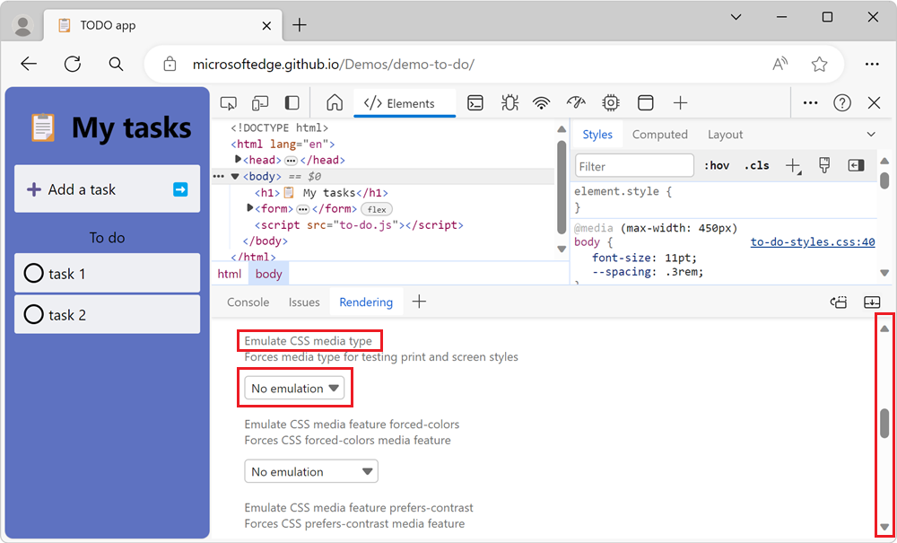
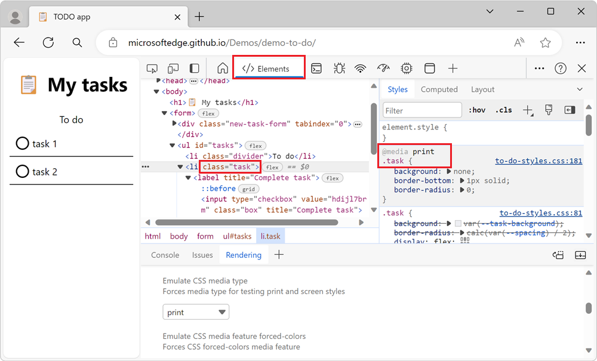

<!-- Copyright Kayce Basques

   Licensed under the Apache License, Version 2.0 (the "License");
   you may not use this file except in compliance with the License.
   You may obtain a copy of the License at

       https://www.apache.org/licenses/LICENSE-2.0

   Unless required by applicable law or agreed to in writing, software
   distributed under the License is distributed on an "AS IS" BASIS,
   WITHOUT WARRANTIES OR CONDITIONS OF ANY KIND, either express or implied.
   See the License for the specific language governing permissions and
   limitations under the License.  -->
# Force print preview mode

The [CSS print media query](https://developer.mozilla.org/docs/Web/CSS/Media_Queries/Using_media_queries) allows you to define CSS styles that only apply when a page is printed.

Use the **Rendering** tool to force a webpage into print preview mode in order to debug your print styles.

To force a page into print preview mode:

1. Go to a webpage, such as the [Todo demo app](https://microsoftedge.github.io/Demos/demo-to-do/).

1. Right-click the webpage, and then select **Inspect**.  DevTools opens.

1. If the **Quick View** panel or toolbar isn't shown at bottom of DevTools, press **Esc** when focus is on DevTools.  The **Quick View** panel opens.

1. In the **Quick View** toolbar, click the **More tools** (+) button, and then select the **Rendering** tool.

   <!-- the Command Menu way:
   1. In DevTools, open the **Command Menu**. To open the **Command Menu**, press **Ctrl+Shift+P** (Windows, Linux) or **Command+Shift+P** (macOS).
   1. Start typing **rendering**, select **Show Rendering**, and then press **Enter**. -->
    
   The **Rendering** tool opens in the **Quick View** panel:
   
   

1. Scroll down to the **Emulate CSS media type** section, and then in the dropdown list, select **print** rather than **No emulation**:

   

   The webpage is rendered with its print media CSS styles applied.

1. In the **Elements** tool, edit the print media CSS styles:

   

   To learn more about changing CSS, see [Get started viewing and changing CSS](index.md).

<!-- ------------------------------ -->
#### Exiting print preview mode

*  In the **Rendering** tool, in the **Emulate CSS media type** section, select **No emulation** in the dropdown menu.

   The webpage is rendered with its screen styles applied.

<!-- ====================================================================== -->
## See also

* [Rendering tool, to see what a webpage looks like with different display options or vision deficiencies](../rendering-tools/rendering-tool.md)

<!-- ====================================================================== -->
> [!NOTE]
> Portions of this page are modifications based on work created and [shared by Google](https://developers.google.com/terms/site-policies) and used according to terms described in the [Creative Commons Attribution 4.0 International License](https://creativecommons.org/licenses/by/4.0).
> The original page is found [here](https://developer.chrome.com/docs/devtools/rendering/emulate-css/) and is authored by [Kayce Basques](https://developers.google.com/web/resources/contributors#kayce-basques) (Technical Writer, Chrome DevTools \& Lighthouse).

This work is licensed under a [Creative Commons Attribution 4.0 International License](https://creativecommons.org/licenses/by/4.0).
