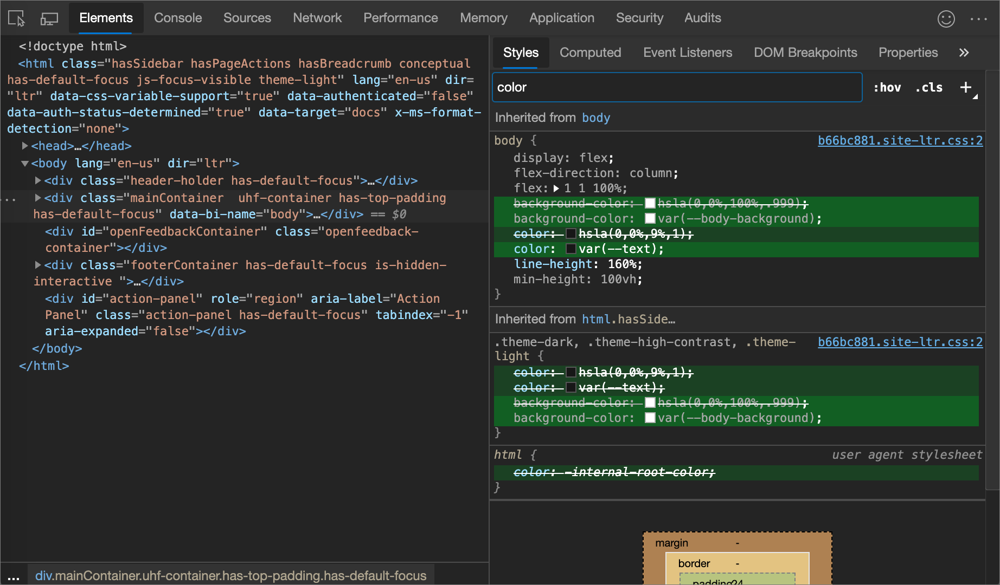
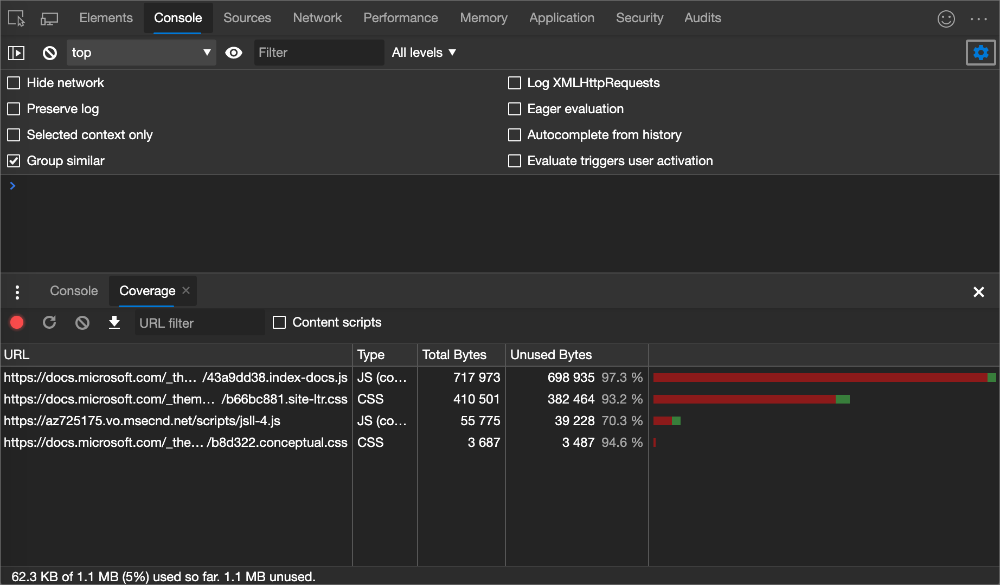
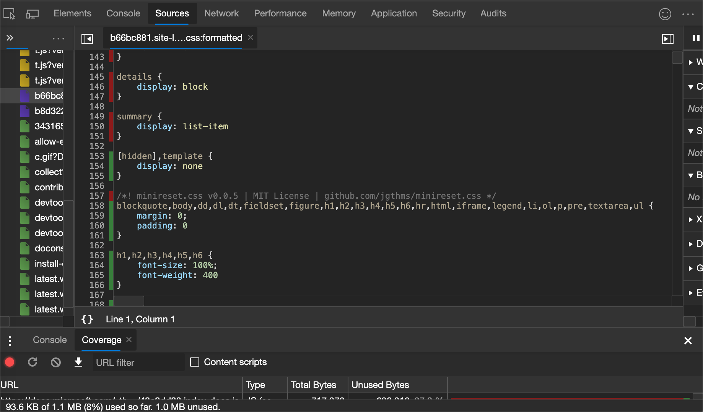
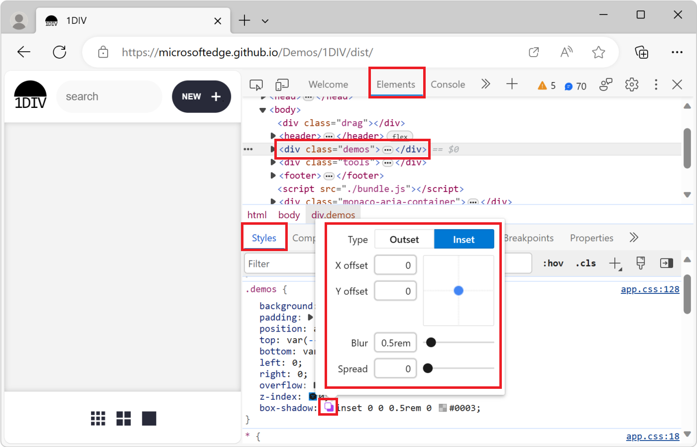
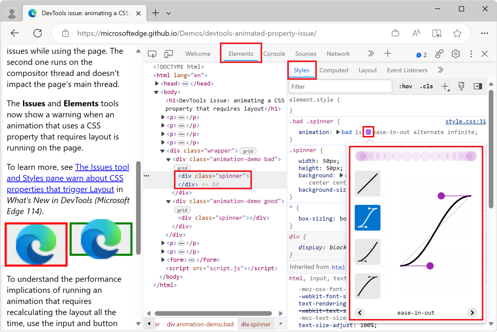
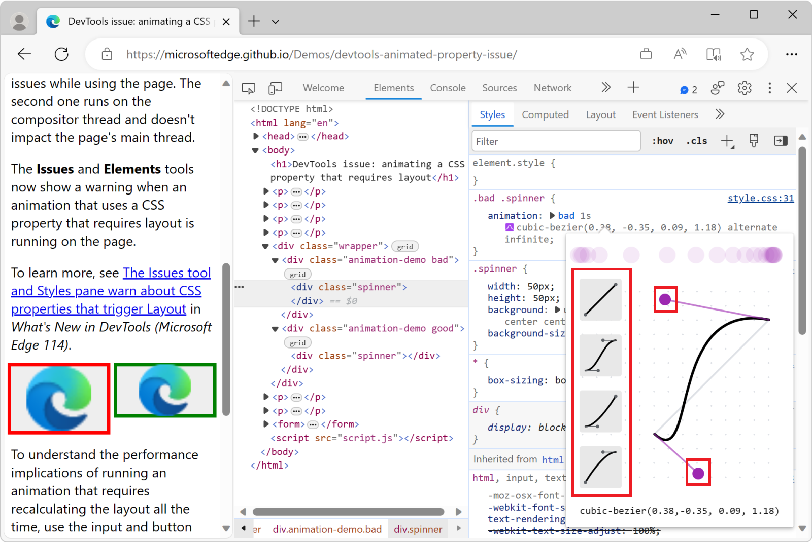

<!-- Copyright Kayce Basques

   Licensed under the Apache License, Version 2.0 (the "License");
   you may not use this file except in compliance with the License.
   You may obtain a copy of the License at

       https://www.apache.org/licenses/LICENSE-2.0

   Unless required by applicable law or agreed to in writing, software
   distributed under the License is distributed on an "AS IS" BASIS,
   WITHOUT WARRANTIES OR CONDITIONS OF ANY KIND, either express or implied.
   See the License for the specific language governing permissions and
   limitations under the License.  -->
# CSS features reference

Discover new workflows in the following comprehensive reference of Microsoft Edge DevTools features related to viewing and changing CSS.

To learn the basics, see [Get started viewing and changing CSS](../css/index.md).

<!-- ====================================================================== -->
## Select an element

The **Elements** tool in DevTools lets you view or change the CSS of one element at a time.  The selected element is highlighted in the **DOM Tree**.  The styles of the element are shown in the **Styles** pane.  For a tutorial, see [View the CSS for an element](../css/index.md#view-the-css-for-an-element).

In the following figure, the `h1` element that is highlighted in the **DOM Tree** is the selected element.  On the right, the styles of the element are shown in the **Styles** pane.  On the left, the element is highlighted in the viewport, but only because the mouse is currently hovering over it in the **DOM Tree**:

There are many ways to select an element:

*  In a rendered webpage, right-click a page element, and then click **Inspect**.

*  In DevTools, click **Select an element** () or press **Ctrl+Shift+C** (Windows, Linux) or **Command+Shift+C** (macOS), and then click the element in the viewport.

*  In DevTools, click the element in the **DOM Tree**.

*  In DevTools, run a query such as `document.querySelector('p')` in the **Console**, right-click the result, and then select **Reveal in Elements panel**.

<!-- ====================================================================== -->
## View the external stylesheet where a rule is defined

In the **Styles** pane, click the link next to a CSS rule to open the external stylesheet that defines the rule.  The stylesheet opens in the **Editor** pane of the **Sources** tool.

If the stylesheet is minified, click the **Format** () button, at the bottom of the **Editor** pane.  For more information, see [Reformat a minified JavaScript file with pretty-print](../javascript/reference.md#reformat-a-minified-javascript-file-with-pretty-print).

In the following figure, after you click
`https://learn.microsoft.com/_themes/docs.theme/master/en-us/_themes/styles/b66bc881.site-ltr.css:2`<!-- :2 at end causes not to work. --><!--keep /en-us--> you are taken to line 2 of
`https://learn.microsoft.com/_themes/docs.theme/master/_themes/styles/b66bc881.site-ltr.css`, where the `.content h1:first-of-type` CSS rule is defined.<!-- master kind of works but all lines are concated.  changing master to main doesn't work -->

<!-- ====================================================================== -->
## View only the CSS that is actually applied to an element

The **Styles** pane shows you all of the rules that apply to an element, including declarations that have been overridden.  When you aren't interested in overridden declarations, use the **Computed** pane to view only the CSS that is actually being applied to an element.

1. [Select an element](#select-an-element).

1. Go to the **Computed** pane in the **Elements** tool.

   On a wide DevTools window, the **Computed** pane doesn't exist.  The contents of the **Computed** pane are shown on the **Styles** pane.

   Inherited properties are opaque.

1. To display all inherited values, select the **Show All** checkbox.

   In the following figure, the **Computed** pane shows the CSS properties being applied to the currently selected `h1` element:

   

<!-- ====================================================================== -->
## View CSS properties in alphabetical order

Use the **Computed** pane.  See [View only the CSS that is actually applied to an element](#view-only-the-css-that-is-actually-applied-to-an-element).

<!-- ====================================================================== -->
## View inherited CSS properties

Check the **Show All** checkbox in the **Computed** pane.  See [View only the CSS that is actually applied to an element](#view-only-the-css-that-is-actually-applied-to-an-element).

<!-- ====================================================================== -->
## View an element's box model

To view [the box model](https://developer.mozilla.org/docs/Learn/CSS/Introduction_to_CSS/Box_model) of an element, go to the **Styles** pane.  If your DevTools window is narrow, the **Box Model** diagram is at the bottom of the panel.

To change a value, double-click it.

In the following figure, the **Box Model** diagram in the **Styles** pane shows the box model for the currently selected `h1` element.

<!-- ====================================================================== -->
## Search and filter the CSS of an element

Use the **Filter** text box on the **Styles** and **Computed** panes to search for specific CSS properties or values.

To also search inherited properties in the **Computed** pane, check the **Show All** checkbox.

In the following figure, the **Styles** pane is filtered to only show rules that include the search query `color`.

In the following figure, the **Computed** pane is filtered to only show declarations that include the search query `100%`.

<!-- ====================================================================== -->
## Toggle a pseudo-class

To toggle a pseudo-class, such as `:active`, `:focus`, `:hover`, or `:visited`:
<!-- :focus-within, :focus-visible, :target. -->

1. [Select an element](#select-an-element).

1. On the **Elements** tool, go to the **Styles** pane.

1. Click **:hov**.

1. Select the pseudo-class that you want to enable.

   The following figure shows toggling the `:hover` pseudo-class.  In the viewport, the `background-color: cornflowerblue` declaration is applied to the element, even though the element isn't actually being hovered over.

   

For an interactive tutorial, see [Add a pseudo-state to a class](../css/index.md#add-a-pseudostate-to-a-class).

<!-- ====================================================================== -->
## View a page in print mode

To view a page in print mode:

1. Open the [Command Menu](../command-menu/index.md).

1. Start typing `rendering`, and then select **Show Rendering**.

1. Click the **Emulate CSS Media** dropdown list, and then select **print**.

<!-- ====================================================================== -->
## View used and unused CSS with the Coverage tool

The **Coverage** tool shows you what CSS a page actually uses.

1. Open the [Command Menu](../command-menu/index.md) by pressing **Ctrl+Shift+P** (Windows, Linux) or **Command+Shift+P** (macOS), while DevTools has focus.

1. Start typing `coverage`, and then select **Show Coverage**:
   
   
   
   The **Coverage** tool appears:
   
   

1. Click **Start instrumenting coverage and refresh the page** ().  The page refreshes and the **Coverage** tool provides an overview of how much CSS (and JavaScript) is used from each file that the browser loads.  Green represents used CSS.  Red represents unused CSS.

   An overview of how much CSS (and JavaScript) is used and unused:

   

1. To display a line-by-line breakdown of what CSS is used, click a CSS file.

   In the following figure, lines 145 to 147 and 149 to 151 of `b66bc881.site-ltr.css` are unused, whereas lines 163 to 166 are used:

   

<!-- ====================================================================== -->
## Force print preview mode

See [Force DevTools into Print Preview mode](../css/print-preview.md).

<!-- ====================================================================== -->
<!-- ## Change CSS -->
<!-- todo s/CSS declaration/declaration/ (or not) -->

<!-- ====================================================================== -->
## Two ways to add a CSS declaration to an element

The order of declarations affects how an element is styled.  You can add declarations either by adding an inline declaration, or by adding a declaration to a style rule.  These two approaches are described in the following sections.

<!-- ====================================================================== -->
## Adding an inline CSS declaration to an element

Adding a inline declaration is equivalent to adding a `style` attribute to the HTML of an element.  For most scenarios, you probably want to use inline declarations.

Inline declarations have higher specificity than external declarations, so using inline declarations ensures that the changes take effect in your specific, expected element.  For more information about specificity, see [Selector Types](https://developer.mozilla.org/docs/Web/CSS/Specificity#Selector_Types).

To add an inline declaration:

1. [Select an element](#select-an-element).

1. In the **Styles** pane, click between the brackets of the **element.style** section.  The cursor focuses, allowing you to enter text.

1. Enter a property name and press **Enter**.

1. Enter a valid value for that property and press **Enter**.  In the **DOM Tree**, a `style` attribute has been added to the element.

Alternatively, enter the value in the property field, and DevTools will then suggest a list of matching **property: value** pairs to select from. For example, if you enter `bold` in the property field, DevTools suggests `font-weight: bold` and `font-weight: bolder` as the possible rules. Press **Enter** to apply the rule.

In the following figure, the `margin-top` and `background-color` properties have been applied to the selected element.  In the **DOM Tree**, the declarations are reflected in the element's `style` attribute.

<!-- ====================================================================== -->
## Adding a CSS declaration to an existing style rule

If you're debugging an element's styles and you need to specifically test what happens when a declaration is defined in different places, add a declaration to an existing style rule.

To add a declaration to an existing style rule:

1. [Select an element](#select-an-element).

1. In the **Styles** pane, click between the brackets of the style rule to which you want to add the declaration.  The cursor focuses, allowing you to enter text.

1. Enter a property name and press **Enter**.

1. Enter a valid value for that property and press **Enter**.

<!-- ====================================================================== -->
## Change a declaration name or value

To change the name of a CSS declaration, double-click the declaration's name.

To change the value of a CSS declaration, double-click the declaration's value.  The following screenshot shows selecting a value from a list:

To change a numerical value, type in the value, or use the arrow keys, per the next section.

<!-- ====================================================================== -->
## Increment numerical declaration values

To change a numerical value of a CSS declaration, type in the value, or use the arrow keys to increment the value by a specific amount:

| Keyboard shortcut | Increments by |
|---|---|
| **Alt+Up Arrow** (Windows, Linux) or **Option+Up Arrow** (macOS) | 0.1 |
| **Up Arrow** | 1 (or 0.1, if the current value is between -1 and 1) |
| **Shift+Up Arrow** | 10 |
| **Shift+Page Up** (Windows, Linux) or **Shift+Command+Up Arrow** (macOS) | 100 |

To decrement, press the **Down Arrow** (or **Page Down**) key instead of the **Up Arrow** (or **Page Up**) key.

<!-- ====================================================================== -->
## Add a class to an element

To add a class to an element:

1. [Select the element](#select-an-element) in the **DOM Tree**.

1. Click **.cls**.

1. Enter the name of the class in the **Add new class** text box.

1. Press **Enter**.

   

<!-- ====================================================================== -->
## Toggle a class

To enable or disable a class on an element:

1. [Select the element](#select-an-element) in the **DOM Tree**.

1. Open the **Element Classes** pane.  See [Add a class to an element](#add-a-class-to-an-element).  Below the **Add New Class** text boxes are all of the classes that are being applied to this element.

1. Toggle the checkbox next to the class that you want to enable or disable.

<!-- ====================================================================== -->
## Add a style rule

To add a new style rule:

1. [Select an element](#select-an-element).

1. Click **New Style Rule** ().  DevTools inserts a new rule beneath the **element.style** rule.

   In the following figure, DevTools adds the `h1.devsite-page-title` style rule after you click **New Style Rule**.

   

### Select a stylesheet to add a rule to

By default, when adding a style rule, DevTools creates a new stylesheet named `inspector-stylesheet` in the document and then adds the new style rule in this stylesheet.

To instead add the rule in an existing stylesheet:

*  Click and hold **New Style Rule** () and then select a stylesheet from the list to add the style rule to.

### Add a style rule to a specific location

By default, adding a style rule by clicking on **New Style Rule** inserts the new rule beneath the **element.style** rule in the `inspector-stylesheet` stylesheet.

To add a style rule in a specific location of the **Styles** pane instead:

1. Hover on the style rule that is directly above where you want to add your new style rule.

1. Click **Insert Style Rule Below** ().

<!-- ====================================================================== -->
## Toggle a declaration

To toggle a single declaration on or off:

1. [Select an element](#select-an-element).

1. In the **Styles** pane, hover on the rule that defines the declaration.  A checkbox appears next to each declaration.

1. Select or clear the checkbox next to the declaration.  When you clear a declaration, DevTools crosses it out, to indicate that it is no longer active.

   In the following figure, the `margin-top` property for the currently selected element has been toggled off.

   

<!-- ====================================================================== -->
## Change colors with the Color Picker

The **Color Picker** provides a user interface for changing `color` and `background-color` declarations.

To open the **Color Picker**:

1. [Select an element](#select-an-element).

1. In the **Styles** pane, find the `color`, `background-color`, or similar declaration that you want to change.  To the left of the `color`, `background-color`, or similar value, there is a small square, which is a preview of the color.

   In the following figure, the small square to the left of `rgba(0, 0, 0, 0.7)` is a preview of that color.

   

1. Click the preview to open the **Color Picker**.

   

The following figure and list describes of each of the UI elements of the **Color Picker**.

| Callout | Component | Description |
|---|---|---|
| 1 | **Shades** |  |
| 2 | **Eyedropper** | [Sample a color off the page with the Eyedropper](#sample-a-color-off-the-page-with-the-eyedropper) |
| 3 | **Copy To Clipboard** | Copy the **Display Value** to your clipboard. |
| 4 | **Display Value** | The RGBA, HSLA, or Hex representation of the color. |
| 5 | **Color Palette** | Click a square to change the color. |
| 6 | **Hue** |  |
| 7 | **Opacity** |  |
| 8 | **Display Value Switcher** | Toggle between the RGBA, HSLA, and Hex representations of the current color. |
| 9 | **Color Palette Switcher** | Toggle between the [Material Design palette](https://material.io/guidelines/style/color.html#color-color-palette), a custom palette, or a page colors palette.  DevTools generates the page color palette based on the colors that it finds in your stylesheets. |

### Sample a color off the page with the Eyedropper

To change the selected color to some other color on the page:

1. Click the **Eyedropper** icon (). Your cursor changes to a magnifying glass.

1. Hover on the pixel that has the color you want to sample, anywhere on your screen.

1. Click to confirm.

   In the following figure, the **Color Picker** shows a current color value of `rgba(0,0,0,0.7)`, which is close to black.  The specific color changes to the version of black that is currently highlighted in the viewport after you clicked it.

   

See also:
* [Test text-color contrast using the Color Picker](../accessibility/color-picker.md)

<!-- ====================================================================== -->
## Change angle value with the Angle Clock

The **Angle Clock** provides a user interface for changing the angle amounts in CSS property values.

To open the **Angle Clock**:

1. Select an element which includes an angle declaration. <!-- For example, select the text below. -->

1. In the **Styles** pane, find the `transform` or `background` declaration that you want to change.  Click the **Angle Preview** box next to the angle value.

   In the following figure, the small clock to the left of `100deg` is a preview of the angle.

1. Click the preview to open the **Angle Clock**:

   

1. Change the angle value by clicking on the **Angle Clock** circle, or scroll your mouse to increase or decrease the angle value by 1.

There are more keyboard shortcuts to change the angle value.  Find out more in the [Styles pane keyboard shortcuts](../shortcuts/index.md#styles-pane-keyboard-shortcuts).

<!-- ====================================================================== -->
## Change box and text shadows with the Shadow Editor

Use the **Shadow Editor** to change the value of the `box-shadow` or `text-shadow` CSS property on an HTML element:

1. [Select an element](#select-an-element) with a `box-shadow` or `text-shadow` declaration.

   For example, open [the 1DIV demo page](https://microsoftedge.github.io/Demos/1DIV/dist/) in a new tab or window, right-click the page and select **Inspect** to open DevTools, and then in the **Elements** tool, select the `
` element.

1. In the **Styles** pane, in the `.demos` CSS rule, find the `box-shadow` declaration, and then click its **Open shadow editor** () button.

   The **Shadow Editor** opens:

   

1. Change the shadow properties, as follows:

   | Property | How to change |
   |---|---|
   | **Type** | Select **Outset** or **Inset**.  Only for `box-shadow`. |
   | **X offset** | Specify a value in the text box, or drag the blue dot. |
   | **Y offset** | Specify a value in the text box, or drag the blue dot. |
   | **Blur** | Specify a value in the text box, or drag the slider. |
   | **Spread** | Specify a value in the text box, or drag the slider.  Only for `box-shadow`. |
   <!-- todo: explain the meaning of each property, not only how to change the value.  change column heading to:
   | Property | Description |
   | Property | Description and how to change |
   -->

   The changes are applied to the element in the rendered webpage in real time:

   

<!-- ====================================================================== -->
## Edit animation and transition timings with the Easing Editor

Use the **Easing Editor** to change the value of the [animation-timing-function](https://developer.mozilla.org/docs/Web/CSS/animation-timing-function) or [transition-timing-function](https://developer.mozilla.org/docs/Web/CSS/transition-timing-function) property on an HTML element:

1. [Select an element](#select-an-element) that has a CSS animation or transition applied.

   For example, open the [animated property demo page](https://microsoftedge.github.io/Demos/devtools-animated-property-issue/) in a new tab or window, right-click the page and select **Inspect** to open DevTools, and then in the **Elements** tool, press **Ctrl+F** and find "spinner", and then select the `
` element.

   The red and green boxes on this demo page are two different CSS animations. Both animations run with CSS by using the `animation` CSS property, and define an `ease-in-out` timing function.

1. In the **Styles** pane, find the `animation` declaration in the `.bad .spinner` CSS rule, and click the **Open cubic bezier editor** () button.

   The **Easing Editor** opens:

   

1. Change the properties of the animation timing function:

   * Choose one of the pre-defined timing functions from the list.
   * Create your own timing function by dragging the cubic-bezier curve handles.

   The changes are applied to the element in the rendered webpage in real time:

   

<!-- ====================================================================== -->
> [!NOTE]
> Portions of this page are modifications based on work created and [shared by Google](https://developers.google.com/terms/site-policies) and used according to terms described in the [Creative Commons Attribution 4.0 International License](https://creativecommons.org/licenses/by/4.0).
> The original page is found [here](https://developer.chrome.com/docs/devtools/css/reference/) and is authored by [Kayce Basques](https://developers.google.com/web/resources/contributors#kayce-basques) (Technical Writer, Chrome DevTools \& Lighthouse).

This work is licensed under a [Creative Commons Attribution 4.0 International License](https://creativecommons.org/licenses/by/4.0).
