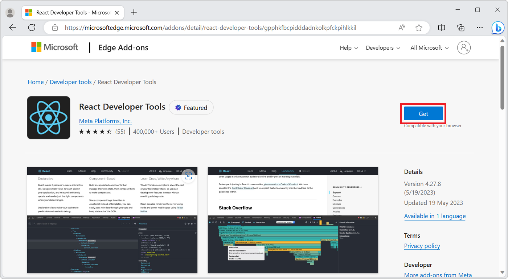

# Add custom UI to DevTools using extensions

In addition to the tools available in Microsoft Edge DevTools you can add new tools by installing Microsoft Edge extensions, or build your own extensions for your specific use cases.

Microsoft Edge extensions can insert new tabs in the main toolbar of DevTools.

<!-- ====================================================================== -->
## Install extensions in DevTools

Install extensions in Microsoft Edge by navigating to [Edge Add-ons](https://microsoftedge.microsoft.com/addons/). 

These extensions often extend the Microsoft Edge user interface with new buttons and panels, but can also extend DevTools, within Microsoft Edge, by adding new tabs in the main toolbar.

There is no way to know if an extension extends the DevTools main toolbar or not without looking at its source code. But the Edge Add-ons website has a **Developer tools** category that contains extensions that often extend DevTools. See the [Developer tools category](https://microsoftedge.microsoft.com/addons/category/Developer-Tools) on the Edge Add-ons website for more details.

To install a DevTools extension:

1. Navigate to the extension you want to install on the Edge Add-ons website. For example, go to the [React Developer Tools](https://microsoftedge.microsoft.com/addons/detail/react-developer-tools/gpphkfbcpidddadnkolkpfckpihlkkil) extension.

1. Click the **Get** button, and then confirm the installation dialog:

    

1. Open a new tab and go to a page that uses React. For example, use the [TodoMVC React example page](https://todomvc.com/examples/react/#/).

1. Open DevTools by pressing **F12**. Two new tabs are displayed in the main toolbar: **Components** and **Profiler**. If you don't see the new tabs, make the DevTools window wider, or click **More tabs** ().

    

1. Click **Components** or **Profiler** to use the React Developer Tools extension.

<!-- ====================================================================== -->
## Create a DevTools extension

You can create your own DevTools extension to add new tabs in the main toolbar and interact with the inspected page.

To learn how to create a DevTools extension, navigate to [Create a DevTools extension](../../extensions-chromium/developer-guide/devtools-extension.md).
