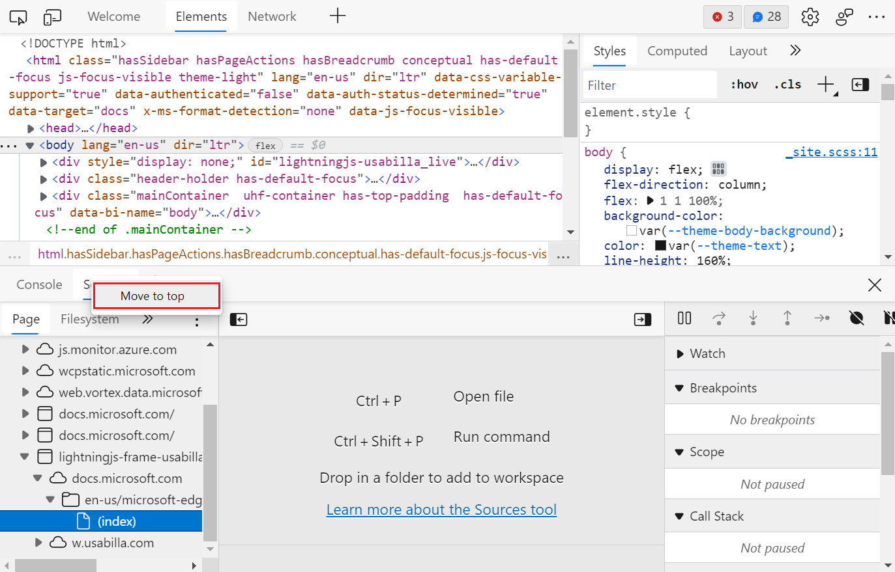
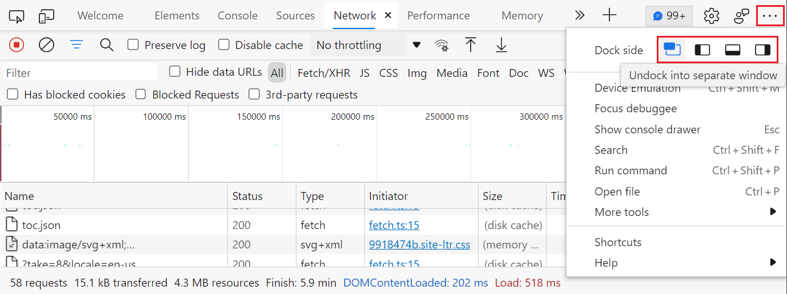
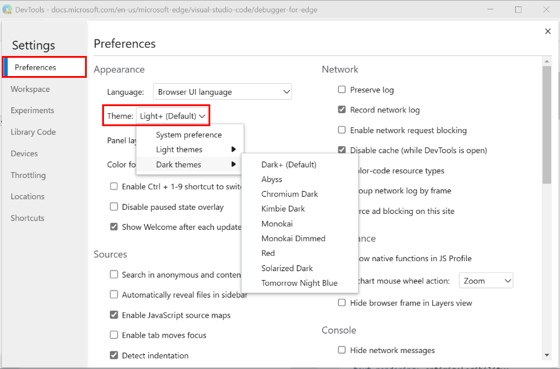

<!-- Copyright Kayce Basques

   Licensed under the Apache License, Version 2.0 (the "License");
   you may not use this file except in compliance with the License.
   You may obtain a copy of the License at

       https://www.apache.org/licenses/LICENSE-2.0

   Unless required by applicable law or agreed to in writing, software
   distributed under the License is distributed on an "AS IS" BASIS,
   WITHOUT WARRANTIES OR CONDITIONS OF ANY KIND, either express or implied.
   See the License for the specific language governing permissions and
   limitations under the License.  -->
# Customize DevTools

This page lists the ways to customize Microsoft Edge DevTools.

<!-- ====================================================================== -->
## Settings

**Settings** > **Preferences** contains many options for customizing DevTools.

To open Settings, in DevTools, click the **Settings** icon ().  Or, while DevTools has focus, press **F1**.

<!-- ====================================================================== -->
## Drawer

In the **Drawer** toolbar in the bottom of DevTools, you can select which tools to display.

To open (or close) the **Drawer**, press **Esc**.

You can move tools between the main panel and the drawer.

*  To move a tool from the drawer to the main panel, right-click a tool, and then select **Move to top**.

   

*  To move a tool from the main panel to the drawer, right-click a tool, and then select **Move to bottom**.

   

<!-- ====================================================================== -->
## Reorder tools

Click and drag a tool to change the ordering.  Your custom tool order persists across DevTools sessions.

By default, the **Network** tool is usually the fifth tab on the main toolbar.  In the following figure, the **Network** tool is being moved to become the first tab in the main toolbar.

<!-- ====================================================================== -->
## Open and close tools

To keep the DevTools interface streamlined, many of the tools aren't opened by default.  To open a tool in the main panel or the **Drawer**, click the **More Tools** () button to the right of the tabs, and then select a tool from the list.

To close a tool, select the **Close** () button in the tool's tab.

<!-- ====================================================================== -->
## Change where DevTools is docked in the browser

See [Change DevTools placement (Undock, Dock to bottom, Dock to left)](placement.md).

<!-- ====================================================================== -->
## Zoom DevTools in or out

See [Zoom DevTools in or out](../overview.md#zoom-devtools-in-or-out) in _Overview of DevTools_.

<!-- ====================================================================== -->
## Color themes

See [Apply a color theme to DevTools](theme.md).

<!-- ====================================================================== -->
## Restore default settings

To restore the default theme, placement, tools order, and any other customized settings, select **Settings** > **Preferences** > **Restore defaults and refresh**.

<!-- ====================================================================== -->
## Customize keyboard shortcuts

See [Customize keyboard shortcuts](../customize/shortcuts.md).

<!-- ====================================================================== -->
## Videos about Customizing the DevTools UI

#### Customizing Microsoft Edge Developer Tools and quick feature access

_Published on 5 May 2022._

Learn how to customize DevTools to fit your needs.

This video covers how to dock or undock DevTools, open new tools, and close those you don't need. It describes how to move tools in the bottom drawer and customize the text size and theme. The video also explains how you can use the Command Menu keyboard shortcuts to quickly customize DevTools.

#### Understand the DevTools user interface

_Published on 1 September 2022._

Understand how the Microsoft Edge DevTools UI is organized. If you are confused about what tools are available, and what the main parts of the DevTools interface do, this video will help get more comfortable.

In this video, we go over the UI structure, with its main toolbar and panel and its drawer area. We also go over how to find, open, and close tools, restore the default settings, and go over the list of available tools.

<!-- additional text, from Welcome panel, which includes 'customize': -->

Check out this video to learn about the main parts of the DevTools UI, how to customize it to meet your needs, learn about the different tools that are available, and where to go for help.

#### See also

* [Videos about web development with Microsoft Edge](../../dev-videos/index.md)

<!-- ====================================================================== -->
> [!NOTE]
> Portions of this page are modifications based on work created and [shared by Google](https://developers.google.com/terms/site-policies) and used according to terms described in the [Creative Commons Attribution 4.0 International License](https://creativecommons.org/licenses/by/4.0).
> The original page is found [here](https://developer.chrome.com/docs/devtools/customize/) and is authored by [Kayce Basques](https://developers.google.com/web/resources/contributors#kayce-basques) (Technical Writer, Chrome DevTools \& Lighthouse).

This work is licensed under a [Creative Commons Attribution 4.0 International License](https://creativecommons.org/licenses/by/4.0).
