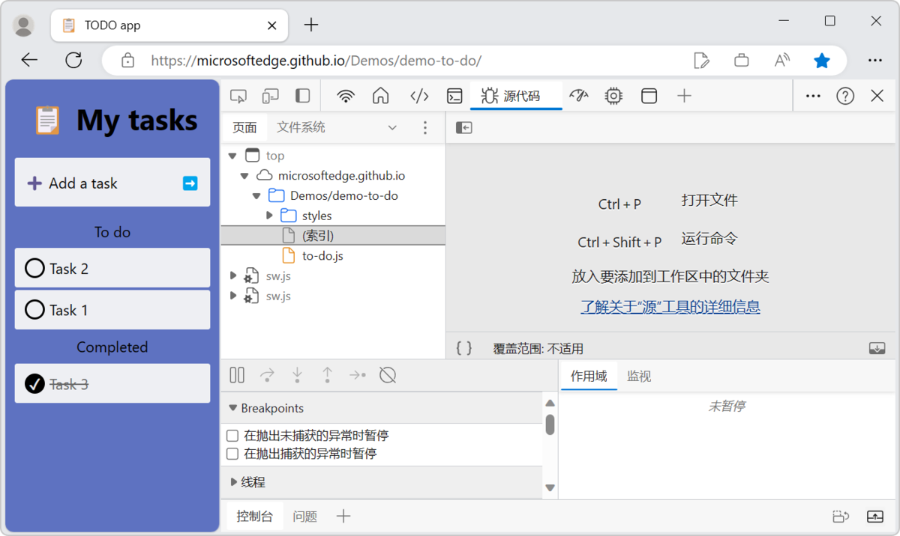

# Change DevTools language settings

Your Developer Tools matches your browser language by default, if it is one of the supported languages:

<!-- same order as UI, for ease of maint and matching what user sees: -->
* Czech - Čeština
* German - Deutsch
* English - English
* Spanish - espa&#241;ol
* French – fran&#231;ais
* Italian - italiano
* Japanese - &#26085;&#26412;&#35486;
* Korean - &#54620;&#44397;&#50612;
* Portuguese - portugu&#234;s
* Russian – &#1088;&#1091;&#1089;&#1089;&#1082;&#1080;&#1081;
* Vietnamese - Tiếng Việt
* Chinese (Simplified) - &#20013;&#25991;&#65288;&#31616;&#20307;&#65289;
* Chinese (Traditional) - &#20013;&#25991;&#65288;&#32321;&#39636;&#65289;

The DevTools UI in Chinese:

<!-- ====================================================================== -->
## Reverting the DevTools UI to English

To revert the UI text of DevTools to English:

1. In DevTools, click the **Customize and control DevTools** () button, and then click **Settings** ().  Or, while DevTools has focus, press **F1**.

1. On the left, make sure the **Preferences** page is selected.

1. In the **Preferences** page, in the **Appearance** section, locate the **Language** dropdown list, which is the first item at the top of the page.

1. In the **Language** dropdown list, select **Browser UI language**, which is the first menuitem in the dropdown list.  Or, select **English**.

   What the dropdown list looks like if your DevTools UI is currently English:

   

   What the dropdown list looks like if your DevTools UI is currently Japanese:

   

1. Click the **Close** (x) button in the upper right of the **Settings** panel, and then click the **Reload DevTools** button that temporarily appears at the top of DevTools.

   What the **Reload DevTools** button looks like when changing the DevTools UI from Japanese to English:

   

<!-- ====================================================================== -->
## Reverting all DevTools settings to the defaults

Caution: This removes all of your customizations of DevTools.

To revert all DevTools settings to the defaults, including the UI language:

1. In DevTools, click the **Customize and control DevTools** () button, and then click **Settings** ().  Or, while DevTools has focus, press **F1**.

1. On the left, make sure the **Preferences** page is selected.

1. At the bottom of the **Preferences** page, click the **Restore defaults and refresh** button.

1. Re-apply any custom settings and layout of DevTools that you want to restore.
