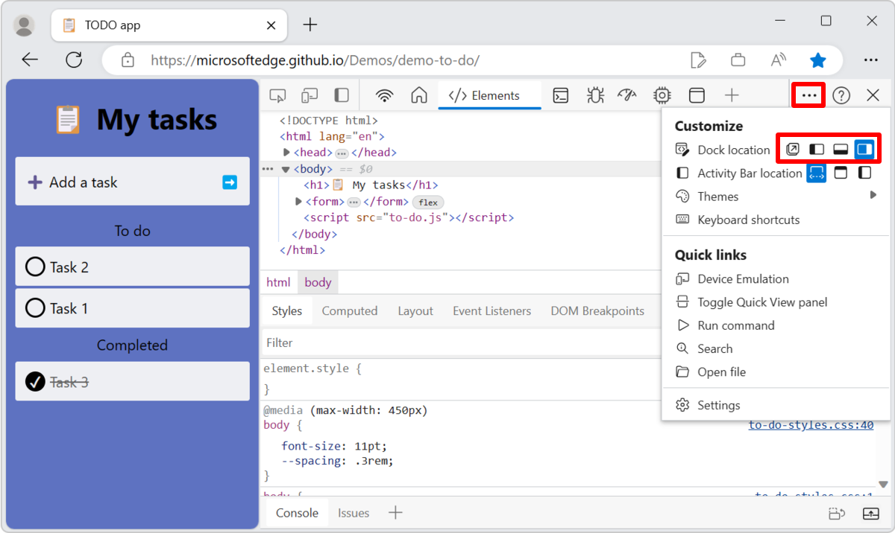
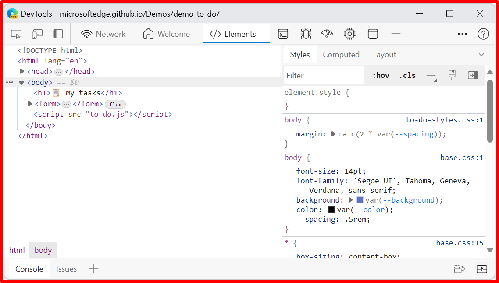
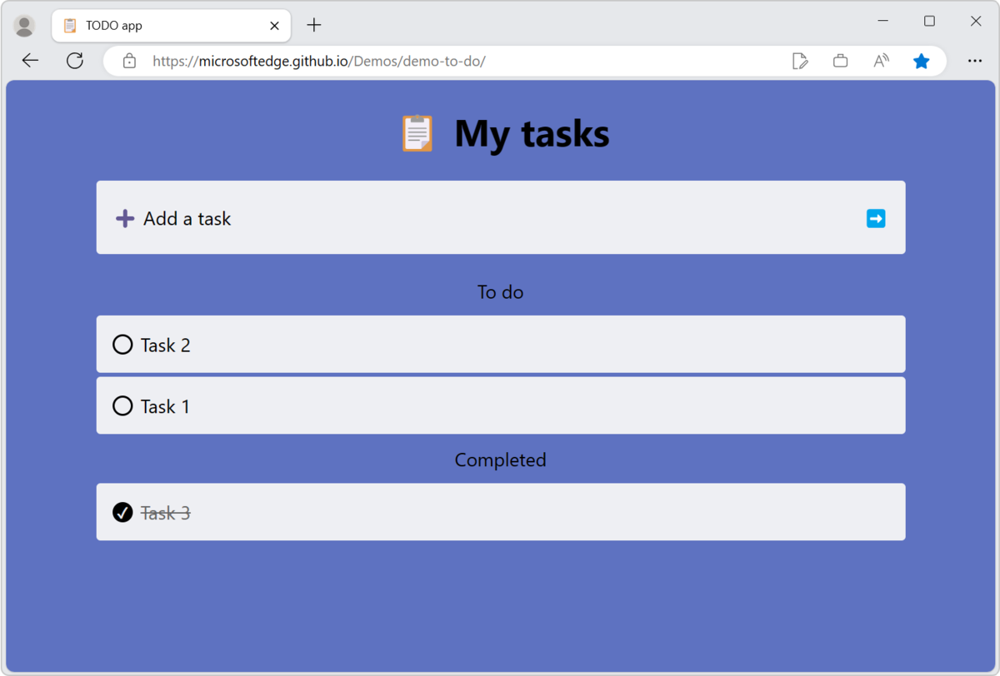
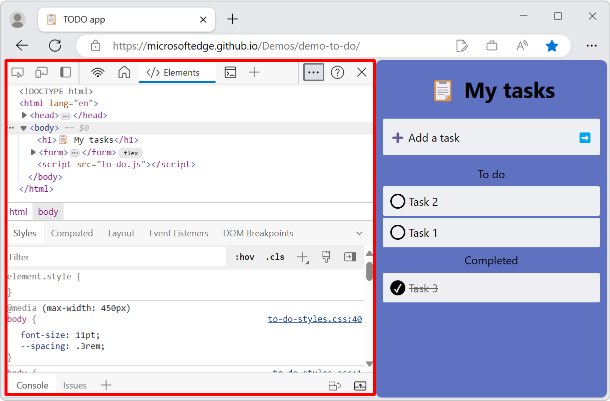
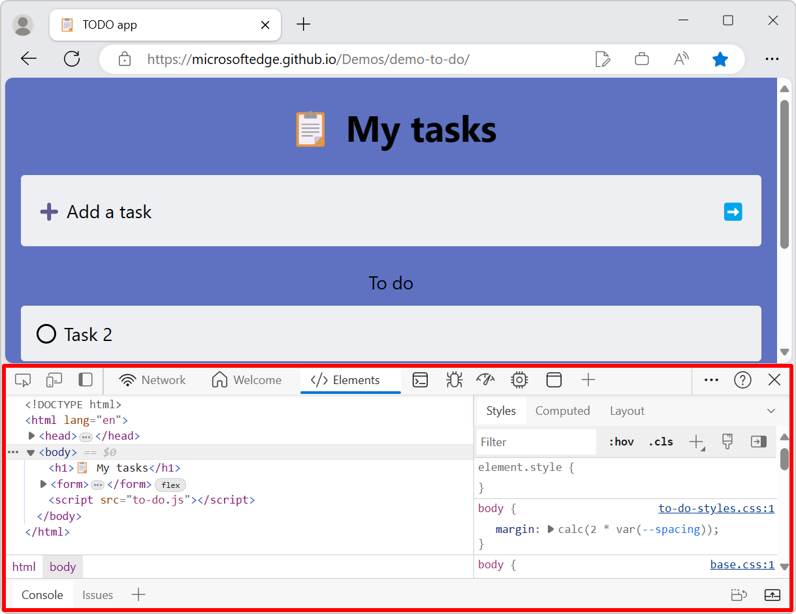
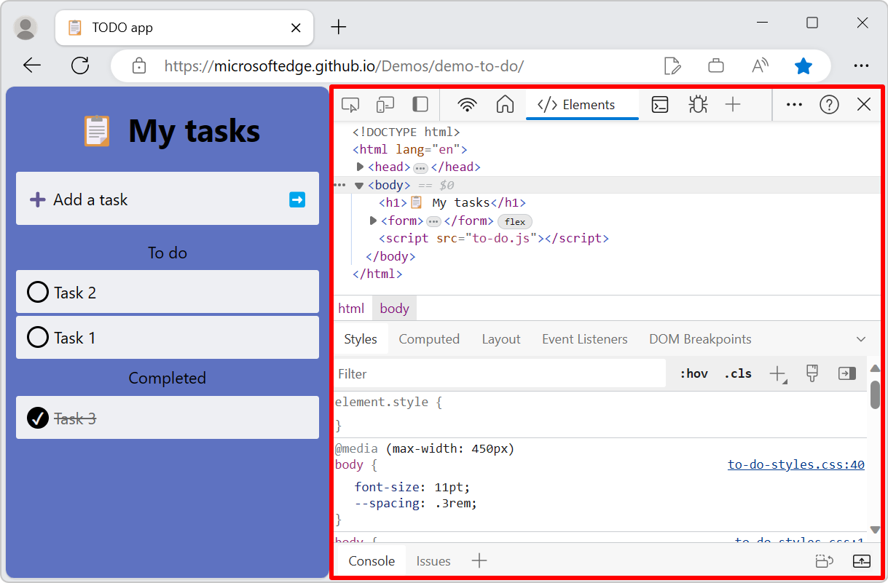

# Change DevTools placement (Undock, Dock to bottom, Dock to left)

You can change where DevTools is docked in the browser.  By default, Microsoft Edge DevTools is docked to the right of the browser window.  You can also dock DevTools to the bottom or left of the window, or undock DevTools to a separate window.

To change where DevTools is placed within the browser window:

*  Click the **Customize and control DevTools** () menu button, and then in the **Dock location** section, select a layout option:
   *  **Undock into separate window** ()
   *  **Dock to left** ()
   *  **Dock to bottom** ()
   *  **Dock to right** ()

**Dock to left** or **Dock to right** keeps DevTools side-by-side with your webpage, and is excellent when you [Emulate mobile devices (Device Emulation)](../device-mode/index.md).  The **Dock to left** and **Dock to right** options work best with high-resolution displays.

<!-- ====================================================================== -->
## Undock DevTools into a separate window

Undock DevTools into its own, separate window, when you want to work with several monitors, or if you need to work on a full-screen app and want a lot of space for the DevTools UI.  The following image shows DevTools undocked into its own, dedicated window:

Since DevTools now has its own dedicated window, the page that's being designed now occupies an entire browser window:

<!-- ====================================================================== -->
## Dock DevTools in the left side of the browser

The following image shows DevTools docked in the left side of the browser window:

<!-- ====================================================================== -->
## Dock DevTools in the bottom of the browser

**Dock to bottom** helps you when you don't have enough horizontal display space, or you want to debug long text in the DOM or **Console**.  The following image shows DevTools in the bottom of the browser window:

<!-- ====================================================================== -->
## Dock DevTools in the right side of the browser

The following image shows DevTools in the right side the browser window, which is the default location:

<!-- ====================================================================== -->
## Change where DevTools is docked by using the Command Menu

1. Open the Command Menu.  To do this, click the **Customize and control DevTools** () menu button, and then click **Run command**.  Or, press **Ctrl+Shift+P** (Windows/Linux) or **Command+Shift+P** (macOS).

1. Type **dock**, and then select a dock command:

    *  **Dock to bottom**
    *  **Dock to left**
    *  **Dock to right**
    *  **Restore last dock position**
    *  **Undock into separate window**
