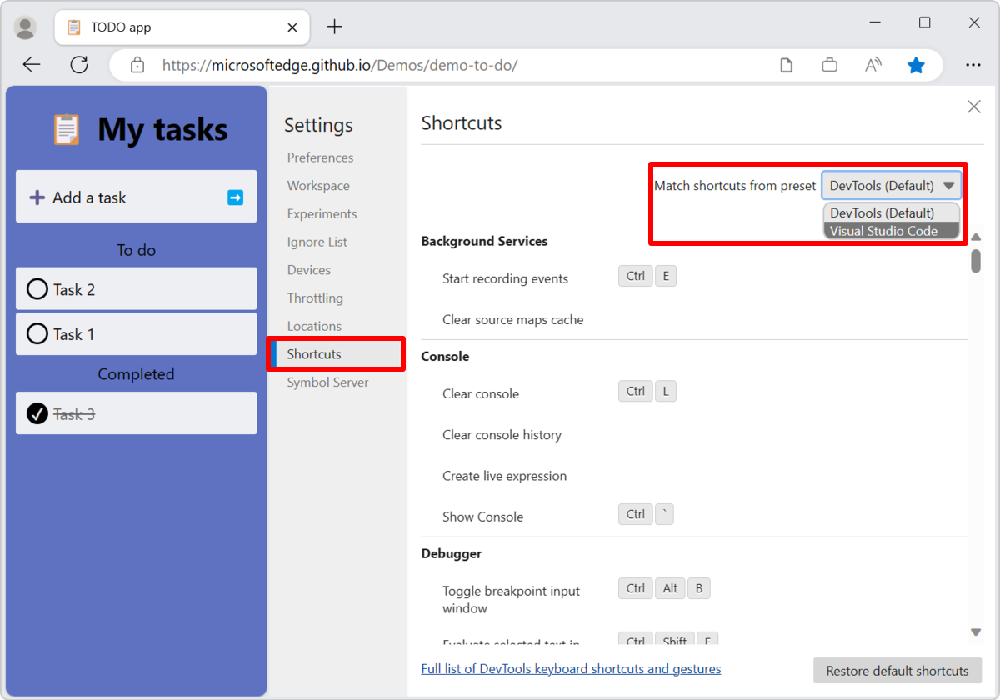

# Customize keyboard shortcuts

In the **Shortcuts** page of **Settings**, you can view the defined shortcuts for Microsoft Edge DevTools, define your own shortcut for a specific action, or use a preset to match the default shortcuts from Microsoft Visual Studio Code.

For the default keyboard shortcuts, see [Keyboard shortcuts](../shortcuts/index.md).

<!-- ====================================================================== -->
## Match keyboard shortcuts from Visual Studio Code

To match the keyboard shortcuts in Microsoft Edge DevTools to their equivalent actions in Visual Studio Code:

1. To open DevTools, right-click the webpage, and then select **Inspect**.  Or, press **Ctrl+Shift+I** (Windows, Linux) or **Command+Option+I** (macOS).  DevTools opens.

1. In DevTools, in the **Activity Bar**, click the **Customize and control DevTools** () button, and then click the **Settings** () button.  Or, press **F1**.

1. In the **Settings** panel, select the **Shortcuts** page.

1. In the upper right, in the **Match shortcuts from preset** dropdown list, select **Visual Studio Code** instead of **DevTools (Default)**:

   

For example, to pause or continue running a script in Visual Studio Code, you press **F5**.  But with the **DevTools (Default)** preset, to pause or continue running a script, you press **F8**.  When you change the preset to **Visual Studio Code**, you now also press **F5** in DevTools, just like in Visual Studio Code.

See also:
* [Microsoft Visual Studio Code](https://code.visualstudio.com)
* [Visual Studio Code Keyboard shortcuts for Windows](https://code.visualstudio.com/shortcuts/keyboard-shortcuts-windows.pdf) (PDF file)

<!-- ====================================================================== -->
## Edit the keyboard shortcut for a DevTools action

1. To open DevTools, right-click the webpage, and then select **Inspect**.  Or, press **Ctrl+Shift+I** (Windows, Linux) or **Command+Option+I** (macOS).  DevTools opens.

1. In DevTools, in the **Activity Bar**, click the **Customize and control DevTools** () button, and then click the **Settings** () button.  Or, press **F1**.

1. In the **Settings** panel, select the **Shortcuts** page.

1. Select the action you want to customize.  For example, in the **Debugger** section, click anywhere in the **Pause script execution** row.  The row becomes highlighted.

1. Click the **Edit shortcut** () icon:

   

1. To bind the shortcut keys to the action, make sure the text box next to the action has focus, and then use the keyboard to press the shortcut key combination.

1. To bind more than one shortcut combination to an action, click the **Add a shortcut** link, make sure the text box next to the action has focus, and then use the keyboard to press the additional shortcut key combination:

   

1. Click the **Confirm changes** () button:

   

<!-- ====================================================================== -->
## Icons and buttons

<!-- keep in same order as screenshot above: -->

| Tooltip and button icon | Description |
|---|---|
| **Edit shortcut** () | Modifies an existing shortcut. |
| **Remove shortcut** () | Removes a keyboard shortcut for an action while you are editing the keyboard shortcuts for an action. |
| The **Add a shortcut** link | Adds an additional keyboard shortcut for an action while you are editing the keyboard shortcuts for an action. |
| **Reset shortcuts for action** () | This icon displayed next to a checkbox indicates that you have customized the keyboard shortcut. |
| **Confirm changes** () | Saves a modified or added keyboard shortcut while you are editing the keyboard shortcuts for an action. |
| **Discard changes** () | Discards your changes while you are editing the keyboard shortcuts for an action. |
| The **Restore default shortcuts** button | Resets all shortcuts. |

<!-- ====================================================================== -->
## Assign a shortcut key combination that's already in use

If a keyboard shortcut is currently assigned to one action, it can't be assigned to another action.

To assign a shortcut key combination that's already in use:

1. Try to assign the shortcut key combination to the new action.  An error message says which action the shortcut is already assigned to.

1. Click the row for the action that already has the keyboard shortcut assigned to it.

1. Delete its keyboard shortcut.

1. Click the row for the action that you want to assign the shortcut key combination to.

1. Add that keyboard shortcut to the new action, as described above.

<!-- ====================================================================== -->
## See also

* [Keyboard shortcuts](../shortcuts/index.md)
* [Navigate DevTools with assistive technology](../accessibility/navigation.md)
* [Run commands in the Command Menu](../command-menu/index.md)
* [Customize DevTools](index.md#settings)
