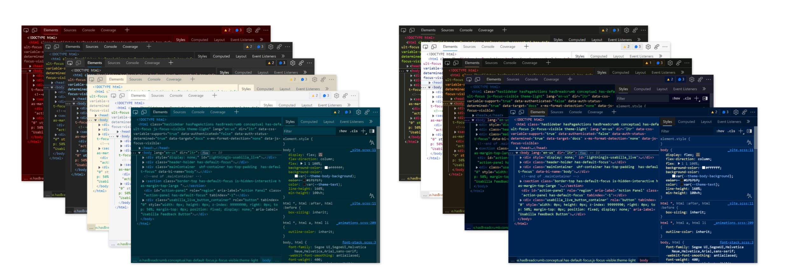
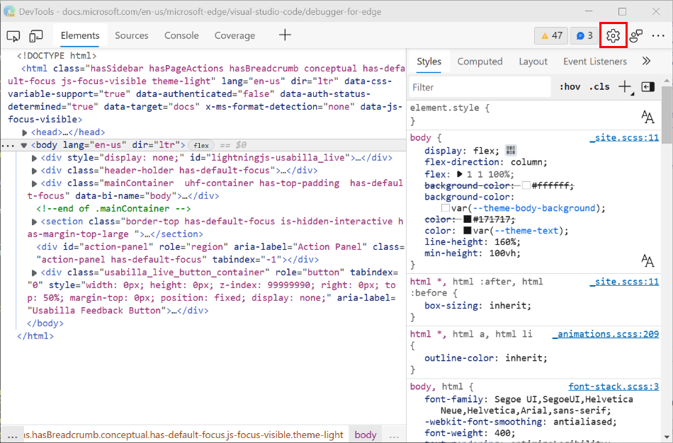
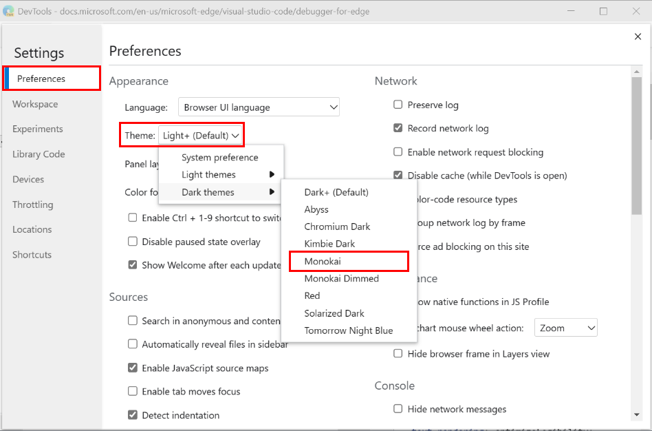
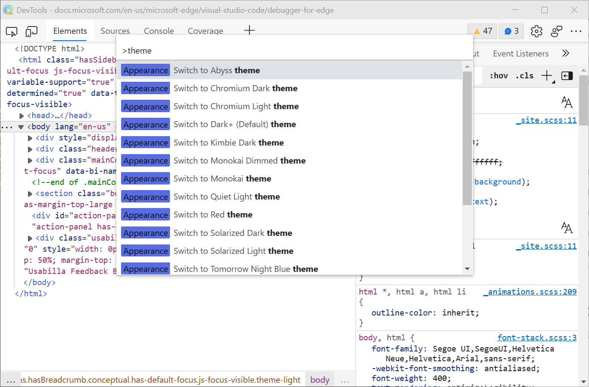

<!-- Copyright Kayce Basques
   Licensed under the Apache License, Version 2.0 (the "License");
   you may not use this file except in compliance with the License.
   You may obtain a copy of the License at
       https://www.apache.org/licenses/LICENSE-2.0
   Unless required by applicable law or agreed to in writing, software
   distributed under the License is distributed on an "AS IS" BASIS,
   WITHOUT WARRANTIES OR CONDITIONS OF ANY KIND, either express or implied.
   See the License for the specific language governing permissions and
   limitations under the License.  -->
# Apply a color theme to DevTools

You can apply various color themes to Microsoft Edge DevTools, including several themes from [Visual Studio Code](https://code.visualstudio.com), such as Monokai and Solarized Dark.  Themes affect the color of panes, buttons, and code syntax highlighting.

This article is about changing the appearance of DevTools.  To instead change how the webpage under development is displayed, see [Emulate dark or light schemes in the rendered page](../accessibility/preferred-color-scheme-simulation.md).

<!-- ====================================================================== -->
## Available themes

By default, the DevTools theme is set to **System preference** (also called **system preferred color theme**).  If your operating system is set to Light theme, DevTools uses the **Light+** theme.  If your operating system is set to Dark theme, DevTools uses the **Dark+** theme.  However, you can change DevTools to any of several other themes, so that DevTools isn't affected when you set the operating system to Light or Dark theme.

Light themes:
- Light+ (Default)
- Quiet Light
- Solarized Light

Dark themes:
- Dark+ (Default)
- Abyss
- Kimbie Dark
- Monokai
- Monokai Dimmed
- Red
- Solarized Dark
- Tomorrow Night Blue

<!-- ====================================================================== -->
## Changing the color theme from Settings

1. Open DevTools, and then select **Settings** (the gear icon).

   

1. Select **Preferences**, and then in the **Appearance** section, select a theme from the **Theme** dropdown list.

<!-- ====================================================================== -->
## Changing the color theme from the Command Menu

To use the Command Menu to change which color theme is applied to DevTools:

1. [Open the Command Menu](../command-menu/index.md).

1. Type `theme`, and then select an **Appearance** command, such as **Appearance: Switch to Abyss theme** or **Appearance: Switch to Light+ (Default) theme**.

1. Press `Enter`.

<!-- ====================================================================== -->
> [!NOTE]
> Portions of this page are modifications based on work created and [shared by Google](https://developers.google.com/terms/site-policies) and used according to terms described in the [Creative Commons Attribution 4.0 International License](https://creativecommons.org/licenses/by/4.0).
> The original page is found [here](https://developer.chrome.com/docs/devtools/customize/dark-theme/) and is authored by [Kayce Basques](https://developers.google.com/web/resources/contributors#kayce-basques) (Technical Writer, Chrome DevTools \& Lighthouse).

This work is licensed under a [Creative Commons Attribution 4.0 International License](https://creativecommons.org/licenses/by/4.0).
