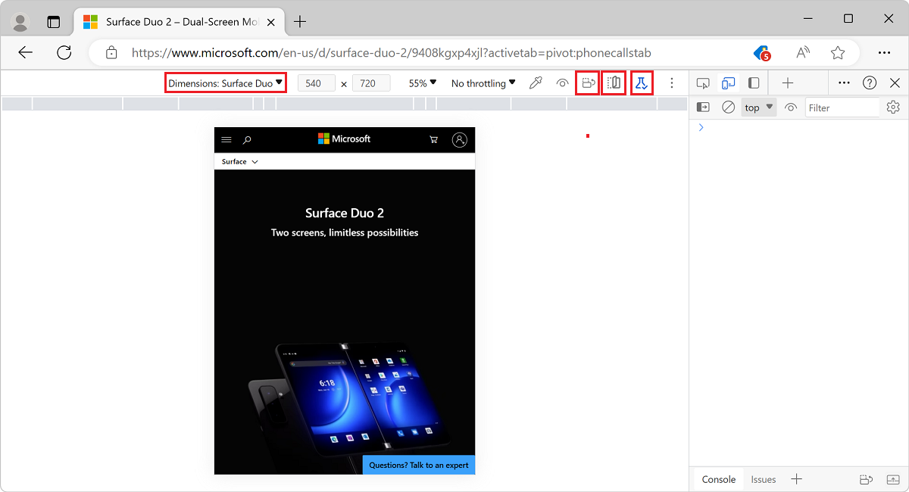

# Emulate dual-screen and foldable devices

You can emulate the following dual-screen and foldable devices in Microsoft Edge DevTools, using the Device Emulation feature of DevTools:

* [Surface Duo](https://www.microsoft.com/surface/devices/surface-duo)
* [Samsung Galaxy Fold](https://www.samsung.com/global/galaxy/galaxy-fold)

Emulate the devices and toggle between the following postures:

*  Single-screen or folded posture.
*  Dual-screen or unfolded posture.

<!-- ====================================================================== -->
## Test on foldable and dual-screen devices

When you emulate the [Surface Duo](https://www.microsoft.com/surface/devices/surface-duo) in a dual-screen posture in Microsoft Edge, the seam (the space between the two screens) is drawn over your website or app.

The emulated display matches the way your website (or app) renders in the [Microsoft Edge Android app](https://play.google.com/store/apps/details?id=com.microsoft.emmx) while running on [Surface Duo](https://www.microsoft.com/surface/devices/surface-duo).  You may have to update your website (or app) to display better along the seam.  For more information about adapting your website (or app) to the seam, see [How to work with the seam](/dual-screen/introduction#how-to-work-with-the-seam).

The [Device Toolbar](../device-mode/index.md#simulate-a-mobile-viewport) has additional features to help you test your website or app in multiple postures and orientations.  Click **Rotate** () to rotate the viewport to landscape orientation. Combine the feature with **Span** () to toggle between single-screen or folded and dual-screen or unfolded postures.  Together, the features allow you to test your website or app in all four possible postures and orientations.

The **Experimental Web Platform features** () icon displays the state of the **Experimental Web Platform features** flag.  If the flag is turned on, the icon is highlighted.  If the flag is turned off, the icon isn't highlighted.  To turn on (or off) the flag, either click the icon or go to `edge://flags` and toggle the flag.

### Known issues

#### Pointer shaking or stuttering

When you use a [Microsoft Remote Desktop client](/windows-server/remote/remote-desktop-services/clients/remote-desktop-clients) to connect to a remote PC and emulate the [Surface Duo](https://www.microsoft.com/surface/devices/surface-duo) or [Samsung Galaxy Fold](https://www.samsung.com/global/galaxy/galaxy-fold), the pointer may shake or stutter.  If you run into the issue, contact the Microsoft Edge DevTools team.

<!-- ====================================================================== -->
## Additional Resources

Here are additional resources that may help you enhance your website (or app) for dual-screen devices.

*  For more information about web development on dual-screen devices, see [Dual-screen web experiences](/dual-screen/web/index).

*  Install the [Surface Duo emulator](/dual-screen/android/use-emulator).  The Surface Duo emulator is different from the emulator in Microsoft Edge, runs Android, and integrates with [Android Studio](https://developer.android.com/studio/).  See [Get the Surface Duo SDK](/dual-screen/android/get-duo-sdk).
