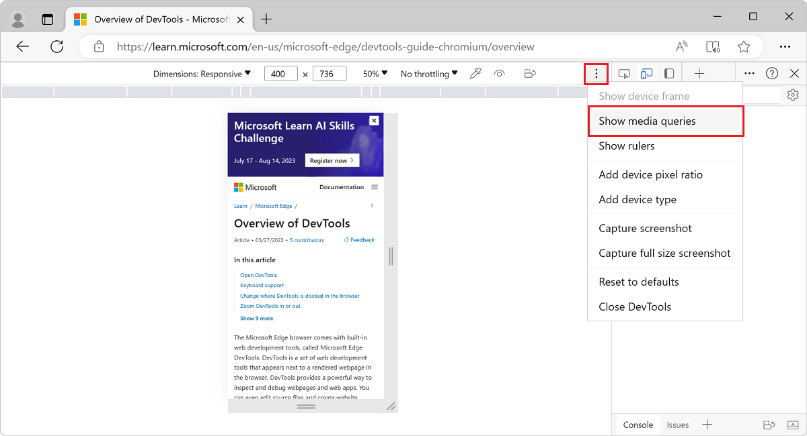
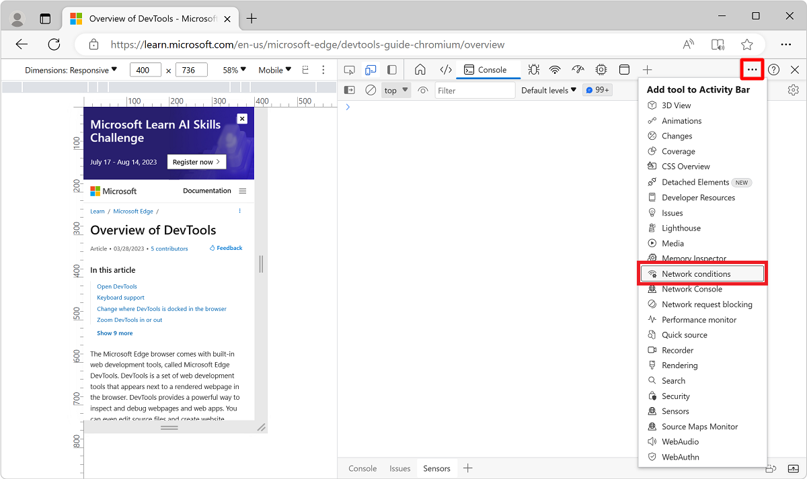
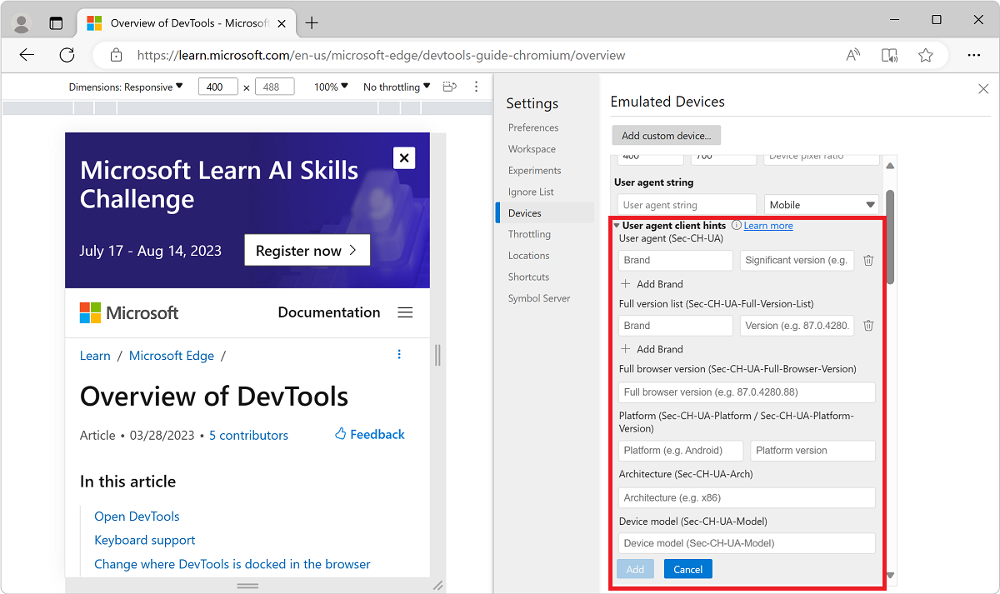

<!-- Copyright Kayce Basques

   Licensed under the Apache License, Version 2.0 (the "License");
   you may not use this file except in compliance with the License.
   You may obtain a copy of the License at

       https://www.apache.org/licenses/LICENSE-2.0

   Unless required by applicable law or agreed to in writing, software
   distributed under the License is distributed on an "AS IS" BASIS,
   WITHOUT WARRANTIES OR CONDITIONS OF ANY KIND, either express or implied.
   See the License for the specific language governing permissions and
   limitations under the License.  -->
# Emulate mobile devices (Device Emulation)

Use the **Device Emulation** tool, sometimes called _Device Mode_, to approximate how your page looks and behaves on a mobile device.

**Detailed contents:**<!--July 27, 2023. compare page toc at https://developer.chrome.com/docs/devtools/device-mode/-->
* [Limitations](#limitations)
* [Simulate a mobile viewport](#simulate-a-mobile-viewport)
   * [Responsive Viewport Mode](#responsive-viewport-mode)
      * [Show media queries](#show-media-queries)
      * [Set the device type](#set-the-device-type)
   * [Mobile Device Viewport Mode](#mobile-device-viewport-mode)
      * [Rotate the viewport to landscape orientation](#rotate-the-viewport-to-landscape-orientation)
      * [Show device frame](#show-device-frame)
      * [Add a custom mobile device](#add-a-custom-mobile-device)
   * [Show rulers](#show-rulers)
   * [Zoom the viewport](#zoom-the-viewport)
* [Throttle the network and CPU](#throttle-the-network-and-cpu)
   * [Throttle the CPU only](#throttle-the-cpu-only)
   * [Throttle the network only](#throttle-the-network-only)
* [Emulate sensors](#emulate-sensors)
   * [Override geolocation](#override-geolocation)
   * [Set orientation](#set-orientation)
* [Set the user agent string](#set-the-user-agent-string)
* [Set user-agent client hints](#set-user-agent-client-hints)

<!-- ====================================================================== -->
## Limitations

**Device Emulation** is a [first-order approximation](https://wikipedia.org/wiki/Order_of_approximation#First-order) of the look and feel of your page on a mobile device.  **Device Emulation** doesn't actually run your code on a mobile device.  Instead, you simulate the mobile user experience from your laptop or desktop.

Some aspects of mobile devices aren't emulated in DevTools.  For example, the architecture of mobile CPUs is different than the architecture of laptop or desktop CPUs.  For the most robust testing, run your page on a mobile device.

Use [Remote Debugging](../remote-debugging/index.md) to interact with the code of a page from your machine while your page actually runs on a mobile device.  You can view, change, debug, profile, or all four while you interact with the code.  Your machine can be a notebook or desktop computer.

<!-- ====================================================================== -->
## Simulate a mobile viewport

To open the UI that enables you to simulate a mobile viewport:

1. Open DevTools.  For example, right-click in a webpage and then select **Inspect**.

1. In the **Activity Bar**, click the **Toggle device emulation** () button.  Or, in DevTools, select **Customize and control DevTools** (`...`) > **Device Emulation**:

   

   The webpage is rendered within the Device Emulation pane.  The Device Toolbar opens in Responsive Viewport Mode.

<!-- ------------------------------ -->
#### Responsive Viewport Mode

To quickly test the look and feel of your page across multiple screen sizes, drag the handles to resize the viewport to your required dimensions.  You can enter any numeric values in the width and height boxes.  If you select a size larger than available in the browser window, the viewport will be automatically scaled to accommodate for the larger viewport.

In the following example, the viewport width is set to `400` and the height is set to `736`:

If you need more space on your screen, you can change where DevTools is docked in the browser window.  See [Change DevTools placement (Undock, Dock to bottom, Dock to left)](/microsoft-edge/devtools-guide-chromium/customize/placement).

<!-- ------------------------------ -->
#### Show media queries

If you have defined media queries on your page, jump to the viewport dimensions where those media queries take effect by showing media query breakpoints above your viewport.  Select **More options** () > **Show media queries**.

A CSS _media query_ defines a breakpoint, which is a browser viewport width.  A webpage can define a responsive layout for each breakpoint (viewport width) that the webpage's CSS defines.

Media queries can be used to change the layout of a page when the viewport of the device that the webpage is viewed on is over or under a certain width.  Media queries allow you to write code to use for page layout either when the screen width is under a certain size, or over a certain size, or within a mininum and maximum size.<!-- optional todo: condense -->

To show media query breakpoints above the viewport:

1. Click the **More options** () button, and then select **Show media queries**:

   
   <!-- https://microsoftedge.github.io/Demos/devtools-a11y-testing/ -->

   If `max-width` or `min-width` breakpoints are defined by the webpage, DevTools displays additional bars above the viewport:
   *  The blue bar corresponds to `max-width` media queries.
   *  The green bar corresponds to media queries that use both `min-width` and `max-width`.
   *  The orange bar corresponds to `min-width` media queries.

   

1. To change the width of the viewport so that the media query for that breakpoint is used, click a breakpoint rectangle in the breakpoints bar.  The viewport's width changes so that the breakpoint gets triggered, and the webpage layout is updated.

1. To go to the corresponding `@media` declaration in the code for the webpage, right-click between breakpoint vertical bars, and then select **Reveal in source code**.  DevTools opens the **Sources** tool and displays the corresponding `@media` line in the **Editor**.

See also:
* [Debug media queries](../css/index.md#debug-media-queries) in _Get started viewing and changing CSS_.

<!-- ------------------------------ -->
#### Set device pixel ratio

[Device pixel ratio (DPR)](https://developer.mozilla.org/docs/Web/API/Window/devicePixelRatio) is the ratio between physical pixels on the hardware screen and logical (CSS) pixels.  In other words, DPR tells the browser how many screen pixels to use to draw a CSS pixel.  Microsoft Edge uses the DPR value when drawing on HiDPI (High Dots Per Inch) displays.

To set a device pixel ratio:

1. Select **More options** () > **Add device pixel ratio**:

   

   A **DPR** dropdown list is added at the top of the viewport.

1. In the **DPR** dropdown list, select a DPR value (**1**, **2**, or **3**).  The default value is **2**.

To remove the device pixel ratio:

* Select **More options** () > **Remove device pixel ratio**.

<!-- ------------------------------ -->
#### Set the device type

To simulate a mobile device or desktop device, use the **Device Type** list:

If the **Device Type** list isn't displayed, select **More options** > **Add device type**.

The **Device Type** list contains the following device types:

| Device type | Rendering method | Cursor icon | Events triggered |
|:--- |:--- |:--- |:--- |
| **Mobile** | Mobile | Circle | `touch` |
| **Mobile (no touch)** | Mobile | Normal | `click` |
| **Desktop** | Desktop | Normal | `click` |
| **Desktop (touch)** | Desktop | Circle | `touch` |

Key for columns in the above table:

| Column | Description |
|---|---|
| **Rendering method** | Whether Microsoft Edge renders the page as a mobile or desktop viewport. |
| **Cursor icon** | What type of cursor is displayed when you hover on the page. |
| **Events triggered** | Whether the page triggers `touch` or `click` events when you interact with the page. |

<!-- ------------------------------ -->
#### Mobile Device Viewport Mode

To simulate the dimensions of a specific mobile device, select the device from the **Device** list:

<!-- ------------------------------ -->
#### Rotate the viewport to landscape orientation

Test your webpage in landscape orientation.

1. To rotate the viewport to landscape orientation, select **Rotate** ():

   

   The **Rotate** button disappears if your **Device Toolbar** is narrow.

See also [Set orientation](#set-orientation), below.

<!-- ------------------------------ -->
#### Show device frame

To simulate the dimensions of a specific mobile device, click **More options** (), and then select **Show device frame** to show the physical device frame around the viewport:

If a device frame isn't shown for a particular device, it means that DevTools doesn't have art for that device.

The device frame for the iPhone 6/7/8:

<!-- ------------------------------ -->
#### Add a custom mobile device

If the mobile device option that you need isn't included on the default list, you can add a custom device.  

To add a custom device:

1. In DevTools, click the **Toggle device emulation** () button to turn on device emulation.

1. In the device dropdown list on the left,<!--no tooltip--> select the **Edit** menuitem:

1. Select the **Device** list > **Edit**:

   

   The DevTools **Settings** > **Devices** (**Emulated Devices**) page opens.

1. Click the **Add custom device** button.  The **Emulated Devices** page in settings adds a **Device** section at the top:

   The [device pixel ratio](https://developer.mozilla.org/docs/Web/API/Window/devicePixelRatio), [user agent string](https://developer.mozilla.org/docs/Glossary/User_agent), and [device type](#set-the-device-type) fields are optional.  The device type defaults to **Mobile**:

   

1. In the **Device** section, in the text boxes, enter a device name, screen width, and screen height for the custom device.

1. Optionally, fill in the following fields:

   * **Device pixel ratio**.  See [Set device pixel ratio](#set-device-pixel-ratio), above; and [Window: devicePixelRatio property](https://developer.mozilla.org/docs/Web/API/Window/devicePixelRatio), at MDN.

   * **User agent string**.  See [Set the user agent string](#set-the-user-agent-string), below; and [User agent](https://developer.mozilla.org/docs/Glossary/User_agent), at MDN.

   * **User agent type** (device type).  See [Set the device type](#set-the-device-type), above.  Defaults to **Mobile**.

1. Click the **Add** button.  The new device is now available in the device dropdown list in the upper left of the device emulator.

To remove a custom device:

* In DevTools > **Settings** > **Devices** (**Emulated Devices**), hover over the custom device name, and then click the trashcan icon.

<!-- ------------------------------ -->
#### Show rulers

If you need to measure screen dimensions, you can use rulers to measure the screen size in pixels.

To display rulers above and to the left of your viewport:

*  Select **More options** () > **Show rulers**:

   

   Rulers appear above and to the left of the viewport, indicating dimensions in pixels:

   

<!-- ------------------------------ -->
#### Zoom the viewport

To test the look and feel of your page at multiple zoom levels, use the **Zoom** list to zoom in or out.

<!-- ------------------------------ -->
#### Capture a screenshot

To capture a screenshot of what you currently see in the viewport, click **More options** () > **Capture screenshot**:

To capture a screenshot of the whole page including the content that isn't currently visible in the viewport, select **Capture a full size screenshot** from the same menu.

<!-- ====================================================================== -->
## Throttle the network and CPU

Mobile devices often have network and CPU constraints.

To test how quickly your page loads and how it responds at different internet and CPU speeds:

*  In the **Throttle** list, change the preset to **Mid-tier mobile** or **Low-end mobile**:

   

   If the **Throttle list** is hidden, widen the **Device Toolbar**.

*  **Mid-tier mobile** simulates `fast 3G` and throttles your CPU.  It is four times slower than normal.
*  **Low-end mobile** simulates `slow 3G` and throttles your CPU.  It is six times slower than normal.

All of the throttling is based upon the normal capability of your laptop or desktop.

<!-- ------------------------------ -->
#### Throttle the CPU only

To throttle the CPU only, and not the network:

1. In DevTools, select the **Performance** tool.

1. Click the **Capture settings** () button in the upper right.

1. In the **CPU** dropdown list, select **4x slowdown** or **6x slowdown**:

   

<!-- ------------------------------ -->
#### Throttle the network only

To throttle the network only and not the CPU:

1. Select the **Network** tool, then select **Online** > **Fast 3G** or **Slow 3G**.

   

    Or, press **Ctrl+Shift+P** (Windows, Linux) or **Command+Shift+P** (macOS) to open the **Command Menu**, start typing `3g`, and then select **Enable fast 3G throttling** or **Enable slow 3G throttling**.

   

You can also set network throttling from within the **Performance** tool:

1. Select **Capture Settings** () and select the **Network** list and change the preset to **Fast 3G** or **Slow 3G**.

   

<!-- ====================================================================== -->
## Emulate sensors

Use the **Sensors** tab to override geolocation, simulate device orientation, force touch, and emulate idle state.

The sections below provide a quick look on how to override geolocation and set device orientation.
<!-- For a complete list of features, see [Emulate device sensors](). -->

<!-- ------------------------------ -->
#### Override geolocation

Use the **Sensors** tool to override geolocation and simulate device orientation.

<!-- ------------------------------ -->
#### Override geolocation

If your page depends on geolocation information from a mobile device to render properly, provide different geolocations using the geolocation-overriding UI.

1. In the **Activity Bar**, click the **More tools** () button, and then click **Sensors**:

   

    Or, open the Command Menu by selecting **Ctrl+Shift+P** (Windows, Linux) or **Command+Shift+P** (macOS).  Type `Sensors` and then select **Show Sensors**:

   

1. Select the **Location** dropdown menu, and then select one of the preset locations:

   

To enter a custom location, select **Other** and enter the coordinates of your custom location.

To test how your page behaves when location information is unavailable, select **Location unavailable**.

See also:
* [Override geolocation with the Sensors tool](./geolocation.md)

<!-- ------------------------------ -->
#### Set orientation

If your page depends on orientation information from a mobile device to render properly, open the orientation UI.

To set the device orientation:

1. In the **Activity Bar**, click the **More tools** () button, and then click **Sensors**:

   

   Or, open the Command Menu by pressing **Ctrl+Shift+P** (Windows, Linux) or **Command+Shift+P** (macOS).  Type `Sensors`, and then select **Show Sensors**:

   

1. In the **Orientation** dropdown menu, select a preset orientation.

   Or, to enter your own orientation, select **Custom orientation**, and enter your own [alpha](https://developer.mozilla.org/docs/Web/API/DeviceOrientationEvent/alpha), [beta](https://developer.mozilla.org/docs/Web/API/DeviceOrientationEvent/beta), and [gamma](https://developer.mozilla.org/docs/Web/API/DeviceOrientationEvent/gamma) values:

   

See also:
* [Simulate device orientation with the Sensors tool](./orientation.md)

<!-- ====================================================================== -->
## Set the user agent string

If your page depends on the user agent string from a mobile device to render properly, use the **Network conditions** tool to specify a different user agent string.

To set the user agent string:

1. Select **More tools** (**+**) > **Network conditions**:

   

   Or, open the Command Menu by pressing **Ctrl+Shift+P** (Windows, Linux) or **Command+Shift+P** (macOS).Type `Network conditions`, and select **Show Network conditions**:

   

1. In the **User agent** section of the **Network conditions** tool, clear the **Use browser default** checkbox.

1. To select from a list of predefined user agent strings, click the menu that initially reads **Custom**.

   Or, to enter your own user agent string, enter the string in the **Enter a custom user agent** text box:

   
<!-- todo: remove "macos" from filename, or show such a user agent string -->

See also:
* [Override the user agent string](override-user-agent.md)

<!-- ====================================================================== -->
## Set user-agent client hints

If your site employs [user-agent client hints](../../web-platform/user-agent-guidance.md), use the **Emulated Devices** tool to add devices and set user-agent client hints:

1. Right-click in a webpage and then select **Inspect**.

1. Select **Settings** > **Devices**.  The **Emulated Devices** page of **Settings** opens.

1. Click the **Add custom device** button, and then expand **user-agent client hints**:

   

1. Type a unique name in the **Device Name** text box such as `Test101`.

1. Accept the default values or change **Width**, **Height**, and **Device pixel ratio** as needed.

1. Set user-agent client hints as follows:
    *  **Brand** and **Version**, such as *Edge* and *92*.  Select **+ Add Brand** to add multiple brand and version pairs.
    *  **Full Browser Version** such as *92.0.1111.0*.
    *  **Platform** and **Version** such as *Windows* and *10.0*.
    *  **Architecture** such as *x86*.
    *  **Device model** such as *Galaxy Nexus*.

   You can set or change any of the user-agent client hints.  There are no required values.

1. Click **Add**.  The new device is displayed in the selected state at the top of the **Emulated Devices** list.

You can also set user-agent client hints in the **Network** tool; see [Network features reference](../network/reference.md).

<!-- ====================================================================== -->
> [!NOTE]
> Portions of this page are modifications based on work created and [shared by Google](https://developers.google.com/terms/site-policies) and used according to terms described in the [Creative Commons Attribution 4.0 International License](https://creativecommons.org/licenses/by/4.0).
> The original page is found [here](https://developer.chrome.com/docs/devtools/device-mode/) and is authored by [Kayce Basques](https://developers.google.com/web/resources/contributors#kayce-basques) (Technical Writer, Chrome DevTools \& Lighthouse).

This work is licensed under a [Creative Commons Attribution 4.0 International License](https://creativecommons.org/licenses/by/4.0).
