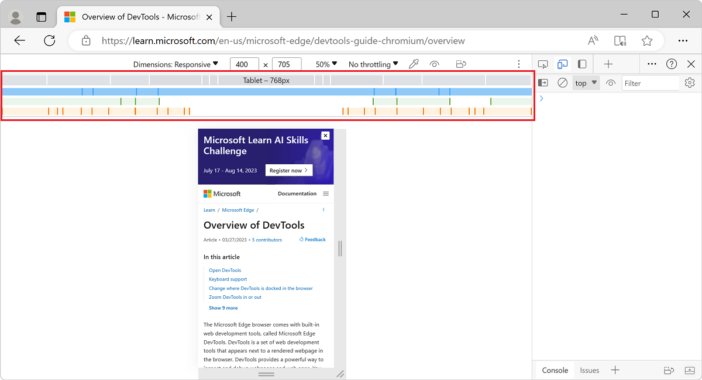
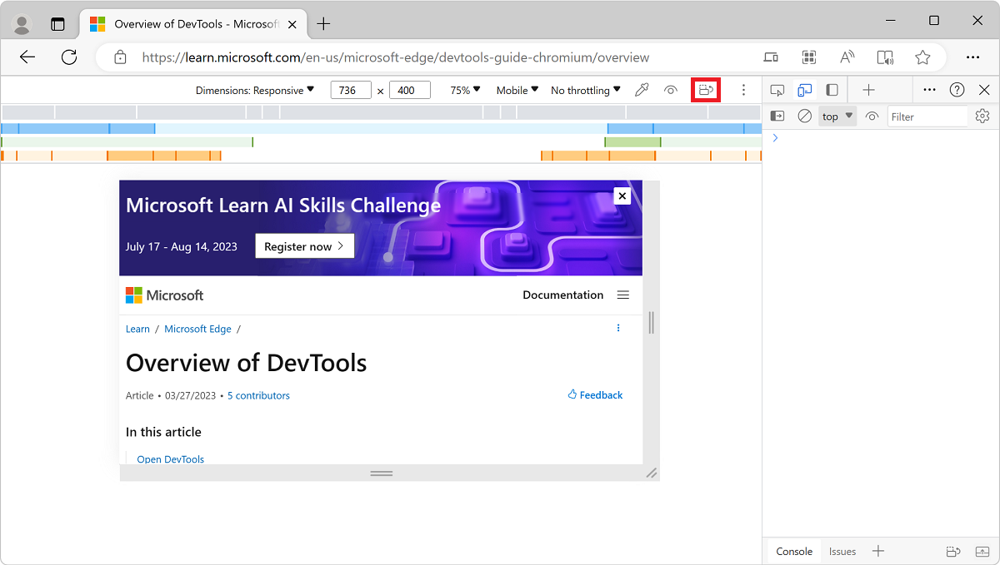
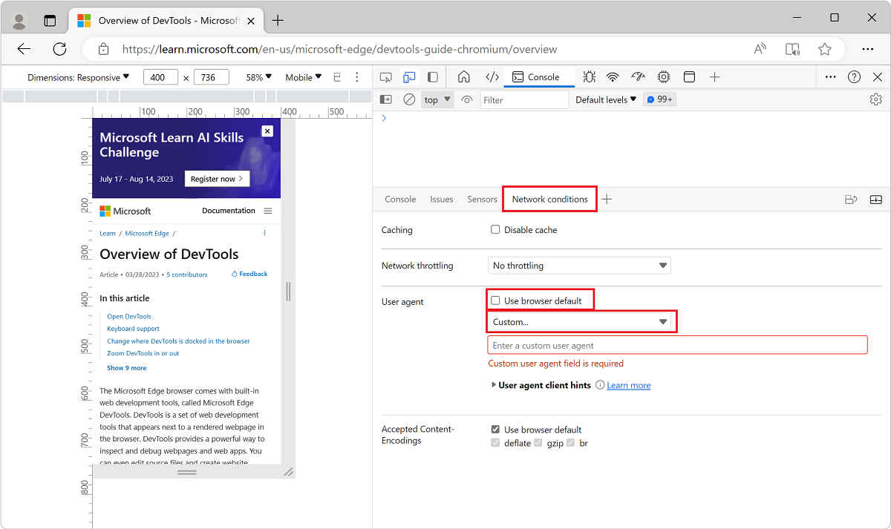

<!-- Copyright Kayce Basques

   Licensed under the Apache License, Version 2.0 (the "License");
   you may not use this file except in compliance with the License.
   You may obtain a copy of the License at

       https://www.apache.org/licenses/LICENSE-2.0

   Unless required by applicable law or agreed to in writing, software
   distributed under the License is distributed on an "AS IS" BASIS,
   WITHOUT WARRANTIES OR CONDITIONS OF ANY KIND, either express or implied.
   See the License for the specific language governing permissions and
   limitations under the License.  -->
# Emulate mobile devices (Device Emulation)

Use the **Device Emulation** tool, sometimes called _Device Mode_, to approximate how your page looks and responds on a mobile device.

DevTools provides the following mobile device emulation features:

* [Simulate a mobile viewport](#simulate-a-mobile-viewport)
* [Throttle the network](#throttle-the-network-only)
* [Throttle the CPU](#throttle-the-cpu-only)
* [Override geolocation](#override-geolocation)
* [Set orientation](#set-orientation)
* [Set the user agent string](#set-the-user-agent-string)
* [Set user-agent client hints](#set-user-agent-client-hints)

<!-- ====================================================================== -->
## Limitations

**Device Emulation** is a [first-order approximation](https://en.wikipedia.org/wiki/Order_of_approximation#First-order) of the look and feel of your page on a mobile device.  **Device Emulation** doesn't actually run your code on a mobile device.  Instead, you simulate the mobile user experience from your laptop or desktop.

Some aspects of mobile devices are never emulated in DevTools.  For example, the architecture of mobile CPUs is different than the architecture of laptop or desktop CPUs.  When in doubt, your best bet is to actually run your page on a mobile device.

Use [Remote Debugging](../remote-debugging/index.md) to interact with the code of a page from your machine while your page actually runs on a mobile device.  You can view, change, debug, profile, or all four while you interact with the code.  Your machine can be a notebook or desktop computer.

<!-- ====================================================================== -->
## Simulate a mobile viewport

Select **Toggle device emulation** () or select **Customize and control DevTools** (`...`) > **Device Emulation** to open the UI that enables you to simulate a mobile viewport.

By default the Device Toolbar opens in Responsive Viewport Mode.

### Responsive Viewport Mode

To quickly test the look and feel of your page across multiple screen sizes, drag the handles to resize the viewport to your required dimensions.  You can enter any numeric values in the width and height boxes.  If you select a size larger than available in the browser window, the viewport will be automatically scaled to accommodate for the larger viewport.

In the following figure, the width is set to `400` and the height is set to `736`.

If you need more space on your screen, you can always change the position of DevTools as explained in [Change DevTools placement (Undock, Dock to bottom, Dock to left)](/microsoft-edge/devtools-guide-chromium/customize/placement).

#### Show media queries

If you have defined media queries on your page, jump to the viewport dimensions where those media queries take effect by showing media query breakpoints above your viewport.  Select **More options** > **Show media queries**.

Select a breakpoint to change the width of the viewport so that the media query gets triggered.

#### Set the device type

Use the **Device Type** list to simulate a mobile device or desktop device.

The following table describes the differences between the available device type options.  The Rendering method column refers to whether Microsoft Edge renders the page as a mobile or desktop viewport.  The Cursor icon column refers to what type of cursor is displayed when you hover on the page.  The Events triggered column refers to whether the page triggers `touch` or `click` events when you interact with the page.

| Option | Rendering method | Cursor icon | Events triggered |
|:--- |:--- |:--- |:--- |
| Mobile | Mobile | Circle | `touch` |
| Mobile (no touch) | Mobile | Normal | `click` |
| Desktop | Desktop | Normal | `click` |
| Desktop (touch) | Desktop | Circle | `touch` |

> [!NOTE]
> If the **Device Type** list isn't displayed, select **More options** > **Add device type**.

### Mobile Device Viewport Mode

To simulate the dimensions of a specific mobile device, select the device from the **Device** list.

#### Rotate the viewport to landscape orientation

Test your webpage in landscape orientation.

1. To rotate the viewport to landscape orientation, select **Rotate** ():

   

   The **Rotate** button disappears if your **Device Toolbar** is narrow.

1. If needed, to access the **Rotate** button, increase the width of the **Device Toolbar**.

   

See also [Set orientation](#set-orientation), below.

#### Show device frame

To simulate the dimensions of a specific mobile device, open **More options** and then select **Show device frame** to show the physical device frame around the viewport.

If a device frame isn't shown for a particular device, it means that DevTools doesn't have art for that device.

The device frame for the iPhone 6/7/8:

#### Add a custom mobile device

If the mobile device option that you need isn't included on the default list, you can add a custom device.  To add a custom device:

1. Select the **Device** list > **Edit**.

   

1. Select **Add custom device**.

1. On **Emulated Devices**, enter a device name, screen width, and screen height for the custom device.  The [device pixel ratio](https://developer.mozilla.org/docs/Web/API/Window/devicePixelRatio), [user agent string](https://developer.mozilla.org/docs/Glossary/User_agent), and [device type](#set-the-device-type) fields are optional.  The device type field defaults to **Mobile**.

   

### Show rulers

If you need to measure screen dimensions, you can use rulers to measure the screen size in pixels.  Select **More options** > **Show rulers** to display rulers above and to the left of your viewport.

Rulers appear above and to the left of the viewport:

### Zoom the viewport

To test the look and feel of your page at multiple zoom levels, use the **Zoom** list to zoom in or out.

<!-- ====================================================================== -->
## Throttle the network and CPU

Mobile devices often have network and CPU constraints.  Test how quickly your page loads and how it responds at different internet and CPU speeds.

1. Select **Throttle** list and change the preset to **Mid-tier mobile** or **Low-end mobile**.
    *  **Mid-tier mobile** simulates `fast 3G` and throttles your CPU.  It is four times slower than normal.
    *  **Low-end mobile** simulates `slow 3G` and throttles your CPU.  It is six times slower than normal.

   All of the throttling is based upon the normal capability of your laptop or desktop.

   

   If the **Throttle list** is hidden, your **Device Toolbar** is too narrow.

1. If needed, to access the **Throttle list**, increase the width of the **Device Toolbar**.

   

### Throttle the CPU only

To throttle the CPU only and not the network:

1. Select the **Performance** panel, and select **Capture Settings** ().

1. Select **CPU** > **4x slowdown** or **6x slowdown**.

   

### Throttle the network only

To throttle the network only and not the CPU:

1. Select the **Network** tool, then select **Online** > **Fast 3G** or **Slow 3G**.

   

    Or, press **Ctrl+Shift+P** (Windows, Linux) or **Command+Shift+P** (macOS) to open the **Command Menu**, start typing `3g`, and then select **Enable fast 3G throttling** or **Enable slow 3G throttling**.

   

You can also set network throttling from the **Performance** panel:

1. Select **Capture Settings** () and select the **Network** list and change the preset to **Fast 3G** or **Slow 3G**.

   

<!-- ====================================================================== -->
## Override geolocation

 If your page depends on geolocation information from a mobile device to render properly, provide different geolocations using the geolocation-overriding UI.

1. Select **More tools** (**+**) > **Sensors**.

   

    Or, open the Command Menu by selecting **Ctrl+Shift+P** (Windows, Linux) or **Command+Shift+P** (macOS).  Type `Sensors` and then select **Show Sensors**.

   

On the **Sensors** panel, to select one of the preset locations, use the **Location** dropdown menu.  To enter a custom location, select **Other** and enter the coordinates of your custom location.  To test how your page behaves when location information is unavailable, select **Location unavailable**.

<!-- ====================================================================== -->
## Set orientation

If your page depends on orientation information from a mobile device to render properly, open the orientation UI.

1. Select **More tools** (**+**) > **Sensors**.

   

   Or, open the Command Menu by pressing **Ctrl+Shift+P** (Windows, Linux) or **Command+Shift+P** (macOS).  Type `Sensors`, and then select **Show Sensors**.

   

   On the **Sensors** panel, you can select a preset orientation from the **Orientation** dropdown menu.

1. To enter your own orientation, select **Custom orientation**, and enter your own [alpha](https://developer.mozilla.org/docs/Web/API/DeviceOrientationEvent/alpha), [beta](https://developer.mozilla.org/docs/Web/API/DeviceOrientationEvent/beta), and [gamma](https://developer.mozilla.org/docs/Web/API/DeviceOrientationEvent/gamma) values.

   

<!-- ====================================================================== -->
## Set the user agent string

If your page depends on the user agent string from a mobile device to render properly, use the **Network conditions** panel to provide different user agent strings.

1. Select **More tools** (**+**) > **Network conditions**.

   

   Or, open the Command Menu by pressing **Ctrl+Shift+P** (Windows, Linux) or **Command+Shift+P** (macOS).Type `Network conditions`, and select **Show Network conditions**.

   

1. Next to **User agent**, clear the **Use browser default** checkbox.

1. Select **Custom** to select from a list of predefined user agent strings.

1. To enter your own user agent string, enter the string in **Enter a custom user agent**.

   

### See also

* [Override the user agent string](override-user-agent.md)

<!-- ====================================================================== -->
## Set user-agent client hints

If your site employs [user-agent client hints](../../web-platform/user-agent-guidance.md), use the **Emulated Devices** panel to add devices and set user-agent client hints.

1. Right-click in a webpage and then select **Inspect**.

1. Select **Settings** > **Devices**.

1. In the Emulated Devices panel, select **Add custom device** and expand **user-agent client hints**.

   

1. Type a unique name in the **Device Name** text box such as `Test101`.

1. Accept the default values or change **Width**, **Height**, and **Device pixel ratio** as needed.

1. Set user-agent client hints as follows:
    *  **Brand** and **Version**, such as *Edge* and *92*.  Select **+ Add Brand** to add multiple brand and version pairs.
    *  **Full Browser Version** such as *92.0.1111.0*.
    *  **Platform** and **Version** such as *Windows* and *10.0*.
    *  **Architecture** such as *x86*.
    *  **Device model** such as *Galaxy Nexus*.

   You can set or change any of the user-agent client hints.  There are no required values.

1. Click **Add**.  The new device is displayed in the selected state at the top of the **Emulated Devices** list.

You can also set user-agent client hints in the **Network** tool; see [Network features reference](../network/reference.md).

<!-- ====================================================================== -->
> [!NOTE]
> Portions of this page are modifications based on work created and [shared by Google](https://developers.google.com/terms/site-policies) and used according to terms described in the [Creative Commons Attribution 4.0 International License](https://creativecommons.org/licenses/by/4.0).
> The original page is found [here](https://developer.chrome.com/docs/devtools/device-mode/) and is authored by [Kayce Basques](https://developers.google.com/web/resources/contributors#kayce-basques) (Technical Writer, Chrome DevTools \& Lighthouse).

This work is licensed under a [Creative Commons Attribution 4.0 International License](https://creativecommons.org/licenses/by/4.0).
