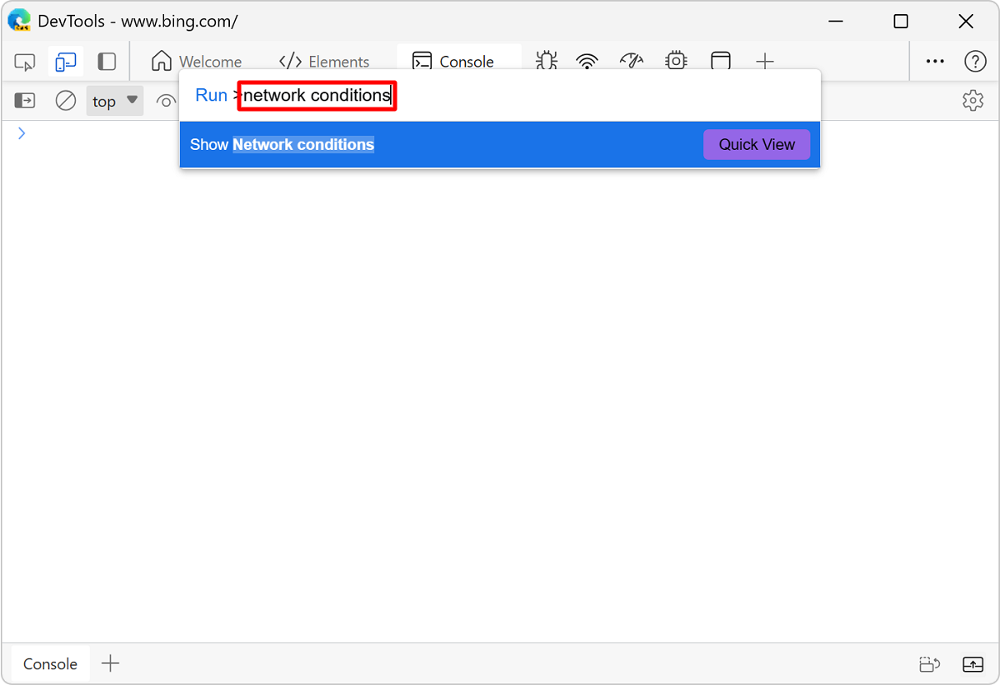
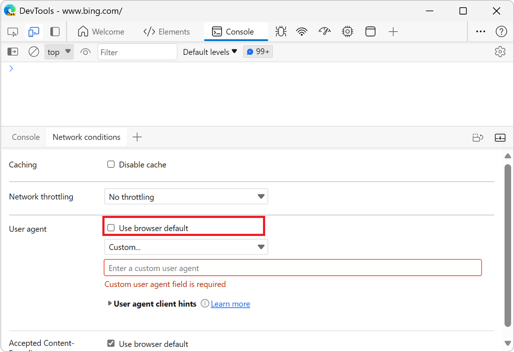

<!-- Copyright Kayce Basques

   Licensed under the Apache License, Version 2.0 (the "License");
   you may not use this file except in compliance with the License.
   You may obtain a copy of the License at

       https://www.apache.org/licenses/LICENSE-2.0

   Unless required by applicable law or agreed to in writing, software
   distributed under the License is distributed on an "AS IS" BASIS,
   WITHOUT WARRANTIES OR CONDITIONS OF ANY KIND, either express or implied.
   See the License for the specific language governing permissions and
   limitations under the License.  -->
# Override the user agent string

To override the [user agent](https://developer.mozilla.org/docs/Glossary/User_agent) string from Microsoft Edge DevTools:

1. Press **Ctrl+Shift+P** (Windows, Linux) or **Command+Shift+P** (macOS) to open the **Command Menu**.

   
    
1. Type `network conditions`, select **Show Network conditions**, and then press **Enter** to open the **Network conditions** tool.

   

1. In the **User agent** section, clear the **Use browser default** checkbox.

   

1. Select a user agent from the dropdown list, or enter a custom user agent.

1. Click **User agent client hints** to view and change these values as described in [Network features reference](../network/reference.md).

<!-- ====================================================================== -->
## See also

* [Set the user agent string](index.md#set-the-user-agent-string) in _Emulate mobile devices (Device Emulation)_

<!-- ====================================================================== -->
> [!NOTE]
> Portions of this page are modifications based on work created and [shared by Google](https://developers.google.com/terms/site-policies) and used according to terms described in the [Creative Commons Attribution 4.0 International License](https://creativecommons.org/licenses/by/4.0).
> The original page is found [here](https://developer.chrome.com/docs/devtools/device-mode/override-user-agent/) and is authored by [Kayce Basques](https://developers.google.com/web/resources/contributors#kayce-basques) (Technical Writer, Chrome DevTools \& Lighthouse).

This work is licensed under a [Creative Commons Attribution 4.0 International License](https://creativecommons.org/licenses/by/4.0).
