<!-- Copyright Kayce Basques

   Licensed under the Apache License, Version 2.0 (the "License");
   you may not use this file except in compliance with the License.
   You may obtain a copy of the License at

       https://www.apache.org/licenses/LICENSE-2.0

   Unless required by applicable law or agreed to in writing, software
   distributed under the License is distributed on an "AS IS" BASIS,
   WITHOUT WARRANTIES OR CONDITIONS OF ANY KIND, either express or implied.
   See the License for the specific language governing permissions and
   limitations under the License.  -->
# Get started viewing and changing the DOM

Follow these interactive tutorial sections to learn the basics of viewing and changing the [Document Object Model](https://developer.mozilla.org/docs/Web/API/Document_Object_Model) (DOM) of a page using Microsoft Edge DevTools.

To understand the difference between the DOM and HTML, see [Appendix: HTML versus the DOM](#appendix-html-versus-the-dom), below.


<!-- ====================================================================== -->
## View DOM nodes

The DOM Tree of the Elements panel is where you do all DOM-related activities in DevTools.


### Inspect a node

When you are interested in a particular DOM node, **Inspect** is a fast way to open DevTools and investigate that node.

1. Open the [DOM Examples](https://microsoftedge.github.io/Demos/devtools-dom-get-started/) demo page in a new window or tab.  To do this, right-click the link, or press and hold `Ctrl` (Windows, Linux) or `Command` (macOS) and then click the link.

<!-- You can view the source files for the DOM Examples demo in the [MicrosoftEdge/Demos > devtools-dom-get-started](https://github.com/MicrosoftEdge/Demos/tree/main/devtools-dom-get-started) repo folder. -->

1. In the rendered webpage, under **Inspect a Node**, right-click **Michelangelo** and then select **Inspect**.

   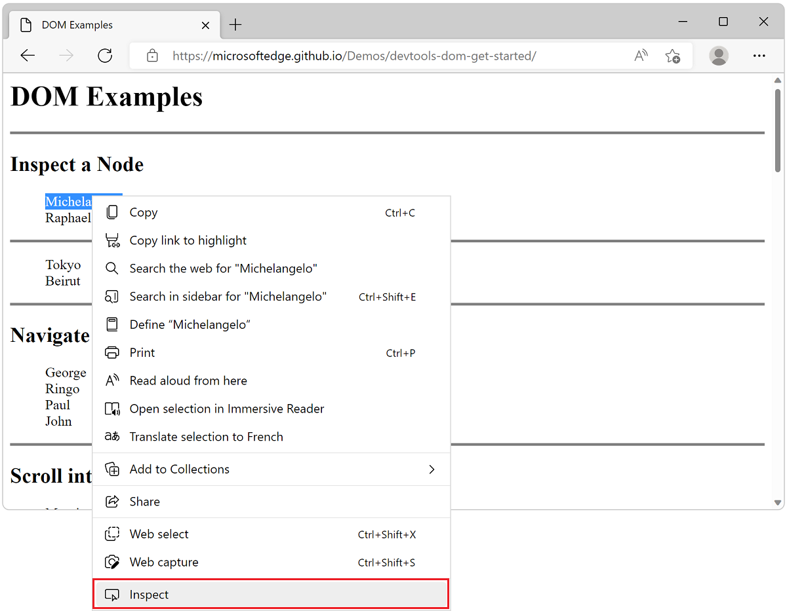

   The **Elements** tool of DevTools opens.  `<p>Michelangelo</p>` node is highlighted in the **DOM Tree**.

   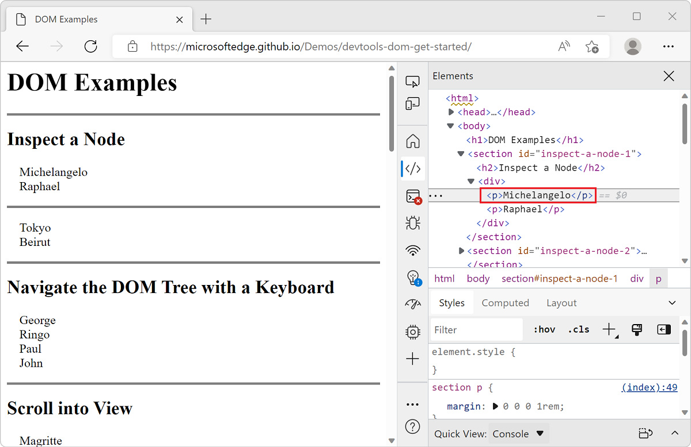

1. Click the **Inspect** () icon in the top-left corner of DevTools.

   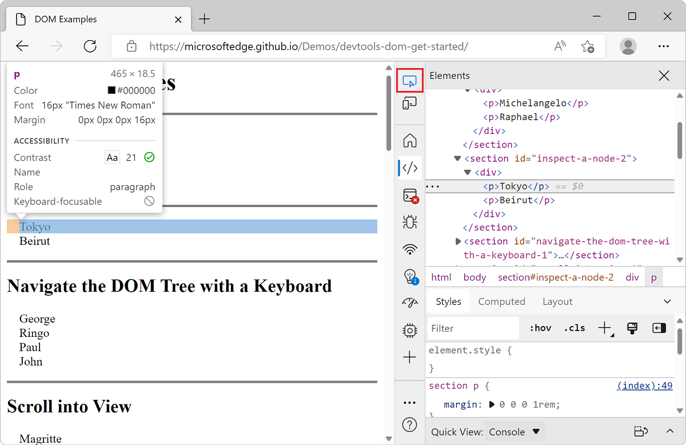

1. Under **Inspect a Node**, click the **Tokyo** text.  Now, `<p>Tokyo</p>` node is highlighted in the DOM Tree.

Inspecting a node is also the first step towards viewing and changing the styles of a node.  See [Get started viewing and changing CSS](../css/index.md).


### Navigate the DOM Tree with a keyboard

Once you have selected a node in the DOM Tree, you can navigate the DOM Tree with your keyboard.

1. Open the [DOM Examples](https://microsoftedge.github.io/Demos/devtools-dom-get-started/) demo page in a new window or tab.

1. In the rendered webpage, under **Navigate the DOM Tree with a Keyboard**, right-click **Ringo** and then select **Inspect**.  `<p>Ringo</p>` is selected in the DOM Tree.

   

1. Press the `Up` arrow key 2 times.  `<div>` is selected.

   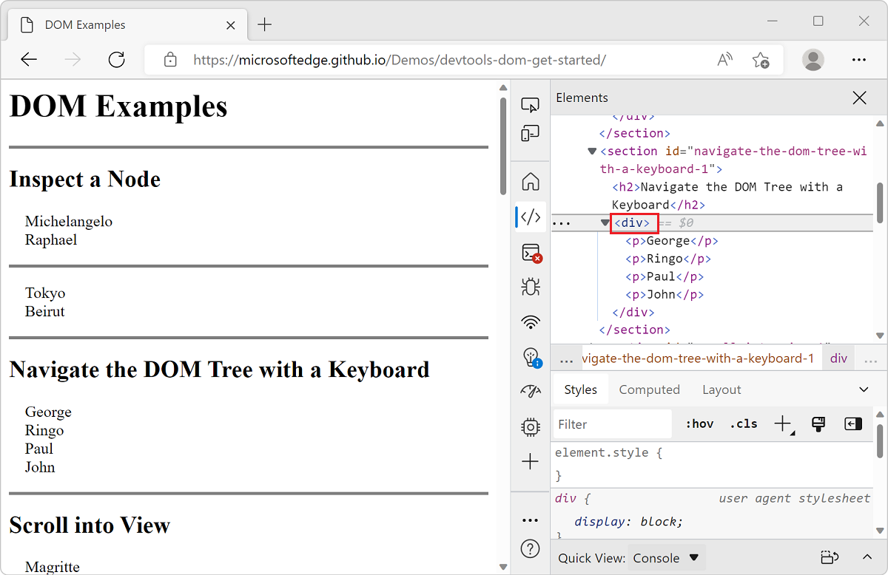

1. Press the `Left` arrow key.  The `<div>` list collapses.

1. Press the `Left` arrow key again.  The parent of the `<div>` node is selected.  In this case it is the `<section>` with the ID `navigate-the-dom-tree-with-a-keyboard-1`.

1. Press the `Down` arrow key 2 times so that you have re-selected the `<div>` list that you just collapsed.  It should look like this: `<div>... </div>`

1. Press the `Right` arrow key.  The list expands.


### Scroll into view

When viewing the DOM Tree, you may find yourself interested in a DOM node that isn't currently in the viewport.  For example, suppose that you scrolled to the bottom of the page, and you are interested in the `<h1>` node at the top of the page.  **Scroll into view** lets you quickly reposition the viewport so that you can review the node.

1. Open the [DOM Examples](https://microsoftedge.github.io/Demos/devtools-dom-get-started/) demo page in a new window or tab.

1. In the rendered webpage, under **Scroll into View**, right-click **Magritte** and then select **Inspect**.

1. Scroll to the bottom of the DOM Examples page.

1. The `<p>Magritte</p>` node should still be selected in your DOM Tree.  If not, go back to [Scroll into view](#scroll-into-view) and start over.

1. Right-click the `<p>Magritte</p>` node, and then click **Scroll into view**.  Your viewport scrolls back up to display the **Magritte** node.  See [Appendix: Missing options](#appendix-missing-options) if the **Scroll into view** option isn't displayed.

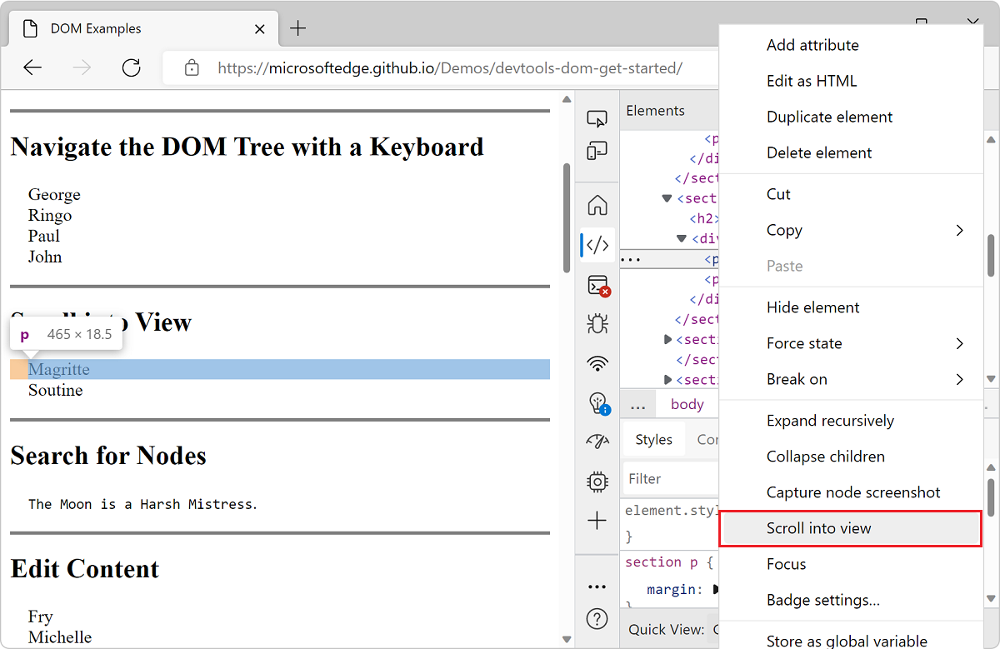

### Search for nodes

You can search the DOM Tree by string, CSS selector, or XPath selector.

1. Focus your cursor on the **Elements** tool.

1. Press `Ctrl`+`F` (Windows, Linux) or `Command`+`F` (macOS).  The Search bar opens at the bottom of the DOM Tree.

1. Type `The Moon is a Harsh Mistress`.  The last sentence is highlighted in the DOM Tree.

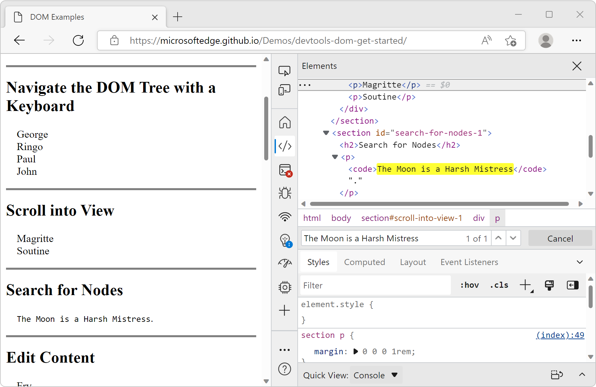

The Search bar also supports CSS and XPath selectors.


<!-- ====================================================================== -->
## Edit the DOM

You can edit the DOM on the fly and review how the changes affect the page.

### Edit text content

To edit the text content of a node, double-click the content in the DOM Tree.

1. Open the [DOM Examples](https://microsoftedge.github.io/Demos/devtools-dom-get-started/) demo page in a new window or tab.

1. In the rendered webpage, under **Edit Content**, right-click **Michelle** and then select **Inspect**.

1. In the DOM Tree, double-click `Michelle`.  In other words, double-click the text between `<p>` and `</p>`.  The text is highlighted to indicate that it is selected.

   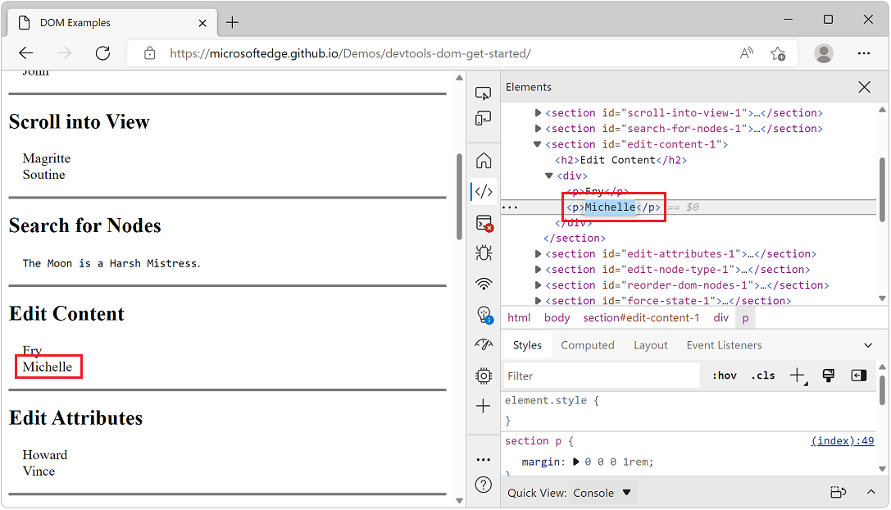

1. Delete `Michelle`, type `Leela`, then press `Enter` to confirm the change.  The text in the DOM changes from **Michelle** to **Leela**.

### Edit attributes

To edit attributes, double-click the attribute name or value.  Follow the instructions to learn how to add attributes to a node.

1. Open the [DOM Examples](https://microsoftedge.github.io/Demos/devtools-dom-get-started/) demo page in a new window or tab.

1. In the rendered webpage, under **Edit Attributes**, right-click **Howard** and then select **Inspect**.

1. Double-click `<p>`.  The text is highlighted to indicate that the node is selected.

   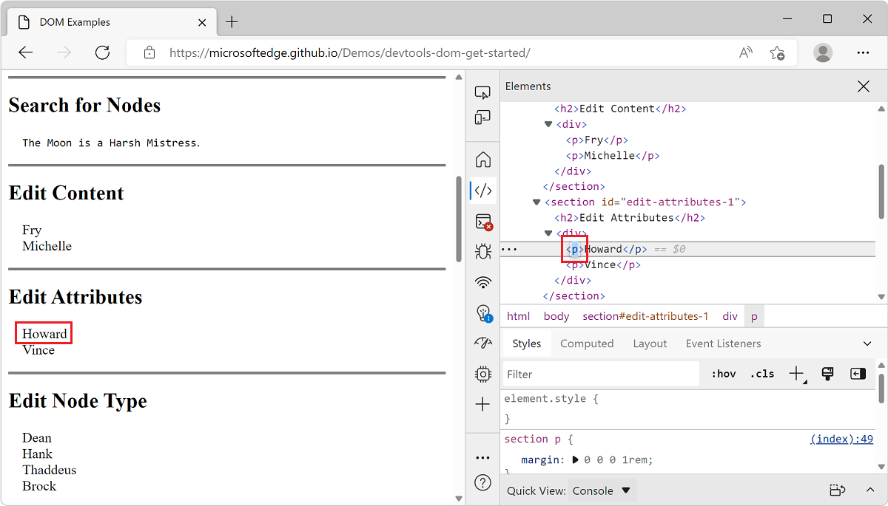

1. Select the `Right` arrow key, add a space, type `style="background-color:gold"`, and then press `Enter`.  The background color of the node changes to gold.

   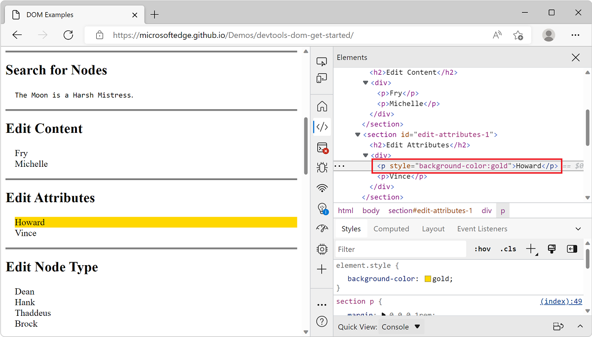

### Edit node tag name

To edit the tag name of a node, double-click the tag name and then type in the new tag name.

1. Open the [DOM Examples](https://microsoftedge.github.io/Demos/devtools-dom-get-started/) demo page in a new window or tab.

1. In the rendered webpage, under **Edit Node Tag Name**, right-click **Hank** and then select **Inspect**.

1. Double-click `<p>`.  The text `p` is highlighted.

1. Delete `p`, type `button`, then press `Enter`.  The `<p>` node changes to a `<button>` node.

   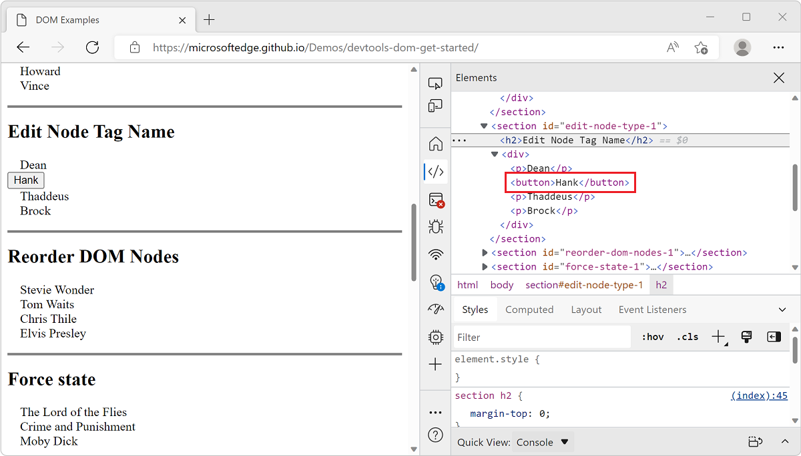

### Edit multiple nodes, text, and attributes 

To change the tag name, text content, or attributes of multiple nodes at once, you can edit part of the DOM using an HTML text editor.

To use the HTML editor:

1. Open the [DOM Examples](https://microsoftedge.github.io/Demos/devtools-dom-get-started/) demo page in a new window or tab.

1. In the rendered webpage, right-click in the **Edit Content, Tag Name, and Attributes** section, and then select **Inspect**.

1. In the DOM Tree, right-click the `<section id="edit-as-html-1">` node and select **Edit as HTML**. The HTML editor appears.

   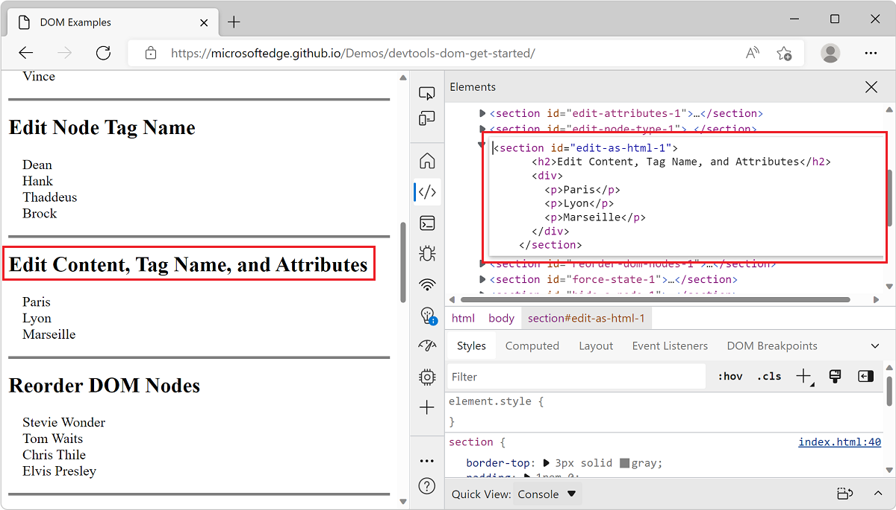

1. Type the changes you want to make in the HTML editor, such as:

   * Adding, deleting, or editing attributes.
   * Adding or deleting nodes.
   * Editing nodes' text content or tag names.

   For example, try adding `<p>Dijon</p>` after the `<p>Marseille</p>` line.

1. Type `Ctrl`+`Enter` to apply the changes to the DOM tree and close the HTML editor.

   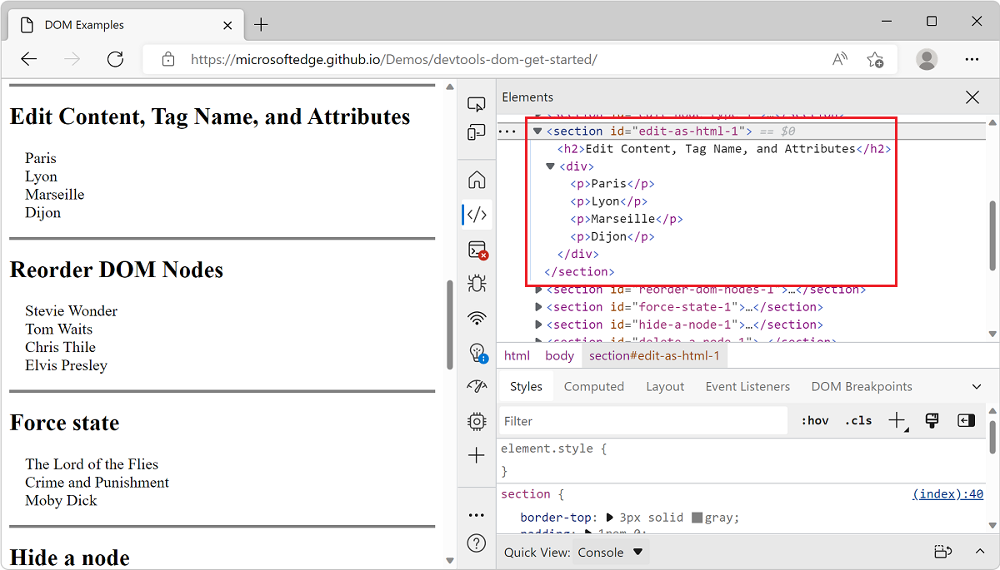

### Reorder DOM nodes

Drag nodes to reorder them.

1. Open the [DOM Examples](https://microsoftedge.github.io/Demos/devtools-dom-get-started/) demo page in a new window or tab.

1. In the rendered webpage, under **Reorder DOM Nodes**, right-click **Elvis Presley** and then select **Inspect**.

1. In the DOM Tree, drag `<p>Elvis Presley</p>` to the top of the list.

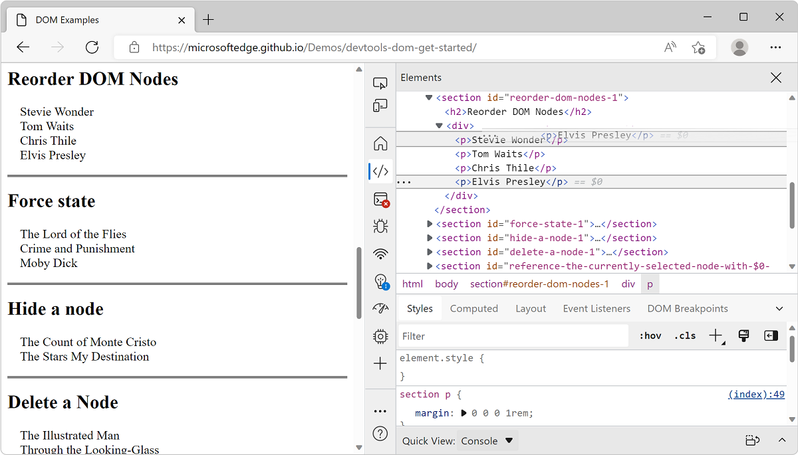

### Force state

You can force nodes to remain in states including `:active`, `:hover`, `:focus`, `:visited`, and `:focus-within`:

1. Open the [DOM Examples](https://microsoftedge.github.io/Demos/devtools-dom-get-started/) demo page in a new window or tab.

1. In the rendered webpage, under **Force state**, hover on **The Lord of the Flies**.  The background color becomes orange.

1. Right-click **The Lord of the Flies**, and then select **Inspect**.

1. Right-click `<p class="demo--hover">The Lord of the Flies</p>`, and then select **Force State** > **:hover**.  See [Appendix: Missing options](#appendix-missing-options) if the option isn't displayed.  The background color remains orange even though you aren't actually hovering over the node.

### Hide a node

Press `H` to hide a node, as follows:

1. Open the [DOM Examples](https://microsoftedge.github.io/Demos/devtools-dom-get-started/) demo page in a new window or tab.

1. In the rendered webpage, under **Hide a node**, right-click **The Stars My Destination** and then select **Inspect**.

1. Press the `H` key.  The node is hidden.

   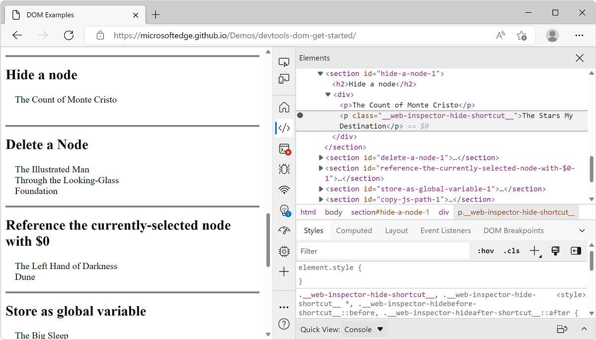

1. Press the `H` key again.  The node is shown again.

### Delete a node

Press `Delete` to delete a node, as follows:

1. Open the [DOM Examples](https://microsoftedge.github.io/Demos/devtools-dom-get-started/) demo page in a new window or tab.

1. In the rendered webpage, under **Delete a Node**, right-click **Foundation** and then select **Inspect**.

1. Press `Delete`.  The node is deleted.

1. Press `Ctrl`+`Z` (Windows, Linux) or `Command`+`Z` (macOS).  The last action is undone and the node reappears.


<!-- ====================================================================== -->
## Access nodes in the Console

DevTools provides a few shortcuts for accessing DOM nodes from the Console, or getting JavaScript references to each one.

### Reference the currently-selected node with $0

When you inspect a node, the `== $0` text next to the node means that you can reference this node in the Console with the variable `$0`.

1. Open the [DOM Examples](https://microsoftedge.github.io/Demos/devtools-dom-get-started/) demo page in a new window or tab.

1. In the rendered webpage, under **Reference the currently-selected node with $0**, right-click **The Left Hand of Darkness** and then select **Inspect**.

1. Select the `Escape` key to open the Console Drawer.

1. Type `$0` and press `Enter`.  The result of the expression shows that `$0` evaluates to `<p>The Left Hand of Darkness</p>`:

   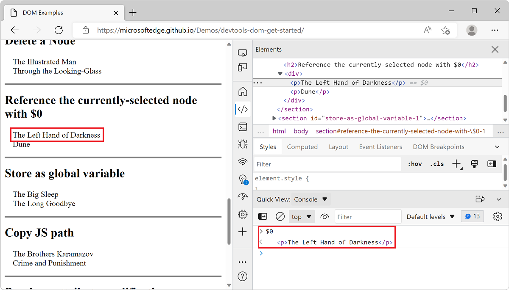

1. Hover on the result.  The node is highlighted in the viewport.

1. Click `<p>Dune</p>` in the DOM Tree, type `$0` in the Console again, and then press `Enter` again.  Now, `$0` evaluates to `<p>Dune</p>`:

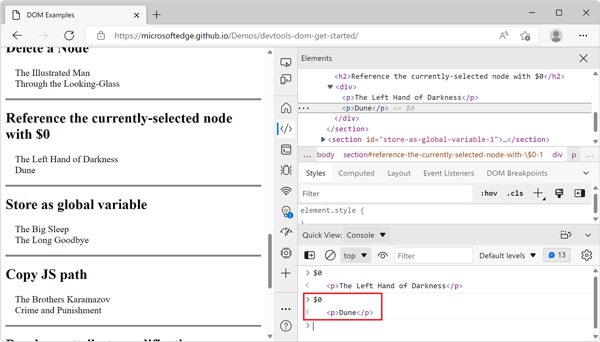

### Store as global variable

If you need to refer back to a node many times, store it as a global variable.

1. Open the [DOM Examples](https://microsoftedge.github.io/Demos/devtools-dom-get-started/) demo page in a new window or tab.

1. In the rendered webpage, under **Store as global variable**, right-click **The Big Sleep**, and then select **Inspect**.

1. Right-click `<p>The Big Sleep</p>` in the DOM Tree, and then select **Store as global variable**.  See [Appendix: Missing options](#appendix-missing-options) if the option isn't displayed.

1. Type `temp1` in the Console and then press `Enter`.  The result of the expression shows that the variable evaluates to the node.

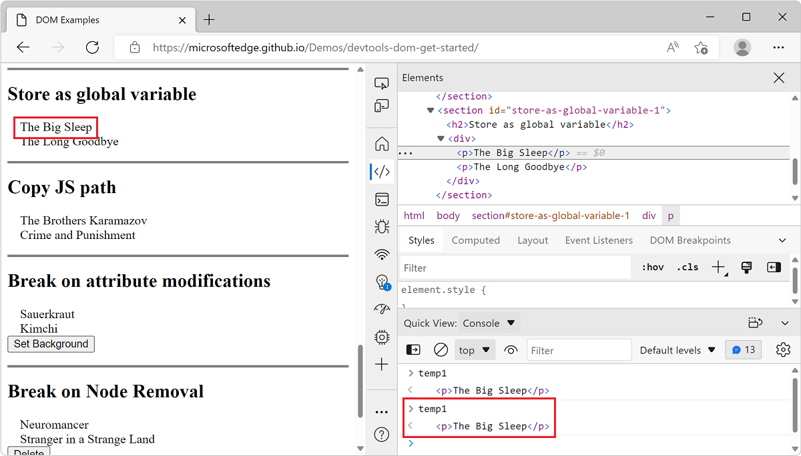

### Copy JS path

Copy the JavaScript path to a node when you need to reference it in an automated test.

1. Open the [DOM Examples](https://microsoftedge.github.io/Demos/devtools-dom-get-started/) demo page in a new window or tab.

1. In the rendered webpage, under **Copy JS path**, right-click **The Brothers Karamazov**, and then select **Inspect**.

1. Right-click `<p>The Brothers Karamazov</p>` in the DOM Tree, and then select **Copy** > **Copy JS Path**.  A `document.querySelector()` expression that resolves to the node has been copied to your clipboard.

1. Press `Ctrl`+`V` (Windows, Linux) or `Command`+`V` (macOS) to paste the expression into the Console.

1. Press `Enter` to evaluate the expression.

The result of the **Copy JS Path** expression:

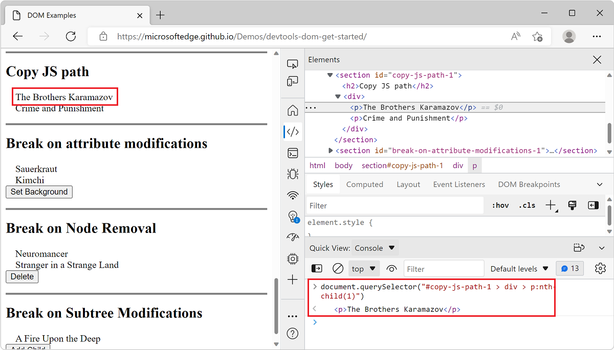


<!-- ====================================================================== -->
## Break on DOM changes

DevTools enables you to pause the JavaScript of a page when the JavaScript modifies the DOM.

### Break on attribute modifications

Use attribute modification breakpoints when you want to pause the JavaScript that causes any attribute of a node to change.

1. Open the [DOM Examples](https://microsoftedge.github.io/Demos/devtools-dom-get-started/) demo page in a new window or tab.

1. In the rendered webpage, under **Break on attribute modifications**, right-click **Sauerkraut** and then select **Inspect**.

1. In the DOM Tree, right-click `<p id="botm_target">Sauerkraut</p>`, and then select **Break On** > **Attribute Modifications**.  See [Appendix: Missing options](#appendix-missing-options) if the option isn't displayed.

   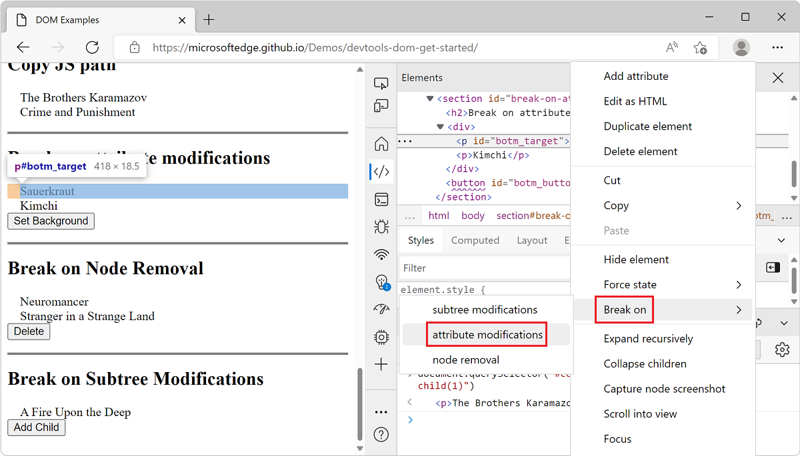

1. Click the **Set Background** button.  This sets the `style` attribute of the node to `background-color:thistle`.  DevTools pauses the page and highlights the code that caused the attribute to change.

   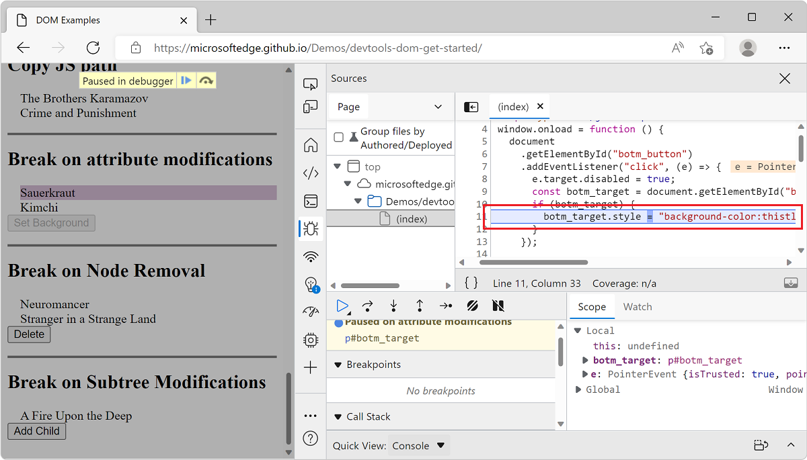

1. Click **Resume Script** () to resume the JavaScript execution.

### Break on node removal

If you want to pause when a particular node is removed, use node removal breakpoints.

1. Open the [DOM Examples](https://microsoftedge.github.io/Demos/devtools-dom-get-started/) demo page in a new window or tab.

1. In the rendered webpage, under **Break on Node Removal**, right-click **Neuromancer** and then select **Inspect**.

1. In the DOM Tree, right-click `<p id="target">Neuromancer</p>`, and then select **Break On** > **Node Removal**.  See [Appendix: Missing options](#appendix-missing-options) if the option isn't displayed.

1. Click the **Delete** button above.  DevTools pauses the page and highlights the code that caused the node to be removed.

1. Select **Resume Script** ().

### Break on subtree modifications

After you put a subtree modification breakpoint on a node, DevTools pauses the page when any of the descendants of the node are added or removed.

1. Open the [DOM Examples](https://microsoftedge.github.io/Demos/devtools-dom-get-started/) demo page in a new window or tab.

1. In the rendered webpage, under **Break on Subtree Modifications**, right-click **A Fire Upon The Deep** and then select **Inspect**.

1. In the DOM Tree, right-click `<div id="ul_target">`, which is the node above `<p>A Fire Upon the Deep</p>`, and then select **Break On** > **Subtree Modifications**.  If the **Subtree Modifications** command doesn't appear, see [Appendix: Missing options](#appendix-missing-options).

1. Click **Add Child**.  The code pauses because a `<p>` node was added to the list.

1. Select **Resume Script** ().


<!-- ====================================================================== -->
## Next steps

That covers most of the DOM-related features in DevTools.  You can discover the rest of the features by right-clicking nodes in the DOM Tree, and experimenting with the other options that were not covered in this tutorial.  See [Elements panel keyboard shortcuts](../shortcuts/index.md#elements-tool-keyboard-shortcuts).

Check out [Overview of DevTools](../../devtools-guide-chromium/overview.md) to discover everything else you can do with DevTools.

<!--See [Community](../index#community) if you want to contact the DevTools team or get help from the DevTools community.  -->


<!-- ====================================================================== -->
## Appendix: HTML versus the DOM

This section explains the difference between HTML and the DOM.

When you use a web browser to request a page, the server returns HTML code like this:

```html
<!doctype html>
<html>
    <head>
        <title>Hello, world!</title>
    </head>
    <body>
        <h1>Hello, world!</h1>
        <p>This is a hypertext document on the World Wide Web.</p>
        <script src="/script.js" async></script>
    </body>
</html>
```

The browser then parses the HTML and creates a tree of objects based on the HTML like this:

```DOM
html
    head
        title
    body
        h1
        p
        script
```

This tree of objects, or nodes, representing the content of the page is called the _Document Object Model_ (_DOM_).  Right now the DOM tree looks the same as the HTML, but suppose that the script referenced at the bottom of the HTML runs the following code:

```javascript
const h1 = document.querySelector('h1');
h1.parentElement.removeChild(h1);
const p = document.createElement('p');
p.textContent = 'Wildcard!';
document.body.appendChild(p);
```

That code removes the `h1` node and adds another `p` node to the DOM.  The complete DOM now looks like this:

```DOM
html
    head
        title
    body
        p
        script
        p
```

The page's HTML is now different than its DOM.  In other words, HTML represents the initial page content, and the DOM represents the current page content.  When JavaScript adds, removes, or edits nodes, the DOM becomes different than the HTML.

See [Introduction to the DOM](https://developer.mozilla.org/docs/Web/API/Document_Object_Model/Introduction) to learn more.


<!-- ====================================================================== -->
## Appendix: Missing options

Many of the instructions in this tutorial instruct you to right-click a node in the DOM Tree and then select an option from the context menu that pops up.  If you don't see the specified option in the context menu, try right-clicking away from the node text, or click the `...` button to the left of the node.

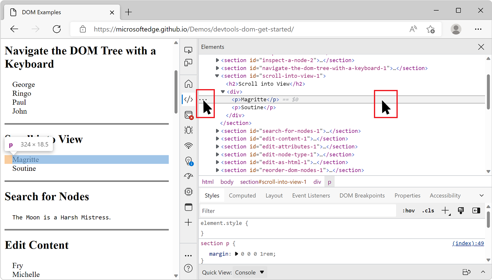


<!-- ====================================================================== -->
> [!NOTE]
> Portions of this page are modifications based on work created and [shared by Google](https://developers.google.com/terms/site-policies) and used according to terms described in the [Creative Commons Attribution 4.0 International License](https://creativecommons.org/licenses/by/4.0).
> The original page is found [here](https://developer.chrome.com/docs/devtools/dom/) and is authored by [Kayce Basques](https://developers.google.com/web/resources/contributors#kayce-basques) (Technical Writer, Chrome DevTools \& Lighthouse).

[](https://creativecommons.org/licenses/by/4.0)
This work is licensed under a [Creative Commons Attribution 4.0 International License](https://creativecommons.org/licenses/by/4.0).
