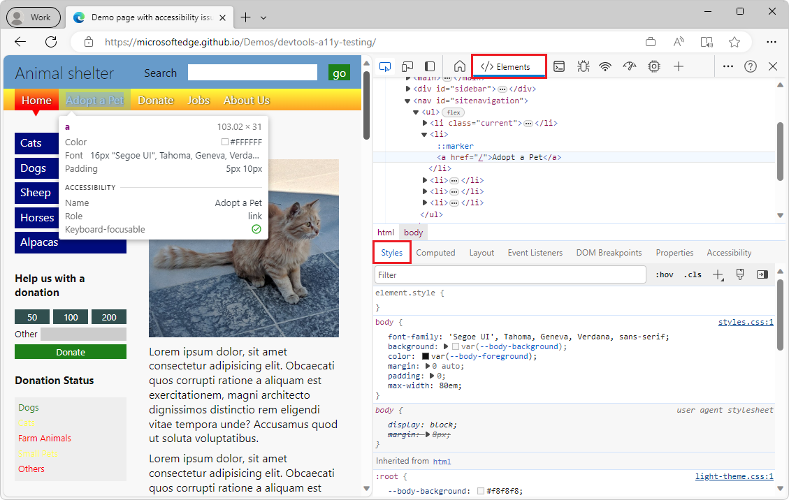

# Inspect, edit, and debug HTML and CSS with the Elements tool

Use the **Elements** tool to inspect, edit, and debug your HTML and CSS.  You can edit in the tool while displaying the changes live in the browser.  

Debug your HTML using the DOM tree, and inspect and work on the CSS for your webpage.

<!-- ====================================================================== -->
## See also

* [CSS features reference](../css/reference.md)
* [Get started viewing and changing CSS](../css/index.md)
* [Inspect CSS Grid](../css/grid.md)
* [Edit CSS font styles and settings in the Styles pane](../inspect-styles/edit-fonts.md)
* [Style editing for CSS-in-JS frameworks](../css/css-in-js.md)
* [Get started viewing and changing the DOM](../dom/index.md)
