<!-- Copyright Kayce Basques

   Licensed under the Apache License, Version 2.0 (the "License");
   you may not use this file except in compliance with the License.
   You may obtain a copy of the License at

       https://www.apache.org/licenses/LICENSE-2.0

   Unless required by applicable law or agreed to in writing, software
   distributed under the License is distributed on an "AS IS" BASIS,
   WITHOUT WARRANTIES OR CONDITIONS OF ANY KIND, either express or implied.
   See the License for the specific language governing permissions and
   limitations under the License.  -->
# Introduction to the Performance tool

_Runtime performance_ is how your page performs when it's running, as opposed to loading.  The following tutorial teaches you how to use the DevTools **Performance** tool to analyze runtime performance.

The skills you learn in this tutorial are useful for analyzing loading, interactivity, and visual stability of your web content, which are also key indicators for [Core Web Vitals](https://web.dev/vitals/).  Each of the Core Web Vitals represents a distinct facet of the user experience, is measurable in the field, and reflects the real-world experience of a critical user-centric outcome.  You can see these Core Web Vitals in the **Performance** tool.

See also:
- [Optimize website speed using Lighthouse](../speed/get-started.md)


<!-- ====================================================================== -->
## Get started

In the following tutorial, you open DevTools on a "Sluggish Animation" demo page and use the **Performance** tool to find a performance bottleneck on the page.

1. Open the [Sluggish Animation](https://microsoftedge.github.io/Demos/devtools-performance-get-started/) demo page in your InPrivate tab or window.  To do that, right-click the link and then select **Open link in InPrivate window**.  You'll profile this page, which shows a variable number of icons moving up and down. For more information about InPrivate, see [Browse InPrivate in Microsoft Edge](https://support.microsoft.com/microsoft-edge/browse-inprivate-in-microsoft-edge-cd2c9a48-0bc4-b98e-5e46-ac40c84e27e2)

   Source code: [MicrosoftEdge / Demos > devtools-performance-get-started](https://github.com/MicrosoftEdge/Demos/tree/main/devtools-performance-get-started).


   <!--TODO: replace section when updated for Chromium-based Edge  -->

   <!-- You can view the source files for the "Sluggish Animation" demo page at the [MicrosoftEdge/Demos > devtools-performance-get-started](https://github.com/MicrosoftEdge/Demos/tree/main/devtools-performance-get-started) repo folder. -->

1. Press **Ctrl+Shift+I** (Windows, Linux) or **Command+Option+I** (macOS) to open DevTools:

   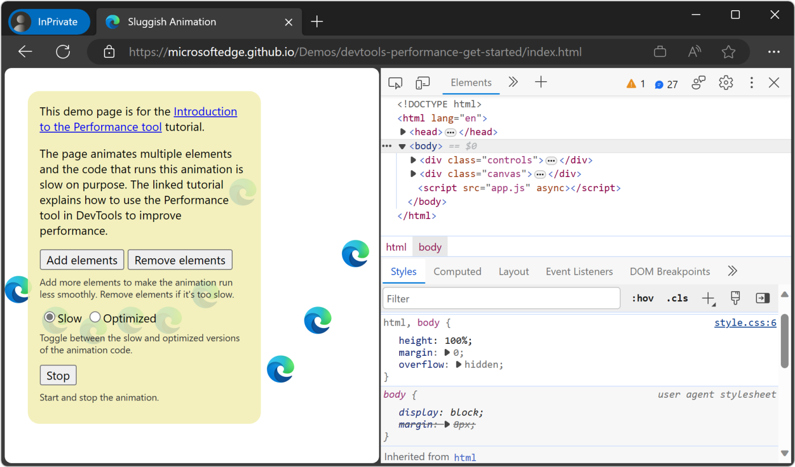

For the rest of the screenshots, DevTools is shown [undocked to a separate window](../customize/placement.md).


<!-- ------------------------------ -->
#### Simulate a mobile CPU

Mobile devices have much less CPU power than desktops and laptops.  Whenever you profile a page, use CPU Throttling to simulate how your page performs on mobile devices.

1. In DevTools, open the **Performance** tool.

1. Click **Capture settings** ().  DevTools reveals settings related to how it captures performance metrics.

1. For **CPU**, select **4x slowdown**.  DevTools throttles your CPU so that it's 4 times slower than usual.

   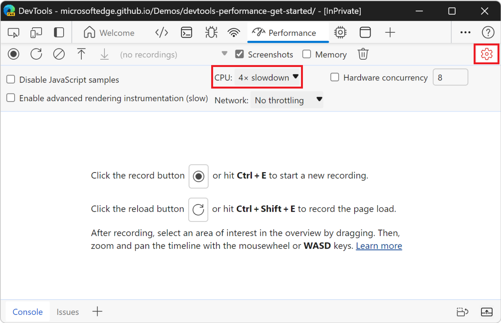

   If you want to ensure that pages work well on low-end mobile devices, set **CPU** to **6x slowdown**.


<!-- ------------------------------ -->
#### Set up the demo

The following section lets you customize the demo to make sure that your experience is relatively consistent with the screenshots and descriptions.

1. Click the **Add elements** button until the blue icons move noticeably slower than before.  On a high-end machine, you can click it about 20 times.

1. Click **Optimized**.  The blue icons should move faster and more smoothly.

1. To better display a difference between the optimized and unoptimized versions, click the **Remove elements** button a few times and try again.  If you add too many blue icons, you could max out the CPU, and then you might not observe a major difference in the results for the two versions.

1. Click **Slow**.  The blue icons move slower and with more sluggishness again.


<!-- ------------------------------ -->
#### Record runtime performance

When you ran the optimized version of the page, the blue icons move faster.  Why is that?  Both versions are supposed to move the icons the same amount of space in the same amount of time.  Take a recording in the **Performance** tool to learn how to detect the performance bottleneck in the unoptimized version.

1. In DevTools, click **Record** ().  DevTools captures performance metrics as the page runs.

   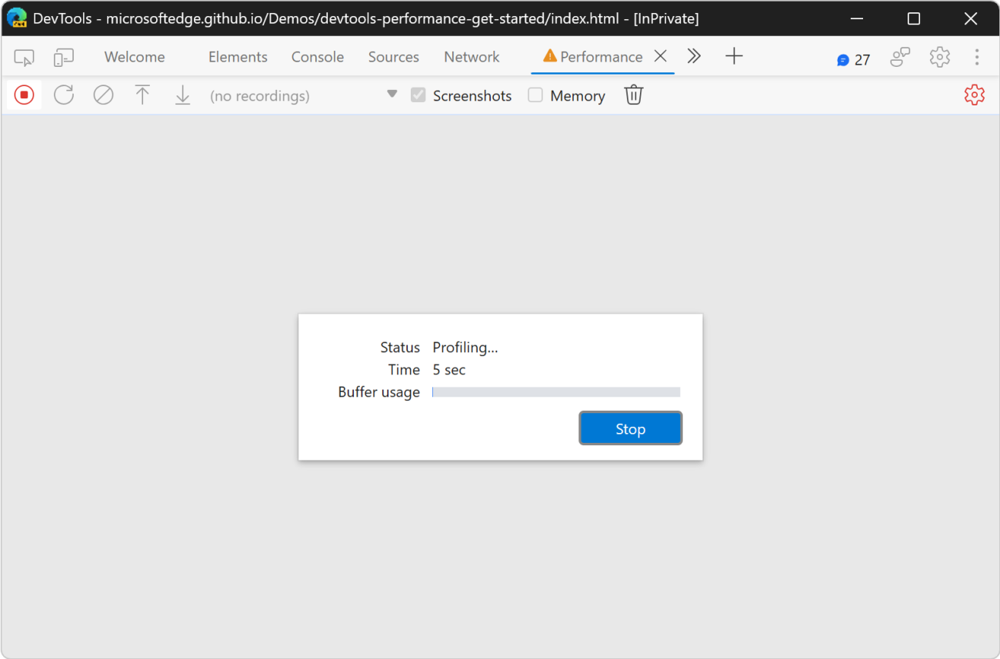

1. Wait a few seconds.

1. Click **Stop**.  DevTools stops recording, processes the data, then displays the results in the **Performance** tool.

   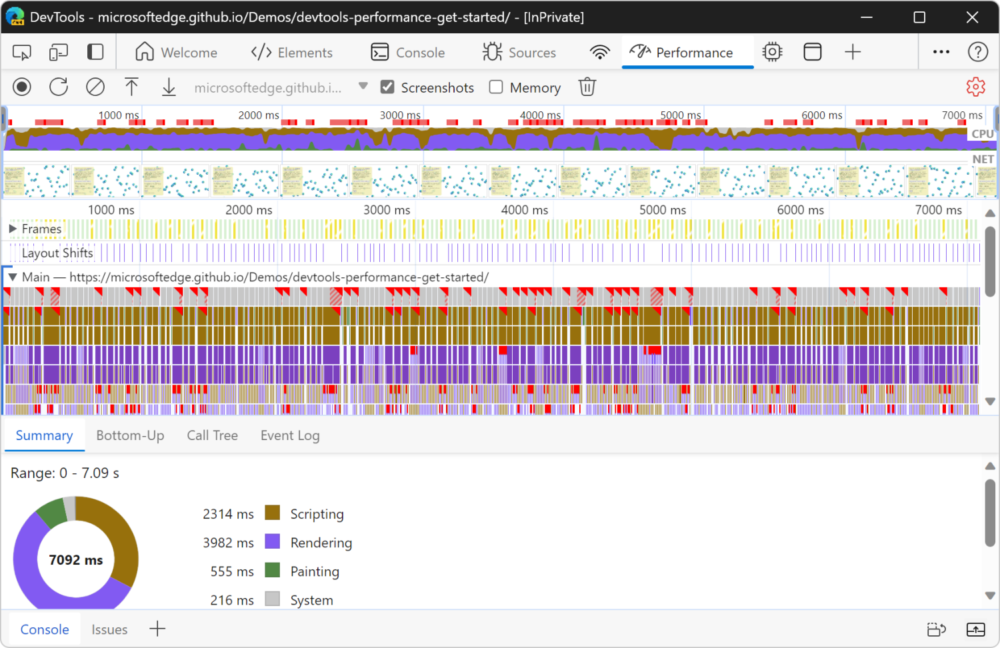

These performance results show an overwhelming amount of data, but it will all make more sense shortly.


<!-- ====================================================================== -->
## Analyze the results

Once you have a recording of the page's performance, you can assess the page's performance and find the cause of any performance issues.

1. The **CPU** chart is displayed along the top.  The colors in the **CPU** chart correspond to the colors in the **Summary** panel, at the bottom of the **Performance** tool.  The **CPU** chart shows that these regions make up a large area, meaning that the CPU was maxed out during the recording.  Whenever the CPU is maxed out for long periods, that's an indicator that the page is not performing well.

   

1. Hover over the **CPU** or **NET** charts.  DevTools shows a screenshot of the page at that point in time.  Move your mouse left and right to replay the recording.  The action is called _scrubbing_, and it's useful for manually analyzing the progression of the performance recording.

   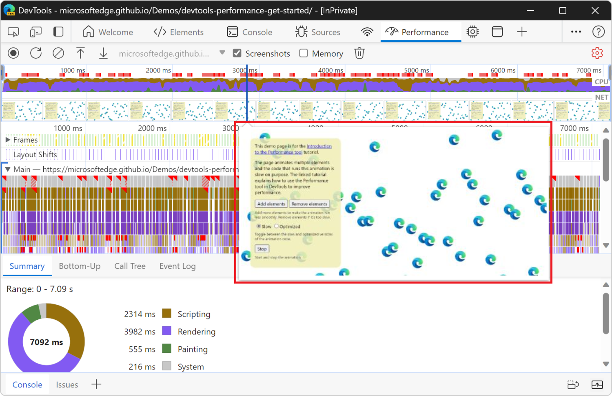


<!-- ------------------------------ -->
#### Bonus: Open the Frame Rendering Stats overlay

Another handy tool is the **Frame Rendering Stats** overlay, which provides real-time estimates for FPS as the page runs. The **Frame Rendering Stats** overlay is not required for this tutorial but may provide helpful insight.

1. In DevTools, press **Ctrl+Shift+P** (Windows, Linux) or **Command+Shift+P** (macOS) to open the **Command Menu**.

1. Start typing `Rendering` in the **Command Menu** and click **Show Rendering**.

1. In the **Rendering** tool, turn on **Frame Rendering Stats**.  A new overlay appears in the top-left of your webpage.

   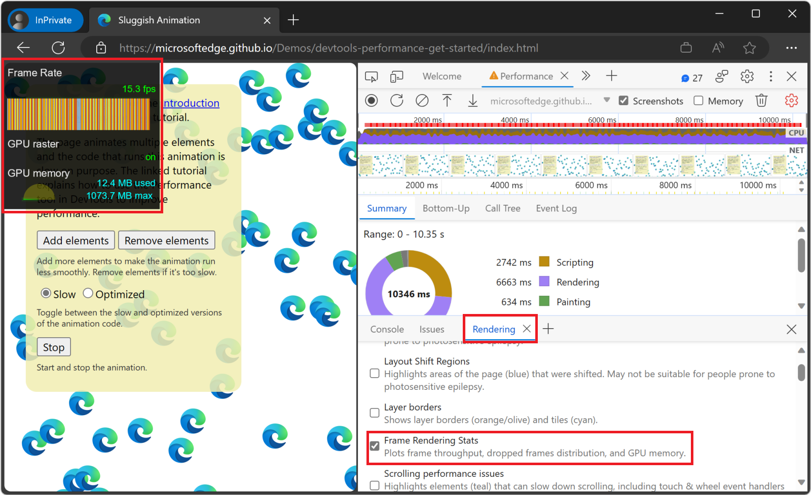

1. When you are done reviewing the FPS data, clear the **Frame Rendering Stats** checkbox to hide the overlay.


<!-- ------------------------------ -->
#### Find the bottleneck

After you verified that the animation isn't performing well, the next step is to answer the question "why?"

1. When no events are selected, the **Summary** panel shows you a breakdown of activity.  The page spent most of the time rendering.  Since performance is the art of doing less work, your goal is to reduce the amount of time spent doing rendering work.

   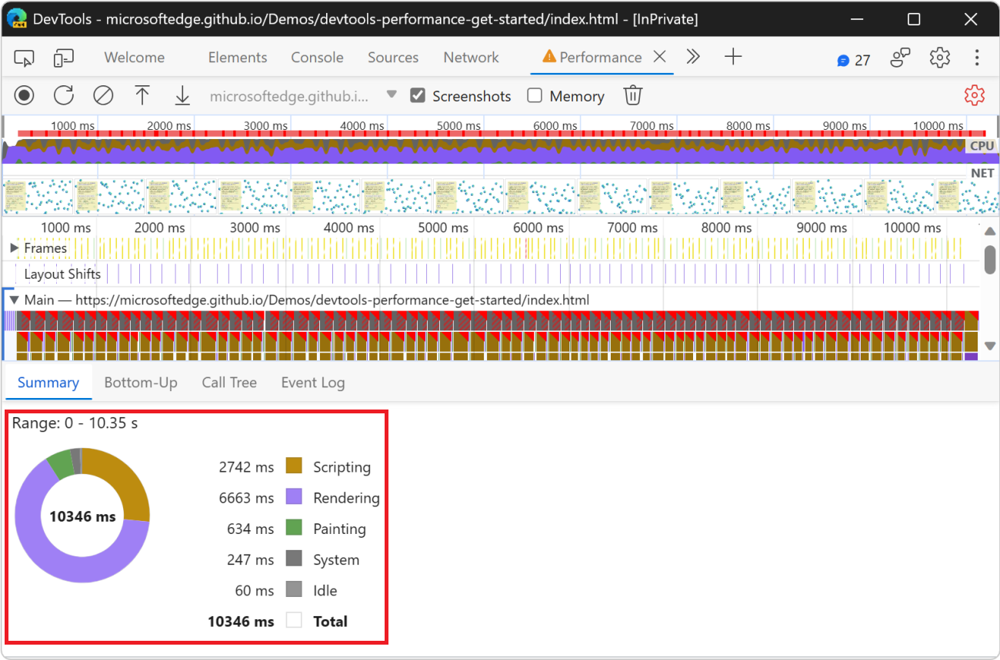

1. Expand the **Main** section.  DevTools shows you a flame chart of activity on the main thread, over time.  The x-axis represents the recording, over time.  Each bar represents an event.  A wider bar means that event took longer.  The y-axis represents the call stack.  When events are stacked on top of each other, it means the upper events caused the lower events.

   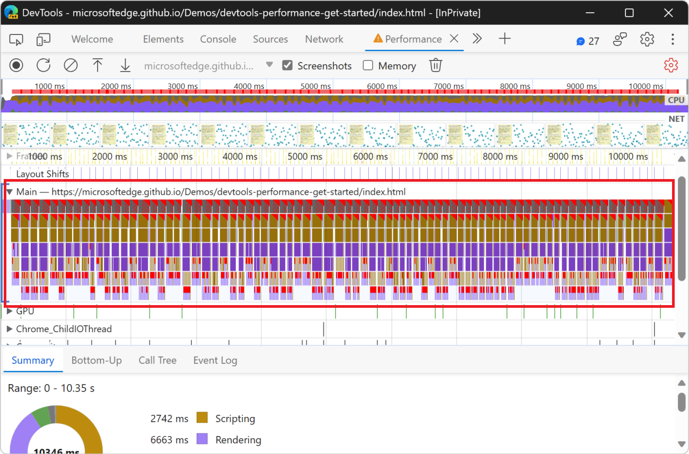

1. There is a lot of data in the recording.  To zoom into a portion of the recording, click and drag in the **Overview** area toward the top of the **Performance** tool.  The **Overview** area includes the **CPU** and **NET** charts (indicated on the right).  The **Main** section and **Summary** panel only display information for the selected portion of the recording.

   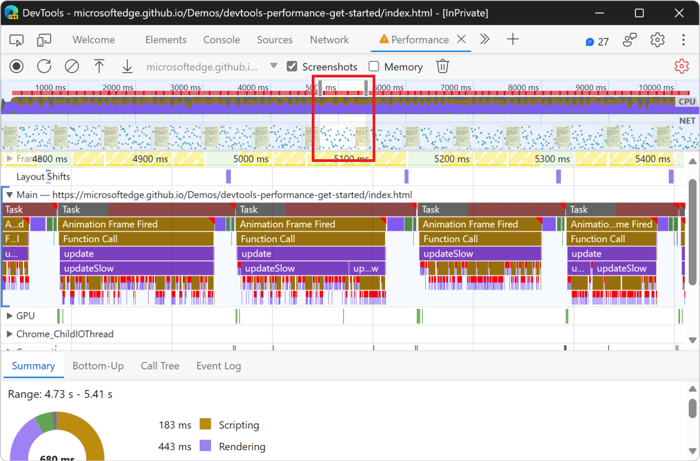

   Another way to change the selected area is to put focus on the **Main** section, click the background or an event, and then press:
   * `W` to zoom in, `S` to zoom out.
   * `A` to move selection left, `D` to move selection right.

1. Click an **Animation Frame Fired** event.

   When a red triangle is displayed at the top right of an event, it's a warning that there might be an issue related to the event.  The **Animation Frame Fired** event occurs whenever a [requestAnimationFrame() callback](https://developer.mozilla.org/docs/Web/API/window/requestAnimationFrame) is run.

   The **Summary** panel displays information about that event:
	
	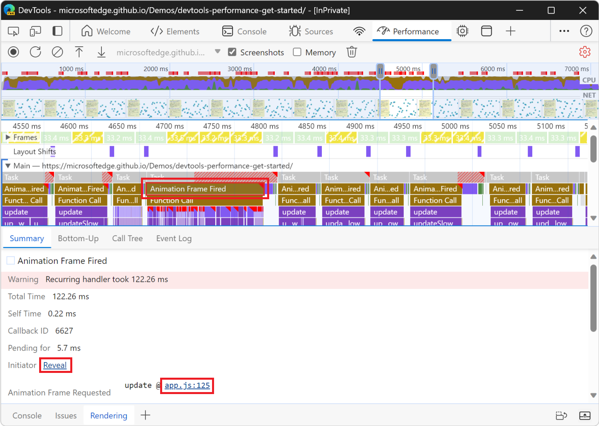

1. Click the **Reveal** link.  DevTools highlights the event that initiated the **Animation Frame Fired** event.
	
1. Click the **app.js:125** link.  The relevant line of source code is displayed in the **Sources** tool.

1. Zoom in on the **Animation Frame Fired** event and its child events, by using the mouse wheel or trackpad. Or, press **W**.

   You can now see the events that occur when a single frame of the animation is rendered. The **update** function is called, which, in turn, calls the **updateSlow** function, which triggers many **Recalculate Style** and **Layout** events:
   
   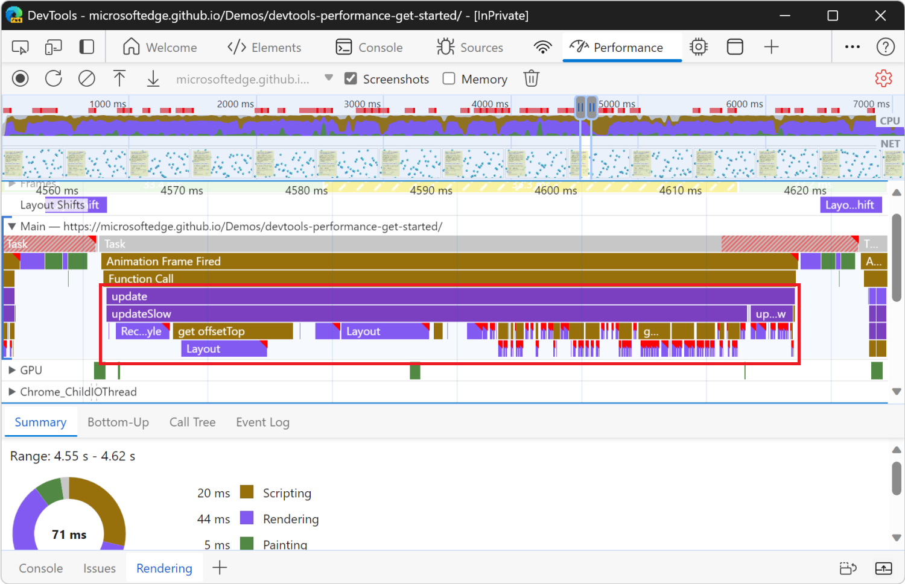

1. Click one of the purple **Layout** events.  DevTools provides more information about the event in the **Summary** panel.  There's a warning about "forced reflows" (re-layout).

1. In the **Summary** panel, click the **app.js:104** link under **Layout Forced**.  DevTools takes you to the line of code that forced the layout in the **Sources** tool:

   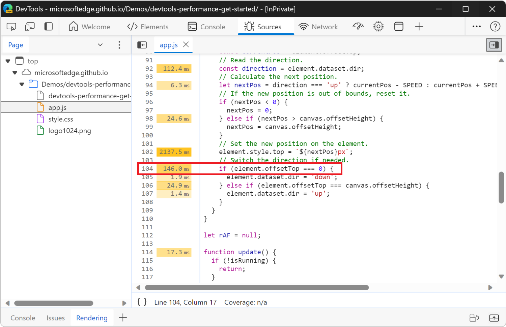

   The problem with the unoptimized code is that, in each animation frame, it changes the style for each icon, and then queries the position of each icon on the page. Because the styles changed, the browser doesn't know if each icon position changed, so it has to re-layout the icon in order to compute the new position.
   <!--
   > To learn more, see [Avoid forced synchronous layouts](https://web.dev/avoid-large-complex-layouts-and-layout-thrashing/#avoid-forced-synchronous-layouts).
   -->


<!-- ------------------------------ -->
#### Analyze the optimized version

Using the workflows and tools that you just learned, click **Optimized** on the demo webpage to turn on the optimized code, take another performance recording, and then analyze the results.  From the improved framerate to the reduction in events in the flame chart in the **Main** section, the optimized version of the app does much less work, resulting in better performance.


<!-- ------------------------------ -->
#### Unoptimized version

Compare this snippet of JavaScript from the unoptimized version of the app:

```javascript
// Read the current position.
const currentPos = element.offsetTop;
// Read the direction.
const direction = element.dataset.dir;
// Calculate the next position.
let nextPos = direction === 'up' ? currentPos - SPEED : currentPos + SPEED;

// If the new position is out of bounds, reset it.
if (nextPos < 0) {
  nextPos = 0;
} else if (nextPos > canvas.offsetHeight) {
  nextPos = canvas.offsetHeight;
}

// Set the new position on the element.
element.style.top = `${nextPos}px`;

// Switch the direction if needed.
if (element.offsetTop === 0) {
  element.dataset.dir = 'down';
} else if (element.offsetTop === canvas.offsetHeight) {
  element.dataset.dir = 'up';
}
```

The above code snippet runs on every frame of the browser rendering loop, for each blue icon on the page.  The `element` variable references a single blue icon.

In this unoptimized version, we create a `nextPos` variable that's set to the current position of the icon, to which we add some distance.  The current position of the icon is read by using `element.offsetTop`.

After making sure that the icon is still within the bounds of the page, we set its new position by using `element.style.top`, which sets inline styles on the element.

Finally, we read `element.offsetTop` again, to adjust the direction of the icon.


<!-- ------------------------------ -->
#### Optimized version

The optimized code uses a different sequence of actions to do less work. Here is the same snippet of JavaScript from the optimized version of the app: 

```javascript
// Read the current position.
const currentPos = parseFloat(element.style.transform.match(/[0-9.]+/)[0]);
// Read the direction.
const direction = element.dataset.dir;
// Calculate the next position.
let nextPos = direction === 'up' ? currentPos - (SPEED * 100 / canvasHeight) : currentPos + (SPEED * 100 / canvasHeight);

// If the new position is out of bounds, reset it, and switch the direction.
if (nextPos < 0) {
  nextPos = 0;
  element.dataset.dir = 'down';
} else if (nextPos > 100) {
  nextPos = 100;
  element.dataset.dir = 'up';
}

// Set the new position on the element.
element.style.transform = `translateY(${nextPos}vh)`;
```

In the optimized version, we first set the value of the `nextPos` variable by reading `element.style.transform` instead of using `element.offsetTop`.  Using the element's inline style is faster, because reading `element.offsetTop` forces the browser engine to know where all the elements are on the page, which requires the engine to recalculate the styles and the layout.

We then adjust the direction of the icon, but this time we don't read `element.offsetTop` again like done in the unoptimized version.

Finally, we set the new position of the icon, but this time we use `element.style.transform` instead of `element.style.top`. Using `element.style.transform` is faster, because the CSS `transform` property can be applied by the browser rendering engine without having to recalculate the layout of the page. When using the `transform` property, the browser considers each icon as an individual layer, and then displays these layers in the correct positions by re-compositing the final image.

To learn more, see [Use transform and opacity changes for animations](https://web.dev/stick-to-compositor-only-properties-and-manage-layer-count/#use-transform-and-opacity-changes-for-animations).


<!-- ====================================================================== -->
## Recommendations in live metrics
<!-- from https://developer.chrome.com/blog/new-in-devtools-130#live-metrics-recommendations -->

Live metrics provide metric-specific recommendations that help you configure your development environment as close as possible to what your users experience.  For information about live metrics, see [Observe Core Web Vitals live](#observe-core-web-vitals-live), below.

To get recommendations, first set up field data fetching from Chrome UX Report (CrUX).  To set up field data fetching, see [Compare your experience to the experience of your users](#compare-your-experience-to-the-experience-of-your-users), below.  For information about Chrome UX Report (CrUX), see [Overview of CrUX](https://developer.chrome.com/docs/crux)<!-- todo: make present repo match linked content, update link -->.

Then expand the **Consider your local test conditions** section in each metric card (if any) and **Consider real user environments** in the **Environment settings**.

The expanded sections with recommendations:


The above screenshot of the **Performance** tool's **Local metrics** home page contains the sections:
* **Largest Contentful Paint (LCP)**
* **Cumulative Layout Shift (CLS)**
* **Interaction to Next Paint (INP)**

To approximate the experience of your users, follow the recommendations in [Configure your environment to better match that of your users](#configure-your-environment-to-better-match-that-of-your-users), below.

`
<!-- ====================================================================== -->
## Observe Core Web Vitals live
<!-- from https://developer.chrome.com/docs/devtools/performance/overview#live-metrics -->

When you open the **Performance** tool, it immediately captures and shows you your local [Largest Contentful Paint (LCP)](https://web.dev/articles/lcp) and [Cumulative Layout Shift (CLS)](https://web.dev/articles/cls) metrics tells you their score (good, needs improvement, or bad).

If you interact with your page, the **Performance** tool also captures your local [Interaction to Next Paint (INP)](https://web.dev/articles/inp) and its score, which, in addition to LCP and CLS, gives you a complete overview of [Core Web Vitals](https://web.dev/articles/vitals) of your page using your network connection and device.

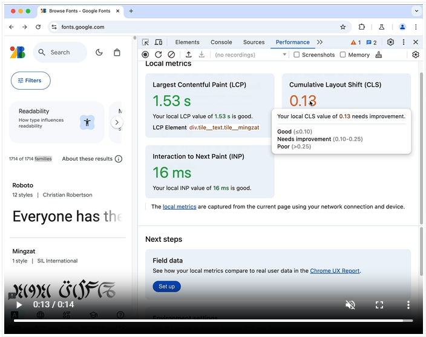
<!-- /static/docs/devtools/performance/overview/video/observe-metrics.mp4 -->

Under the three metric cards in the **Interactions** and **Layout shifts** tabs, you can find tables with information on captured interactions and layout shifts, including elements, timings, phases (for interactions), and scores (for layout shifts).  To clear both lists, click **Clear** (block-icon<!--  -->).

To get a breakdown of a metric score, hover over the metric value to see a tooltip.


<!-- ------------------------------ -->
#### Compare your experience to the experience of your users

You can also fetch field data from the [Chrome UX Report](https://developer.chrome.com/docs/crux) and compare the experience of your site's users to your local metrics.

To add field data:

1. In **Performance** > **Next steps** > **Field data**, click **Set up**.

   

1. In the **Configure field data fetching** dialog, note the **Privacy disclosure**, and click **Ok**.

   <!-- expander section -->
   Advanced: Set up a mapping between development and production environments:

      Optionally, to automatically get the most relevant field data, you can set up (multiple) mappings between your development and production origins:
      
      1. In the dialog window, expand the **Advanced** section and click **+ New**.
   
      1. In the mapping table, enter your development and production URLs and click **+**.
      
      
   
      For example, a mapping of `http://localhost:8080` to `https://example.com` will bring up field data for `example.com/page1` when you navigate to `localhost:8080/page1`.
      
      Additionally, if for some reason you can't get the field data automatically, you can turn on (check_box icon) **Always show field data for the below URL** and provide a URL.  The **Performance** panel will attempt to fetch field data for this URL first and then show you this field data no matter what page you navigate to.
      
      To change your field data fetch settings after setup, click **Field data** > **Configure**.
       
   <!-- end expander section -->

   With the field data fetch set up, the **Performance** panel now shows you a comparison between your local metric scores and those that your users experience.  You can see the collection period in the **Field data** section on the right.

   

   To get a breakdown of a metric score, hover over the metric value to see a tooltip.


<!-- ------------------------------ -->
#### Configure your environment to better match that of your users

With the field data fetch set up as described in the previous section, the **Performance** panel provides you with recommendations on how to configure your environment to better match the experience of your users.


To configure your environment:

1. In each metric card, expand the **Consider your local test conditions** section, if any, and read the recommendations.

   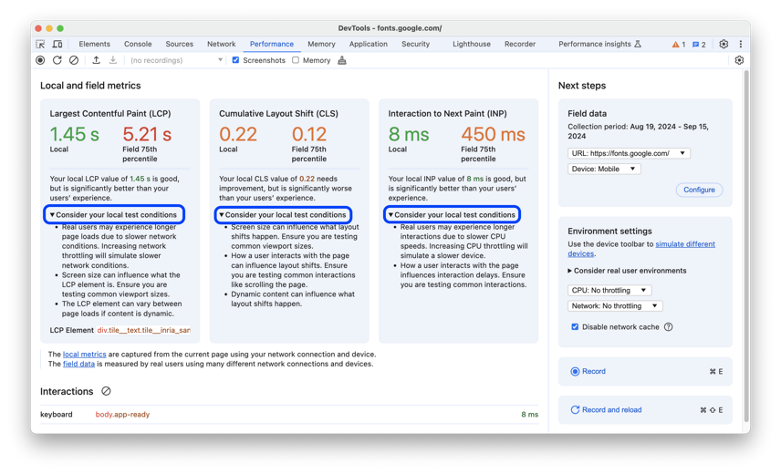

   Looks like in this example, to better match the experience of your users, you might want to use a common desktop screen size and throttle down the CPU and network.

1. To match the environment configuration for this example:

   1. Set your viewport to one of the common screen sizes (for example, 720p or 1080p). To emulate specific devices and screen sizes, you can use the [Device mode](https://developer.chrome.com/docs/devtools/device-mode) in the **Elements** tool.  See [Emulate mobile devices (Device Emulation)](https://learn.microsoft.com/en-us/microsoft-edge/devtools-guide-chromium/device-mode/).<!-- todo: ok to change link 1 to link 2? -->

   1. 82% users of the website in this example use desktops to browse. To make sure that you compare your local metric scores to the correct field data, you can select **Desktop** from the **Field data** > **Device** drop-down list.

   1. In the **Environment settings** section, set the **Network** drop-down list to, for example, **Fast 4G**, and **CPU** to, for example, **20x slowdown**.  You may also make sure to select the **Disable network cache** checkbox in the same section.

1. With your environment configured, reload the page, interact with it to capture your local INP, and compare the metric scores again.

   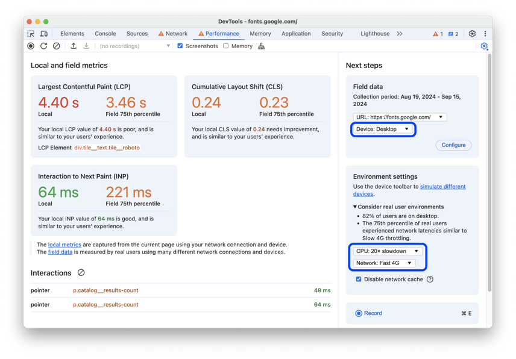

   Looks like the metric scores are now more similar to those that your users experience. Accordingly, the **Consider your local test conditions** sections disappeared from the metric cards.

With that, you can now start improving the [Core Web Vitals](https://web.dev/articles/vitals) of your website:

* [Optimize LCP](https://web.dev/articles/optimize-lcp)
* [Optimize INP](https://web.dev/articles/optimize-inp)
* [Optimize CLS](https://web.dev/articles/optimize-cls)


<!-- ====================================================================== -->
## Next steps

<!--The foundation for understanding performance is the RAIL model.  The RAIL model teaches you the performance metrics that are most important to your users.
To learn more, see [Measure Performance With The RAIL Model](https://web.dev/rail/). -->

To get more comfortable with the **Performance** tool, practice profiling your pages and analyzing the results.

If you have any questions about your results, in the **Activity Bar**, select **Help** () > **Feedback**.  Or, press **Alt+Shift+I** (Windows, Linux) or **Option+Shift+I** (macOS).
 
Or, [file an issue on the MicrosoftEdge / DevTools repo](https://github.com/MicrosoftEdge/DevTools/issues).

In your feedback, include screenshots or links to reproducible pages, if possible.

There are many ways to improve runtime performance.  This article focused on one particular animation bottleneck to give you a focused tour of the **Performance** tool, but it's only one of many bottlenecks you may encounter.  <!--  The rest of the Rendering Performance series has a lot of good tips for improving various aspects of runtime performance, such as:  -->

<!--
* [Optimize JavaScript execution](https://web.dev/optimize-javascript-execution/)
* [Reduce the scope and complexity of style calculations](https://web.dev/reduce-the-scope-and-complexity-of-style-calculations/)
* [Avoid large, complex layouts and layout thrashing](https://web.dev/avoid-large-complex-layouts-and-layout-thrashing/)
* [Simplify paint complexity and reduce paint areas](https://web.dev/simplify-paint-complexity-and-reduce-paint-areas/)
* [Stick to Compositor-Only Properties and Manage Layer Count](https://web.dev/stick-to-compositor-only-properties-and-manage-layer-count/)
* [Debounce your input handlers](https://web.dev/debounce-your-input-handlers/)
-->


<!-- ====================================================================== -->
> [!NOTE]
> Portions of this page are modifications based on work created and [shared by Google](https://developers.google.com/terms/site-policies) and used according to terms described in the [Creative Commons Attribution 4.0 International License](https://creativecommons.org/licenses/by/4.0). 
> The original page is found [here](https://developer.chrome.com/docs/devtools/evaluate-performance/) and is authored by Kayce Basques.

[](https://creativecommons.org/licenses/by/4.0)
This work is licensed under a [Creative Commons Attribution 4.0 International License](https://creativecommons.org/licenses/by/4.0).
