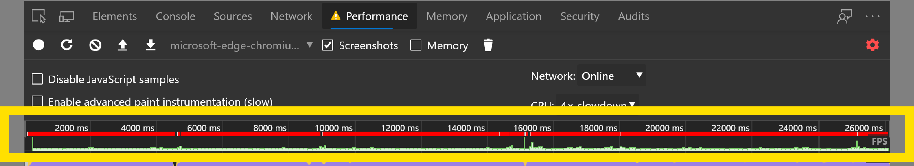
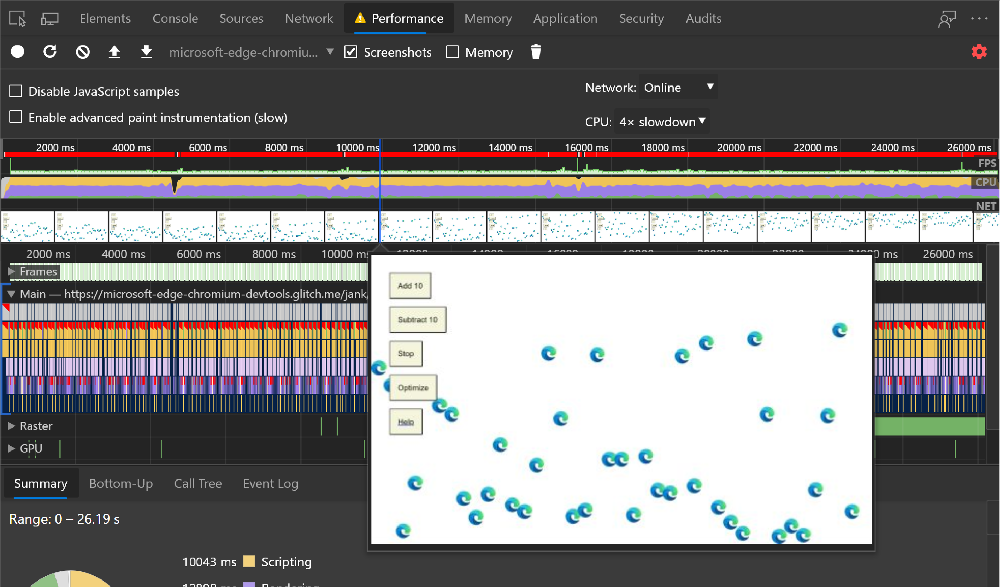

<!-- Copyright Kayce Basques

   Licensed under the Apache License, Version 2.0 (the "License");
   you may not use this file except in compliance with the License.
   You may obtain a copy of the License at

       https://www.apache.org/licenses/LICENSE-2.0

   Unless required by applicable law or agreed to in writing, software
   distributed under the License is distributed on an "AS IS" BASIS,
   WITHOUT WARRANTIES OR CONDITIONS OF ANY KIND, either express or implied.
   See the License for the specific language governing permissions and
   limitations under the License.  -->
# Get started analyzing runtime performance

_Runtime performance_ is how your page performs when it's running, as opposed to loading.  The following tutorial teaches you how to use the DevTools **Performance** tool to analyze runtime performance.

In terms of the **RAIL** model, the skills you learn in this tutorial are useful for analyzing the Response, Animation, and Idle phases of your page.

See also [Optimize website speed using Lighthouse](../speed/get-started.md).

<!--todo: add rail link when section is ready -->


<!-- ====================================================================== -->
## Get started

In the following tutorial, you open DevTools on a "Sluggish Animation" demo page and use the **Performance** tool to find a performance bottleneck on the page.

1. Open Microsoft Edge in **InPrivate Mode**.  InPrivate Mode ensures that Microsoft Edge runs in a clean state.  For example, if you have a lot of extensions installed, the extensions may create noise in your performance measurements.

   <!--TODO: replace section when updated for Chromium-based Edge  -->

1. Load the following "Sluggish Animation" demo page in your InPrivate window.  You'll profile this page, which shows a variable number of icons moving up and down.

   ```https
   https://microsoftedge.github.io/Demos/devtools-performance-get-started/
   ```

    <!-- You can view the source files for the "Sluggish Animation" demo page at the [MicrosoftEdge/Demos > devtools-performance-get-started](https://github.com/MicrosoftEdge/Demos/tree/main/devtools-performance-get-started) repo folder. -->

1. Press `Ctrl`+`Shift`+`I` (Windows, Linux) or `Command`+`Option`+`I` (macOS) to open DevTools.

   

For the rest of the screenshots below, DevTools is [undocked to a separate window](../customize/placement.md), to better focus on the contents.


### Simulate a mobile CPU

Mobile devices have much less CPU power than desktops and laptops.  Whenever you profile a page, use CPU Throttling to simulate how your page performs on mobile devices.

1. In DevTools, open the **Performance** tool.

1. Select the checkbox next to **Screenshots**.

1. Click **Capture Settings** ().  DevTools reveals settings related to how it captures performance metrics.

1. For **CPU**, select **4x slowdown**.  DevTools throttles your CPU so that it is 4 times slower than usual.

   

   When testing other pages; if you want to ensure that each page works well on low-end mobile devices, set CPU Throttling to **6x slowdown**.  The demo doesn't work well with 6x slowdown, so it just uses 4x slowdown for instructional purposes.


### Set up the demo

It's hard to create a runtime performance demo that works consistently for all readers of the website.  The following section lets you customize the demo to make sure that your experience is relatively consistent with the screenshots and descriptions, regardless of your particular setup.

1. Click the **Add 10** button until the blue icons move noticeably slower than before.  On a high-end machine, you can click it about 20 times.

1. Click **Optimize**.  The blue icons should move faster and more smoothly.

1. To better display a difference between the optimized and un-optimized versions, click the **Subtract 10** button a few times and try again.  If you add too many blue icons, you might max out the CPU, and then you might not observe a major difference in the results for the two versions.

1. Click **Un-Optimize**.  The blue icons move slower and with more sluggishness again.


### Record runtime performance

When you ran the optimized version of the page, the blue icons move faster.  Why is that?  Both versions are supposed to move the icons the same amount of space in the same amount of time.  Take a recording in the **Performance** tool to learn how to detect the performance bottleneck in the un-optimized version.

1. In DevTools, click **Record** ().  DevTools captures performance metrics as the page runs.

   

1. Wait a few seconds.

1. Click **Stop**.  DevTools stops recording, processes the data, then displays the results in the **Performance** tool.

   

That's an overwhelming amount of data, but it'll all make more sense shortly.


<!-- ====================================================================== -->
## Analyze the results

Once you have a recording of the page's performance, you can assess the page's performance and find the cause of any performance issues.


### Analyze frames per second

The main metric for measuring the performance of any animation is frames per second (FPS).  Users are happy when animations run at 60 FPS.

1. Look at the **FPS** chart, shown below.  Whenever a red bar is displayed above **FPS**, it means that the framerate dropped so low that it's probably harming the user experience.  In general, the higher the green bar, the higher the FPS.

   

1. Below the **FPS** chart, the **CPU** chart is displayed.  The colors in the **CPU** chart correspond to the colors in the **Summary** panel, at the bottom of the **Performance** tool.  The fact that the **CPU** chart is full of color means that the CPU was maxed out during the recording.  Whenever the CPU is maxed out for long periods, that's an indicator that you should find ways to do less work.

   

1. Hover over the **FPS**, **CPU**, or **NET** charts.  DevTools shows a screenshot of the page at that point in time.  Move your mouse left and right to replay the recording.  The action is called _scrubbing_, and it's useful for manually analyzing the progression of animations.

   

1. In the **Frames** section, hover on one of the green squares.  DevTools shows you the FPS for that particular frame.  Each frame is probably well below the target of 60 FPS.

   

The display indicates that the webpage isn't performing well.  In real scenarios, it may not be so clear whether the page is performing well, so having all of the tools to make measurements comes in handy.


#### Bonus: Open the FPS meter

Another handy tool is the FPS meter, which provides real-time estimates for FPS as the page runs.

1. Press `Ctrl`+`Shift`+`P` (Windows, Linux) or `Command`+`Shift`+`P` (macOS) to open the **Command Menu**.

1. Start typing `Rendering` in the **Command Menu** and click **Show Rendering**.

1. In the **Rendering** tool, turn on **FPS Meter**.  A new overlay appears in the top-right of your viewport.

   

1. Turn off the **FPS Meter** and press `Escape` to close the **Rendering** tool.  You aren't using **FPS Meter** in this tutorial.


### Find the bottleneck

After you measured and verified that the animation isn't performing well, the next step is to answer the question "why?".

1. When no events are selected, the **Summary** panel shows you a breakdown of activity.  The page spent most of the time rendering.  Since performance is the art of doing less work, your goal is to reduce the amount of time spent doing rendering work.

   

1. Expand the **Main** section.  DevTools shows you a flame chart of activity on the main thread, over time.  The x-axis represents the recording, over time.  Each bar represents an event.  A wider bar means that event took longer.  The y-axis represents the call stack.  When events are stacked on top of each other, it means the upper events caused the lower events.

   

1. There's a lot of data in the recording.  To Zoom into a single event, click, hold, and drag your cursor over the **Overview**, which is the section that includes the **FPS**, **CPU**, and **NET** charts.  The **Main** section and **Summary** panel only display information for the selected portion of the recording.

   

   Another way to zoom is to put focus on the **Main** section, click the background or an event, and press `W`, `A`, `S`, or `D`.

1. Focus on the red triangle in the top-right of the **Animation Frame Fired** event.  Whenever a red triangle is displayed, it's a warning that there may be an issue related to the event.

   The **Animation Frame Fired** event occurs whenever a [requestAnimationFrame() callback](https://developer.mozilla.org/docs/Web/API/window/requestAnimationFrame) is run.

1. Click the **Animation Frame Fired** event.  The **Summary** panel now shows you information about that event.  Note the **Reveal** link.  After you click it, DevTools highlights the event that initiated the **Animation Frame Fired** event.  Also, focus on the **app.js:95** link.  After you click it, the relevant line in the source code is displayed.

   

   After clicking an event, use the arrow keys to select the events next to it.

1. Under the **app.update** event, there's a bunch of purple events.  If each purple event was wider, it looks as though each one may have a red triangle on it.

1. Click one of the purple **Layout** events.  DevTools provides more information about the event in the **Summary** panel.  Indeed, there is a warning about forced reflows (another word for _layout_).

1. In the **Summary** panel, click the **app.js:71** link under **Layout Forced**.  DevTools takes you to the line of code that forced the layout.

   

   The problem with the code is that, in each animation frame, it changes the style for each icon, and then queries the position of each icon on the page.  Because the styles changed, the browser doesn't know if each icon position changed, so it has to re-layout the icon in order to compute the new position.
   <!--
   > To learn more, see [Avoid forced synchronous layouts](https://web.dev/avoid-large-complex-layouts-and-layout-thrashing/#avoid-forced-synchronous-layouts).
   -->

That was a lot to learn.  You now have a solid foundation in the basic workflow for analyzing runtime performance.  Good job.


### Bonus: Analyze the optimized version

Using the workflows and tools that you just learned, click **Optimize** on the demo to turn on the optimized code, take another performance recording, and then analyze the results.  From the improved framerate to the reduction in events in the flame chart in the **Main** section, the optimized version of the app does much less work, resulting in better performance.

Even the optimized version isn't great, because it manipulates the `top` property of every icon.  A better approach is to stick to properties that only affect compositing.
<!--  > For more information, see [Use transform and opacity changes for animations](https://web.dev/stick-to-compositor-only-properties-and-manage-layer-count/#use-transform-and-opacity-changes-for-animations). todo: add rendering section when available -->


<!-- ====================================================================== -->
## Next steps

<!--The foundation for understanding performance is the RAIL model.  The RAIL model teaches you the performance metrics that are most important to your users.
To learn more, see [Measure Performance With The RAIL Model](https://web.dev/rail/). -->

To get more comfortable with the **Performance** tool, practice makes perfect.  Try profiling your pages and analyzing the results.  If you have any questions about your results, use the **Send Feedback** icon, press `Alt`+`Shift`+`I` (Windows, Linux) or `Option`+`Shift`+`I` (macOS), or [tweet the DevTools team](https://twitter.com/intent/tweet?text=@EdgeDevTools).  Include screenshots or links to reproducible pages, if possible.


<!-- To really become an expert in runtime performance, you must learn how the browser translates HTML, CSS, and JS into pixels on a screen.  The best place to start is the [Rendering Performance](https://web.dev/rendering-performance/).  [The Anatomy Of A Frame](https://aerotwist.com/blog/the-anatomy-of-a-frame/) dives into even more detail. -->

Last, there are many ways to improve runtime performance.  This article focused on one particular animation bottleneck to give you a focused tour of the **Performance** tool, but it's only one of many bottlenecks you may encounter.  <!--  The rest of the Rendering Performance series has a lot of good tips for improving various aspects of runtime performance, such as:  -->

<!--
* [Optimize JavaScript execution](https://web.dev/optimize-javascript-execution/)
* [Reduce the scope and complexity of style calculations](https://web.dev/reduce-the-scope-and-complexity-of-style-calculations/)
* [Avoid large, complex layouts and layout thrashing](https://web.dev/avoid-large-complex-layouts-and-layout-thrashing/)
* [Simplify paint complexity and reduce paint areas](https://web.dev/simplify-paint-complexity-and-reduce-paint-areas/)
* [Stick to Compositor-Only Properties and Manage Layer Count](https://web.dev/stick-to-compositor-only-properties-and-manage-layer-count/)
* [Debounce your input handlers](https://web.dev/debounce-your-input-handlers/)
-->


<!-- ====================================================================== -->
> [!NOTE]
> Portions of this page are modifications based on work created and [shared by Google](https://developers.google.com/terms/site-policies) and used according to terms described in the [Creative Commons Attribution 4.0 International License](https://creativecommons.org/licenses/by/4.0).
> The original page is found [here](https://developer.chrome.com/docs/devtools/evaluate-performance/) and is authored by [Kayce Basques](https://developers.google.com/web/resources/contributors#kayce-basques) (Technical Writer, Chrome DevTools \& Lighthouse).

[](https://creativecommons.org/licenses/by/4.0)
This work is licensed under a [Creative Commons Attribution 4.0 International License](https://creativecommons.org/licenses/by/4.0).
