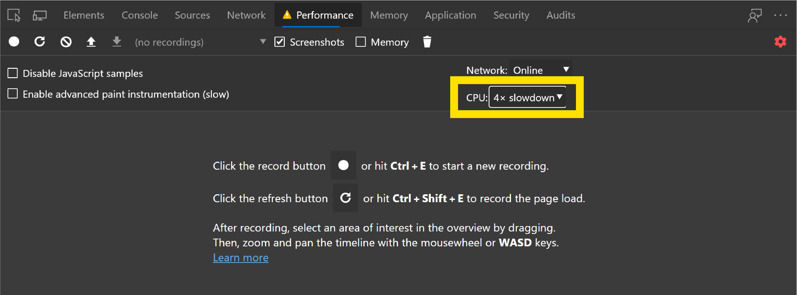

<!-- Copyright Kayce Basques

   Licensed under the Apache License, Version 2.0 (the "License");
   you may not use this file except in compliance with the License.
   You may obtain a copy of the License at

       https://www.apache.org/licenses/LICENSE-2.0

   Unless required by applicable law or agreed to in writing, software
   distributed under the License is distributed on an "AS IS" BASIS,
   WITHOUT WARRANTIES OR CONDITIONS OF ANY KIND, either express or implied.
   See the License for the specific language governing permissions and
   limitations under the License.  -->
# Introduction to the Performance tool

_Runtime performance_ is how your page performs when it's running, as opposed to loading.  The following tutorial teaches you how to use the DevTools **Performance** tool to analyze runtime performance.

The skills you learn in this tutorial are useful for analyzing loading, interactivity, and visual stability of your web content, which are also key indicators for [Core Web Vitals](https://web.dev/vitals/).  Each of the Core Web Vitals represents a distinct facet of the user experience, is measurable in the field, and reflects the real-world experience of a critical user-centric outcome.  You can see these Core Web Vitals in the **Performance** tool.

See also:
- [Optimize website speed using Lighthouse](../speed/get-started.md)

<!-- ====================================================================== -->
## Get started

In the following tutorial, you open DevTools on a "Sluggish Animation" demo page and use the **Performance** tool to find a performance bottleneck on the page.

1. Open the [Sluggish Animation](https://microsoftedge.github.io/Demos/devtools-performance-get-started/) demo page in your InPrivate tab or window.  To do that, right-click the link and then select **Open link in InPrivate window**.  You'll profile this page, which shows a variable number of icons moving up and down. For more information about InPrivate, see [Browse InPrivate in Microsoft Edge](https://support.microsoft.com/en-us/microsoft-edge/browse-inprivate-in-microsoft-edge-cd2c9a48-0bc4-b98e-5e46-ac40c84e27e2)

   Note: The source for this demo is at [MicrosoftEdge / Demos > devtools-performance-get-started](https://github.com/MicrosoftEdge/Demos/tree/main/devtools-performance-get-started).

1. Press `Ctrl`+`Shift`+`I` (Windows, Linux) or `Command`+`Option`+`I` (macOS) to open DevTools.

   


For the rest of the following screenshots, DevTools is [undocked to a separate window](../customize/placement.md), to better focus on the contents.


### Simulate a mobile CPU

Mobile devices have much less CPU power than desktops and laptops.  Whenever you profile a page, use CPU Throttling to simulate how your page performs on mobile devices.

1. In DevTools, open the **Performance** tool.

1. Select the **Screenshots** checkbox.

1. Click **Capture settings** ().  DevTools reveals settings related to how it captures performance metrics.

1. For **CPU**, select **4x slowdown**.  DevTools throttles your CPU so that it's 4 times slower than usual.

   

   If you want to ensure that pages work well on low-end mobile devices, set **CPU** to **6x slowdown**.  The demo doesn't work well with 6x slowdown, so it just uses 4x slowdown for instructional purposes.


### Set up the demo

The following section lets you customize the demo to make sure that your experience is relatively consistent with the screenshots and descriptions.

1. Click the **Add 10** button until the blue icons move noticeably slower than before.  On a high-end machine, you can click it about 20 times.

1. Click **Optimize**.  The blue icons should move faster and more smoothly.

1. To better display a difference between the optimized and non-optimized versions, click the **Subtract 10** button a few times and try again.  If you add too many blue icons, you could max out the CPU, and then you might not observe a major difference in the results for the two versions.

1. Click **Un-Optimize**.  The blue icons move slower and with more sluggishness again.


### Record runtime performance

When you ran the optimized version of the page, the blue icons move faster.  Why is that?  Both versions are supposed to move the icons the same amount of space in the same amount of time.  Take a recording in the **Performance** tool to learn how to detect the performance bottleneck in the non-optimized version.

1. In DevTools, click **Record** ().  DevTools captures performance metrics as the page runs.

   

1. Wait a few seconds.

1. Click **Stop**.  DevTools stops recording, processes the data, then displays the results in the **Performance** tool.

   


These performance results show an overwhelming amount of data, but it will all make more sense shortly.


<!-- ====================================================================== -->
## Analyze the results

Once you have a recording of the page's performance, you can assess the page's performance and find the cause of any performance issues.

1. The **CPU** chart is displayed along the top.  The colors in the **CPU** chart correspond to the colors in the **Summary** panel, at the bottom of the **Performance** tool.  The **CPU** chart shows that these regions make up a large area, meaning that the CPU was maxed out during the recording.  Whenever the CPU is maxed out for long periods, that's an indicator that the page is not performing well.

   

1. Hover over the **CPU** or **NET** charts.  DevTools shows a screenshot of the page at that point in time.  Move your mouse left and right to replay the recording.  The action is called _scrubbing_, and it's useful for manually analyzing the progression of the performance recording.

   


#### Bonus: Open the Frame Rendering Stats overlay

Another handy tool is the **Frame Rendering Stats** overlay, which provides real-time estimates for FPS as the page runs. The **Frame Rendering Stats** overlay is not required for this tutorial but may provide helpful insight.

1. In DevTools, press `Ctrl`+`Shift`+`P` (Windows, Linux) or `Command`+`Shift`+`P` (macOS) to open the **Command Menu**.

1. Start typing `Rendering` in the **Command Menu** and click **Show Rendering**.

1. In the **Rendering** tool, turn on **Frame Rendering Stats**.  A new overlay appears in the top-left of your webpage.

   

1. When you are done reviewing the FPS data, clear the **Frame Rendering Stats** checkbox to hide the overlay.


### Find the bottleneck

After you verified that the animation isn't performing well, the next step is to answer the question "why?"

1. When no events are selected, the **Summary** panel shows you a breakdown of activity.  The page spent most of the time rendering.  Since performance is the art of doing less work, your goal is to reduce the amount of time spent doing rendering work.

   

1. Expand the **Main** section.  DevTools shows you a flame chart of activity on the main thread, over time.  The x-axis represents the recording, over time.  Each bar represents an event.  A wider bar means that event took longer.  The y-axis represents the call stack.  When events are stacked on top of each other, it means the upper events caused the lower events.

   

1. There is a lot of data in the recording.  To zoom into a portion of the recording, click and drag in the **Overview** area toward the top of the **Performance** tool.  The **Overview** area includes the **CPU** and **NET** charts (indicated on the right).  The **Main** section and **Summary** panel only display information for the selected portion of the recording.

   

   Another way to change the selected area is to put focus on the **Main** section, click the background or an event, and then press:
   * `W` to zoom in, `S` to zoom out.
   * `A` to move selection left, `D` to move selection right.

1. Select an **Animation Frame Fired** event.  When a red triangle is displayed at the top right of an event, it's a warning that there might be an issue related to the event.

   The **Animation Frame Fired** event occurs whenever a [requestAnimationFrame() callback](https://developer.mozilla.org/docs/Web/API/window/requestAnimationFrame) is run.

1. Click the **Animation Frame Fired** event.  The **Summary** panel now shows you information about that event.  Note the **Reveal** link.  After you click it, DevTools highlights the event that initiated the **Animation Frame Fired** event.  Also, focus on the **app.js:96** link.  After you click it, the relevant line in the source code is displayed.

   

   After clicking an event, use the arrow keys to select the events next to it.

1. Under the **app.update** event, there's a bunch of purple events, and they each have a red triangle.

1. Click one of the purple **Layout** events.  DevTools provides more information about the event in the **Summary** panel.  There is a warning about forced reflows (another word for _layout_).

1. In the **Summary** panel, click the **app.js:72** link under **Layout Forced**.  DevTools takes you to the line of code that forced the layout.

   

   The problem with the non-optimized code is that, in each animation frame, it changes the style for each icon, and then queries the position of each icon on the page. Because the styles changed, the browser doesn't know if each icon position changed, so it has to re-layout the icon in order to compute the new position.
   <!--
   > To learn more, see [Avoid forced synchronous layouts](https://web.dev/avoid-large-complex-layouts-and-layout-thrashing/#avoid-forced-synchronous-layouts).
   -->


This article gives you a lot to learn. But now you have a solid foundation in the basic workflow for analyzing runtime performance.  Good job.


### Analyze the optimized version

Using the workflows and tools that you just learned, click **Optimize** on the demo to turn on the optimized code, take another performance recording, and then analyze the results.  From the improved framerate to the reduction in events in the flame chart in the **Main** section, the optimized version of the app does much less work, resulting in better performance.

Compare this snippet of JavaScript from the unoptimized version of the app:

```javascript
var pos = m.classList.contains("down")
  ? m.offsetTop + distance
  : m.offsetTop - distance;
if (pos < 0) pos = 0;
if (pos > maxHeight) pos = maxHeight;
m.style.top = pos + "px";
if (m.offsetTop === 0) {
  m.classList.remove("up");
  m.classList.add("down");
}
if (m.offsetTop === maxHeight) {
  m.classList.remove("down");
  m.classList.add("up");
}
```

The above code snippet runs on every frame of the browser rendering loop, for each blue icon on the page.  The `m` variable references a single blue icon.

In this unoptimized version, we create a `pos` variable that's set to the current position of the icon, to which we add some distance.  The current position of the icon is read by using `m.offsetTop`.

After making sure that the icon is still within the bounds of the page, we set its new position by using `m.style.top`, which sets inline styles on the element.

Finally, we read `m.offsetTop` again, to adjust the direction of the icon.

The optimized code uses a different sequence of actions to do less work. Here is the same snippet of JavaScript from the optimized version of the app: 

```javascript
var pos = parseInt(m.style.top.slice(0, m.style.top.indexOf("px")));
m.classList.contains("down") ? (pos += distance) : (pos -= distance);
if (pos < 0) pos = 0;
if (pos > maxHeight) pos = maxHeight;
m.style.top = pos + "px";
if (pos === 0) {
  m.classList.remove("up");
  m.classList.add("down");
}
if (pos === maxHeight) {
  m.classList.remove("down");
  m.classList.add("up");
}
```

In the optimized version, we first set the value of the `pos` variable by reading `m.style.top` instead of using `m.offsetTop`.  Using the element's inline style is faster because reading `m.offsetTop` forces the browser engine to know where all the elements are on the page, which requires the engine to recalculate the styles and the layout.

We then set the new position of the icon like the previous version, but we don't read `m.offsetTop` again like we did before to adjust the icon's direction.

The unoptimized code reads and writes the position of the icon from two different places, forcing the browser to recalculate the style and layout on each frame. The optimized version, however, writes and reads the position of the icon in the inline styles only.

Note that this code could be made even faster by using CSS properties that only require the browser to do compositing, rather than layout.  Instead of manipulating the `top` property which forces the browser to run its layout code again, using the `transform` property would allow the browser to consider each icon as individual layers and display these layers in the right positions by re-compositing the final image.  For example, instead of using `m.style.top = pos + "px";`, we can use `m.style.transform = translateY(pos + "px,");`.

To learn more, see [Use transform and opacity changes for animations](https://web.dev/stick-to-compositor-only-properties-and-manage-layer-count/#use-transform-and-opacity-changes-for-animations).

<!-- ====================================================================== -->
## Next steps

To get more comfortable with the **Performance** tool, practice makes perfect.  Try profiling your pages and analyzing the results.  If you have any questions about your results, use the **Send Feedback** icon, press `Alt`+`Shift`+`I` (Windows, Linux) or `Option`+`Shift`+`I` (macOS), or [file an issue on the MicrosoftEdge / DevTools repo](https://github.com/MicrosoftEdge/DevTools/issues).  Include screenshots or links to reproducible pages, if possible.


Last, there are many ways to improve runtime performance.  This article focused on one particular animation bottleneck to give you a focused tour of the **Performance** tool, but it's only one of many bottlenecks you may encounter.  <!--  The rest of the Rendering Performance series has a lot of good tips for improving various aspects of runtime performance, such as:  -->

<!--
* [Optimize JavaScript execution](https://web.dev/optimize-javascript-execution/)
* [Reduce the scope and complexity of style calculations](https://web.dev/reduce-the-scope-and-complexity-of-style-calculations/)
* [Avoid large, complex layouts and layout thrashing](https://web.dev/avoid-large-complex-layouts-and-layout-thrashing/)
* [Simplify paint complexity and reduce paint areas](https://web.dev/simplify-paint-complexity-and-reduce-paint-areas/)
* [Stick to Compositor-Only Properties and Manage Layer Count](https://web.dev/stick-to-compositor-only-properties-and-manage-layer-count/)
* [Debounce your input handlers](https://web.dev/debounce-your-input-handlers/)
-->


<!-- ====================================================================== -->
> [!NOTE]
> Portions of this page are modifications based on work created and [shared by Google](https://developers.google.com/terms/site-policies) and used according to terms described in the [Creative Commons Attribution 4.0 International License](https://creativecommons.org/licenses/by/4.0). 
> The original page is found [here](https://developer.chrome.com/docs/devtools/evaluate-performance/) and is authored by [Kayce Basques](https://developers.google.com/web/resources/contributors#kayce-basques) (Technical Writer, Chrome DevTools \& Lighthouse).

[](https://creativecommons.org/licenses/by/4.0)
This work is licensed under a [Creative Commons Attribution 4.0 International License](https://creativecommons.org/licenses/by/4.0).
