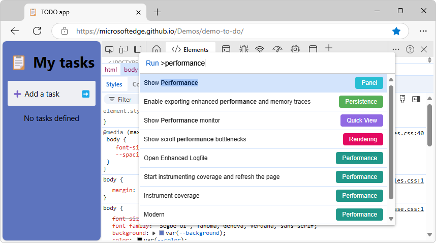

<!-- Copyright Kayce Basques

   Licensed under the Apache License, Version 2.0 (the "License");
   you may not use this file except in compliance with the License.
   You may obtain a copy of the License at

       https://www.apache.org/licenses/LICENSE-2.0

   Unless required by applicable law or agreed to in writing, software
   distributed under the License is distributed on an "AS IS" BASIS,
   WITHOUT WARRANTIES OR CONDITIONS OF ANY KIND, either express or implied.
   See the License for the specific language governing permissions and
   limitations under the License.  -->
<!-- https://developer.chrome.com/docs/devtools/performance/overview -->
# Performance tool: Analyze your website's performance

Use the **Performance** tool to analyze your website's performance.

<!-- ====================================================================== -->
## Overview

The **Performance** tool lets you record CPU performance profiles of your web applications.  Analyze profiles to find potential performance bottlenecks and ways you can optimize resource use.

Use the **Performance** tool to do the following:

* Record a performance profile.
* Change capture settings.
* Analyze a performance report.

For a comprehensive guide on improving your website's performance, see [Analyze runtime performance (tutorial)](./index.md).

<!-- ====================================================================== -->
## Open the Performance tool

To open the **Performance** tool, open DevTools and select **Performance** from a set of tabs at the top.

Alternatively, follow these steps to open the **Performance** tool with the **Command menu**:

1. [Open DevTools](../overview.md#open-devtools).

1. Open the **Command menu** by pressing:

   * macOS: **Command+Shift+P**

   * Windows, Linux, ChromeOS: **Control+Shift+P**

   

1. Start typing **performance**, select **Show Performance [panel]**, and then press **Enter**.

<!-- ====================================================================== -->
## Observe Core Web Vitals live

When you open the **Performance** tool, it immediately captures and shows you your local [Largest Contentful Paint (LCP)](https://web.dev/articles/lcp) and [Cumulative Layout Shift (CLS)](https://web.dev/articles/cls) metrics tells you their score (good, needs improvement, or bad).

If you interact with your page, the **Performance** tool also captures your local [Interaction to Next Paint (INP)](https://web.dev/articles/inp) and its score, which, in addition to LCP and CLS, gives you a complete overview of [Core Web Vitals](https://web.dev/articles/vitals) of your page using your network connection and device.

<!-- /static/docs/devtools/performance/overview/video/observe-metrics.mp4 -->

Under the three metric cards in the **Interactions** and **Layout shifts** tabs, you can find tables with information on captured interactions and layout shifts, including elements, timings, phases (for interactions), and scores (for layout shifts).  To clear both lists, click **Clear** (block-icon<!--  -->).

To get a breakdown of a metric score, hover over the metric value to see a tooltip.

<!-- ====================================================================== -->
## Compare your experience to the experience of your users

You can also fetch field data from the [Chrome UX Report](https://developer.chrome.com/docs/crux) and compare the experience of your site's users to your local metrics.

To add field data:

1. In **Performance** > **Next steps** > **Field data**, click **Set up**.

   

1. In the **Configure field data fetching** dialog, note the **Privacy disclosure**, and click **Ok**.

   <!-- expander section -->
   Advanced: Set up a mapping between development and production environments:

      Optionally, to automatically get the most relevant field data, you can set up (multiple) mappings between your development and production origins:
      
      1. In the dialog window, expand the **Advanced** section and click **+ New**.
   
      1. In the mapping table, enter your development and production URLs and click **+**.
      
      
   
      For example, a mapping of `http://localhost:8080` to `https://example.com` will bring up field data for `example.com/page1` when you navigate to `localhost:8080/page1`.
      
      Additionally, if for some reason you can't get the field data automatically, you can turn on (check_box icon) **Always show field data for the below URL** and provide a URL.  The **Performance** panel will attempt to fetch field data for this URL first and then show you this field data no matter what page you navigate to.
      
      To change your field data fetch settings after setup, click **Field data** > **Configure**.
       
   <!-- end expander section -->

   With the field data fetch set up, the **Performance** panel now shows you a comparison between your local metric scores and those that your users experience.  You can see the collection period in the **Field data** section on the right.

   

   To get a breakdown of a metric score, hover over the metric value to see a tooltip.

<!-- ------------------------------ -->
#### Configure your environment to better match that of your users

With the field data fetch set up as described in the previous section, the **Performance** panel provides you with recommendations on how to configure your environment to better match the experience of your users.

To configure your environment:

1. In each metric card, expand the **Consider your local test conditions** section, if any, and read the recommendations.

   

   Looks like in this example, to better match the experience of your users, you might want to use a common desktop screen size and throttle down the CPU and network.

1. To match the environment configuration for this example:

   1. Set your viewport to one of the common screen sizes (for example, 720p or 1080p). To emulate specific devices and screen sizes, you can use device emulation in the **Elements** tool; see [Emulate mobile devices (Device Emulation)](../device-mode/index.md).

   1. 82% users of the website in this example use desktops to browse.  To make sure that you compare your local metric scores to the correct field data, you can select **Desktop** from the **Field data** > **Device** drop-down list.

   1. In the **Environment settings** section, set the **Network** drop-down list to, for example, **Fast 4G**, and **CPU** to, for example, **20x slowdown**.  You may also make sure to select the **Disable network cache** checkbox in the same section.

1. With your environment configured, reload the page, interact with it to capture your local INP, and compare the metric scores again.

   

   Looks like the metric scores are now more similar to those that your users experience. Accordingly, the **Consider your local test conditions** sections disappeared from the metric cards.

With that, you can now start improving the [Core Web Vitals](https://web.dev/articles/vitals) of your website:

* [Optimize LCP](https://web.dev/articles/optimize-lcp)
* [Optimize INP](https://web.dev/articles/optimize-inp)
* [Optimize CLS](https://web.dev/articles/optimize-cls)

<!-- ====================================================================== -->
## Capture and analyze a performance report

In the next sections, follow guidance on how to record a profile, change capture settings, and analyze the report.

<!-- ------------------------------ -->
#### Record a performance profile

When you are ready to record, the **Performance** tool gives you the following options:

* [Record runtime performance](./reference.md#record-runtime-performance) in _Performance features reference_.
* [Record load performance](./reference.md#record-load-performance) in _Performance features reference_.
* [Capture screenshots while recording](./reference.md#capture-screenshots-while-recording) in _Performance features reference_.
* [Force garbage collection while recording](./reference.md#force-garbage-collection-while-recording) in _Performance features reference_.
* [Save and share a recording](./reference.md#save-and-share-a-recording) in _Performance features reference_.
* [Load a recording](./reference.md#load-a-recording) in _Performance features reference_.
* [Clear the previous recording](./reference.md#clear-the-previous-recording) in _Performance features reference_.

<!-- ------------------------------ -->
#### Change capture settings

**Capture settings** let you change how DevTools captures performance recordings and can give you additional information in the report.  Click the **Capture settings** () button to access the **Capture settings** menu.

Select the following options from the **Capture settings** menu:

* Select the **Disable JavaScript samples** checkbox:  Disables the recording of the JavaScript call stacks displayed in the Main track that are called during the recording.  Reduces performance overhead.  See [Disable JavaScript samples](../evaluate-performance/reference.md#disable-javascript-samples) in _Performance features reference_.

* Select the **Enable advanced rendering instrumentation (slow)** checkbox:  Captures advanced paint instrumentation.  Significantly hinders performance.  See [Enable advanced paint instrumentation](../evaluate-performance/reference.md#enable-advanced-paint-instrumentation) in _Performance features reference_.

* Select the **Enable CSS selector stats (slow)** checkbox: Captures CSS selector statistics.  Significantly hinders performance.  See [View CSS selector costs in the Performance tool sidebar](../whats-new/2024/11/devtools-131.md#view-css-selector-costs-in-the-performance-tool-sidebar) in _What's New in DevTools (Microsoft Edge 131)_.

* CPU throttling: Simulate slower CPU speeds.  See [Throttle the CPU while recording](../evaluate-performance/reference.md#throttle-the-cpu-while-recording) in _Performance features reference_.  

* Network throttling: Simulate slower network speeds.  See [Throttle the network while recording](../evaluate-performance/reference.md#throttle-the-network-while-recording) in _Performance features reference_.

<!-- ------------------------------ -->
#### Analyze a performance report

For a complete guide on how to use the **Performance** tool, see [Analyze a performance recording](../evaluate-performance/reference.md#analyze-a-performance-recording) in _Performance features reference_.

To navigate a performance report:

* See [Navigate the recording](../evaluate-performance/reference.md#navigate-the-recording) in _Performance features reference_.

* See [Search activities](../evaluate-performance/reference.md#search-activities) in _Performance features reference_.

* See [Track event initiators](../evaluate-performance/reference.md#track-event-initiators) in _Performance features reference_.

To focus on what matters for your workflow:

* [Change the order of tracks and hide them](../evaluate-performance/reference.md#change-the-order-of-tracks-and-hide-them)

* [Hide functions and their children in the flame chart](../evaluate-performance/reference.md#hide-functions-and-their-children-in-the-flame-chart)

<!-- todo: resume here: 9x left to convert: https://developer.chrome.com/docs/devtools/performance/reference# -->
* [Create breadcrumbs and jump between zoom levels](https://developer.chrome.com/docs/devtools/performance/reference#breadcrumbs)

To learn about the **Bottom-up**, **Call tree**, and **Event log** tabs:

* [View activities in a table](https://developer.chrome.com/docs/devtools/performance/reference#activities)

To analyze a performance report:

* [View main thread activity](https://developer.chrome.com/docs/devtools/performance/reference#main)
* [Read the flame chart](https://developer.chrome.com/docs/devtools/performance/reference#flame-chart)
* [View a screenshot](https://developer.chrome.com/docs/devtools/performance/reference#view-screenshot)
* [View memory metrics](https://developer.chrome.com/docs/devtools/performance/reference#memory)
* [View the duration of a portion of a recording](https://developer.chrome.com/docs/devtools/performance/reference#duration)
* [Analyze CSS selector performance during Recalculate Style events](https://developer.chrome.com/docs/devtools/performance/selector-stats)
* [Profile Node.js performance with the **Performance** tool](https://developer.chrome.com/docs/devtools/performance/nodejs)
* [Analyze frames per second (FPS)](https://developer.chrome.com/docs/devtools/performance/reference#fps)
* [Timeline event reference](https://developer.chrome.com/docs/devtools/performance/timeline-reference)

<!-- ====================================================================== -->
## Improve performance with these tools

Discover other tools that can help you improve your website's performance:

| Tool | Article |
|---|---|
| **Lighthouse** tool | [Optimize website speed using Lighthouse](../speed/get-started.md) |
| **Memory** tool | [Fix memory problems](../memory-problems/index.md) |
| **Performance** tool > **Insights** tab | * [Performance insights: Get actionable insights on your website's performance](https://developer.chrome.com/docs/devtools/performance-insights) |
| **Rendering** tool | [Rendering tool, to see what a webpage looks like with different display options or vision deficiencies](../rendering-tools/rendering-tool.md) |
| **Issues** tool | [Find and fix problems using the Issues tool](../issues/index.md) |
| **Performance** tool | [View layers information](../evaluate-performance/reference.md#view-layers-information) in _Performance features reference_ |

<!-- ====================================================================== -->
> [!NOTE]
> Portions of this page are modifications based on work created and [shared by Google](https://developers.google.com/terms/site-policies) and used according to terms described in the [Creative Commons Attribution 4.0 International License](https://creativecommons.org/licenses/by/4.0). 
> The original page is found [here](https://developer.chrome.com/docs/devtools/performance/overview) and is authored by Dale St. Marthe and Sofia Emelianova.

This work is licensed under a [Creative Commons Attribution 4.0 International License](https://creativecommons.org/licenses/by/4.0).

<!-- ====================================================================== -->
## View local and field metrics

todo: provisionally added new section from https://developer.chrome.com/blog/new-in-devtools-130#live-metrics-recommendations

The difference between the local and field metrics shows that most of your users might not experience your website under the same conditions as you do.  The **Environment settings** section gives you recommendations about simulating a slower CPU and network connection to better match with what your users experience.

todo: steps to:
1. Open the **Performance** tool.
1. Show landing page of **Performance** tool.
1. Explain what the local metrics are.  (Chrome docs calls them "live metrics", but the UI says "local metrics", which is better.)
1. Display the field metrics as well: click **Set up** under the **Field data** section.

Enabling field metrics changes the **Local metrics** section of the page to be **Local and field metrics**, and shows both the user's local metrics and metrics that were captured on real users' devices.

Live metrics provide metric-specific recommendations that help you configure your development environment as close as possible to what your users experience.  For information about live metrics, see [Observe Core Web Vitals live](#observe-core-web-vitals-live), above.

To get recommendations, first set up field data fetching from Chrome UX Report (CrUX).  To set up field data fetching, see [Compare your experience to the experience of your users](#compare-your-experience-to-the-experience-of-your-users), below.  For information about Chrome UX Report (CrUX), see [Overview of CrUX](https://developer.chrome.com/docs/crux)<!-- todo: make present repo match linked content, update link -->.

Then expand the **Consider your local test conditions** section in each metric card (if any) and **Consider real user environments** in the **Environment settings**.

The expanded sections with recommendations:

The above screenshot of the **Performance** tool's **Local metrics** home page contains the sections:
* **Largest Contentful Paint (LCP)**
* **Cumulative Layout Shift (CLS)**
* **Interaction to Next Paint (INP)**

To approximate the experience of your users, follow the recommendations in [Configure your environment to better match that of your users](#configure-your-environment-to-better-match-that-of-your-users), below.

<!-- ====================================================================== -->
## Simulate a real user environment

<!-- todo: also say this with the previous section [which may have moved to new Overview article]: -->
<!-- added in this PR draft: -->
The difference between the local and field metrics, as seen above, shows that most of your users might not experience your website under the same conditions as you do.  The **Environment settings** section gives you recommendations about simulating a slower CPU and network connection to better match with what your users experience.

<!-- first para of live article: -->
Mobile devices have much less CPU power than desktops and laptops.  Whenever you profile a page, use CPU Throttling to simulate how your page performs on mobile devices.

1. Right-click the link [Sluggish Animation](https://microsoftedge.github.io/Demos/devtools-performance-get-started/) and then select **Open link in InPrivate window**.

1. Right-click the demo webpage and then select **Inspect**.

   DevTools opens:

   

1. In DevTools, open the **Performance** tool.

1. Click **Capture settings** ().  DevTools reveals settings related to how it captures performance metrics.

1. For **CPU**, select **4x slowdown**.  DevTools throttles your CPU so that it's 4 times slower than usual.

   

   A warning icon is displayed on the **Performance** tool's tab, to remind you that throttling is enabled.

If you want to ensure that pages work well on low-end mobile devices, set **CPU** to **6x slowdown**.
