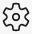

<!-- Copyright Kayce Basques

   Licensed under the Apache License, Version 2.0 (the "License");
   you may not use this file except in compliance with the License.
   You may obtain a copy of the License at

       https://www.apache.org/licenses/LICENSE-2.0

   Unless required by applicable law or agreed to in writing, software
   distributed under the License is distributed on an "AS IS" BASIS,
   WITHOUT WARRANTIES OR CONDITIONS OF ANY KIND, either express or implied.
   See the License for the specific language governing permissions and
   limitations under the License.  -->
# Performance features reference

This page is a comprehensive reference of Microsoft Edge DevTools features related to analyzing performance.

Navigate to [Get Started With Analyzing Runtime Performance](./index.md) for a guided tutorial on how to analyze the performance of a page using [Microsoft Edge DevTools](../../devtools-guide-chromium/index.md).

<!-- ====================================================================== -->
## Record performance

### Record runtime performance

Record runtime performance when you want to analyze the performance of a page as it is running, as opposed to loading.

1.  Navigate to the page that you want to analyze.
1.  Open the **Performance** tool in DevTools.
1.  Choose **Record** ().

    :::image type="complex" source="../media/evaluate-performance-performance-record-highlight.msft.png" alt-text="Record" lightbox="../media/evaluate-performance-performance-record-highlight.msft.png":::
       **Record**
    :::image-end:::

1.  Interact with the page.  DevTools records all page activity that occurs as a result of your interactions.
1.  Choose **Record** again or choose **Stop** to stop recording.

### Record load performance

Record load performance when you want to analyze the performance of a page as it is loading, as opposed to running.

1.  Navigate to the page that you want to analyze.
1.  Open the **Performance** panel of DevTools.
1.  Choose **Refresh page** ().  DevTools records performance metrics while the page refreshes and then automatically stops the recording a couple seconds after the load finishes.

    :::image type="complex" source="../media/evaluate-performance-performance-refresh-button.msft.png" alt-text="Refresh page" lightbox="../media/evaluate-performance-performance-refresh-button.msft.png":::
       **Refresh page**
    :::image-end:::

DevTools automatically zooms in on the portion of the recording where most of the activity occurred.

:::image type="complex" source="../media/evaluate-performance-performance-refreshed.msft.png" alt-text="A page-load recording" lightbox="../media/evaluate-performance-performance-refreshed.msft.png":::
   A page-load recording
:::image-end:::

### Capture screenshots while recording

Turn on the **Screenshots** checkbox to capture a screenshot of every frame while recording.

:::image type="complex" source="../media/evaluate-performance-performance-capture-screenshots-checkbox.msft.png" alt-text="The Screenshots checkbox" lightbox="../media/evaluate-performance-performance-capture-screenshots-checkbox.msft.png":::
   The **Screenshots** checkbox
:::image-end:::

Navigate to [View a screenshot](#view-a-screenshot) to learn how to interact with screenshots.

### Force garbage collection while recording

While you are recording a page, choose **Collect garbage** () to force garbage collection.

:::image type="complex" source="../media/evaluate-performance-performance-collect-garbage-button.msft.png" alt-text="Collect garbage" lightbox="../media/evaluate-performance-performance-collect-garbage-button.msft.png":::
   Collect garbage
:::image-end:::

### Show recording settings

Choose **Capture settings** () to expose more settings related to how DevTools captures performance recordings.

:::image type="complex" source="../media/evaluate-performance-performance-capture-settings-button-open-drawer.msft.png" alt-text="The Capture Settings section" lightbox="../media/evaluate-performance-performance-capture-settings-button-open-drawer.msft.png":::
   The **Capture Settings** section
:::image-end:::

### Disable JavaScript samples

By default, the **Main** section of a recording displays detailed call stacks of JavaScript functions that were called during the recording.  To disable these call stacks:

1.  Open the **Capture settings** menu.  Navigate to [Show recording settings](#show-recording-settings).
1.  Turn on the **Disable JavaScript Samples** checkbox.
1.  Take a recording of the page.

The following 2 figures display the difference between disabling and enabling JavaScript samples.  The **Main** section of the recording is much shorter when sampling is disabled, because it omits all of the JavaScript call stacks.

:::row:::
   :::column span="":::
      :::image type="complex" source="../media/evaluate-performance-performance-refreshed-disable-javascript-samples-checkbox-on.msft.png" alt-text="An example of a recording when JS samples are disabled" lightbox="../media/evaluate-performance-performance-refreshed-disable-javascript-samples-checkbox-on.msft.png":::
         An example of a recording when JS samples are disabled
      :::image-end:::
   :::column-end:::
   :::column span="":::
      :::image type="complex" source="../media/evaluate-performance-performance-refreshed-disable-javascript-samples-checkbox-off.msft.png" alt-text="An example of a recording when JS samples are turned on" lightbox="../media/evaluate-performance-performance-refreshed-disable-javascript-samples-checkbox-off.msft.png":::
         An example of a recording when JS samples are turned on
      :::image-end:::
   :::column-end:::
:::row-end:::

### Throttle the network while recording

To throttle the network while recording:

1.  Open the **Capture settings** menu.  Navigate to [Show recording settings](#show-recording-settings).
1.  Set **Network** to the desired level of throttling.

### Throttle the CPU while recording

To throttle the CPU while recording:

1.  Open the **Capture settings** menu.  Navigate to [Show recording settings](#show-recording-settings).
1.  Set **CPU** to the desired level of throttling.

Throttling is relative to the capabilities of your computer.  For example, the **2x slowdown** option makes your CPU operate 2 times slower than normal.  DevTools do not truly simulate the CPUs of mobile devices, because the architecture of mobile devices is very different from that of desktops and laptops.

### Turn on advanced paint instrumentation

To view detailed paint instrumentation:

1.  Open the **Capture settings** menu.  Navigate to [Show recording settings](#show-recording-settings).
1.  Check the **Enable advanced paint instrumentation (slow)** checkbox.

To learn how to interact with the paint information, navigate to [View layers](#view-layers-information) and [View paint profiler](#view-paint-profiler).

<!-- ====================================================================== -->
## Save a recording

To save a recording, open the contextual menu (right-click), and choose **Save Profile**.

:::image type="complex" source="../media/evaluate-performance-performance-refreshed-disable-javascript-samples-checkbox-off-save-profile.msft.png" alt-text="Save Profile" lightbox="../media/evaluate-performance-performance-refreshed-disable-javascript-samples-checkbox-off-save-profile.msft.png":::
   **Save Profile**
:::image-end:::

<!-- ====================================================================== -->
## Load a recording

To load a recording, open the contextual menu (right-click), and choose **Load Profile**.

:::image type="complex" source="../media/evaluate-performance-performance-refreshed-disable-javascript-samples-checkbox-off-load-profile.msft.png" alt-text="Load Profile" lightbox="../media/evaluate-performance-performance-refreshed-disable-javascript-samples-checkbox-off-load-profile.msft.png":::
   **Load Profile**
:::image-end:::

<!-- ====================================================================== -->
## Clear the previous recording

After making a recording, choose **Clear recording** () to clear that recording from the **Performance** panel.

:::image type="complex" source="../media/evaluate-performance-performance-refreshed-disable-javascript-samples-checkbox-off-clear-button.msft.png" alt-text="Clear recording" lightbox="../media/evaluate-performance-performance-refreshed-disable-javascript-samples-checkbox-off-clear-button.msft.png":::
   **Clear recording**
:::image-end:::

<!-- ====================================================================== -->
## Analyze a performance recording

After you [record runtime performance](#record-runtime-performance) or [record load performance](#record-load-performance), the **Performance** panel provides a lot of data for analyzing the performance of what just happened.

### Select a portion of a recording

Drag your mouse left or right across the **Overview** to select a portion of a recording.  The **Overview** is the section that contains the **FPS**, **CPU**, and **NET** charts.

:::image type="complex" source="../media/evaluate-performance-performance-zoom-highlighted.msft.png" alt-text="Drag the mouse across the Overview to zoom" lightbox="../media/evaluate-performance-performance-zoom-highlighted.msft.png":::
   Drag the mouse across the **Overview** to zoom
:::image-end:::

To select a portion using the keyboard:

1.  Choose the background of the **Main** section, or any of the sections next to it, such as **Interactions**, **Network**, or **GPU**.  This keyboard workflow only works when one of these sections is in focus.
1.  Use the `W`, `A`, `S`, `D` keys to zoom in, move left, zoom out, and move right, respectively.

To select a portion using a trackpad, complete the following actions.

1.  Hover your mouse over the **Overview** section or the **Details** section.  The **Overview** section is the area containing the **FPS**, **CPU**, and **NET** charts.  The **Details** section is the area containing the **Main** section, the **Interactions** section, and so on.
1.  Using two fingers, swipe up to zoom out, swipe left to move left, swipe down to zoom in, and swipe right to move right.

To scroll a long flame chart in the **Main** section or any of the neighbors, choose and hold while dragging up and down.  Drag left and right to move what portion of the recording is chosen.

### Search activities

Select `Control`+`F` (Windows, Linux) or `Command`+`F` (macOS) to open the search box at the bottom of the **Performance** panel.

:::image type="complex" source="../media/evaluate-performance-performance-search-regex.msft.png" alt-text="The search box" lightbox="../media/evaluate-performance-performance-search-regex.msft.png":::
   The search box
:::image-end:::

To navigate activities that match your query:

*   Use the **Previous** () and **Next** () buttons.
*   Select `Shift`+`Enter` to select the previous or `Enter` to select the next.

To modify query settings:

*   Choose **Case sensitive** () to make the query case sensitive.
*   Choose **Regex** () to use a regular expression in your query.

To hide the search box, choose **Cancel**.

### View main thread activity

Use the **Main** section to view activity that occurred on the main thread of the page.

:::image type="complex" source="../media/evaluate-performance-performance-main-zoomed.msft.png" alt-text="The Main section" lightbox="../media/evaluate-performance-performance-main-zoomed.msft.png":::
   The **Main** section
:::image-end:::

Choose an event to view more information about it in the **Summary** panel.  DevTools outlines the selected event.

:::image type="complex" source="../media/evaluate-performance-performance-summary-me.msft.png" alt-text="More information about the anonymous function in the Summary panel" lightbox="../media/evaluate-performance-performance-summary-me.msft.png":::
   More information about the `anonymous` function in the **Summary** panel
:::image-end:::

DevTools represents main thread activity with a flame chart.  The x-axis represents the recording over time.  The y-axis represents the call stack.  The events on top cause the events below it.

:::image type="complex" source="../media/evaluate-performance-performance-main-flame-chart.msft.png" alt-text="A flame chart" lightbox="../media/evaluate-performance-performance-main-flame-chart.msft.png":::
   A flame chart
:::image-end:::

In the previous figure, a `click` event caused a `Function Call` in `activitytabs.js` on line 53.  Below `Function Call`, review that an anonymous function was run.  The anonymous function requested `a`, which requested `wait`, which requested `Minor GC`.

DevTools assigns scripts random colors.  In the previous figure, function requests from one script are colored light green.  Requests from another script are colored beige.  The darker yellow represents scripting activity, and the purple event represents rendering activity.  These darker yellow and purple events are consistent across all recordings.

Navigate to [Disable JavaScript samples](#disable-javascript-samples) if you want to hide the detailed flame chart of JavaScript requests.  When JS samples are disabled, only high-level events such as `Event: choose` and `Function Call` from the previous figure `str` displayed.

### View activities in a table

After recording a page, you do not need to rely solely on the **Main** section to analyze activities.  DevTools also provides three tabular views for analyzing activities.  Each view gives you a different perspective on the activities:

*   When you want to view the root activities that cause the most work, use the [Call Tree](#the-call-tree-panel) panel.
*   When you want to view the activities where the most time was directly spent, use the [Bottom-Up](#the-bottom-up-panel) panel.
*   When you want to view the activities in the order in which they occurred during the recording, use the [Event Log](#the-event-log-panel) panel.

> [!NOTE]
> The next three sections all refer to the same demo.  Run the demo yourself at [Activity Tabs Demo](https://microsoft-edge-chromium-devtools.glitch.me/perf/activitytabs.html).

#### Root activities

Here is an explanation of the **root activities** concept that is mentioned in the **Call Tree** panel, **Bottom-Up** panel, and **Event Log** panel.

Root activities are those which cause the browser to do some work.  For example, when you choose a webpage, the browser runs an `Event` activity as the root activity.  That `Event` may cause a handler to run, and so on.

In the flame chart of the **Main** section, root activities are at the top of the chart.  In the **Call Tree** and **Event Log** panels, root activities are the top-level items.

Navigate to the [Call Tree](#the-call-tree-panel) panel for an example of root activities.

#### The Call Tree panel

Use the **Call Tree** panel to view which [root activities](#root-activities) cause the most work.

The **Call Tree** panel only displays activities during the selected portion of the recording.  Navigate to [Select a portion of a recording](#select-a-portion-of-a-recording) to learn how to select portions.

:::image type="complex" source="../media/evaluate-performance-performance-call-tree.msft.png" alt-text="The Call Tree panel" lightbox="../media/evaluate-performance-performance-call-tree.msft.png":::
   The **Call Tree** panel
:::image-end:::

In the previous figure, the top-level of items in the **Activity** column, such as `Evaluate Script` and `Parse HTML` are root activities.  The nesting represents the call stack.  For example, in the previous figure, `Parse HTML` which caused `Evaluate Script` which caused `Compile Script` and `(anonymous)`.

**Self Time** represents the time directly spent in that activity.  **Total Time** represents the time spent in that activity or any of the children.

Choose **Self Time**, **Total Time**, or **Activity** to sort the table by that column.

Use the **Filter** text box to filter events by activity name.

By default the **Grouping** menu is set to **No Grouping**.  Use the **Grouping** menu to sort the activity table based on various criteria.

Choose **Show Heaviest Stack** () to reveal another table to the right of the **Activity** table.  Choose an activity to populate the **Heaviest Stack** table.  The **Heaviest Stack** table displays which children of the selected activity took the longest time to run.

#### The Bottom-Up panel

Use the **Bottom-Up** panel to view which activities directly took up the most time in aggregate.

The **Bottom-Up** panel only displays activities during the selected portion of the recording.  Navigate to [Select a portion of a recording](#select-a-portion-of-a-recording) to learn how to select portions.

:::image type="complex" source="../media/evaluate-performance-performance-bottoms-up.msft.png" alt-text="The Bottom-Up panel" lightbox="../media/evaluate-performance-performance-bottoms-up.msft.png":::
   The **Bottom-Up** panel
:::image-end:::

In the **Main** section flame chart of the previous figure, navigate to that almost practically all of the time was spent running `Parse HTML`.  The top activity in the **Bottom-Up** panel of the previous figure is `Parse HTML`.  <!--In the flame chart of the previous figure, the yellow below the calls to `wait` are actually thousands of `Minor GC` calls.  -->  Navigate to the **Bottom-Up** panel, the next most expensive activity is `Layout`.

The **Self Time** column represents the aggregated time spent directly in that activity, across all of the occurrences.

The **Total Time** column represents aggregated time spent in that activity or any of the children.

#### The Event Log panel

Use the **Event Log** panel to view activities in the order in which they occurred during the recording.

The **Event Log** panel only displays activities during the selected portion of the recording.  Navigate to [Select a portion of a recording](#select-a-portion-of-a-recording) to learn how to select portions.

:::image type="complex" source="../media/evaluate-performance-performance-event-log.msft.png" alt-text="The Event Log panel" lightbox="../media/evaluate-performance-performance-event-log.msft.png":::
   The **Event Log** panel
:::image-end:::

The **Start Time** column represents the point at which that activity started, relative to the start of the recording.  For example, the start time of `175.7 ms` for the selected item in the previous figure means that activity started 175.7 ms after the recording started.

The **Self Time** column represents the time spent directly in that activity.

The **Total Time** columns represents time spent directly in that activity or in any of the children.

Choose **Start Time**, **Self Time**, or **Total Time** to sort the table by that column.

Use the **Filter** text box to filter activities by name.

Use the **Duration** menu to filter out any activities that took less than 1 ms or 15 ms.  By default the **Duration** menu is set to **All**, meaning all activities are shown.

Disable the **Loading**, **Scripting**, **Rendering**, or **Painting** checkboxes to filter out all activities from those categories.

### View GPU activity

View GPU activity in the **GPU** section.

:::image type="complex" source="../media/evaluate-performance-performance-gpu-zoomed.msft.png" alt-text="The GPU section" lightbox="../media/evaluate-performance-performance-gpu-zoomed.msft.png":::
   The **GPU** section
:::image-end:::

### View raster activity

View raster activity in the **Raster** section.

:::image type="complex" source="../media/evaluate-performance-performance-raster.msft.png" alt-text="The Raster section" lightbox="../media/evaluate-performance-performance-raster.msft.png":::
   The **Raster** section
:::image-end:::

### View interactions

Use the **Interactions** section to find and analyze user interactions that happened during the recording.

:::image type="complex" source="../media/evaluate-performance-performance-interactions-animation.msft.png" alt-text="The Interactions section" lightbox="../media/evaluate-performance-performance-interactions-animation.msft.png":::
   The **Interactions** section
:::image-end:::

A red line at the bottom of an interaction represents time spent waiting for the main thread.

Choose an interaction to view more information about it in the **Summary** panel.

### Analyze frames per second (FPS)

DevTools provides numerous ways to analyze frames per second:

*   Use [the FPS chart](#the-fps-chart) to get an overview of FPS over the duration of the recording.
*   Use [the Frames section](#the-frames-section) to view how long a particular frame took.
*   Use the **FPS meter** for a realtime estimate of FPS as the page runs.  Navigate to [View frames per second in realtime with the FPS meter](#view-frames-per-second-in-realtime-with-the-fps-meter).

#### The FPS chart

The **FPS** chart provides an overview of the frame rate across the duration of a recording.  In general, the higher the green bar, the better the frame
rate.

A red bar above the **FPS** chart is a warning that the frame rate dropped so low that it probably harmed the user's experience.

:::image type="complex" source="../media/evaluate-performance-performance-fps-highlight.msft.png" alt-text="The FPS chart" lightbox="../media/evaluate-performance-performance-fps-highlight.msft.png":::
   The **FPS** chart
:::image-end:::

#### The Frames section

The **Frames** section tells you exactly how long a particular frame took.

Hover on a frame to view a tooltip with more information about it.

:::image type="complex" source="../media/evaluate-performance-performance-frames-hover.msft.png" alt-text="Hover on a frame" lightbox="../media/evaluate-performance-performance-frames-hover.msft.png":::
   Hover on a frame
:::image-end:::

Choose a frame to view more information about the frame in the **Summary** panel.  DevTools outlines the selected frame in blue.

:::image type="complex" source="../media/evaluate-performance-performance-frames-summary.msft.png" alt-text="View a frame in the Summary panel" lightbox="../media/evaluate-performance-performance-frames-summary.msft.png":::
   View a frame in the **Summary** panel
:::image-end:::

### View network requests

Expand the **Network** section to view a waterfall of network requests that occurred during the recording.

:::image type="complex" source="../media/evaluate-performance-performance-network.msft.png" alt-text="The Network section" lightbox="../media/evaluate-performance-performance-network.msft.png":::
   The **Network** section
:::image-end:::

Requests are color-coded as follows:

*   HTML: Blue
*   CSS: Purple
*   JS: Yellow
*   Images: Green

Choose a request to view more information about it in the **Summary** panel.  For example, in the previous figure, the **Summary** panel is displaying more information about the blue request that is selected in the **Network** section.

A darker-blue square in the top-left of a request means it is a higher-priority request.  A lighter-blue square means lower-priority.  For example, in the previous figure, the blue, selected request is higher-priority, and the green one below it is lower-priority.

In the 1st of the following figures, the request for `www.bing.com` is represented by a line on the left, a bar in the middle with a dark portion and a light portion, and a line on the right.  In the 2nd of the following figures shows the corresponding representation of the same request in the **Timing** panel of the **Network** tool.  Here is how these two representations map to each other:

*   The left line is everything up to the `Connection Start` group of events, inclusive.  In other words, it is everything before `Request Sent`, exclusive.
*   The light portion of the bar is `Request Sent` and `Waiting (TTFB)`.
*   The dark portion of the bar is `Content Download`.
*   The right line is essentially time spent waiting for the main thread.  This is not represented in the **Timing** panel.

:::row:::
   :::column span="":::
      :::image type="complex" source="../media/evaluate-performance-bing-performance-network.msft.png" alt-text="The line-bar representation of the www.bing.com request" lightbox="../media/evaluate-performance-bing-performance-network.msft.png":::
         The line-bar representation of the `www.bing.com` request
      :::image-end:::
   :::column-end:::
   :::column span="":::
      :::image type="complex" source="../media/evaluate-performance-bing-network-timing.msft.png" alt-text="The Network tool" lightbox="../media/evaluate-performance-bing-network-timing.msft.png":::
         The **Network** tool
:     ::image-end:::
   :::column-end:::
:::row-end:::

### View memory metrics

Turn on the **Memory** checkbox to view memory metrics from the last recording.

:::image type="complex" source="../media/evaluate-performance-performance-memory-highlight.msft.png" alt-text="The Memory checkbox" lightbox="../media/evaluate-performance-performance-memory-highlight.msft.png":::
   The **Memory** checkbox
:::image-end:::

DevTools displays a new **Memory** chart, above the **Summary** panel.  There is also a new chart below the **NET** chart, called **HEAP**.  The **HEAP** chart provides the same information as the **JS Heap** line in the **Memory** chart.

:::image type="complex" source="../media/evaluate-performance-performance-memory-chart.msft.png" alt-text="Memory metrics" lightbox="../media/evaluate-performance-performance-memory-chart.msft.png":::
   Memory metrics
:::image-end:::

The colored lines on the chart map to the colored checkboxes above the chart.
Disable a checkbox to hide that category from the chart.

The chart only displays the region of the recording that is currently selected.  For example, in the previous figure, the **Memory** chart is only showing memory usage from around the 400 ms mark to the 1750 ms mark.

### View the duration of a portion of a recording

When analyzing a section like **Network** or **Main**, sometimes you need a more precise estimate of how long certain events took.  Hold `Shift`, choose and hold, and drag left or right to select a portion of the recording.  At the bottom of your selection, DevTools shows how long that portion took.

:::image type="complex" source="../media/evaluate-performance-performance-main-duration.msft.png" alt-text="View the duration of a portion of a recording" lightbox="../media/evaluate-performance-performance-main-duration.msft.png":::
   View the duration of a portion of a recording
:::image-end:::

### View a screenshot

Navigate to [Capture screenshots while recording](#capture-screenshots-while-recording) to learn how to turn on screenshots.

Hover on the **Overview** to view a screenshot of how the page looked during that moment of the recording.  The **Overview** is the section that contains the **CPU**, **FPS**, and **NET** charts.

:::image type="complex" source="../media/evaluate-performance-performance-screenshots-hover.msft.png" alt-text="View a screenshot" lightbox="../media/evaluate-performance-performance-screenshots-hover.msft.png":::
   View a screenshot
:::image-end:::

You may also view screenshots by choosing a frame in the **Frames** section.  DevTools displays a small version of the screenshot in the **Summary** panel.

:::image type="complex" source="../media/evaluate-performance-performance-summary-preview.msft.png" alt-text="View a screenshot in the Summary panel" lightbox="../media/evaluate-performance-performance-summary-preview.msft.png":::
   View a screenshot in the **Summary** panel
:::image-end:::

Choose the thumbnail in the **Summary** panel to zoom in on the screenshot.

:::image type="complex" source="../media/evaluate-performance-performance-summary-preview-select.msft.png" alt-text="Zoom into a screenshot from the Summary panel" lightbox="../media/evaluate-performance-performance-summary-preview-select.msft.png":::
   Zoom into a screenshot from the **Summary** panel
:::image-end:::

### View layers information

To view advanced layers information about a frame:

1.  [Turn on advanced paint instrumentation](#turn-on-advanced-paint-instrumentation).
1.  Choose a frame in the **Frames** section.  DevTools displays information about the layers in the new **Layers** panel, next to the **Event Log** panel.

    :::image type="complex" source="../media/evaluate-performance-layers-all.msft.png" alt-text="The Layers pane" lightbox="../media/evaluate-performance-layers-all.msft.png":::
       The **Layers** pane
    :::image-end:::

Hover on a layer to highlight it in the diagram.

:::image type="complex" source="../media/evaluate-performance-performance-frames-document-nav-bar-highlighted.msft.png" alt-text="Highlight a layer" lightbox="../media/evaluate-performance-performance-frames-document-nav-bar-highlighted.msft.png":::
   Highlight a layer
:::image-end:::

To move the diagram:

*   Choose **Pan Mode** () to move along the X and Y axes.
*   Choose **Rotate Mode** () to rotate along the Z axis.
*   Choose **Reset Transform** () to reset the diagram to the original position.

### View paint profiler

To view advanced information about a paint event:

1.  [Turn on](#turn-on-advanced-paint-instrumentation).
1.  Choose a **Paint** event in the **Main** section.

    :::image type="complex" source="../media/evaluate-performance-paint-profiler.msft.png" alt-text="The Paint Profiler panel" lightbox="../media/evaluate-performance-paint-profiler.msft.png":::
       The **Paint Profiler** panel
    :::image-end:::

<!-- ====================================================================== -->
## Analyze rendering performance with the Rendering tool

Use the features of the **Rendering** panel to help visualize the rendering performance of your page.

To open the **Rendering** tool:

1.  [Open the Command Menu](../command-menu/index.md#open-the-command-menu).
1.  Start typing `Rendering` and select `Show Rendering`.  DevTools displays the **Rendering** tool at the bottom of your DevTools window.

    :::image type="complex" source="../media/evaluate-performance-console-drawer-rendering.msft.png" alt-text="The Rendering tool" lightbox="../media/evaluate-performance-console-drawer-rendering.msft.png":::
       The **Rendering** tool
    :::image-end:::

### View frames per second in realtime with the FPS meter

The **FPS meter** is an overlay that appears in the top-right corner of your viewport.  It provides a realtime estimate of FPS as the page runs.  To open the **FPS meter**:

1.  Open the **Rendering** tool.  [Analyze rendering performance with the Rendering tool](#analyze-rendering-performance-with-the-rendering-tool).
1.  Turn on the **FPS Meter** checkbox.

    :::image type="complex" source="../media/evaluate-performance-jank-console-rendering-frame-rate.msft.png" alt-text="The FPS meter" lightbox="../media/evaluate-performance-jank-console-rendering-frame-rate.msft.png":::
       The **FPS meter**
    :::image-end:::

### View painting events in realtime with Paint Flashing

Use Paint Flashing to get a realtime view of all paint events on the page.  Whenever a part of the page gets re-painted, DevTools outlines that section in green.

To turn on Paint Flashing, complete the following actions.

1.  Open the **Rendering** tool.  Navigate to [Analyze rendering performance with the Rendering tool](#analyze-rendering-performance-with-the-rendering-tool).
1.  Turn on the **Paint Flashing** checkbox.

    :::image type="complex" source="../media/evaluate-performance-jank-console-rendering-paint-flashing.msft.png" alt-text="Paint Flashing" lightbox="../media/evaluate-performance-jank-console-rendering-paint-flashing.msft.png":::
       **Paint Flashing**
    :::image-end:::

### View an overlay of layers with Layer Borders

Use **Layer Borders** to view an overlay of layer borders and tiles on top of the page.

To turn on Layer Borders, complete the following actions,

1.  Open the **Rendering** tool.  Navigate to [Analyze rendering performance with the Rendering tool](#analyze-rendering-performance-with-the-rendering-tool).
1.  Turn on the **Layer Borders** checkbox.

    :::image type="complex" source="../media/evaluate-performance-devtools-console-rendering-layer-borders.msft.png" alt-text="Layer Borders" lightbox="../media/evaluate-performance-devtools-console-rendering-layer-borders.msft.png":::
       **Layer Borders**
    :::image-end:::

Navigate to the comments in [debug_colors.cc](https://cs.chromium.org/chromium/src/cc/debug/debug_colors.cc) for an explanation of the color-codings.

### Find scroll performance issues in realtime

Use Scrolling Performance Issues to identify elements of the page that have event listeners related to scrolling that may harm the performance of the page.
DevTools outlines the potentially-problematic elements in teal.

To view scroll performance issues, complete the following actions.

1.  Open the **Rendering** tool.  Navigate to [Analyze rendering performance with the Rendering tool](#analyze-rendering-performance-with-the-rendering-tool).
1.  Turn on the **Scrolling Performance Issues** checkbox.

    :::image type="complex" source="../media/evaluate-performance-bing-console-drawer-rendering-scrolling-performance-issues.msft.png" alt-text="Scrolling Performance Issues indicates that non-layer viewport-constrained objects may harm scroll performance" lightbox="../media/evaluate-performance-bing-console-drawer-rendering-scrolling-performance-issues.msft.png":::
       **Scrolling Performance Issues** indicates that non-layer viewport-constrained objects may harm scroll performance
    :::image-end:::

<!-- ====================================================================== -->
> [!NOTE]
> Portions of this page are modifications based on work created and [shared by Google](https://developers.google.com/terms/site-policies) and used according to terms described in the [Creative Commons Attribution 4.0 International License](https://creativecommons.org/licenses/by/4.0).
> The original page is found [here](https://developers.google.com/web/tools/chrome-devtools/evaluate-performance/reference) and is authored by [Kayce Basques](https://developers.google.com/web/resources/contributors#kayce-basques) (Technical Writer, Chrome DevTools \& Lighthouse).

This work is licensed under a [Creative Commons Attribution 4.0 International License](https://creativecommons.org/licenses/by/4.0).
