<!-- Copyright Kayce Basques

   Licensed under the Apache License, Version 2.0 (the "License");
   you may not use this file except in compliance with the License.
   You may obtain a copy of the License at

       https://www.apache.org/licenses/LICENSE-2.0

   Unless required by applicable law or agreed to in writing, software
   distributed under the License is distributed on an "AS IS" BASIS,
   WITHOUT WARRANTIES OR CONDITIONS OF ANY KIND, either express or implied.
   See the License for the specific language governing permissions and
   limitations under the License.  -->
# Performance features reference

This page is a comprehensive reference of DevTools features that are related to analyzing performance.

For a step-by-step tutorial on how to analyze the performance of a page using the **Performance** tool, see [Get started analyzing runtime performance](index.md).

<!-- ====================================================================== -->
## Record performance

<!-- ------------------------------ -->
#### Record runtime performance

Record runtime performance when you want to analyze the performance of a page as it is running, as opposed to loading.

1. Go to the page that you want to analyze.

1. Click the **Performance** tool in DevTools.

1. Click the **Record** () button.

   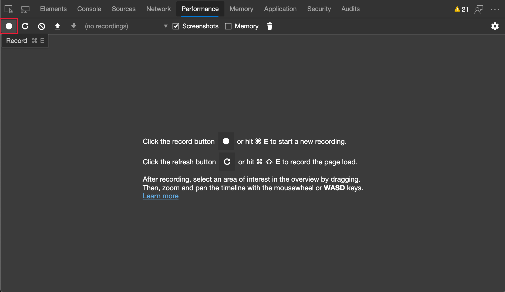

1. Interact with the page.  DevTools records all page activity that occurs as a result of your interactions.

1. Click **Record** again or click **Stop** to stop recording.

<!-- ------------------------------ -->
#### Record load performance

Record load performance when you want to analyze the performance of a page as it is loading, as opposed to running.

1. Go to the page that you want to analyze.

1. In DevTools, open the **Performance** tool.

1. Click the **Refresh page** () button.  DevTools records performance metrics while the page refreshes and then automatically stops the recording a couple seconds after the load finishes.

DevTools automatically zooms in on the portion of the recording where most of the activity occurred.

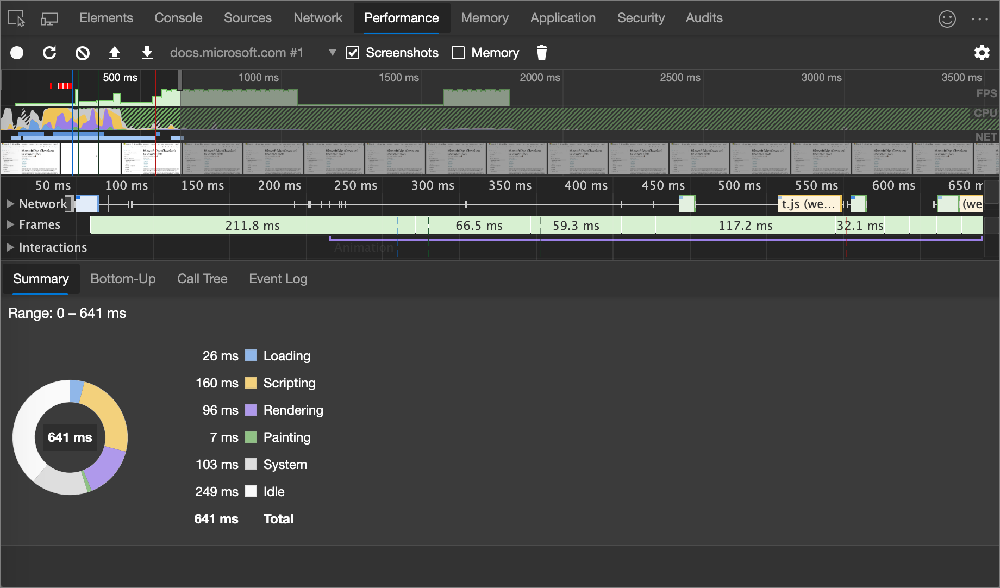

<!-- ------------------------------ -->
#### Capture screenshots while recording

To capture a screenshot of every frame while recording, select the **Screenshots** checkbox.

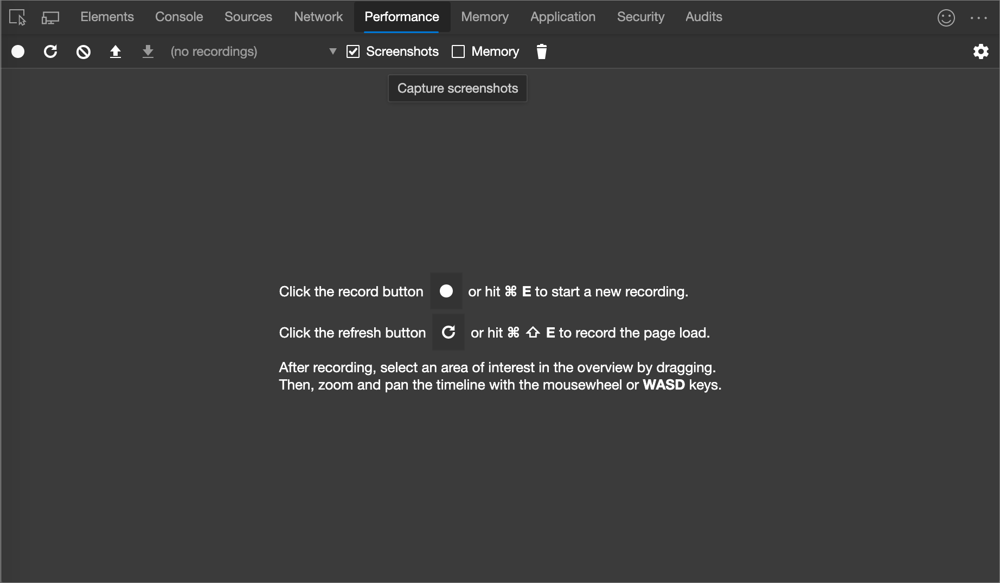

To learn how to interact with screenshots, see [View a screenshot](#view-a-screenshot).

<!-- ------------------------------ -->
#### Force garbage collection while recording

While you are recording a page, click **Collect garbage** () to force garbage collection.

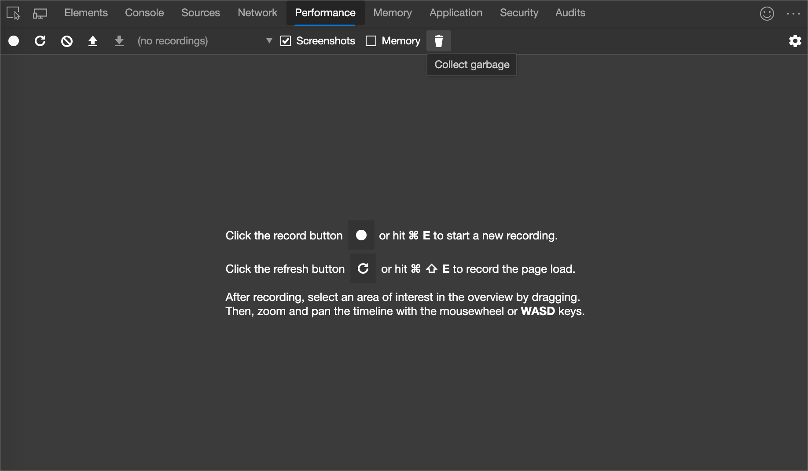

<!-- ------------------------------ -->
#### Show recording settings

Click **Capture settings** () to expose more settings related to how DevTools captures performance recordings.

<!-- ------------------------------ -->
#### Disable JavaScript samples

By default, the **Main** section of a recording displays detailed call stacks of JavaScript functions that were called during the recording.  To disable these call stacks:

1. Open the **Capture settings** menu.  See [Show recording settings](#show-recording-settings).

1. Turn on the **Disable JavaScript Samples** checkbox.

1. Take a recording of the page.

The following two figures show the difference between disabling and enabling JavaScript samples.  The **Main** section of the recording is much shorter when sampling is disabled, because it omits all of the JavaScript call stacks.

An example of a recording when JS samples are disabled:

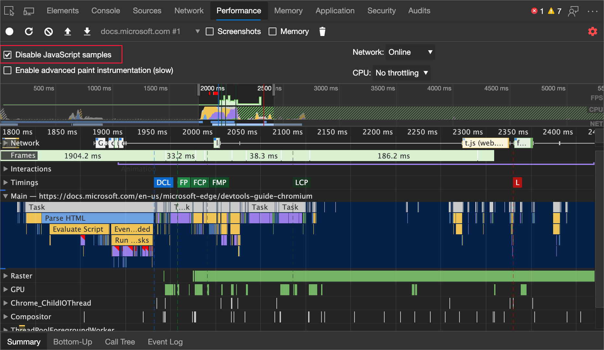

An example of a recording when JS samples are turned on:

<!-- ------------------------------ -->
#### Throttle the network while recording

To throttle the network while recording:

1. Open the **Capture settings** menu.  See [Show recording settings](#show-recording-settings).

1. Set **Network** to the desired level of throttling.

<!-- ------------------------------ -->
#### Throttle the CPU while recording

To throttle the CPU while recording:

1. Open the **Capture settings** menu.  See [Show recording settings](#show-recording-settings).

1. Set **CPU** to the desired level of throttling.

Throttling is relative to the capabilities of your computer.  For example, the **2x slowdown** option makes your CPU operate 2 times slower than normal.  DevTools don't truly simulate the CPUs of mobile devices, because the architecture of mobile devices is very different from that of desktops and laptops.

<!-- ------------------------------ -->
#### Turn on advanced paint instrumentation

To view detailed paint instrumentation:

1. Open the **Capture settings** menu.  See [Show recording settings](#show-recording-settings).

1. Check the **Enable advanced paint instrumentation (slow)** checkbox.

To learn how to interact with the paint information, see [View layers](#view-layers-information) and [View paint profiler](#view-paint-profiler).

<!-- ====================================================================== -->
## Save a recording

To save a recording, right-click the recording and then select **Save Profile**.

<!-- ====================================================================== -->
## Load a recording

To load a recording, right-click the recording and then select **Load Profile**.

<!-- ====================================================================== -->
## Clear the previous recording

After making a recording, click **Clear recording** () to clear that recording from the **Performance** tool.

<!-- ====================================================================== -->
## Analyze a performance recording

After you [record runtime performance](#record-runtime-performance) or [record load performance](#record-load-performance), the **Performance** tool provides a lot of data for analyzing the performance of what just happened.

<!-- ------------------------------ -->
#### Select a portion of a recording

Drag your mouse left or right across the **Overview** to select a portion of a recording.  The **Overview** is the section that contains the **FPS**, **CPU**, and **NET** charts.

To select a portion using the keyboard:

1. Select the background of the **Main** section, or any of the sections next to it, such as **Interactions**, **Network**, or **GPU**.  This keyboard workflow only works when one of these sections is in focus.

1. Use the `W`, `A`, `S`, `D` keys to zoom in, move left, zoom out, and move right, respectively.

To select a portion using a trackpad:

1. Hover your mouse over the **Overview** section or the **Details** section.  The **Overview** section is the area containing the **FPS**, **CPU**, and **NET** charts.  The **Details** section is the area containing the **Main** section, the **Interactions** section, and so on.

1. Using two fingers, swipe up to zoom out, swipe left to move left, swipe down to zoom in, and swipe right to move right.

To scroll a long flame chart in the **Main** section or any of the neighbors, click and hold while dragging up and down.  Drag left and right to move what portion of the recording is selected.

<!-- ------------------------------ -->
#### Search activities

Press **Ctrl+F** (Windows, Linux) or **Command+F** (macOS) to open the search box at the bottom of the **Performance** tool.

To navigate activities that match your query:

1. Click the **Previous** () and **Next** () buttons.

1. To select the next activity, press **Enter**.  To select the previous activity, press **Shift+Enter**.

To modify query settings:

*  To make the query case-sensitive, click the **Case sensitive** () button.

*  To use a regular expression in your query, click the **Regex** () button.

To hide the search box, click **Cancel**.

<!-- ------------------------------ -->
#### View main thread activity

Use the **Main** section to view activity that occurred on the main thread of the page.

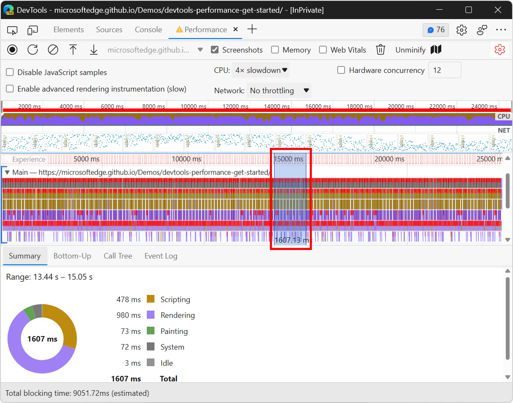

Select an event to view more information about it in the **Summary** tab.  DevTools outlines the selected event.

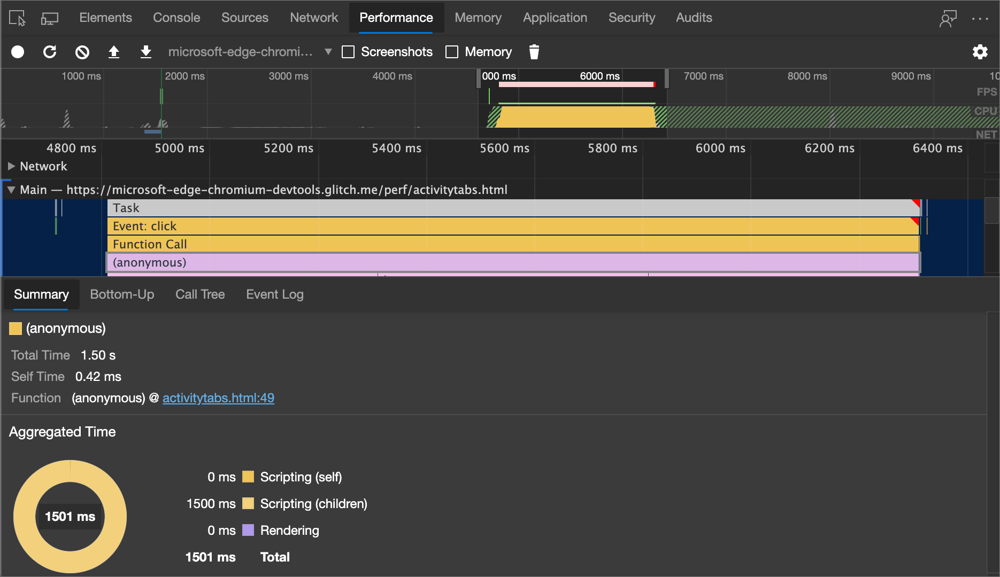

DevTools represents main thread activity with a flame chart.  The x-axis represents the recording over time.  The y-axis represents the call stack.  The events on top cause the events below it.

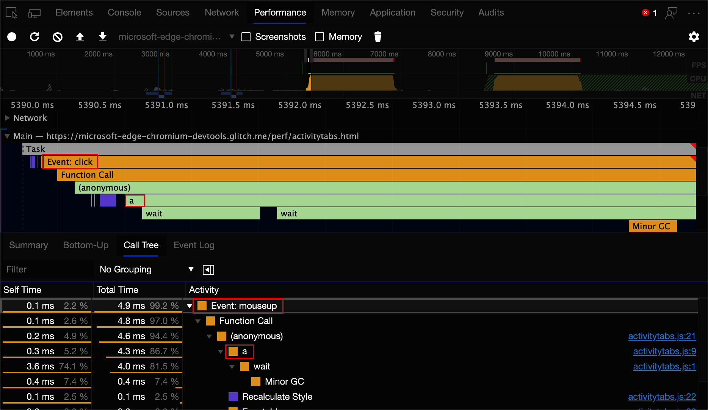

In the previous figure, a `click` event caused a `Function Call` in `activitytabs.js` on line 53.  Below `Function Call`, review that an anonymous function was run.  The anonymous function requested `a`, which requested `wait`, which requested `Minor GC`.

DevTools assigns scripts random colors.  In the previous figure, function requests from one script are colored light green.  Requests from another script are colored beige.  The darker yellow represents scripting activity, and the purple event represents rendering activity.  These darker yellow and purple events are consistent across all recordings.

If you want to hide the detailed flame chart of JavaScript requests, see [Disable JavaScript samples](#disable-javascript-samples), above.
When JS samples are disabled, only high-level events such as `Event: click` and `Function Call` from the previous figure <!--`str` (?)--> are displayed.
<!--When JS samples are disabled, you only see high-level events such as `Event (click)` and `Function Call` (script_foot_closure.js:53) from Figure 16.-->

<!-- ------------------------------ -->
#### View activities in a table

After recording a page, you don't need to rely solely on the **Main** section to analyze activities.  DevTools also provides three tabular views for analyzing activities.  Each view gives you a different perspective on the activities:

*  To view the activities where the most time was directly spent, use the [Bottom-Up](#the-bottom-up-tab) tab.

*  To view the root activities that cause the most work, use the [Call Tree](#the-call-tree-tab) tab.

*  To view the activities in the order in which they occurred during the recording, use the [Event Log](#the-event-log-tab) tab.

###### Root activities

<!-- tab order left to right:
[Bottom Up] [Call Tree] [Event Log]
-->

Open the [Activity Tabs Demo](https://microsoftedge.github.io/Demos/devtools-performance-activitytabs/) webpage in a new window or tab.  The _activity tabs_ are the **Bottom-Up**, **Call Tree**, and **Event Log** tabs at the bottom of the **Performance** tool.  These tabs display root activities.

<!-- You can view the source files for the Activity Tabs Demo in the [MicrosoftEdge/Demos > devtools-performance-activitytabs](https://github.com/MicrosoftEdge/Demos/tree/main/devtools-performance-activitytabs) repo folder. -->

_Root activities_ are activities that cause the browser to do some work.  For example, when you click a webpage, the browser runs an `Event` activity as the root activity.  That `Event` activity may cause other activities to run, such as a handler.

In the flame chart of the **Main** section, root activities are at the top of the chart.  In the **Call Tree** and **Event Log** tabs, root activities are the top-level items.

For an example of root activities, see [The Call Tree tab](#the-call-tree-tab), below.

<!-- tab order left to right:
[Bottom Up] [Call Tree] [Event Log]
-->

###### The Bottom-Up tab

Open the [Activity Tabs Demo](https://microsoftedge.github.io/Demos/devtools-performance-activitytabs/) webpage in a new window or tab.

Use the **Bottom-Up** tab to view which activities directly took up the most time in aggregate.

The **Bottom-Up** tab only displays activities during the selected portion of the recording.  See [Select a portion of a recording](#select-a-portion-of-a-recording) to learn how to select portions.

In the **Main** section flame chart of the previous figure, you can see that almost practically all of the time was spent running `Parse HTML`.  The top activity in the **Bottom-Up** tab of the previous figure is `Parse HTML`.  <!-- in orig article: In the flame chart of the previous figure, the yellow below the calls to `wait` are actually thousands of `Minor GC` calls.  -->  In the **Bottom-Up** tab, the next most expensive activity is `Layout`.

The **Self Time** column represents the aggregated time spent directly in that activity, across all of the occurrences.

The **Total Time** column represents aggregated time spent in that activity or any of the children.

###### The Call Tree tab

Open the [Activity Tabs Demo](https://microsoftedge.github.io/Demos/devtools-performance-activitytabs/) webpage in a new window or tab.

Use the **Call Tree** tab to view which [root activities](#root-activities) cause the most work.

The **Call Tree** tab only displays activities during the selected portion of the recording.  See [Select a portion of a recording](#select-a-portion-of-a-recording) to learn how to select portions.

In the previous figure, the top-level of items in the **Activity** column, such as `Evaluate Script` and `Parse HTML` are root activities.  The nesting represents the call stack.  For example, in the previous figure, `Parse HTML` which caused `Evaluate Script` which caused `Compile Script` and `(anonymous)`.

**Self Time** represents the time directly spent in that activity.  **Total Time** represents the time spent in that activity or any of the children.

Click **Self Time**, **Total Time**, or **Activity** to sort the table by that column.

Use the **Filter** text box to filter events by activity name.

By default the **Grouping** menu is set to **No Grouping**.  Use the **Grouping** menu to sort the activity table based on various criteria.

Click **Show Heaviest Stack** () to reveal another table to the right of the **Activity** table.  Click on an activity to populate the **Heaviest Stack** table.  The **Heaviest Stack** table displays which children of the selected activity took the longest time to run.

###### The Event Log tab

Use the **Event Log** tab to view activities in the order in which they occurred during the recording.

The **Event Log** tab only displays activities during the selected portion of the recording.  See [Select a portion of a recording](#select-a-portion-of-a-recording) to learn how to select portions.

The **Start Time** column represents the point at which that activity started, relative to the start of the recording.  For example, the start time of `175.7 ms` for the selected item in the previous figure means that activity started 175.7 ms after the recording started.

The **Self Time** column represents the time spent directly in that activity.

The **Total Time** columns represents time spent directly in that activity or in any of the children.

Click **Start Time**, **Self Time**, or **Total Time** to sort the table by that column.

Use the **Filter** text box to filter activities by name.

Use the **Duration** menu to filter out any activities that took less than 1 ms or 15 ms.  By default the **Duration** menu is set to **All**, meaning all activities are shown.

Disable the **Loading**, **Scripting**, **Rendering**, or **Painting** checkboxes to filter out all activities from those categories.

<!-- ------------------------------ -->
#### View GPU activity

View GPU activity in the **GPU** section.

<!-- ------------------------------ -->
#### View raster activity

View raster activity in the **Raster** section.

<!-- ------------------------------ -->
#### View interactions

Use the **Interactions** section to find and analyze user interactions that happened during the recording.

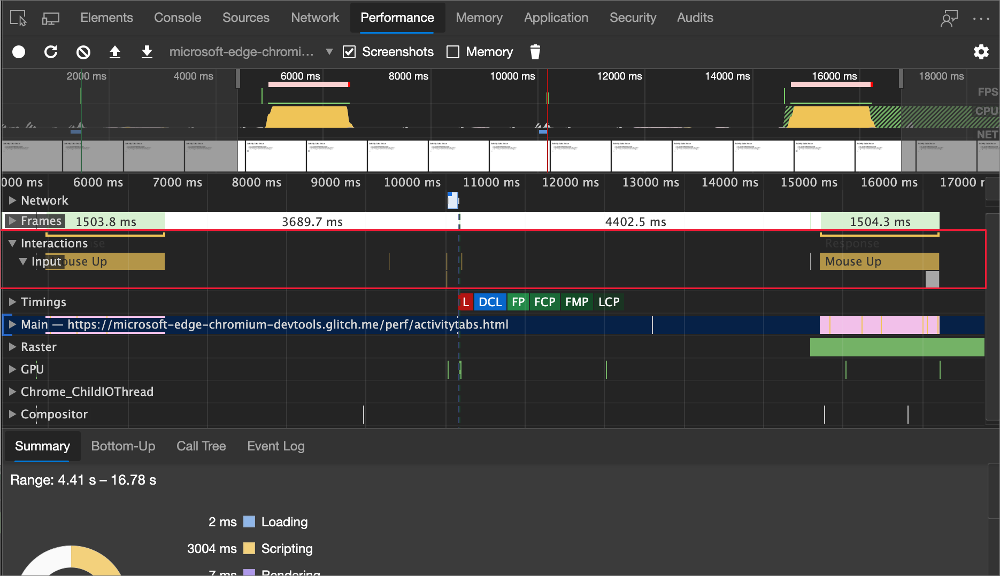

A red line at the bottom of an interaction represents time spent waiting for the main thread.

Click an interaction to view more information about it in the **Summary** tab.

<!-- ------------------------------ -->
#### Analyze frames per second (FPS)

DevTools provides numerous ways to analyze frames per second:

*  Use [the FPS chart](#the-fps-chart) to get an overview of FPS over the duration of the recording.
*  Use [the Frames section](#the-frames-section) to view how long a particular frame took.
*  Use the **FPS meter** for a realtime estimate of FPS as the page runs.  See [View frames per second in realtime with the FPS meter](#view-frames-per-second-in-realtime-with-the-fps-meter).

###### The FPS chart

The **FPS** chart provides an overview of the frame rate across the duration of a recording.  In general, the higher the green bar, the better the frame
rate.

A red bar above the **FPS** chart is a warning that the frame rate dropped so low that it probably harmed the user's experience.

###### The Frames section

The **Frames** section tells you exactly how long a particular frame took.

Hover over a frame to view a tooltip with more information about it.

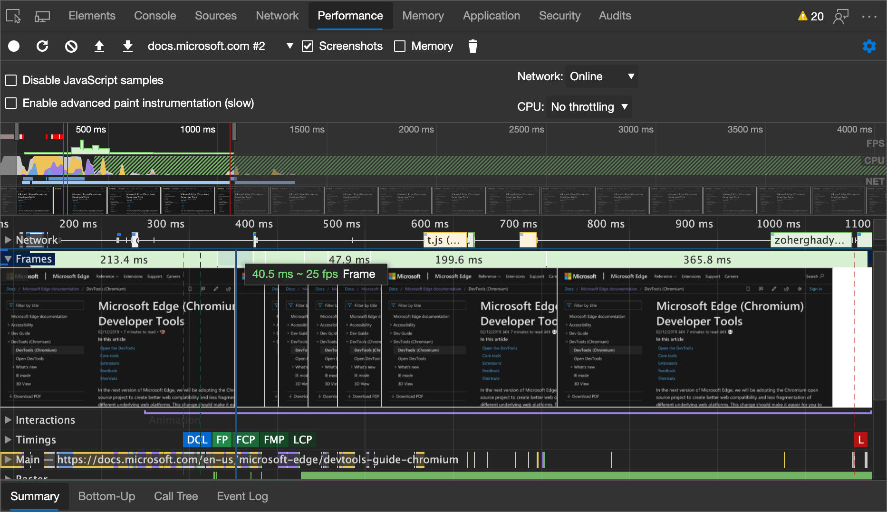

Select a frame to view more information about the frame in the **Summary** tab at the bottom of the **Performance** tool.  DevTools outlines the selected frame in blue.

<!-- ------------------------------ -->
#### View network requests

Expand the **Network** section to view a waterfall of network requests that occurred during the recording.

Requests are color-coded as follows:
*  HTML: Blue
*  CSS: Purple
*  JS: Yellow
*  Images: Green

Click on a request to view more information about it in the **Summary** tab.  For example, in the previous figure, the **Summary** tab is displaying more information about the blue request that is selected in the **Network** section.

A darker-blue square in the top-left of a request means it's a higher-priority request.  A lighter-blue square means lower-priority.  For example, in the previous figure, the blue, selected request is higher-priority, and the green one below it is lower-priority.

In the first figure below, the request for `www.bing.com` is represented by a line on the left, a bar in the middle with a dark portion and a light portion, and a line on the right.  The second figure below shows the corresponding representation of the same request in the **Timing** tab of the **Network** tool.

Here's how these two representations map to each other:

*  The left line is everything up to the `Connection Start` group of events, inclusive.  In other words, it's everything before `Request Sent`, exclusive.

*  The light portion of the bar is `Request Sent` and `Waiting (TTFB)`.

*  The dark portion of the bar is `Content Download`.

*  The right line is essentially time spent waiting for the main thread.  This isn't represented in the **Timing** tab.

The line-bar representation of the `www.bing.com` request:

The **Network** tool:

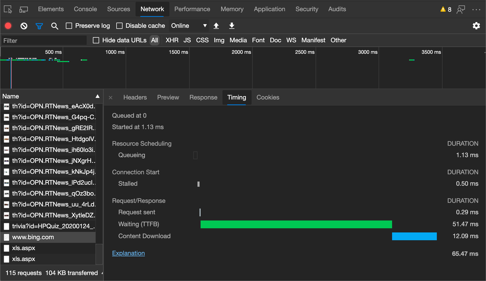

<!-- ------------------------------ -->
#### View memory metrics

Turn on the **Memory** checkbox to view memory metrics from the last recording.

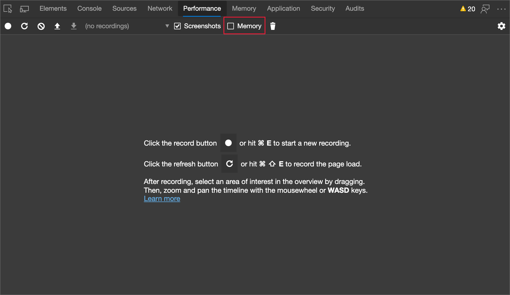

DevTools displays a new **Memory** chart, above the **Summary** tab.  There is also a new chart below the **NET** chart, called **HEAP**.  The **HEAP** chart provides the same information as the **JS Heap** line in the **Memory** chart.

The colored lines on the chart map to the colored checkboxes above the chart.  Clear a checkbox to hide that category from the chart.

The chart only displays the region of the recording that is currently selected.  For example, in the previous figure, the **Memory** chart is only showing memory usage from around the 400 ms mark to the 1750 ms mark.

<!-- ------------------------------ -->
#### View the duration of a portion of a recording

When analyzing a section like **Network** or **Main**, sometimes you need a more precise estimate of how long certain events took.  Hold **Shift**, click and hold, and drag left or right to select a portion of the recording.  At the bottom of your selection, DevTools shows how long that portion took.

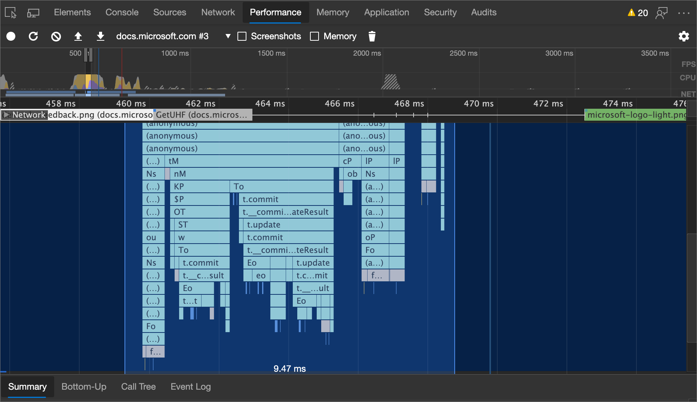

<!-- ------------------------------ -->
#### View a screenshot

See [Capture screenshots while recording](#capture-screenshots-while-recording) to learn how to turn on screenshots.

Hover over the **Overview** to view a screenshot of how the page looked during that moment of the recording.  The **Overview** is the section that contains the **CPU**, **FPS**, and **NET** charts.

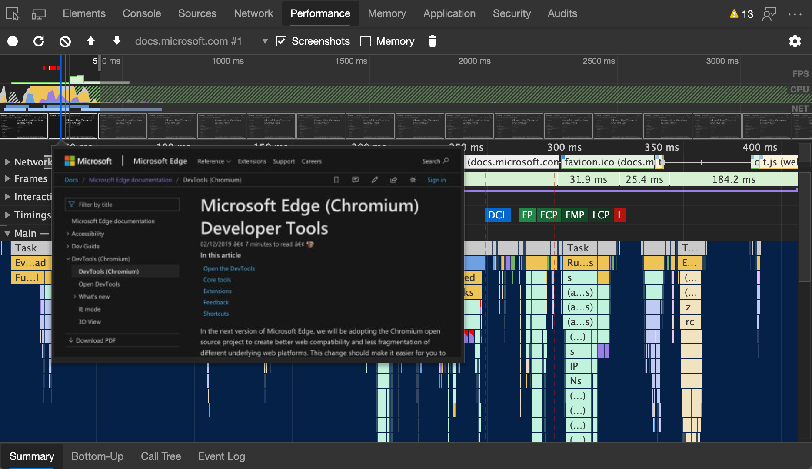

You can also view screenshots by selecting a frame in the **Frames** section.  DevTools displays a small version of the screenshot in the **Summary** tab.

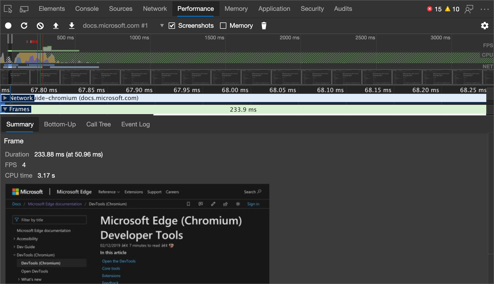

Click the thumbnail in the **Summary** tab to zoom in on the screenshot.

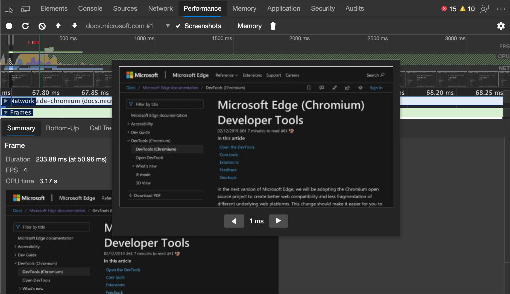

<!-- ------------------------------ -->
#### View layers information

To view advanced layers information about a frame:

1. [Turn on advanced paint instrumentation](#turn-on-advanced-paint-instrumentation).

1. Select a frame in the **Frames** section.  DevTools displays information about the layers in the new **Layers** tab, next to the **Event Log** tab.

Hover over a layer to highlight it in the diagram.

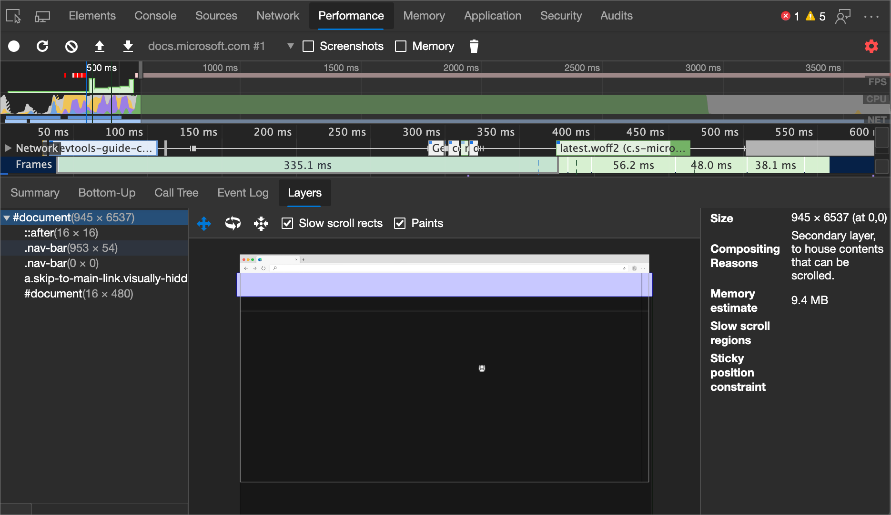

To move the diagram:

*  Select **Pan Mode** () to move along the X and Y axes.

*  Select **Rotate Mode** () to rotate along the Z axis.

*  Select **Reset Transform** () to reset the diagram to the original position.

<!-- ------------------------------ -->
#### View paint profiler

To view advanced information about a paint event:

1. [Turn on](#turn-on-advanced-paint-instrumentation).

1. Select a **Paint** event in the **Main** section.

The **Paint Profiler** tab:

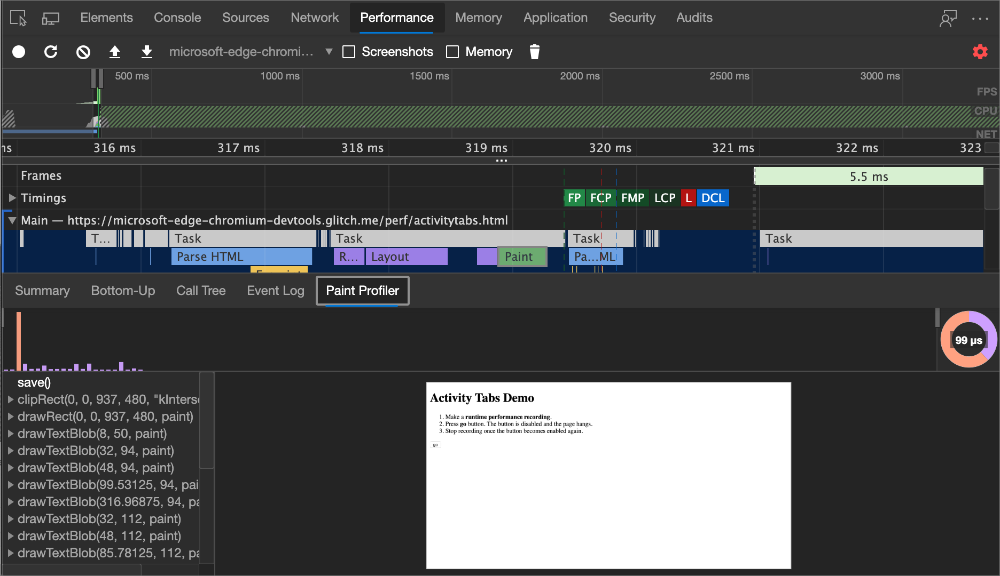

<!-- ====================================================================== -->
## Analyze rendering performance with the Rendering tool

Use the features of the **Rendering** tool to help visualize the rendering performance of your page.

To open the **Rendering** tool:

1. [Open the Command Menu](../command-menu/index.md#open-the-command-menu).

1. Start typing **Rendering**, and then select **Show Rendering**.  DevTools displays the **Rendering** tool at the bottom of your DevTools window.

<!-- ------------------------------ -->
#### View frames per second in realtime with the FPS meter

The **FPS meter** is an overlay that appears in the top-right corner of your viewport.  It provides a realtime estimate of FPS as the page runs.  To open the **FPS meter**:

1. Open the **Rendering** tool.  [Analyze rendering performance with the Rendering tool](#analyze-rendering-performance-with-the-rendering-tool).

1. Select the **FPS Meter** checkbox.

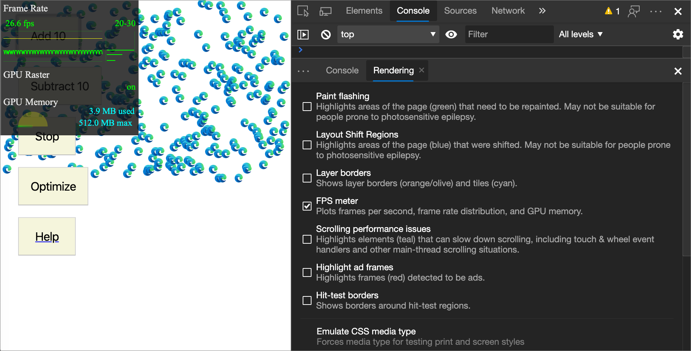

<!-- ------------------------------ -->
#### View painting events in realtime with Paint Flashing

Use Paint Flashing to get a realtime view of all paint events on the page.  Whenever a part of the page gets re-painted, DevTools outlines that section in green.

To turn on Paint Flashing:

1. Open the **Rendering** tool.  See [Analyze rendering performance with the Rendering tool](#analyze-rendering-performance-with-the-rendering-tool).

1. Select the **Paint Flashing** checkbox.

   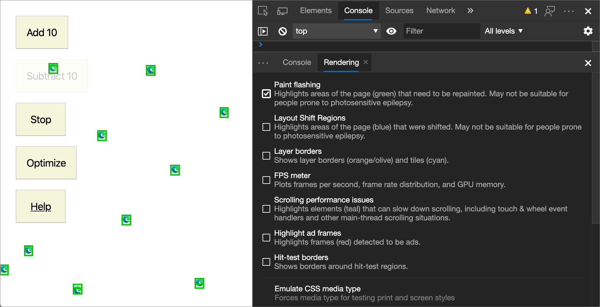

<!-- ------------------------------ -->
#### View an overlay of layers with Layer Borders

Use **Layer Borders** to view an overlay of layer borders and tiles on top of the page.

To turn on Layer Borders:

1. Open the **Rendering** tool.  See [Analyze rendering performance with the Rendering tool](#analyze-rendering-performance-with-the-rendering-tool).

1. Select the **Layer Borders** checkbox.

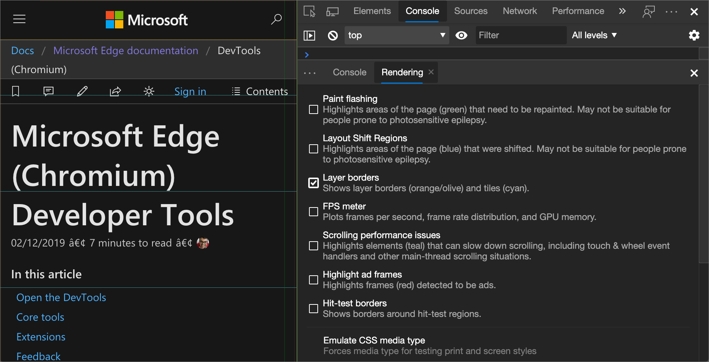

See the comments in [debug_colors.cc](https://cs.chromium.org/chromium/src/cc/debug/debug_colors.cc) for an explanation of the color-codings.

<!-- ------------------------------ -->
#### Find scroll performance issues in realtime

Use Scrolling Performance Issues to identify elements of the page that have event listeners related to scrolling that may harm the performance of the page.  DevTools outlines the potentially problematic elements in teal.

To view scroll performance issues:

1. Open the **Rendering** tool.  See [Analyze rendering performance with the Rendering tool](#analyze-rendering-performance-with-the-rendering-tool).

1. Select the **Scrolling Performance Issues** checkbox.

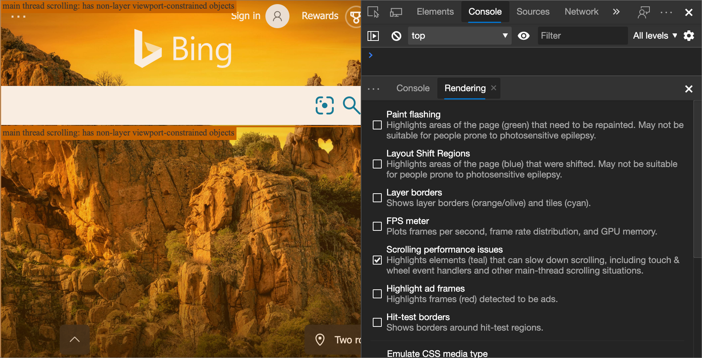

See also:
* [Slow scroll rects (checkbox)](../3d-view/index.md#slow-scroll-rects-checkbox) in _Navigate webpage layers, z-index, and DOM using the 3D View tool_.

<!-- ====================================================================== -->
## Disable local fonts

In **Rendering** tool, use the **Disable local fonts** checkbox to emulate missing `local()` sources in `@font-face` rules.

For example, when the **Rubik** font is installed on your device and the `@font-face src` rule uses it as a `local()` font, Microsoft Edge uses the local font file from your device.

When **Disable local fonts** is selected, DevTools ignores the `local()` fonts and fetches each font from the network:

<!-- copied from edge-developer\microsoft-edge\devtools-guide-chromium\whats-new\2020\08\devtools.md   ../../media/2020/08/disable-font.msft.png -->

This feature is useful if you use two different copies of the same font during development, such as:
*  A local font for your design tools.
*  A web font for your code.

Use **Disable local fonts** to make it easier to:
*  Debug and measure loading performance and optimization of web fonts.
*  Verify accuracy of your CSS `@font-face` rules.
*  Discover differences between local versions installed on your device and a web font.

<!-- ====================================================================== -->
> [!NOTE]
> Portions of this page are modifications based on work created and [shared by Google](https://developers.google.com/terms/site-policies) and used according to terms described in the [Creative Commons Attribution 4.0 International License](https://creativecommons.org/licenses/by/4.0).
> The original page is found [here](https://developer.chrome.com/docs/devtools/evaluate-performance/reference/) and is authored by [Kayce Basques](https://developers.google.com/web/resources/contributors#kayce-basques) (Technical Writer, Chrome DevTools \& Lighthouse).

This work is licensed under a [Creative Commons Attribution 4.0 International License](https://creativecommons.org/licenses/by/4.0).
