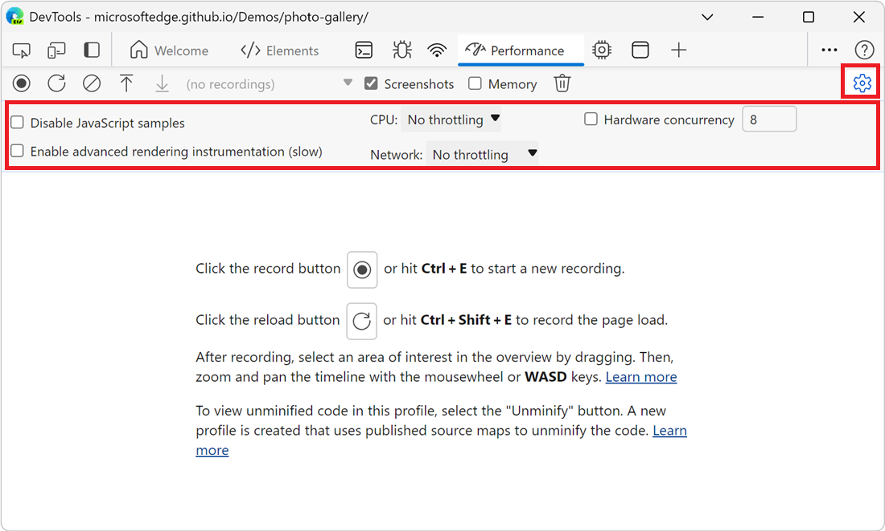
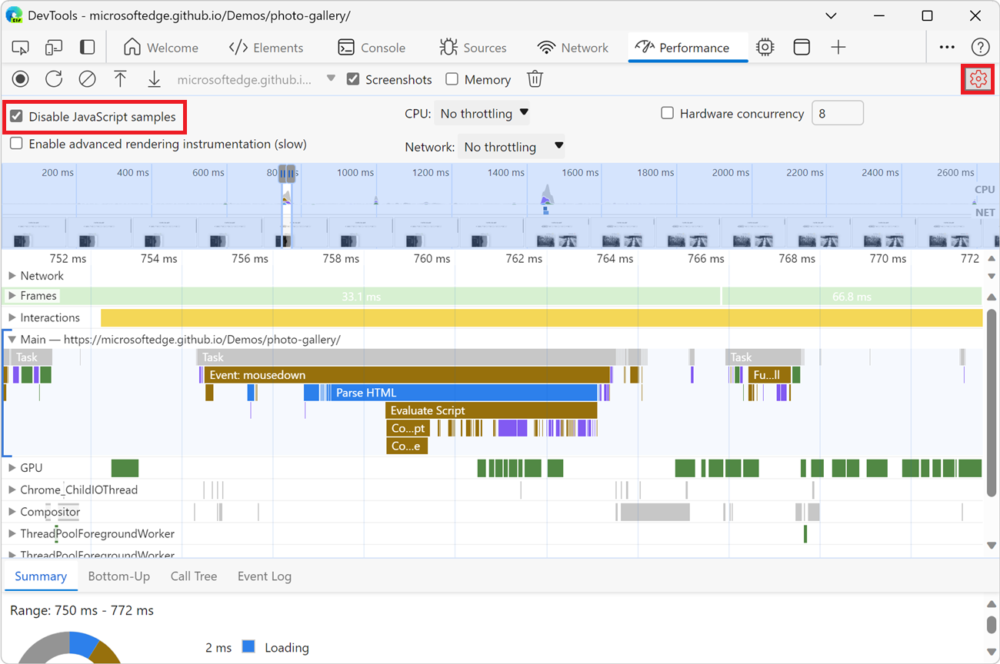
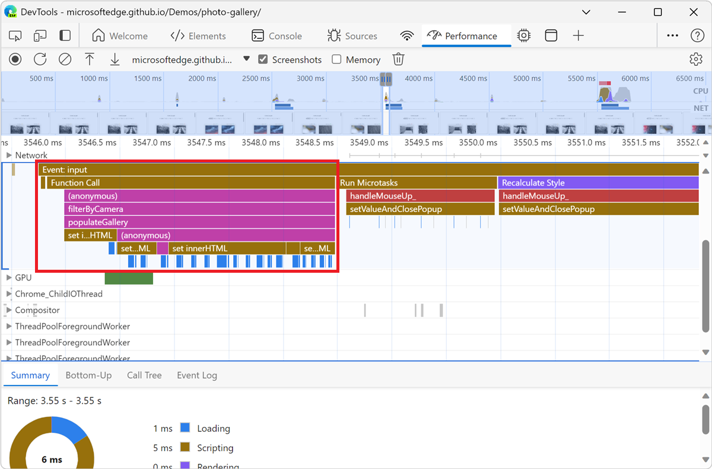
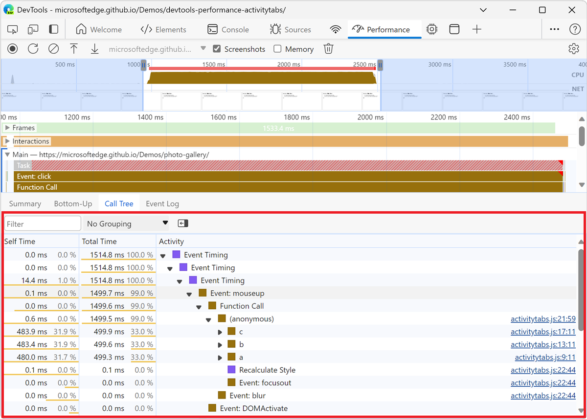
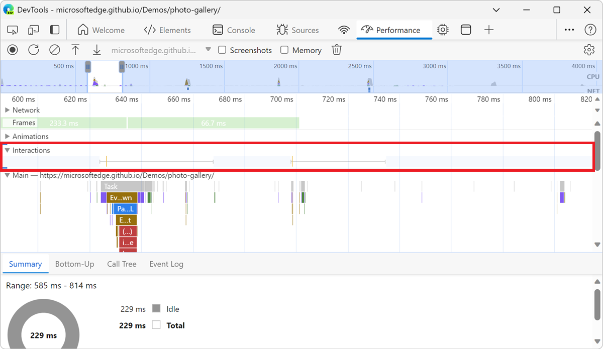
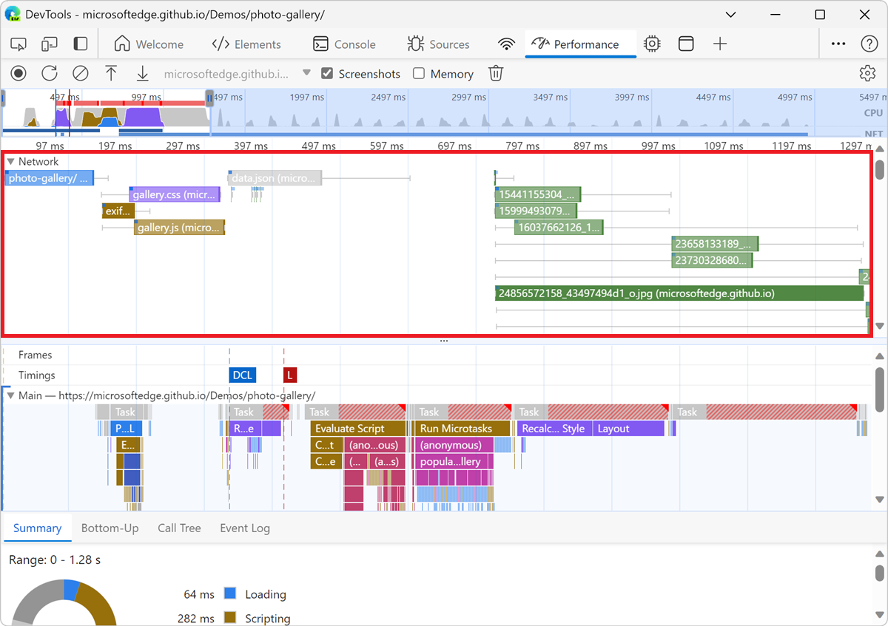
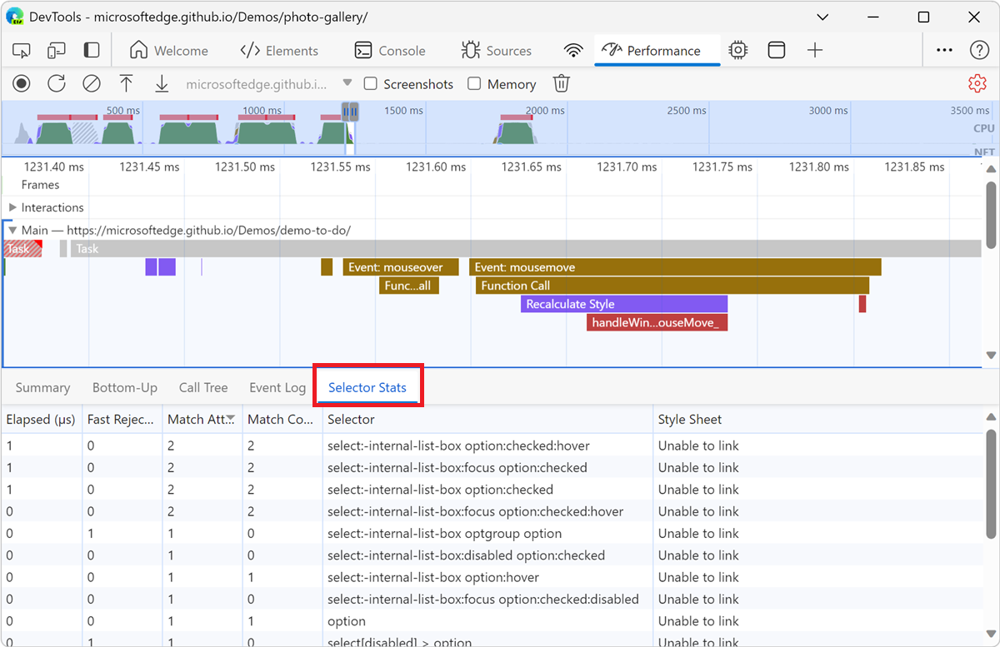
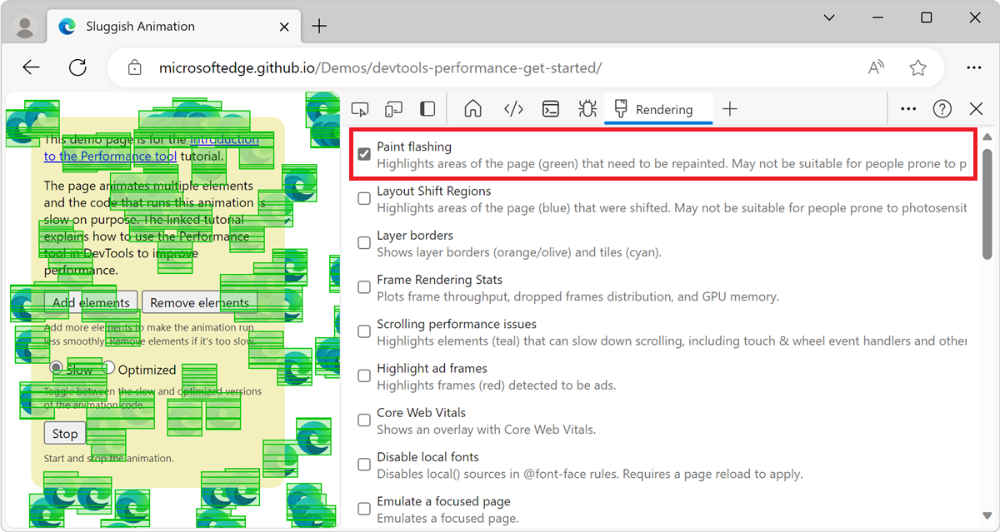

<!-- Copyright Kayce Basques

   Licensed under the Apache License, Version 2.0 (the "License");
   you may not use this file except in compliance with the License.
   You may obtain a copy of the License at

       https://www.apache.org/licenses/LICENSE-2.0

   Unless required by applicable law or agreed to in writing, software
   distributed under the License is distributed on an "AS IS" BASIS,
   WITHOUT WARRANTIES OR CONDITIONS OF ANY KIND, either express or implied.
   See the License for the specific language governing permissions and
   limitations under the License.  -->
# Performance features reference

This page is a comprehensive reference of DevTools features that are related to analyzing performance.

For a step-by-step tutorial on how to analyze the performance of a page using the **Performance** tool, see [Introduction to the Performance tool](index.md).

The images in this page show DevTools undocked into its own, dedicated window. To learn more about undocking DevTools, see [Undock DevTools into a separate window](../customize/placement.md#undock-devtools-into-a-separate-window) in _Change DevTools placement (Undock, Dock to bottom, Dock to left)_.

<!-- ====================================================================== -->
## Open the Performance tool

To use the sections in this page, open the **Performance** tool in DevTools:

1. To open DevTools, right-click the webpage, and then select **Inspect**.  Or, press **Ctrl+Shift+I** (Windows, Linux) or **Command+Option+I** (macOS). DevTools opens.

1. In DevTools, on the **Activity Bar**, select the **Performance** tab.  If that tab isn't visible, click the **More tools** () button.

<!-- ====================================================================== -->
## Record performance

The sections below describe how to record the performance of a webpage in DevTools.

<!-- ------------------------------ -->
#### Record runtime performance

To analyze the performance of a webpage while it's running (rather than while it's loading):

1. Go to the webpage that you want to analyze, such as the [Photo Gallery demo](https://microsoftedge.github.io/Demos/photo-gallery/).

1. In DevTools, open the **Performance** tool.

1. Click the **Record** () button.

   

1. Interact with the page for a while.  DevTools records all page activity that occurs as a result of your interactions.

1. Click **Record** again.  Or, click **Stop** to stop recording.

   The **Performance** tool displays the recording.

<!-- ------------------------------ -->
#### Record load performance

To analyze the performance of a webpage while it's loading (rather than while it's running):

1. Go to the webpage that you want to analyze, such as the [Photo Gallery demo](https://microsoftedge.github.io/Demos/photo-gallery/).

1. In DevTools, open the **Performance** tool.

1. Click the **Refresh page** () button:

   

   DevTools records performance metrics while the page refreshes and then automatically stops the recording a couple seconds after the load finishes. Then, DevTools displays the recording and automatically zooms in on the portion of the recording where most of the activity occurred:

   

<!-- ------------------------------ -->
#### Capture screenshots while recording

To capture a screenshot of every frame while recording, select the **Screenshots** checkbox:

To learn how to interact with screenshots, see [View a screenshot](#view-a-screenshot), below.

<!-- ------------------------------ -->
#### Force garbage collection while recording

To force garbage collection while you are recording a page, click the **Collect garbage** () button:

<!-- ------------------------------ -->
#### Show recording settings

To expose more settings related to how DevTools captures performance recordings, in the **Performance** tool, click the **Capture settings** () button.  Checkboxes and dropdown lists are displayed at the top of the **Performance** tool:

<!-- ------------------------------ -->
#### Disable JavaScript samples

By default, the **Main** section of a recording displays detailed call stacks of JavaScript functions that were called during the recording.  To disable the JavaScript call stacks:

1. In the **Performance** tool, click the **Capture settings** () button.

1. Select the **Disable JavaScript samples** checkbox.

1. Take a recording of the page.

The following two figures show the difference between disabling and enabling JavaScript samples.  The **Main** section of the recording is much shorter when JavaScript sampling is disabled, because the recording omits the JavaScript call stacks.

An example of a recording when JS samples are disabled:

An example of a recording when JS samples are enabled:

<!-- ------------------------------ -->
#### Throttle the network while recording

To throttle the network while recording:

1. In the **Performance** tool, click the **Capture settings** () button.

1. Set **Network** to the desired level of throttling.

<!-- ------------------------------ -->
#### Throttle the CPU while recording

To throttle the CPU while recording:

1. In the **Performance** tool, click the **Capture settings** () button.

1. Set **CPU** to the desired level of throttling.

Throttling is relative to the capabilities of your computer.  For example, the **2x slowdown** option makes your CPU operate twice as slow than normal.  DevTools don't truly simulate the CPUs of mobile devices, because the architecture of mobile devices is very different from that of desktops and laptops.

<!-- ------------------------------ -->
#### Turn on advanced rendering instrumentation

To record more rendering information, enable advanced rendering instrumentation:

1. In the **Performance** tool, click the **Capture settings** () button.

1. Select the **Enable advanced rendering instrumentation (slow)** checkbox.

With advanced rendering instrumentation enabled, DevTools records more information about the rendering of the page, such as layer information, and CSS selector statistics. The performance of the page may be affected.

For example, see [View layers information](#view-layers-information), and [View CSS selector statistics](#view-css-selector-statistics), below.

<!-- ====================================================================== -->
## Save a recording

To save a recording as a file on your device, right-click the recording and then select **Save profile**:

<!-- ====================================================================== -->
## Load a recording

To load a recording from a file, right-click in the **Performance** tool and then select **Load profile**:

You can right-click in an existing recording, or on the screen that's displayed in the **Performance** tool when there are no recordings.

<!-- ====================================================================== -->
## Clear the previous recording

After making a recording, to remove that recording from the **Performance** tool, click the **Clear recording** () button:

<!-- ====================================================================== -->
## Analyze a performance recording

After you [record runtime performance](#record-runtime-performance) or [record load performance](#record-load-performance), the **Performance** tool displays a lot of data about the recording. Use the recorded data to analyze the performance of your webpage.

<!-- ------------------------------ -->
#### Select a portion of a recording

You can select a portion of a recording by using a mouse, keyboard, or trackpad.

###### Mouse

To select a portion of a recording by using the mouse:

* Drag your mouse left or right across the **Overview**.  The **Overview** is the section that contains the **CPU** and **NET** charts:

To scroll a long flame chart in the **Main** section or in any of the neighboring sections, click and hold while dragging up and down.  Drag left or right to move which portion of the recording is selected.

###### Keyboard

To select a portion of a recording by using the keyboard:

1. Select the background of the **Main** section, or select the background of a section that's next to the **Main** section, such as **Interactions**, **Network**, or **GPU**.  This keyboard workflow only works when one of these sections is in focus.

1. Press `W` or `S` to zoom in or out.  Press `A` or `D` to move left or right.

###### Trackpad

To select a portion of a recording by using a trackpad:

1. Hover over the **Overview** section or the **Details** section.  The **Overview** section is the area containing the **FPS**, **CPU**, and **NET** charts.  The **Details** section is the area containing the **Main** section and the **Interactions** section.

1. Using two fingers, swipe up to zoom out, or down to zoom in.  Using two fingers, swipe left to move left, or right to move right.

<!-- ------------------------------ -->
#### Search activities

To open the search box at the bottom of the **Performance** tool:

1. Press **Ctrl+F** (Windows, Linux) or **Command+F** (macOS).

   The search box appears at the bottom of the **Performance** tool:

   

1. Enter a query in the search box, such as "recalculate style", to find all activities that match that query.

   The matching activities are highlighted in the **Main** section as you type, and the total number of matches appears in the search box. The first matching activity is selected, outlined in blue:

   

To navigate among the activities that match your query:

* To select the next activity, press **Enter** or click the **Next** () button.

* To select the previous activity, press **Shift+Enter** or click the **Previous** () button.

To modify the query settings:

*  To make the query case-sensitive, click the **Case sensitive** () button.

*  To use a regular expression in your query, click the **Regex** () button.

To hide the search box, click the **Cancel** button.

<!-- ------------------------------ -->
#### View main thread activity

Use the **Main** section to view the activity that occurred on the main thread of the page:

Select an event to view more information about it in the **Summary** tab.  DevTools outlines the selected event:

DevTools represents main thread activity with a flame chart: 

The x-axis represents the recording over time.  The y-axis represents the call stack.  An event that's near the top causes the events that are below it; for example, in the previous figure, an `input` event caused a `Function Call`, which ran an anonymous function that called `filterByCamera` and then `populateGallery`.  The `populateGallery` function then made DOM changes by calling `set innerHTML`.

DevTools assigns scripts random colors.  In the previous figure, function requests from a script are colored fuchsia (purple-pink).  The darker yellow represents scripting activity, and the purple event represents rendering activity.  These darker yellow and purple events are consistent across all recordings.

If you want to hide the detailed flame chart of JavaScript requests, see [Disable JavaScript samples](#disable-javascript-samples), above.
When JavaScript samples are disabled, only high-level events are displayed, such as `Event: input` and `Function Call` from the previous figure.
<!--When JS samples are disabled, you only see high-level events such as `Event (click)` and `Function Call` (script_foot_closure.js:53) from Figure 16.-->

<!-- ------------------------------ -->
#### View activities in a table

After recording a page, in addition to the **Main** section to analyze activities, DevTools also provides three tabular views for analyzing activities.  Each view gives you a different perspective on the activities:

*  To view the activities where the most time was directly spent, use the [Bottom-Up](#the-bottom-up-tab) tab.

*  To view the root activities that cause the most work, use the [Call Tree](#the-call-tree-tab) tab.

*  To view the activities in the order in which they occurred during the recording, use the [Event Log](#the-event-log-tab) tab.

###### Root activities

<!-- tab order left to right:
[Bottom Up] [Call Tree] [Event Log]
-->

Open the [Activity Tabs Demo](https://microsoftedge.github.io/Demos/devtools-performance-activitytabs/) webpage in a new window or tab.  The _activity tabs_ are the **Bottom-Up**, **Call Tree**, and **Event Log** tabs at the bottom of the **Performance** tool.  These tabs display root activities.

<!-- You can view the source files for the Activity Tabs Demo in the [MicrosoftEdge/Demos > devtools-performance-activitytabs](https://github.com/MicrosoftEdge/Demos/tree/main/devtools-performance-activitytabs) repo folder. -->

_Root activities_ are activities that cause the browser to do some work.  For example, when you click a webpage, the browser runs an `Event` activity as the root activity.  That `Event` activity may cause other activities to run, such as a handler.

In the flame chart of the **Main** section, root activities are at the top of the chart.  In the **Call Tree** and **Event Log** tabs, root activities are the top-level items.

For an example of root activities, see [The Call Tree tab](#the-call-tree-tab), below.

<!-- tab order left to right:
[Bottom Up] [Call Tree] [Event Log]
-->

###### The Bottom-Up tab

Open the [Activity Tabs Demo](https://microsoftedge.github.io/Demos/devtools-performance-activitytabs/) webpage in a new window or tab.

Use the **Bottom-Up** tab to view which activities directly took up the most time in aggregate.

The **Bottom-Up** tab only displays activities during the selected portion of the recording:

To learn how to select a portion of a recording, see [Select a portion of a recording](#select-a-portion-of-a-recording), above.

In the **Main** section flame chart of the previous figure, almost all of the time was spent running the `a`, `b`, and `c` functions.  The top activities in the **Bottom-Up** tab of the previous figure are also `a`, `b`, and `c`. In the **Bottom-Up** tab, the next most expensive activity is `Minor GC`.

The **Self Time** column represents the aggregated time spent directly in that activity, across all of the occurrences.

The **Total Time** column represents aggregated time spent in that activity or any of the children.

###### The Call Tree tab

Open the [Activity Tabs Demo](https://microsoftedge.github.io/Demos/devtools-performance-activitytabs/) webpage in a new window or tab.

Use the **Call Tree** tab to view which [root activities](#root-activities) cause the most work.

The **Call Tree** tab only displays activities during the selected portion of the recording:

To learn how to select a portion of a recording, see [Select a portion of a recording](#select-a-portion-of-a-recording), above.

In the previous figure, the top-level items in the **Activity** column, such as `Event Timing`, are root activities.  The nesting represents the call stack.  For example, in the previous figure, `Event Timing` caused `Event: mouseup`, which caused `Function Call`, which cause `(anonymous)`, and so on.

**Self Time** represents the time directly spent in that activity.  **Total Time** represents the time spent in that activity or any of the children.

Click **Self Time**, **Total Time**, or **Activity** to sort the table by that column.

Use the **Filter** text box to filter events by activity name.

By default the **Grouping** menu is set to **No Grouping**.  Use the **Grouping** menu to sort the activity table based on various criteria.

Click **Show Heaviest Stack** () to reveal another table to the right of the **Activity** table.  Click on an activity to populate the **Heaviest Stack** table.  The **Heaviest Stack** table displays which children of the selected activity took the longest time to run.

###### The Event Log tab

Use the **Event Log** tab to view activities in the order in which they occurred during the recording.

The **Event Log** tab only displays activities during the selected portion of the recording:

To learn how to select a portion of a recording, see [Select a portion of a recording](#select-a-portion-of-a-recording), above.

The **Start Time** column represents the point at which that activity started, relative to the start of the recording.  For example, the start time of `175.7 ms` for the selected item in the previous figure means that activity started 175.7 ms after the recording started.

The **Self Time** column represents the time spent directly in that activity.

The **Total Time** column represents time spent directly in that activity or in any of the children.

Click the **Start Time**, **Self Time**, or **Total Time** column heading, to sort the table by that column.

Use the **Filter** text box to filter activities by name.

Use the **Duration** menu to filter out any activities that took less than 1 ms or 15 ms.  By default, the **Duration** menu is set to **All**, meaning that all activities are shown.

Clear the **Loading**, **Scripting**, **Rendering**, or **Painting** checkboxes to filter out all activities from those categories.

<!-- ------------------------------ -->
#### View GPU activity

View GPU activity in the **GPU** section of the **Performance** tool:

<!-- ------------------------------
#### View raster activity

TODO: wait for this bug to be fixed, and then add the section again
https://bugs.chromium.org/p/chromium/issues/detail?id=1504808

View raster activity in the **Raster** section of the **Performance** tool:

-->

<!-- ------------------------------ -->
#### View interactions

Use the **Interactions** section to find and analyze user interactions that happened during the recording:

A red line at the bottom of an interaction represents time spent waiting for the main thread.

Click an interaction to view more information about it in the **Summary** tab.

<!-- ------------------------------ -->
#### Analyze frames per second (FPS)

DevTools provides two ways to analyze frames per second:

*  Use [the Frames section](#the-frames-section) to view how long a particular frame took.

*  Use the **FPS meter** for a realtime estimate of FPS as the page runs.  See [View frames per second in realtime with the FPS meter](#view-frames-per-second-in-realtime-with-the-fps-meter), below.

###### The Frames section

The **Frames** section tells you exactly how long a particular frame took.

Hover over a frame to view a tooltip with more information about it:

Select a frame to view more information about the frame in the **Summary** tab at the bottom of the **Performance** tool.  DevTools outlines the selected frame in blue:

<!-- ------------------------------ -->
#### View network requests

Expand the **Network** section to view a waterfall of network requests that occurred during the recording:

Click on a request to view more information about it in the **Summary** tab:

Requests in the **Network** section are color-coded as follows:

*  Blue background: HTML request.
*  Purple background: CSS request.
*  Dark yellow background: JS request.
*  Green background: image request.

Requests have squares in the top-left corner:
*  A darker-blue square in the top-left of a request means it's a higher-priority request.
*  A lighter-blue square means lower-priority.

For example, in the previous figure, the **photo-gallery** request, in the top left corner of the **Network** section is higher-priority.

Requests might have lines on the left and right sides, and their bars might be split into two colors. Here's what these lines and colors represent:

*  The left line is everything up to the `Connection Start` group of events, inclusive.  In other words, it's everything before `Request Sent`, exclusive.

*  The light portion of the bar is `Request Sent` and `Waiting (TTFB)`.

*  The dark portion of the bar is `Content Download`.

*  The right line is essentially time spent waiting for the main thread.  This isn't represented in the **Timing** tab.

<!-- ------------------------------ -->
#### View memory metrics

Select the **Memory** checkbox to view memory metrics in a performance recording:

DevTools displays a new **Memory** chart, above the **Summary** tab.  There is also a new chart below the **NET** chart, called **HEAP**.  The **HEAP** chart provides the same information as the **JS Heap** line in the **Memory** chart:

The colored lines on the chart map to the colored checkboxes above the chart.  Clear a checkbox to hide that category from the chart.

The chart only displays the region of the recording that is currently selected.  For example, in the previous figure, the **Memory** chart is only showing memory usage from around the 3600 ms mark to the 6200 ms mark.

<!-- ------------------------------ -->
#### View the duration of a portion of a recording

When analyzing a section like **Network** or **Main**, sometimes you need a more precise estimate of how long certain events took.  Hold **Shift**, click and hold, and drag left or right to select a portion of the recording.  At the bottom of your selection, DevTools shows how long that portion took:

<!-- ------------------------------ -->
#### View a screenshot

To learn how to turn on screenshots, see [Capture screenshots while recording](#capture-screenshots-while-recording), above.

To view a screenshot of how the page looked during that moment of the recording, hover over the **Overview**.  The **Overview** is the section that contains the **CPU** and **NET** charts:

You can also view screenshots by selecting a frame in the **Frames** section.  DevTools displays a small version of the screenshot in the **Summary** tab:

To zoom in on the screenshot, click the thumbnail in the **Summary** tab.

<!-- ------------------------------ -->
#### View layers information

To view advanced layers information about a frame:

1. In the **Performance** tool, click the **Capture settings** () button, and then select the **Enable advanced rendering instrumentation (slow)** checkbox.

1. In the **Frames** section, select a frame.  DevTools displays information about the layers in the **Layers** tab at the bottom of the **Performance** tool:

   

The **Layers** tab works like the **Composited Layers** tab in the **3D View** tool.  To learn how to interact with the **Layers** tab, see [Navigate webpage layers, z-index, and DOM using the 3D View tool](../3d-view/index.md).

<!-- ------------------------------
#### View paint profiler

TODO: wait for this bug to be fixed and then add this section again
https://bugs.chromium.org/p/chromium/issues/detail?id=1505065

To view advanced information about a paint event:

1. In the **Performance** tool, click the **Capture settings** () button, and then select the **Enable advanced rendering instrumentation (slow)** checkbox.

1. Select a **Paint** event in the **Main** section. DevTools displays information about the paint event in the **Paint Profiler** tab:

   
-->

<!-- ------------------------------ -->
#### View CSS selector statistics

To view statistics about the selectors of the CSS rules that got recalculated during a performance recording:

*  In the **Performance** tool, click the **Capture settings** () button, and then select the **Enable advanced rendering instrumentation (slow)** checkbox.

   DevTools displays aggregate information about the selectors of the CSS rules that were recalculated during the recording in the **Selector Stats** tab:

   

1. In the **Main** section, select a **Recalculate Style** event. In the **Selector Stats** tab, DevTools displays information about the selectors of the CSS rules that were recalculated during that event.

<!-- ====================================================================== -->
## Analyze rendering performance with the Rendering tool

Use the **Rendering** tool to help visualize the rendering performance of your page.

To open the **Rendering** tool:

1. To open DevTools, right-click the webpage, and then select **Inspect**.  Or, press **Ctrl+Shift+I** (Windows, Linux) or **Command+Option+I** (macOS).  DevTools opens.

1. In DevTools, on the **Activity Bar**, click the **More tools** () button.

1. Click **Rendering** in the dropdown menu. The **Rendering** tool appears:

   

<!-- ------------------------------ -->
#### View frames per second in realtime with the FPS meter

The **FPS meter** is an overlay that appears in the top-left corner of the rendered webpage.  It provides a realtime estimate of FPS as the page runs.  To open the **FPS meter**:

1. Open the **Rendering** tool.  See [Analyze rendering performance with the Rendering tool](#analyze-rendering-performance-with-the-rendering-tool), above.

1. Select the **Frame Rendering Stats** checkbox. The **FPS meter** overlay appears in the rendered webpage:

   

<!-- ------------------------------ -->
#### View painting events in realtime with Paint Flashing

Use Paint Flashing to get a realtime view of all paint events on the page.  Whenever a part of the page gets re-painted, DevTools outlines that section in green.

To turn on Paint Flashing:

1. Open the **Rendering** tool.  See [Analyze rendering performance with the Rendering tool](#analyze-rendering-performance-with-the-rendering-tool), above.

1. Select the **Paint Flashing** checkbox. Green outlines appear in the rendered webpage:

   

<!-- ------------------------------ -->
#### View an overlay of layers with Layer Borders

To view an overlay of layer borders and tiles on top of the page:

1. Open the **Rendering** tool, as described in [Analyze rendering performance with the Rendering tool](#analyze-rendering-performance-with-the-rendering-tool), above.

1. Select the **Layer Borders** checkbox. Layer borders appear in the rendered webpage:

   

See the comments in [debug_colors.cc](https://source.chromium.org/chromium/chromium/src/+/main:cc/debug/debug_colors.cc) for an explanation of the color-codings.

<!-- ------------------------------ -->
#### Find scroll performance issues in realtime

Use the **Scrolling Performance Issues** checkbox to identify elements of the page that have event listeners related to scrolling that may harm the performance of the page.  DevTools outlines the potentially problematic elements in teal.

To view scroll performance issues:

1. Open the **Rendering** tool, as described in [Analyze rendering performance with the Rendering tool](#analyze-rendering-performance-with-the-rendering-tool), above.

1. Select the **Scrolling Performance Issues** checkbox. Potentially problematic elements are outlined:

   

See also:
* [Slow scroll rects (checkbox)](../3d-view/index.md#slow-scroll-rects-checkbox) in _Navigate webpage layers, z-index, and DOM using the 3D View tool_.

<!-- ------------------------------ -->
#### Disable local fonts

In the **Rendering** tool, use the **Disable local fonts** checkbox to emulate missing `local()` sources in `@font-face` rules.

For example, when the **Rubik** font is installed on your device and the `@font-face src` rule uses it as a `local()` font, Microsoft Edge uses the local font file from your device.

When **Disable local fonts** is selected, DevTools ignores the `local()` fonts and fetches each font from the network:

<!-- copied from edge-developer\microsoft-edge\devtools-guide-chromium\whats-new\2020\08\devtools.md   ../../media/2020/08/disable-font.msft.png -->

This feature is useful if you use two different copies of the same font during development, such as:
*  A local font for your design tools.
*  A web font for your code.

Use **Disable local fonts** to make it easier to:
*  Debug and measure loading performance and optimization of web fonts.
*  Verify accuracy of your CSS `@font-face` rules.
*  Discover differences between local versions installed on your device and a web font.

<!-- ====================================================================== -->
> [!NOTE]
> Portions of this page are modifications based on work created and [shared by Google](https://developers.google.com/terms/site-policies) and used according to terms described in the [Creative Commons Attribution 4.0 International License](https://creativecommons.org/licenses/by/4.0).
> The original page is found [here](https://developer.chrome.com/docs/devtools/evaluate-performance/reference/) and is authored by [Kayce Basques](https://developers.google.com/web/resources/contributors#kayce-basques) (Technical Writer, Chrome DevTools \& Lighthouse).

This work is licensed under a [Creative Commons Attribution 4.0 International License](https://creativecommons.org/licenses/by/4.0).
