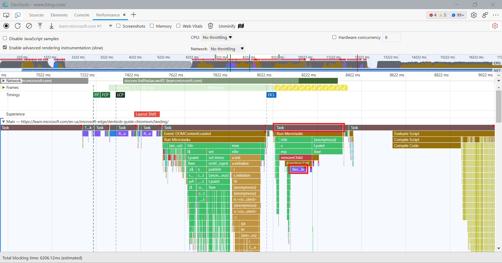
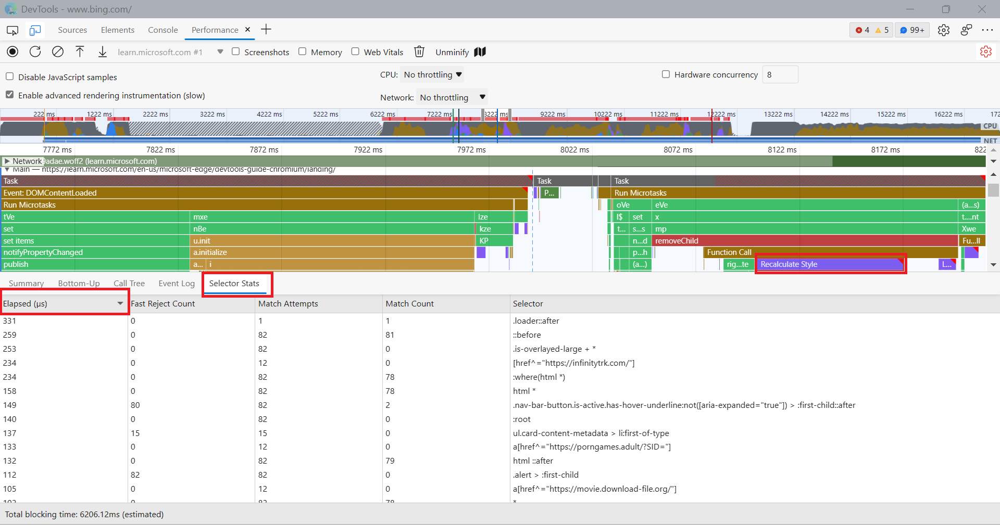

# Analyze selector performance during Recalculate Style events

The **Performance** tool highlights long tasks with red triangles to indicate work on the main thread that takes too long and has slow performance:

In your performance recordings, some of these long-running tasks may be **Recalculate Style** events.  These events track the time it takes for the browser to iterate through DOM elements on a page, find all of the CSS style rules that match a given element, and then compute the element's actual style based on these rules.  These styles need to be recalculated whenever the applicability of CSS rules may have changed, such as when:

- Elements are added to or removed from the DOM.
- An element's attributes are changed, such as `class` or `id`.
- User input occurs, such as a mouse move or focus change, which can affect `:hover` rules.

When you have long-running **Recalculate Style** events, you can use the **Selector Stats** feature to understand which of your CSS selectors are taking up the most time and resulting in slow performance.

## How to use Selector Stats

To see **Selector Stats** during **Recalculate Style** events:

1. In the **Performance** tool, click **Capture settings** ().

1. Click **Enable advanced rendering instrumentation (slow)** to turn the setting on. Note that this setting adds more overhead for performance recordings, so you should only leave it turned on when you need to record **Selector Stats** and other rendering information.
 
1. Click **Record** and run the scenario that you want to improve for your website or app.

1. Click **Stop**.

1. Find a **Recalculate Style** event and click it.

1. In the bottom section of the **Performance** tool, click **Selector Stats**:

   
 
The **Selector Stats** section of the **Performance** tool shows you:
* A table of CSS selectors.
* The amount of time the browser spent calculating the style rules.
* The number of elements the selector matched.

<!-- ====================================================================== -->
## Analyze Selector Stats

You can sort the data in the **Selector Stats** table in ascending or descending order for any of the columns by clicking the column header.  For example, sort the **Elapsed (µs)** column in descending order to see which selectors take up the most time in the **Recalculate Style** event you have selected.

As a general rule, if you find a CSS selector that took the browser a long time to calculate and was matched many times, that's a good candidate to try and improve.  Try to change your selector so it requires less time to calculate and matches fewer elements on the page.  How to improve your CSS selectors depend on your particular use case. Repeat the steps from the previous section to confirm that your changes helped decrease the **Recalculate Style** event duration.

<!-- ====================================================================== -->
## See also

* [Introduction to the Performance tool](./index.md) - An introduction to analyzing runtime performance in DevTools.
* [Performance features reference](./reference.md) - Covers many of the features in the **Performance** tool.
* [The truth about CSS selector performance](https://blogs.windows.com/msedgedev/2023/01/17/the-truth-about-css-selector-performance/)