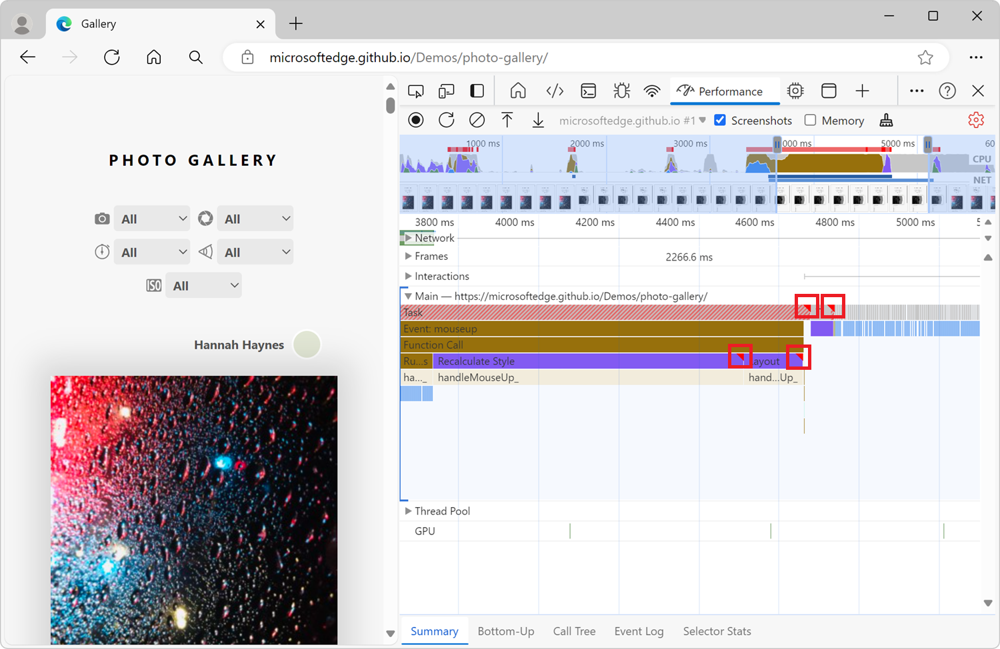
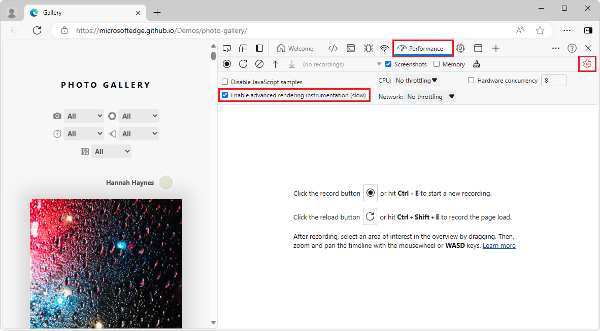
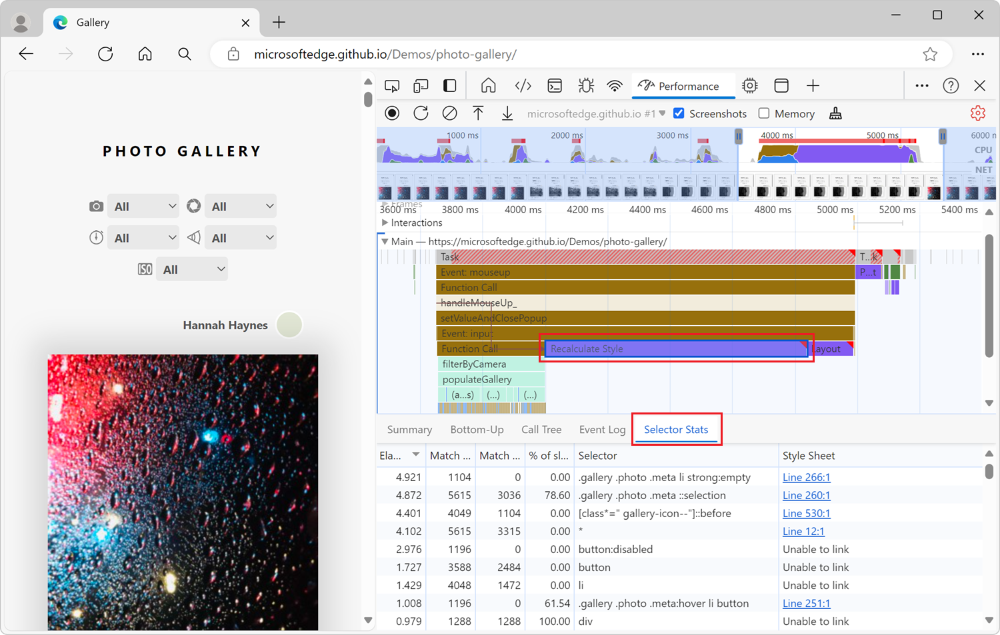
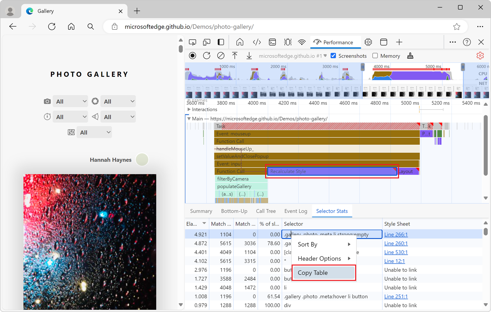
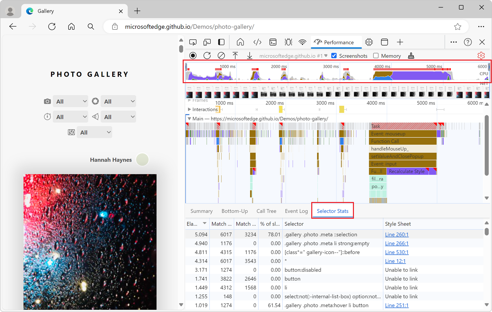
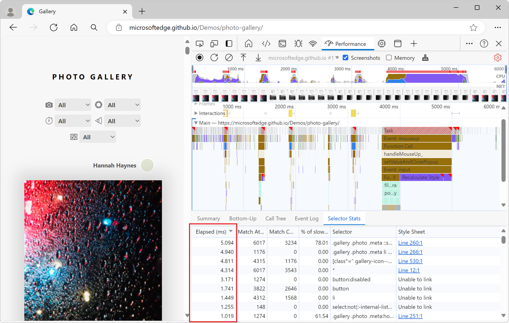

# Analyze selector performance during Recalculate Style events

The **Performance** tool highlights long tasks with red triangles to indicate work on the main thread that takes too long and has slow performance:

In your performance recordings, some of these long-running tasks may be **Recalculate Style** events.  These events track the time it takes for the browser to iterate through DOM elements on a page, find all of the CSS style rules that match a given element, and then compute the element's actual style based on these rules.  These styles need to be recalculated whenever the applicability of CSS rules may have changed, such as when:

- Elements are added to or removed from the DOM.
- An element's attributes are changed, such as `class` or `id`.
- User input occurs, such as a mouse move or focus change, which can affect `:hover` rules.

When you have long-running **Recalculate Style** events, you can use the **Selector Stats** feature to understand which of your CSS selectors are taking up the most time and resulting in slow performance.

The **Selector Stats** feature provides statistics about the CSS rule selectors that were involved in one or more **Recalculate Style** events within a performance recording.

## View CSS rule selector statistics

#### Record a performance trace with Selector Stats enabled

To view the statistics of your CSS rule selectors during long-running **Recalculate Style** events, first record a performance trace with the Selector Stats feature enabled.

The Selector Stats feature isn't always enabled, because it adds more overhead to your performance recordings. You should only leave it turned on when you need to investigate the performance of **Recalculate Style** events and other rendering information.

To record a performance trace with selector statistics:

1. In the **Performance** tool, click **Capture settings** ().

1. Select the **Enable advanced rendering instrumentation (slow)** checkbox:

   
 
1. Click **Record**, and then run the scenario that you want to improve for your website or app.

1. Click **Stop**.

#### View statistics for a single event

To view the statistics of the CSS rule selectors that are involved in a single **Recalculate Style** event:

1. Find a **Recalculate Style** event in your performance recording and click it.

1. In the bottom section of the **Performance** tool, click **Selector Stats**:

   
 
The **Selector Stats** section of the **Performance** tool shows a table of CSS selectors that contains the following information for each selector:

* The amount of time the browser spent matching this selector. This time is given in microseconds (µs), where 1 µs is 1/1000 of a millisecond (ms) and 1/1,000,000 of a second.
* The number of elements the browser engine attempted to match with this selector, and the number of elements it actually matched.
* The stylesheet that contains the selector.

#### View statistics for multiple events

To view aggregate statistics of the CSS rule selectors that are involved in multiple **Recalculate Style** events, copy multiple **Selector Stats** tables into a spreadsheet:

1. Find the first **Recalculate Style** event you're interested in, and then click it.

1. In the bottom section of the **Performance** tool, click **Selector Stats**.

1. Right-click the **Selector Stats** table, and then select **Copy Table**:

   

1. Paste the table into a spreadsheet, such as Microsoft Excel.

1. Repeat the previous steps with the other **Recalculate Style** events you're interested in.

#### View aggregate statistics for the full recording

To view aggregate statistics of the CSS rule selectors that are involved in the entire performance recording:

1. Deselect any event that's selected in the performance recording, by clicking an empty area of the flame chart.

1. Select the entire recording range. To do this, double-click in the **CPU** chart at the top of the **Performance** tool or, using your mouse, hover over the flame chart and scroll up until the entire chart is displayed.

1. In the bottom section of the **Performance** tool, click **Selector Stats**:

   

<!-- ====================================================================== -->
## Analyze Selector Stats

To sort the data that's displayed in the **Selector Stats** table in ascending or descending order, click a column header.  For example, to see which selectors take up the most time, click the **Elapsed (µs)** column header:

If you find a CSS selector that took the browser a long time to calculate and was matched many times, it's a good candidate to try and improve.  Try to change your selector so it requires less time to calculate and matches fewer elements on the page.  How to improve your CSS selectors depend on your particular use case. Repeat the steps from the previous section to confirm that your changes helped decrease the **Recalculate Style** event duration.

<!-- ====================================================================== -->
## See also

* [Introduction to the Performance tool](./index.md) - An introduction to analyzing runtime performance in DevTools.
* [Performance features reference](./reference.md) - Covers many of the features in the **Performance** tool.
* [The truth about CSS selector performance](https://blogs.windows.com/msedgedev/2023/01/17/the-truth-about-css-selector-performance/) - Windows blog post.
