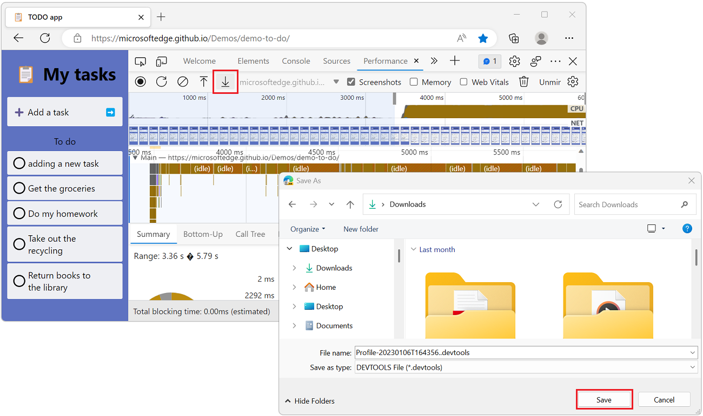
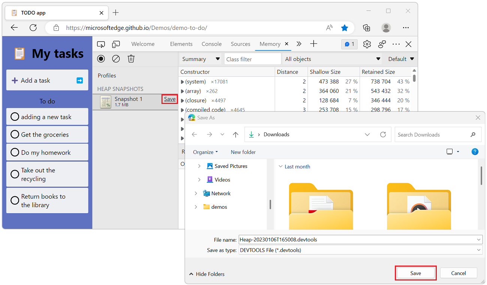
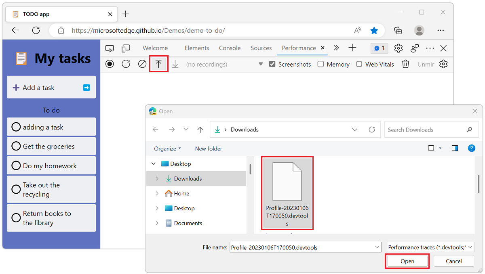
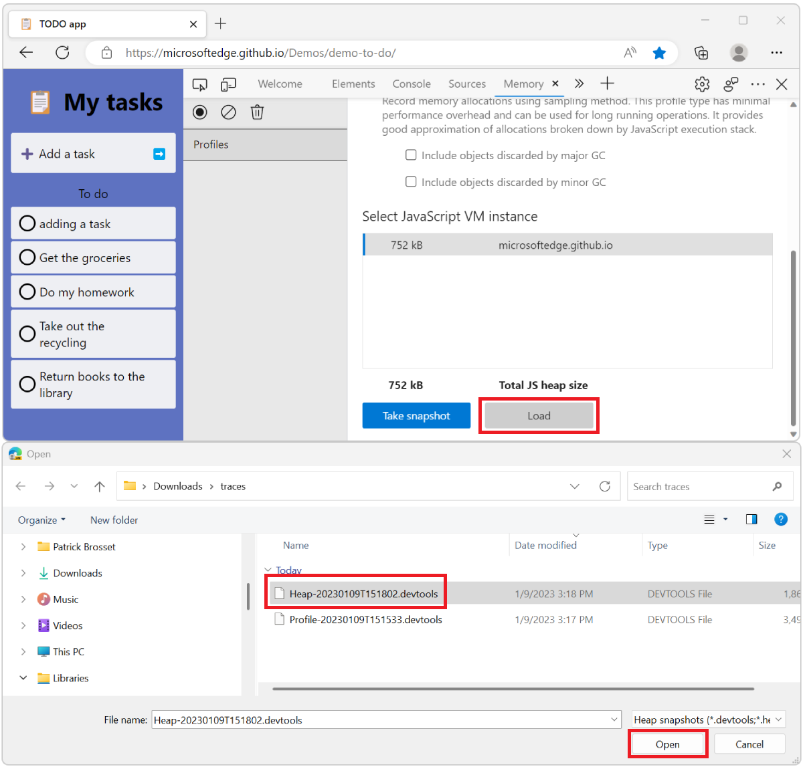

# Share performance and memory traces

The **Performance** and **Memory** tools record runtime data about your webpage. Exploring the recorded data makes it possible to improve your webpage's memory usage or runtime performance.

Additionally, the recorded data can be exported to files on disk. The exported files are called _traces_.

Exporting performance and memory traces is useful when you want to share these files with other people to get help with investigating issues. An exported trace file can be imported in DevTools at any time.

Traces can be exported in one of two ways: 

* As a normal trace: a `.json`, `.heapsnapshot`, `.heapprofile`, or `.heaptimeline` file, which contains minimal information about the runtime data from the traced webpage.

* As an enhanced trace: a `.devtools` file, which contains more runtime data from the traced webpage.

In Microsoft Edge versions prior to 109, enhanced traces aren't available. Starting with 109, the **Performance** and **Memory** tools can export normal and enhanced traces.

<!-- ====================================================================== -->
## Enhanced traces

A normal trace only contains some of the information that's present in a webpage. Much of the original code is lost and only the recorded performance or memory data of the webpage is preserved in the trace. For example, when importing a `.heapsnapshot` memory trace that was recorded during another DevTools session or on another computer, there's no way to go from an object in the **Memory** tool to its constructor in the **Sources** tool.

Similarly, in the **Performance** tool; when you import a performance trace recorded earlier, it needs to have been recorded on the same site and same configuration to be able to map from the performance report to the JavaScript that was running in the browser.

An enhanced trace retains more information about the page. For example, an enhanced trace contains the execution context and the list of parsed scripts, and can optionally contain console messages, script sources, and a snapshot of the DOM tree.

When a normal trace is imported in DevTools, the recorded data is used to populate the **Performance** or **Memory** tool. However, when an enhanced trace is imported in DevTools, a new DevTools window appears. This new window isn't connected to the webpage that's running in your browser, and instead re-creates the environment in which the trace was originally recorded.

For example, if a snapshot of the DOM was recorded in the enhanced trace, the **Elements** tool displays this snapshot. If console messages were recorded, the **Console** tool prints these messages. The **Sources** tool displays the scripts that were present during the recording.

Using enhanced traces makes it possible to reliably resolve source code references found in imported traces to the actual runtime code in the **Sources** tool. Additionally, if source maps were presents when a trace was recorded, it will also be possible to resolve code references to their original source code.

Enhanced traces can only be imported in Microsoft Edge, while normal traces are compatible with other browsers based on the Chromium engine.

<!-- ====================================================================== -->
## Set the default trace type

By default, the **Performance** and **Memory** tools export data as normal traces, but it's possible to choose which type of traces are exported.

To change the trace type:

1. Open DevTools by pressing `Ctrl`+`Shift`+`I` (Windows, Linux) or `Command`+`Option`+`I` (macOS).

1. In DevTools, in the upper right, click **Settings** ().

1. Under **Persistence**, if you want to record enhanced traces, check **Export Enhanced Performance and Memory Traces**. Otherwise clear the option.

   

1. Enhanced traces can also optionally include console messages, script sources and DOM elements too. Choose what to include in enhanced traces by using these options:

   * **Include console message in enhanced traces**.
   * **Include script sources in enhanced traces**.
   * **Include DOM snapshots in enhanced traces (experimental)**.

   

<!-- ====================================================================== -->
## Export a trace

To export a performance recording from the **Performance** tool:

1. Go to the website you want to record the performance of.

1. Open the **Performance** tool.

1. Press **Record**, execute the scenario you want to investigate the performance of by interacting with the webpage, and then press **Stop**.

1. When the performance profile appears, click **Save profile** ().

1. Choose a location to save the trace file on your disk.

   

To export memory information from the **Memory** tool:

1. Go to the website you want to export the memory data from.

1. Open the **Memory** tool.

1. Choose the type of memory recording you're interested in, such as **Heap Snapshot**. The following instructions are similar if you choose a different memory recording type. To learn more about the different memory recording types, see [Fix memory problems](../memory-problems/index.md).

1. Click **Take Snapshot**.

1. When the snapshot is recorded, click the **Save** button in the **Memory** tool sidebar.

1. Choose a location to save the trace file on your disk.

   

Traces are exported as normal or enhanced traces, depending on the **Export Enhanced Performance and Memory Traces** option. To change the default trace type, see [Set the default trace type](#set-the-default-trace-type). You can also choose the type of trace you want when exporting.

To choose a different trace type when exporting:

1. Right-click (or hold the `Ctrl` key and click) the **Save profile** () in the **Performance** tool or the **Save** button in the **Memory** tool.

1. Click either **.devtools (enhanced format for Microsoft Edge)** if you want to export an enhanced trace, or click **.json (works with Microsoft Edge and Chromium browsers)** if you want a normal trace.

   

<!-- ====================================================================== -->
## Import a trace

To import a trace in the **Performance** tool:

1. Open the **Performance** tool.

1. Click **Load profile** ().

1. Locate the trace file on your disk. It's either a `.devtools` file (for enhanced traces) or a `.json` file (for normal traces).

1. Open the file.

   

   If the file is an enhanced trace, a new DevTools window appears, showing the performance profile and the extra runtime information that was recorded displayed in the **Sources**, **Console**, and **Elements** tools.

   If the file is a normal trace, the performance profile appears in the **Performance** tool, and the rest of the DevTools tabs continue to show information related to the current webpage.

To import a trace in the **Memory** tool:

1. Open the **Memory** tool.

1. Click **Load**.

1. Locate the trace file on your disk. It's either a `.devtools` file (for enhanced traces) or a `.heapsnapshot`, `.heaptimeline`, or `.heapprofile` file (for normal traces).

1. Open the file.

   

   If the file is an enhanced trace, a new DevTools window appears, showing the memory information and the extra runtime information that was recorded displayed in the **Sources**, **Console**, and **Elements** tools.

   If the file is a normal trace, the memory information appears in the **Memory** tool, and the rest of the DevTools tabs continue to show information related to the current webpage.

