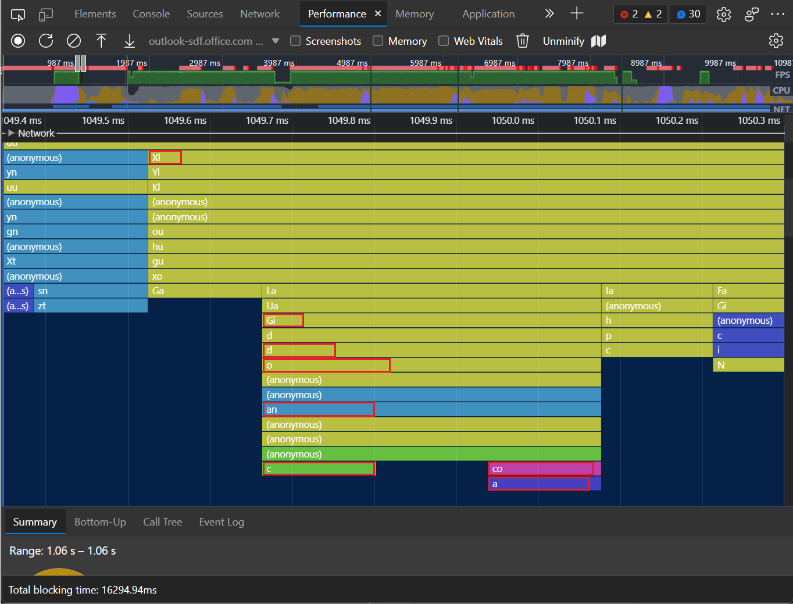
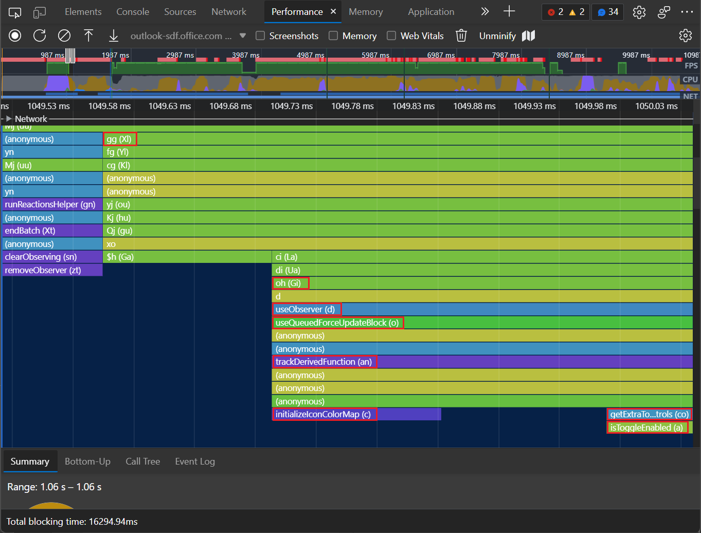
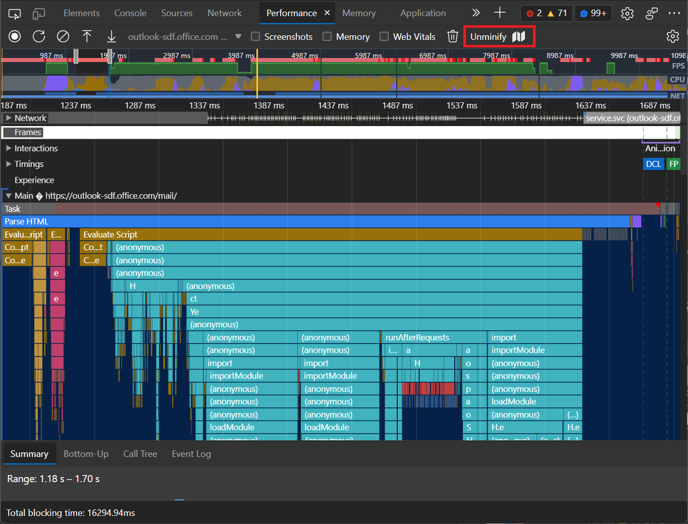
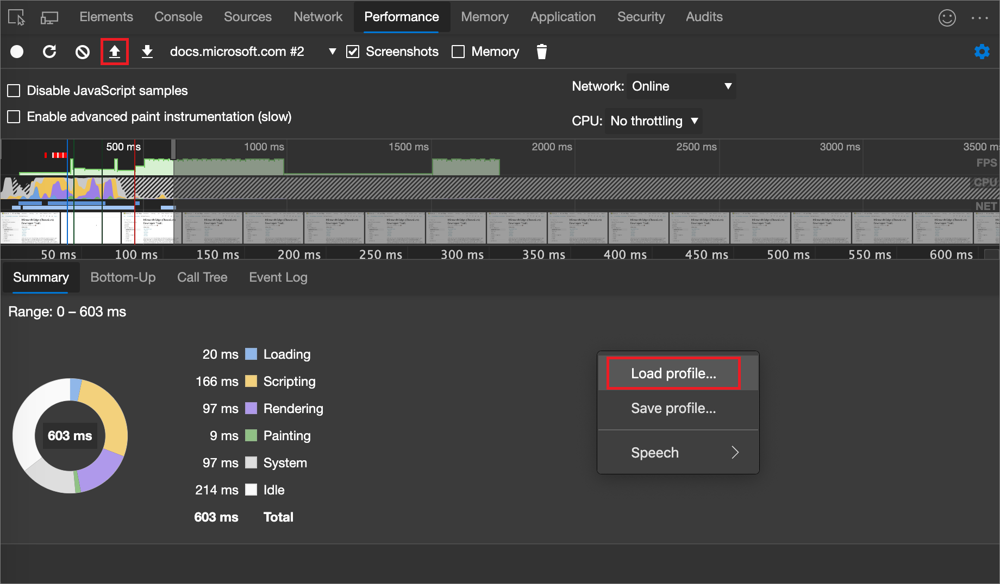

# Display original function names in performance profiles

If your build process compiles and minifies your code and combines it into a single file, the names of the functions displayed in a performance profile might be hard to understand.  Source maps map your compiled, minified code to your original source code files.  The **Performance** tool can use source maps to map minified function names after a recording has been made, back to their original names found in your original code.
   
To learn more about how DevTools uses source maps, see [Map the processed code to your original source code, for debugging](../javascript/source-maps.md).
   
To see your original function names in the flame chart in the **Performance** tool, use the **Unminify** () button.

Source mapping is used in DevTools to keep your client-side code readable and debuggable.  By clicking the **Unminify** button in the Performance tool, you can use source maps to create an unminified version of the performance profile you recorded.

An example of a performance profile flame chart, with hard-to-read function names:

An example of a performance profile flame chart, with some more meaningful function names restored:

When recording a performance profile in the **Performance** tool, the **Main** section of the profile displays detailed flame charts of JavaScript functions that were called during the recording.  

Ideally, in this flame chart view, you want to see the meaningful function names that are shown in your original source code.  However, if your production code is compiled, minified, or bundled, the **Performance** tool initially displays the function names that are extracted from your transformed, _production_ code.  These production function names might be obscure and might not easily map to function names in your original source code.

To unminify a performance profile, so that some more meaningful function names are shown in addition to the minified identifiers, follow the steps below.

<!-- ====================================================================== -->
## Step 1 - Set up source maps

Host your source maps side-by-side with your production code. When unminifying, the **Performance** tool expects to find your source maps along with your production code.

For details, see [Map the processed code to your original source code, for debugging](/microsoft-edge/devtools-guide-chromium/javascript/source-maps).

<!-- ====================================================================== -->
## Step 2 - Record a performance profile

1. In the **Performance** tool, click the **Record** button, to record a performance profile for the page you want to analyze.  For details, see [Record runtime performance](/microsoft-edge/devtools-guide-chromium/evaluate-performance/reference).

   

   A performance profile is recorded, in the **Performance** tool.

1. In the **Performance** tool, click in the main area (the flame chart), and use the mouse wheel to zoom in.  Click and drag left and right.  Look at the function names in the flame chart.

   The flame chart in the **Performance** tool shows minified function names, such as **XI**, **Gi**, **d**, **o**, **an**, **c**, **co**, and **a** from your production code:

   

<!-- ====================================================================== -->
## Step 3 - Unminify the code

1. Click the **Unminify** () button:

   

   In DevTools, a popup briefly appears, reading: **Status: creating unminfied file**.  Then the **Save As** dialog opens.  The default filename is a pattern starting with date and time like `yymmddThhmmss`, such as: `Profile-20220307T164948-unminified.json`.  The default directory is the **Downloads** directory.

1. Select a filename and directory and then click the **Save** button.

   The **Performance** tool creates a new version of the recorded performance profile, with some function names from the flame chart replaced by more meaningful function names by using your source maps.  Some of the minified production names might still appear, because source maps don't always provide the necessary information for the **Performance** tool to map all function names.

<!-- ====================================================================== -->
## Step 4 - Load the unminified profile

1. In the **Performance** tool, click the **Load profile** () icon button.  Or, right-click a blank area of the **Performance** tool, and then select **Load profile**.

   

1. In the **Open** dialog, select the unminified performance profile `.json` file that you just downloaded.  If needed, for details, see [Load a recording](/microsoft-edge/devtools-guide-chromium/evaluate-performance/reference#load-a-recording) in _Performance features reference_, and then continue below.

   Some function names are now unminified.  The unminified flame chart in the **Performance** tool now shows those functions labeled with more meaningful names taken from your source maps, such as **useObserver (d)**, **useQueuedForceUpdateBlock (o)**, **trackDerivedFunction (an)**, **initializeIconColorMap (c)**, **getExtraToolControls (co)**, and **isToggleEnabled (a)**.

   

<!-- ====================================================================== -->
## See also

* [Introduction to the Performance tool](index.md) - An introduction to analyzing runtime performance in DevTools.
* [Performance features reference](reference.md), - A reference for many of the features offered in the Performance tool.
